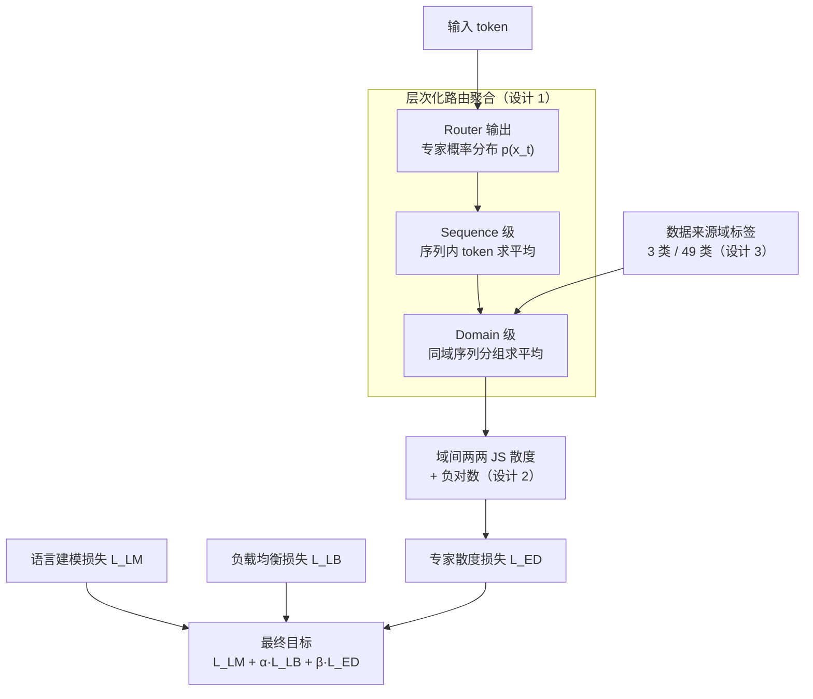

# Expert Divergence Learning for MoE-based Language Models

**会议**: ICLR 2026  
**arXiv**: [2603.00054](https://arxiv.org/abs/2603.00054)  
**代码**: 未公开  
**领域**: LLM效率 / MoE  
**关键词**: 混合专家, 专家同质化, 路由多样性, Jensen-Shannon散度, 领域特化

## 一句话总结
解决 MoE 训练中的专家同质化问题，通过最大化不同数据域之间路由分布的 Jensen-Shannon 散度，鼓励不同域激活不同专家子集，在 15B-A1.5B 模型上提升专家特化程度和语言建模性能。

## 研究背景与动机
**领域现状**：混合专家模型（MoE）通过稀疏激活实现高参数量低计算量，但训练中经常出现"专家同质化"——不同专家学到高度相似的功能，浪费了参数容量。

**现有痛点**：现有方法（如负载均衡损失）只确保专家被均匀使用，但不保证不同专家学到不同技能。专家可能均匀使用但功能相同。

**核心矛盾**：负载均衡和功能特化是不同的概念——均匀使用不等于各有专长。

**核心 idea**：不同数据域应该激活不同的专家组合——通过最大化域间路由分布的 JS 散度来鼓励专家特化。

## 方法详解

### 整体框架
这篇论文要解决的是 MoE 的"专家同质化"——稀疏激活本想让不同专家各管一摊数据，但训练下来专家学到的功能高度雷同，参数容量被浪费。它的做法不改 router 结构、不改专家数量、不碰推理路径，只在标准训练目标上额外挂一项"专家散度损失"，把"不同数据域应该激活不同专家组合"这条先验显式写进梯度里。

整条流水线是一个自下而上的聚合再分化过程：每个 token 经 router 得到一份专家概率分布，先在序列内求平均、再按域标签分组求平均，得到每个数据域"整体偏好哪些专家"的代表性路由分布；随后计算域与域之间的两两 JS 散度并取负对数，构成专家散度损失 $\mathcal{L}_{ED}$；最终目标是语言建模损失、负载均衡损失、专家散度损失三者加权之和 $\mathcal{L}_{final} = \mathcal{L}_{LM} + \alpha \mathcal{L}_{LB} + \beta \mathcal{L}_{ED}$，前两项是常规 MoE 配方，新增的 $\mathcal{L}_{ED}$ 负责把多样性定向逼成"按域分工"。

### 关键设计

**1. 层次化路由聚合：把 token 级噪声压成域级信号**

单个 token 的路由概率方差很大，直接拿来比较域间差异不可靠，所以方法先做三级聚合把信号逐层平滑。Token 级上每个 token 经 router 得到 $N$ 个专家的概率分布 $p(x_t)$；Sequence 级把一条序列内所有 token 的分布求平均得到 $\bar{p}_s = \frac{1}{T}\sum_{t=1}^T p(x_t)$；Domain 级再按数据来源的域标签把同域序列分组平均，得到每个域的代表性路由分布 $\bar{p}_j = \frac{1}{|\mathcal{B}_j|}\sum_{s \in \mathcal{B}_j} \bar{p}_s$。这样最终参与比较的是"某个域整体偏好哪些专家"的稳定统计量，而不是抖动剧烈的单 token 决策。

**2. 域间 JS 散度最大化：用对称有界的散度逼专家分化**

有了每个域的路由分布后，损失直接惩罚域之间分布过于接近：

$$\mathcal{L}_{ED} = \frac{1}{\binom{M_B}{2}}\sum_{j<k} -\log\big(D_{JS}(\bar{p}_j \,\|\, \bar{p}_k) + \epsilon\big)$$

对一个 batch 内所有域对 $(j,k)$ 求平均。选 Jensen-Shannon 散度而非 KL，是因为它对称且有界，衡量两个路由分布的差异更稳定。外层套负对数则是为了在散度很小（专家高度同质）时放大梯度——此时 $-\log$ 的导数很大，能给"开始分化"一个强推力，避免梯度消失让损失卡在退化解上，$\epsilon$ 只为数值稳定。

**3. 两种粒度的域标签：用免费的数据来源标签当监督信号**

域散度需要域划分，本文直接复用预训练语料自带的来源信息，不引入额外标注。粗粒度 3-Class 按英语 / 中文 / 数学三大来源切分；细粒度 49-Class 进一步用分类器把英文细分成 24 个主题、中文细分成 24 个主题、数学保留为 1 个，共 49 个域。粒度越细，域间能拉开的路由差异越多，给专家的"分工题面"也越丰富，后续实验中 49 类的特化与性能都优于 3 类；而消融里若把域标签换成随机划分（无语义），效果反而掉到基线以下，说明真正起作用的是标签的语义含义而非单纯"多分几组"。

**4. 多样性分解：解释为什么 $\mathcal{L}_{ED}$ 和负载均衡互补而不冲突**

这一点回答"加了散度损失会不会破坏负载均衡"。文中证明（Proposition 1）总路由多样性可分解为 $D_{total} = D_{inter} + D_{intra}$：$D_{inter}$ 是域间散度，刻画不同域用不同专家的程度；$D_{intra}$ 是域内散度，刻画同一域内 token 之间的专家分散。标准负载均衡损失 $\mathcal{L}_{LB}$ 只管把 $D_{total}$ 顶高，却不规定多样性该流向哪里，结果常常是专家被均匀使用但功能雷同。Proposition 2 进一步说明 $\mathcal{L}_{ED}$ 专门抬高 $D_{inter}$，相当于在固定总量下把多样性重新分配到域间差异上。于是两个损失各司其职：$\mathcal{L}_{LB}$ 保证总量、防止专家空转，$\mathcal{L}_{ED}$ 把这份多样性导向"按域分工"，最终落到专家特化上。

## 实验关键数据

### 主实验（三个模型规模，100B tokens 从头预训练）

| 模型 | 方法 | CEval | MMLU | CMMLU | ARC-e | ARC-c | RACE-m | RACE-h | 平均 |
|------|------|-------|------|-------|-------|-------|--------|--------|------|
| 15B-A1.5B | 标准 MoE | 28.0 | 25.8 | 25.6 | 47.4 | 28.2 | 50.5 | 43.6 | 35.59 |
| 15B-A1.5B | **+ED(49类)** | **28.9** | **27.1** | **26.3** | **48.6** | **28.5** | **51.7** | **45.5** | **36.65** |
| 8B-A0.8B | 标准 MoE | 25.8 | 24.5 | 25.0 | 43.2 | 23.6 | 42.7 | 36.5 | 31.61 |
| 8B-A0.8B | **+ED(49类)** | **26.1** | **25.2** | **25.2** | **44.1** | **24.9** | **44.3** | **38.2** | **32.57** |
| 3B-A0.3B | 标准 MoE | 23.8 | 23.1 | 24.2 | 35.0 | 22.6 | 37.8 | 32.1 | 28.37 |
| 3B-A0.3B | +ED(49类) | 24.5 | 23.4 | 24.5 | 36.2 | 22.8 | 37.5 | 32.8 | 28.81 |

### 训练动态与专家分析

| 分析维度 | 发现 |
|---------|------|
| LM 损失 | 所有 ED 配置收敛到更低的 $\mathcal{L}_{LM}$，不同 $\beta$ 均优于基线 |
| 域粒度 | 49 类 > 3 类 > 基线，细粒度域标签帮助更大 |
| 专家特化 | Layer 4 的特化程度远超其他层（中间层专家最分化） |
| 计算开销 | 额外训练开销可忽略（仅需每个 batch 计算域间散度） |
| 规模效应 | 性能增益随模型规模增大而增大（15B > 8B > 3B） |

### 关键发现
- 负载均衡 ≠ 功能特化：均匀使用不保证各有专长
- ED 损失引导专家开发不同域的路由策略，形成有组织的专家团队
- 49 类细粒度域分类比 3 类更有效，说明域标签的信息量直接影响特化质量

## 亮点与洞察
- **从均衡到特化的范式转变**：标准 MoE 训练关注负载均衡（$D_{total}$），本文关注功能特化（$D_{inter}$），是更本质的目标
- **域标签的利用**：利用预训练数据已有的域标签作为免费的监督信号来引导专家特化，零额外标注成本
- **JS 散度的选择**：对称且有界的 JS 散度比 KL 散度更适合衡量路由分布差异
- **理论清晰**：多样性分解定理优雅地揭示了 $\mathcal{L}_{LB}$ 和 $\mathcal{L}_{ED}$ 的互补关系

## 局限与展望
- 需要数据的域标签，纯无标签场景不直接适用（但可用分类器自动打标，如本文所做）
- 3B/8B/15B 三个模型尺度上验证，但训练规模有限（100B tokens）
- 域分类的粒度（49 vs 3）需要手工设定，最优粒度的自适应确定是开放问题
- 未探索与 shared expert 架构（如 DeepSeek-MoE）的交互效应
- 是否可以在预训练结束后通过域标签引导的微调来追加特化？

## 相关工作与启发
- **vs DeepSeek-MoE**：DeepSeek 用 shared expert 捕获共性来减轻路由专家冗余，本文用域间散度最大化直接引导路由专家分化——两者正交可组合
- **vs ERNIE 4.5**：ERNIE 用 router 权重矩阵的正交性（无监督），本文用域标签（有监督）引导特化——有监督方法更有效
- **vs Qiu et al. (global LB)**：global batch 负载均衡增强了整体多样性，本文进一步引导多样性的分配方向
- **启发**：MoE 的"divide and conquer"设计意图需要训练目标的显式支持，否则退化为"redundant generalists"

## 补充分析
- 核心洞察：load balancing 只鼓励全局路由多样性，不指导多样性如何分布——ℒ_ED 通过域标签将多样性定向分配为域间差异
- Divergence Decomposition ($D_{total} = D_{inter} + D_{intra}$) 非常优雅——ℒ_LB 促进 $D_{total}$，ℒ_ED 导向 $D_{inter}$
- 49-class 表现优于 3-class，暗示更细粒度域标签带来更精细专家分工
- 性能增益随模型规模正向增长（3B < 8B < 15B），更大模型有更多潜力被有效分工利用
- 计算开销几乎为零——ℒ_ED 仅在已有路由 logit 上计算 JSD

## 评分
- 新颖性: ⭐⭐⭐⭐ 专家特化 via 域间散度最大化是新颖的角度，理论分解优雅
- 实验充分度: ⭐⭐⭐⭐ 三个模型尺度+两种域分类粒度+专家行为分析
- 写作质量: ⭐⭐⭐⭐ 问题分析清晰，理论动机完整
- 价值: ⭐⭐⭐⭐ 对 MoE 训练有实际指导，域标签利用成本低

<!-- RELATED:START -->

## 相关论文

- [\[ICLR 2026\] Deep Hierarchical Learning with Nested Subspace Networks for Large Language Models](deep_hierarchical_learning_with_nested_subspace_networks_for_large_language_mode.md)
- [\[ICML 2026\] ProactiveLLM: Learning Active Interaction for Streaming Large Language Models](../../ICML2026/llm_efficiency/proactivellm_learning_active_interaction_for_streaming_large_language_models.md)
- [\[ICML 2026\] TEAM: Temporal-Spatial Consistency Guided Expert Activation for MoE Diffusion Language Model Acceleration](../../ICML2026/llm_efficiency/team_temporal-spatial_consistency_guided_expert_activation_for_moe_diffusion_lan.md)
- [\[NeurIPS 2025\] Advancing Expert Specialization for Better MoE](../../NeurIPS2025/llm_efficiency/advancing_expert_specialization_for_better_moe.md)
- [\[ICLR 2026\] DND: Boosting Large Language Models with Dynamic Nested Depth](dnd_boosting_large_language_models_with_dynamic_nested_depth.md)

<!-- RELATED:END -->
