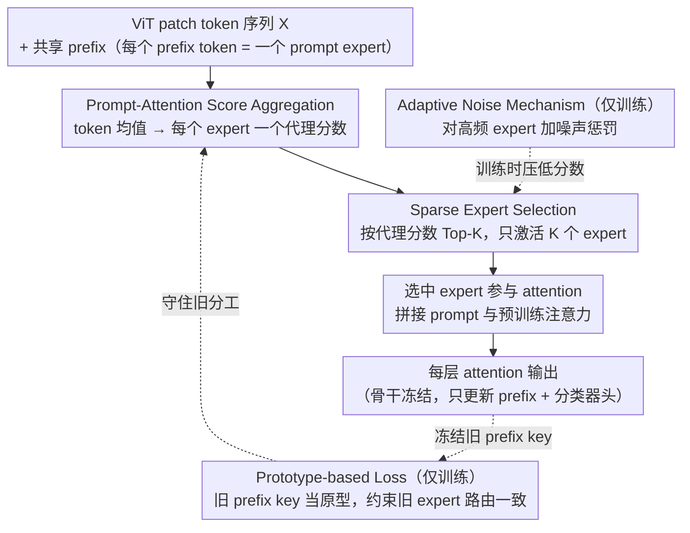

# One-Prompt Strikes Back: Sparse Mixture of Experts for Prompt-based Continual Learning

**会议**: ICLR 2026  
**arXiv**: [2509.24483](https://arxiv.org/abs/2509.24483)  
**代码**: [https://github.com/Minhchuyentoancbn/SMoPE](https://github.com/Minhchuyentoancbn/SMoPE)  
**领域**: LLM效率  
**关键词**: continual learning, prompt tuning, Mixture of Experts, Sparse MoE, Prefix Tuning

## 一句话总结
提出 SMoPE 框架，将单个共享 prompt 组织为稀疏 MoE 结构中的多个 prompt expert，通过 prompt-attention score aggregation 实现动态稀疏激活，在保持高参数效率的同时显著缓解知识干扰，在多个持续学习 benchmark 上达到 SOTA。

## 研究背景与动机

**领域现状**：基于 Prompt 的持续学习（CL）方法通过在冻结的预训练 ViT 上添加可学习 prompt 来适配新任务，已成为缓解灾难性遗忘的主流范式。代表方法包括 DualPrompt、HiDe-Prompt、NoRGa 等。

**现有痛点**：主流方法为每个 task 分配独立的 prompt 子集（task-specific prompting），带来两个问题：(a) 推理时需通过完整预训练模型做前向传播来选择 prompt，计算开销大；(b) prompt 参数随 task 数线性增长，可扩展性差且阻碍跨 task 知识共享。

**核心矛盾**：OVOR 等方法用单个共享 prompt 来解决效率问题，但因所有 prompt 参数被持续更新，导致严重的知识干扰（knowledge interference），性能不如 task-specific 方法。效率与性能之间存在根本冲突。

**本文目标** 如何在保持单 prompt 的参数效率优势的同时，避免共享 prompt 带来的知识干扰？具体包括：(a) 如何在多门控 MoE 的 attention head 中做稀疏选择；(b) 如何平衡 expert 利用率；(c) 如何在没有旧数据的情况下保持 expert 的专门化。

**切入角度**：基于 Le et al. (2024a) 的洞察——每个 attention head 可以视为多个 MoE 模型的组合，prefix tuning 本质上是往这些 MoE 中添加新的 prompt expert。既然已经是 MoE，那就自然可以引入稀疏选择。

**核心 idea**：将共享 prompt 中的每个 prefix token 视为独立 expert，通过 prompt-attention score aggregation 计算统一代理分数实现 Top-K 稀疏激活，从而在单 prompt 上获得隐式参数分区效果。

## 方法详解

### 整体框架

SMoPE 想解决的是「单个共享 prompt 既要省参数又不能被知识干扰拖垮」这个矛盾。它的做法是把单个共享 prompt 内部重新看成一个稀疏 MoE：输入是 ViT 的 patch token 序列 $\mathbf{X} \in \mathbb{R}^{N \times d}$，模型维护一份共享的 prefix key $\mathbf{P}^K \in \mathbb{R}^{N_p \times d}$ 和 prefix value $\mathbf{P}^V \in \mathbb{R}^{N_p \times d}$，prepend 到每个 MSA 层 attention 的 key 和 value 上。每个 prefix token 被当成一个独立的 prompt expert，于是一次前向就分三步走完：先用 prompt-attention score aggregation 给每个 expert 算一个统一代理分数，再据此做 Top-K 稀疏选择只激活最相关的几个 expert，最后让选中的 expert 参与 attention 计算，输出每层的 attention 结果。训练时另有两条辅助回路——adaptive noise 在选择前压一压高频 expert、prototype loss 用旧 prefix key 守住旧 expert 的分工；整条链路只更新 prefix 参数和分类器头，骨干始终冻结。

### 关键设计

**1. Prompt-Attention Score Aggregation：把每个 expert 的 $N$ 个分数压成一个代理分数**

直接套标准 SMoE 的难点在这里——prefix tuning 里每个 prompt expert 对应 $N$ 个 score function（每个 output token 一个），要在 $N$ 个分数上逐个做 Top-K 选择是 intractable 的。SMoPE 的做法是把所有 token 对某个 expert 的 attention 分数取平均，得到一个统一代理分数：

$$\tilde{s}_{j'}(\mathbf{X}) = \frac{\tilde{\mathbf{x}}^\top W_l^Q {W_l^K}^\top \mathbf{p}_{j'}^K}{\sqrt{d_v}}, \quad \tilde{\mathbf{x}} = \frac{1}{N}\sum_{i=1}^N \mathbf{x}_i$$

其中 $\tilde{\mathbf{x}}$ 是所有 token 的均值表示，只需算一次就能拿到全部 expert 的代理分数。这样单个 expert 的打分复杂度从 $\mathcal{O}(N d_k)$ 降到 $\mathcal{O}(d_k)$，而且作者证明聚合后仍保持与标准 MoE 相同的 $\mathcal{O}(\tau^{-4})$ 样本复杂度——既让 Top-K 选择变得可行，又没牺牲理论上的统计效率。

**2. Sparse Expert Selection：用代理分数做 Top-K，只激活 $K$ 个 expert**

拿到代理分数后，attention 矩阵被拆成 prompt 和预训练两部分 $\tilde{A}_l = [\tilde{A}_l^{\text{prompt}}, A_l^{\text{pre-trained}}]$，其中 prompt 部分按下式做稀疏选择：

$$\tilde{A}_l^{\text{prompt}} = \text{TopK}\!\left(\tilde{\mathbf{x}}^\top W_l^Q {W_l^K}^\top \mathbf{P}^K / \sqrt{d_v}\right).\text{expand}(N, -1)$$

被选中的 $K$ 个 expert 的分数会 expand 到全部 $N$ 个 query token 上，未选中的 expert 分数置零。这一步正是缓解干扰的关键：OVOR 那种单 prompt 方法每步都更新所有 prompt 参数，导致新 task 不断覆写旧知识；而稀疏激活相当于给单个共享 prompt 引入了隐式参数分区，不同 task 倾向落在不同 expert 子集上，互相踩踏的概率大幅下降。同时 expert 选择只看当前层输入，不像 task-specific 方法那样需要先跑一遍完整模型做 prompt retrieval。

**3. Adaptive Noise Mechanism：给高频 expert 加噪声惩罚，逼出冷门 expert**

稀疏选择会带来标准 SMoE 的老毛病——少数 expert 垄断路由、利用率严重失衡；在 CL 里这更糟，因为反复用同一批 expert 等于把所有 task 的知识又挤回少数参数里，干扰重新出现。SMoPE 在训练时统计每个 expert 的激活频率 $F_{j'}$，对频率高于平均值的 expert 施加噪声惩罚降低其被选概率，惩罚幅度按当前分数的动态范围缩放：

$$\epsilon_{j'} = \epsilon \cdot \left(\max_j \tilde{s}_j - \min_j \tilde{s}_j\right), \quad \epsilon \in [0,1]$$

频率低于均值的 expert 不受惩罚。按动态范围缩放是为了避免噪声盖过真实分数，而且这套机制只在训练时生效、推理时关掉，所以不会引入推理抖动。比起传统 MoE 的 load-balancing auxiliary loss，它只压高频 expert、更温和，不会强行把已学好的路由也打散。

**4. Prototype-based Loss：用 prefix key 当旧 task 原型，保住 expert 的专门化**

前面三步解决了「怎么选、怎么均衡」，但 CL 还有个无旧数据的难题——训练新 task 时旧 expert 学到的分工很容易被冲掉。SMoPE 用两个 loss 配合：$\mathcal{L}_{\text{router}}$ 在当前 task 数据上鼓励被选 expert 的分数高于未被选 expert，促进 expert 之间的差异化；$\mathcal{L}_{\text{proto}}$ 则把上一轮训练结束时的 prefix key 当成 prototype，约束旧 expert 的路由保持一致，从而在没有旧样本的情况下守住已学的 specialization。为避免噪声，prototype 集合只保留那些频繁被激活的 expert。两者一个管「当下分得开」、一个管「过去不忘」，互补地压住遗忘。

### 损失函数 / 训练策略

最终 loss: $\mathcal{L} = \mathcal{L}_{ce} + \alpha_{\text{router}} \cdot \mathcal{L}_{\text{router}} + \alpha_{\text{proto}} \cdot \mathcal{L}_{\text{proto}}$

其中 $\mathcal{L}_{ce}$ 是标准交叉熵，$\alpha_{\text{router}}$ 和 $\alpha_{\text{proto}}$ 为权重超参。训练只更新 prefix 参数和分类器头，骨干网络保持冻结。第一个 task 的前几个 epoch 使用 dense expert training（不做稀疏选择）来建立稳定的 expert 表示。同时采用 task-adaptive prediction 纠正分类器对新类的偏置。

## 实验关键数据

### 主实验

| 数据集 | 指标 | SMoPE | 之前SOTA (VQ-Prompt) | 提升 |
|--------|------|-------|---------------------|------|
| ImageNet-R (10-task) | FAA | **79.32** | 78.71 | +0.61 |
| ImageNet-R (10-task) | CAA | **84.39** | 83.24 | +1.15 |
| CIFAR-100 (10-task) | FAA | **89.23** | 88.73 | +0.50 |
| CIFAR-100 (10-task) | CAA | **93.67** | 92.84 | +0.83 |
| CUB-200 (10-task) | FAA | **87.43** | 86.72 | +0.71 |
| CUB-200 (10-task) | CAA | **91.11** | 90.33 | +0.78 |

自监督预训练（ImageNet-R）: iBOT-1K FAA 72.17 / DINO-1K FAA 68.61，均超越所有 baseline。

### 消融实验

| 配置 | FAA (CUB-200) | CAA | 说明 |
|------|---------------|-----|------|
| One Prompt (baseline) | 75.23 | 83.61 | 只用单 prompt 无任何增强 |
| + Score Aggregation | 75.49 | 83.65 | 统一代理分数，微小提升 |
| + Sparse Expert Selection | 79.12 | 87.16 | **+3.63 FAA**，稀疏选择是核心 |
| + Adaptive Noise | 85.36 | 89.12 | **+6.24 FAA**，平衡利用率效果显著 |
| + Task-Adaptive Prediction | 86.03 | 90.09 | 纠正分类器偏置 |
| + Initial Dense Training | 86.27 | 90.23 | 稳定初始 expert 表示 |
| + Router Loss | 87.05 | 90.47 | 促进 expert 专门化 |
| + Prototype Loss (Full) | **87.43** | **91.11** | 保持旧 expert specialization |

### 关键发现
- **稀疏选择 + Adaptive Noise** 贡献最大：从 75.49 到 85.36，合计 +9.87 FAA
- 参数量仅 0.38M，是 Deep L2P++ (4.78M) 的 8%，训练/推理 GFLOPs 均为其他方法的 50%
- $\epsilon$ 超参消融：$\epsilon=0$ 导致少数 expert 垄断，$\epsilon=1$ 导致过度探索，$\epsilon=0.5$ 附近最优
- SMoPE 共享单个 prompt 却超越所有 task-specific prompt 方法，打破了"共享 prompt 必然性能差"的认知

## 亮点与洞察
- **MoE 视角理解 Prefix Tuning 极为巧妙**：将每个 prefix token 视为 attention head 中的一个 expert，这个视角使得稀疏选择自然可行。这种视角可以迁移到任何使用 prefix tuning 的场景中。
- **Prompt-Attention Score Aggregation**：用 token 均值的单次计算代替 $N$ 次 score 计算，既高效又不损失样本复杂度，是理论驱动的高效工程设计。
- **Adaptive Noise 比传统 load balancing loss 更适合 CL**：传统 MoE 的 auxiliary loss 会强制平衡，可能破坏已学知识；adaptive noise 只惩罚高频 expert 且只在训练时生效，更温和可控。
- **Prefix Key as Prototype** 的思路可迁移到 NLP 的 prefix tuning 场景，用于任何需要在无旧数据时保持路由一致性的增量学习任务。

## 局限与展望
- 实验仅在 ViT-B/16 上验证，未测试更大规模模型或 NLP 任务，泛化性有待验证
- Top-K 是硬选择，可能不如 learnable soft routing 灵活；可以尝试 Gumbel-Softmax 等可微分选择
- Adaptive noise 的 $\epsilon$ 需要手动调，跨数据集可能需要重新搜索
- Prototype loss 只用上一轮的 prefix key，长序列 task 可能导致原型漂移（prototype drift）
- 未探索 prompt length $N_p$ 和 Top-K 比例对不同 task 数量的影响

## 相关工作与启发
- **vs OVOR**: 同样用单 prompt，但 OVOR 全部更新所有 prompt，SMoPE 稀疏激活减少干扰。OVOR 在多数 benchmark 上比 SMoPE 差 4-10 个点。
- **vs VQ-Prompt**: VQ-Prompt 用 vector quantization 做 prompt 选择，SMoPE 直接在 MoE 框架内用 attention score 选择，更自然且计算量更少（50% vs 100%）。
- **vs HiDe-Prompt/NoRGa**: 这些方法用 task-specific prompt + 额外前向传播做 prompt retrieval，参数量是 SMoPE 的 10 倍+。SMoPE 证明了在正确的架构设计下，单 prompt 就能超越 task-specific 方法。

## 评分
- 新颖性: ⭐⭐⭐⭐ MoE 视角下的 prefix tuning 有理论新意，但 SMoE 本身不算新
- 实验充分度: ⭐⭐⭐⭐⭐ 三个数据集 + 两种预训练范式 + 详细消融 + 计算量对比
- 写作质量: ⭐⭐⭐⭐ 公式推导清晰，从理论到实现过渡自然
- 价值: ⭐⭐⭐⭐ 对 prompt-based CL 有实际推动，50% 计算量减少有实用价值

<!-- RELATED:START -->

## 相关论文

- [\[AAAI 2026\] Resource Efficient Sleep Staging via Multi-Level Masking and Prompt Learning](../../AAAI2026/llm_efficiency/resource_efficient_sleep_staging_via_multi-level_masking_and_prompt_learning.md)
- [\[ICLR 2026\] Expert Divergence Learning for MoE-based Language Models](expert_divergence_learning_for_moe-based_language_models.md)
- [\[ICLR 2026\] Understanding and Improving Length Generalization in Hierarchical Sparse Attention Models](understanding_and_improving_length_generalization_in_hierarchical_sparse_attenti.md)
- [\[ICLR 2026\] Deep Hierarchical Learning with Nested Subspace Networks for Large Language Models](deep_hierarchical_learning_with_nested_subspace_networks_for_large_language_mode.md)
- [\[ICLR 2026\] Randomization Boosts KV Caching, Learning Balances Query Load: A Joint Perspective](randomization_boosts_kv_caching_learning_balances_query_load_a_joint_perspective.md)

<!-- RELATED:END -->
