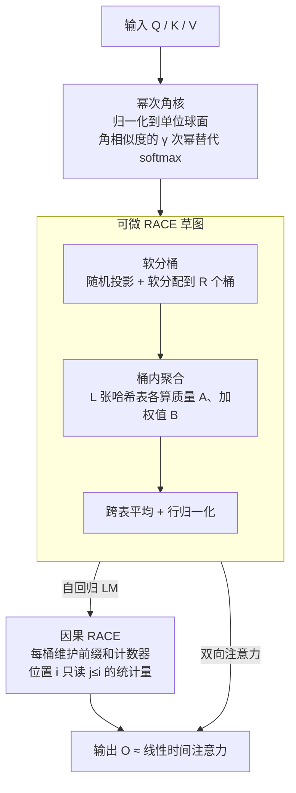

# RACE Attention: A Strictly Linear-Time Attention for Long-Sequence Training

**会议**: ICLR 2026  
**arXiv**: [2510.04008](https://arxiv.org/abs/2510.04008)  
**代码**: [https://github.com/sahiljoshi515/RACE_Attention](https://github.com/sahiljoshi515/RACE_Attention)  
**领域**: LLM效率 / 注意力机制  
**关键词**: 线性注意力, LSH, 角核, 长序列训练, 注意力近似  

## 一句话总结
提出 RACE Attention——用幂次角核替代 softmax 并通过可微 LSH 草图近似注意力输出，实现严格线性时间复杂度，支持单 GPU 处理 1200 万 token、单 CPU 处理 7500 万 token，在多种任务上匹配或超越 softmax 精度。

## 研究背景与动机

**领域现状**：Softmax 注意力的 $O(N^2 d)$ 复杂度是长上下文训练的根本瓶颈。即使 FlashAttention-2/3 优化，GH200 上单层也无法处理超过 ~400 万 token。

**现有痛点**：线性注意力（Linear Attention、Performer）精度下降；低秩近似（Linformer）不支持自回归；YOSO 用硬 LSH 但无理论保证且不支持因果 LM。

**核心矛盾**：现有近似方法缺乏严格数学框架刻画效率-精度权衡，设计决策 ad hoc 且跨任务不稳定。

**本文目标**：设计有理论保证的严格线性时间注意力，支持因果和非因果，可处理数千万 token。

**切入角度**：角核的 LSH 碰撞概率恰好等于角相似度，RACE 草图可线性时间无偏估计核密度和。

**核心 idea**：用幂次角核替代 softmax + 可微 RACE 草图实现 $O(N)$ 注意力。

## 方法详解

### 整体框架

RACE Attention 要解决的是 softmax 注意力 $O(N^2 d)$ 复杂度在长上下文下根本跑不动的问题，思路是绕开"显式构造 $N \times N$ 注意力矩阵再加权求和"这条二次复杂度的老路。它分三步走：第一步用一个幂次角核 $(1 - \frac{\arccos(\hat{q}_i \cdot \hat{k}_j)}{\pi})^\gamma$ 替代 softmax 来度量 query 与 key 的相似度，因为这个核与角度 LSH（局部敏感哈希）的碰撞概率天然对齐；第二步把所有 key/value 通过可微的"软分桶"哈希进 $L$ 张哈希表、每张 $R$ 个桶的草图里，桶内预累加好质量和加权值这两组统计量，再跨 $L$ 张表平均、归一化，查询时只需把 $\hat{q}_i$ 落到对应桶、聚合同桶统计量，就能以 $O(N)$ 时间无偏估计出注意力输出；自回归场景下第三步换用因果 RACE，每个桶维护随位置流式更新的前缀和，保证位置 $i$ 只看见 $j \le i$ 的 key。

### 关键设计

**1. 幂次角核：让相似度度量天然适配 LSH**

softmax 注意力的二次复杂度，根源在于它定义的指数核没有可线性时间估计的草图结构。RACE 改用角核 $\big(1 - \frac{\arccos(\hat{q}_i \cdot \hat{k}_j)}{\pi}\big)^\gamma$，先把 query 和 key 归一化到单位球面，再以两者夹角的角相似度的 $\gamma$ 次幂作为权重；指数 $\gamma$ 越大，核越尖锐、越接近 softmax 的"赢者通吃"行为（原文实测 $\gamma=8$ 左右就能让角核与 softmax 的 Frobenius 误差降到很小）。关键之处在于，角度 LSH（SimHash）的单次碰撞概率恰好等于这个角相似度，于是核的 $\gamma$ 次幂可以直接解释为 $\gamma$ 个独立哈希位同时碰撞的概率——这把"核密度求和"无缝翻译成"哈希桶里的碰撞计数"，让后续的线性时间草图估计有了严格的理论落点。

**2. 可微 RACE 草图：在保持无偏估计的同时打通梯度**

这一步解决整体框架里第二步"怎么在 $O(N)$ 时间内估出注意力输出、还能训练"的核心难题。经典 RACE（Repeated Array of Count Estimators）草图用硬 SimHash 把每个 key 投到离散桶里，碰撞计数即为核密度的无偏估计，但 `sign` 函数不可导、无法反向传播。RACE Attention 把硬分配换成软分配：每个 query/key 先经 $P$ 个随机投影超平面得到 $\tanh(Wx)$，再对 $R=2^P$ 个超立方体顶点做带温度 $\beta$ 的 softmax，得到一份"软落入各桶"的连续分布 $\phi(x)$，从而在近似质量几乎不损的前提下让整个草图对参数可微、可端到端训练。落桶之后，每张表只需累加两组统计量——桶质量向量 $A^{(\ell)} = (\Phi_K^{(\ell)})^\top \mathbf{1}$ 和加权值矩阵 $B^{(\ell)} = (\Phi_K^{(\ell)})^\top V$，查询时取

$$\widehat{O} = \operatorname{diag}\Big(\tfrac{1}{L}\sum_\ell \Phi_Q^{(\ell)} A^{(\ell)}\Big)^{-1} \cdot \tfrac{1}{L}\sum_\ell \Phi_Q^{(\ell)} B^{(\ell)}$$

为压低单张哈希表带来的估计方差，方法并行维护 $L$ 张独立哈希表、每张 $R$ 个桶，最终对 $L$ 张表的估计取平均——方差随 $L$ 线性下降，而 $L$、$R$ 都是与序列长度 $N$ 无关的常数，于是总开销严格停在 $O(LNRd)$ 即 $O(N)$，桶数 $S = L \times R$ 远小于 key 数 $N$，实测常数也小。

**3. 因果 RACE：用前缀和把草图扩展到自回归生成**

双向注意力下所有 key 可一次性灌进草图，但自回归 LM 要求位置 $i$ 只能看到 $j \le i$ 的 key，直接复用全局草图会泄漏未来信息。RACE 为每个桶维护随位置流式更新的前缀和计数器：扫描到位置 $i$ 时，桶里累积的恰好是 $i$ 及之前所有 key 的统计量，查询当前 token 只读这份前缀状态即可。原文用定制的 OpenMP/CUDA kernel 在单趟流式扫描里完成这套前缀操作，既保住了因果约束，又把因果掩码的代价从 $O(N^2)$ 降到与序列长度线性相关，使 RACE 能直接用于因果语言模型训练而非局限于编码任务。

### 损失函数 / 训练策略

RACE Attention 设计为对 Softmax Attention 的即插即用替换，不引入额外损失项，沿用标准交叉熵在因果或双向设置下训练。真正需要调的是两个草图超参：哈希表数 $L$ 与桶数 $R$ 共同控制方差-精度权衡——二者越大估计越准但显存与算力开销越高；核的尖锐度 $\gamma$ 越大越逼近 softmax，但也会放大估计方差，需要相应增大 $L$ 来补偿。

## 实验关键数据

### 主实验

| 方法 | 复杂度 | 64K 支持 | 精度 |
|------|--------|---------|------|
| Softmax (FA2) | $O(N^2)$ | OOM | 基线 |
| Linear Attn | $O(N)$ | ✓ | 差 |
| Performer | $O(Nd^2)$ | 部分 | 差 |
| **RACE** | **$O(N)$** | **✓** | **≈基线** |

### 扩展性

| 硬件 | Softmax 最大 | RACE 最大 |
|------|------------|----------|
| GH200 (96GB) | ~4M | **12M** |
| CPU | N/A | **75M** |

### 关键发现
- RACE 在 64K wall-clock 时间快于 FlashAttention-2，精度匹配
- 比 Linformer 精度更高且少 13% 参数
- $\gamma$ 参数控制尖锐度，过大增加方差需更多哈希表补偿
- 支持 CPU 训练开辟无 GPU 长上下文训练的可能

## 亮点与洞察
- **理论链条优雅**：角核→LSH 碰撞概率→RACE 草图→线性时间注意力，每步都有理论保证。
- **真正线性时间**且常数小——$S = L \times R$ 个桶而非 $N$ 个 key，实际加速显著。
- CPU 75M token 训练是独特贡献，使长上下文研究不再受限于 GPU。

## 局限与展望
- 仅在 ~120M 模型验证，大模型效果未知
- $\gamma$ 和 $L, R$ 需调优，目前无自动选择策略
- 与稀疏注意力的结合是未来方向

## 相关工作与启发
- **vs FlashAttention**: FA 优化但不改变 $O(N^2)$，RACE 真正 $O(N)$
- **vs YOSO**: 都用角核+LSH，但 RACE 用软 LSH 有理论保证且支持因果
- **vs Performer**: Performer 在 embedding 维度二次且精度差

## 评分
- 新颖性: ⭐⭐⭐⭐⭐ 角核+RACE 草图组合是全新方案
- 实验充分度: ⭐⭐⭐⭐ 多任务+扩展性+理论，但缺大模型验证
- 写作质量: ⭐⭐⭐⭐ 理论推导清晰
- 价值: ⭐⭐⭐⭐⭐ 对超长上下文训练有重大实用价值

<!-- RELATED:START -->

## 相关论文

- [\[ACL 2026\] Native Hybrid Attention for Efficient Sequence Modeling](../../ACL2026/llm_efficiency/native_hybrid_attention_for_efficient_sequence_modeling.md)
- [\[ICLR 2026\] xLSTM Scaling Laws: Competitive Performance with Linear Time-Complexity](xlstm_scaling_laws_competitive_performance_with_linear_time-complexity.md)
- [\[NeurIPS 2025\] ZeroS: Zero-Sum Linear Attention for Efficient Transformers](../../NeurIPS2025/llm_efficiency/zeros_zero-sum_linear_attention_for_efficient_transformers.md)
- [\[NeurIPS 2025\] Tiled Flash Linear Attention: More Efficient Linear RNN and xLSTM Kernels](../../NeurIPS2025/llm_efficiency/tiled_flash_linear_attention_more_efficient_linear_rnn_and_xlstm_kernels.md)
- [\[ICLR 2026\] Understanding and Improving Length Generalization in Hierarchical Sparse Attention Models](understanding_and_improving_length_generalization_in_hierarchical_sparse_attenti.md)

<!-- RELATED:END -->
