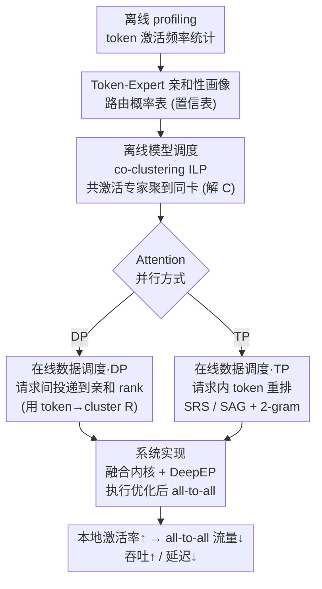

# Semantic Parallelism: Redefining Efficient MoE Inference via Model-Data Co-Scheduling

**会议**: ICLR 2026  
**arXiv**: [2503.04398](https://arxiv.org/abs/2503.04398)  
**代码**: 基于SGLang实现（约5000行Python + Triton内核）  
**领域**: LLM效率  
**关键词**: Mixture-of-Experts, Expert Parallelism, all-to-all通信, 模型-数据协同调度, Token-Expert亲和性  

## 一句话总结
提出语义并行(Semantic Parallelism)范式，通过预测token-expert路由路径并协同调度模型放置与数据分发，大幅削减MoE推理中专家并行的all-to-all通信开销，在Attention-DP场景下吞吐提升最高2.78×，Attention-TP场景下延迟降低最高24.9%。

## 研究背景与动机
**MoE模型推理受all-to-all通信瓶颈制约**：EP(Expert Parallelism)将专家分布到多GPU，但需要两次all-to-all集合通信路由token到远程专家再返回，即使在400GB/s高速互联上仍占MoE层前向延迟的59.2%

**现有方案将模型放置和数据调度割裂**：专家放到哪个GPU和token发到哪个GPU被当作独立问题处理，导致大量不必要的跨设备通信

**Token具有上下文无关的专家亲和性**：实验发现token对特定专家的激活高度集中且稳定（top-k专家累计激活概率中位数达0.833-0.976），这提供了预测路由的基础

**DeepSeek-V3/R1、Qwen3等MoE模型的广泛部署**使得EP通信优化成为关键产业需求

## 方法详解

### 整体框架
Sem-MoE 把 MoE 推理的通信优化从"事后治理 all-to-all"前移到"事前预测路由"。它先离线对 token-expert 亲和性做**画像**，证明 token 路由稳定到足以预测；再把"专家放哪块卡"和"token 发往哪块卡"放进**同一个共聚类（co-clustering）整数规划**一起解，让经常一起被激活的专家聚到同卡、让请求/token 直接投递到其最可能命中的专家所在设备。上线时分两路落地：Attention-DP 走请求级调度、Attention-TP 走更细的 token 级重排，最后由一套融合内核执行优化后的 all-to-all。这样大部分专家激活变成本地访问，远程 all-to-all 流量被结构性压到最低——本质是把全局的"any-to-any token 洗牌"换成了"数据与模型协同就位"。

### 关键设计

**1. Token-Expert 亲和性画像：为预测式调度提供可靠先验**

整套方法成立的前提，是 token 路由是否稳定到可以"预测"。作者在 ShareGPT 上对 DeepSeek-V2-Lite 做 profiling，发现尽管门控函数 $G_L(h_{L,j})=\text{top-}k(\text{softmax}(\mathbf{W}_{L,g}h_{L,j}+\mathbf{b}_{L,g}))$ 理论上依赖上下文语义，实际中同一个 token 在不同上下文里却一致地路由到同一个窄而静止的 top-k 专家子集——各层"只凭最热 top-k 专家预测命中"的 F1-score 中位数高达 0.833–1.000，而非 top-k 专家的最大热度（max hotness）中位数仅约 0.05，激活高度集中且稳定。据此为每层维护一张激活频率表 $\mathbf{T}^{(L)}\in\mathbb{N}^{t\times N}$（$t$ 为词表大小、$N$ 为专家数，$\mathbf{T}^{(L)}_{j,k}$ 记 token $x_j$ 激活专家 $E_k$ 的次数），归一化得路由概率 $\Pr(E_k^{(L)}\mid x_j)=\mathbf{T}^{(L)}_{j,k}/\sum_k \mathbf{T}^{(L)}_{j,k}$ 并存成置信表，作为后续放置与调度的统一先验；OOV token 用 embedding 空间最近邻兜底。画像离线一次完成、可跨数据集零样本迁移，避免了在线统计的额外开销。

**2. 离线模型调度：把共激活专家聚到同一张卡**

拿到亲和性后，作者把"专家放哪块卡"和"token 归哪个 cluster"放进同一个 0-1 整数规划一起解。决策变量是 token $j$ 到 cluster $i$ 的归属 $\mathbf{R}_{ij}\in\{0,1\}$ 与专家 $k$ 到 cluster $i$ 的放置 $\mathbf{C}_{ik}\in\{0,1\}$（cluster 数等于 EP 度、对应各 GPU），目标函数为

$$\mathcal{L}=\theta\sum_{i}\Big|\sum_{j}\mathbf{R}_{ij}\bm{a}_j-\tfrac{S}{E}\Big|+(1-\theta)\sum_{i_1\neq i_2}\sum_{j,k}\mathbf{R}_{i_1 j}\mathbf{C}_{i_2 k}\,\bm{\mathcal{C}}_{p,jk}\,\bm{a}_j$$

左项让各 cluster 的 token 频率尽量均衡以促进 EP rank 间负载均衡，右项最小化跨 cluster 的远程激活量（即所有归属不同 cluster 的 token-专家激活之和），$\theta$ 权衡二者；硬约束要求每个 token、每个专家各属唯一 cluster，且各 cluster 专家数相等。直接 LP 求解因线性化引入大量中间变量而代价高，作者改用交替优化在 token 归属与专家放置间迭代逼近一个可行解。**模型调度**就是把解出的 $\mathbf{C}$ 落地：若 $\mathbf{C}_{jk}=1$ 就把专家 $j$ 放到设备 $k$，并相应洗牌门控矩阵的列，实现对上层透明的专家重分布。经常一起被激活的专家因此落在同卡，token 命中的多个专家更可能本地，远程 all-to-all 的需求从源头被削减。

**3. 在线数据调度：让数据主动靠近专家**

放置固定后，在线阶段反过来用同一份解决定数据往哪送，并按 Attention 并行方式分两路。Attention-DP 下请求各自独立，做**请求间调度**：把整条请求投到其 token 聚合后最亲和的 cluster（即 DP rank），$\bm{S}_{\bm{r}}=\arg\max_{j\in\llbracket E\rrbracket}\sum_{i\in\bm{r}}\mathbf{R}_{ij}$，再叠加 workload-aware 的均衡策略——对连续 $E$ 条请求保证铺满全部 $E$ 个 rank，防止 decoding 阶段负载倾斜。Attention-TP 下注意力本身被切分，需要更细的 **token 级调度**：单层预测不够准，作者发现相邻层专家选择存在马尔可夫依赖，用一个 2-gram 设备转移模型 $\Pr(D_k^{(L)}\mid D^{(L-1)},\dots,D^{(L-n)})$ 增强预测，并把投机性的 token 重排直接嵌进 TP 既有的通信阶段——用 Shuffled-Reduce-Scatter (SRS) 替换标准的 post-attention reduce-scatter、再配一个延后的 Shuffled-AllGather (SAG)，让"重排"与"必要的数据变换"合并执行。两路共用同一套亲和性，区别只在调度粒度（请求级 vs token 级）。

**4. 系统实现：把算法收益落到延迟上**

协同调度的理论收益要靠高效内核兑现，否则重排开销会吃掉省下的通信。作者把 Sem-MoE 实现为 SGLang 的插件，约 5000 行 Python 加自定义 Triton 内核：DP 侧扩展请求调度器以读入 token-expert 亲和信息批处理相似请求；TP 侧的 SRS/SAG 依赖一个比 PyTorch 原生快 25% 的优化 argsort 内核，把重排嵌进环形通信调度后实测额外开销仅约 1%；并集成 DeepEP 通信库执行优化后的 all-to-all，确保减少的远程激活切实转化为端到端吞吐与延迟收益。

## 实验

### Attention-DP场景（吞吐 under SLO约束）

| 模型 | vs SGLang (TTFT SLO) | vs SGLang (E2E SLO) | vs MoETuner (TTFT) | vs MoETuner (E2E) |
|------|---------------------|--------------------|--------------------|-------------------|
| DeepSeek-V2-Lite | +31% | +221% | +32% | +278% |
| Qwen3-30B-A3B | +98% | +11% | +35% | +32% |

### Attention-TP场景（延迟降低）

| 模型 | 输入长度256 | 输入长度512 | 输入长度1024 |
|------|-----------|-----------|------------|
| DeepSeek-V2-Lite p99 TTFT | -12.21% | -10.60% | -18.89% |
| Qwen3-30B-A3B p99 TTFT | -17.16% | -24.90% | -3.80% |

### 关键发现
- 本地激活率(LAR)比vanilla提升37-43%，对应EP层延迟降低41.8-46.6%
- 协同调度算法的LAR比最佳baseline(MoETuner)高15.4%，负载不平衡率更低
- 跨数据集零样本迁移表现验证了调度策略的泛化性

## 亮点
- 提出"语义并行"新范式概念，将通信优化从被动治理转为主动预防
- 揭示token-expert亲和性的上下文无关特性，为预测式调度提供理论基础
- 同时优化模型放置和数据调度，是系统性而非局部的方案
- SRS/SAG融合原语设计精巧，将token重排嵌入已有通信流，额外开销仅1%

## 局限性
- 仅在8-GPU单节点验证，跨节点/低速互联场景效果待验证
- 预测模型需要离线profiling数据，冷启动时无法发挥作用
- 对路由机制高度动态的MoE变体更换gate函数后需重新profiling
- 未评估与KV缓存优化或量化技术的联合使用

## 相关工作
- **专家放置**：MoETuner(ILP优化放置)、ExFlow(层间专家亲和性)、EPLB(DeepSeek的负载均衡)
- **MoE推理系统**：DeepSpeed-MoE、Tutel、vLLM、SGLang
- **预取/卸载**：Pre-gated MoE(修改架构预测下层专家)——Sem-MoE无需修改架构
- 本文是首个同时优化模型调度和数据调度的工作

## 评分 ⭐⭐⭐⭐⭐
- **新颖性**: 5/5 — 语义并行范式+协同调度思想原创性强
- **实验充分度**: 4/5 — 两种模型两种场景，但仅单节点
- **写作质量**: 4/5 — 系统描述清晰，图示质量高
- **价值**: 5/5 — MoE推理的核心痛点，产业价值极高

<!-- RELATED:START -->

## 相关论文

- [\[ICML 2025\] Ladder Residual: Parallelism-Aware Architecture for Accelerating Large Model Inference](../../ICML2025/llm_efficiency/ladder-residual_parallelism-aware_architecture_for_accelerating_large_model_infe.md)
- [\[ACL 2026\] Alloc-MoE: Budget-Aware Expert Activation Allocation for Efficient Mixture-of-Experts Inference](../../ACL2026/llm_efficiency/alloc-moe_budget-aware_expert_activation_allocation_for_efficient_mixture-of-exp.md)
- [\[ICLR 2026\] Fast Catch-Up, Late Switching: Optimal Batch Size Scheduling via Functional Scaling Laws](fast_catch-up_late_switching_optimal_batch_size_scheduling_via_functional_scalin.md)
- [\[ICLR 2026\] Expert Divergence Learning for MoE-based Language Models](expert_divergence_learning_for_moe-based_language_models.md)
- [\[AAAI 2026\] How Many Experts Are Enough? Towards Optimal Semantic Specialization for Mixture-of-Experts](../../AAAI2026/llm_efficiency/how_many_experts_are_enough_towards_optimal_semantic_specialization_for_mixture-.md)

<!-- RELATED:END -->
