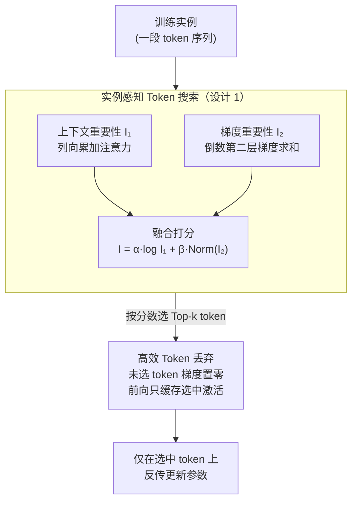

# TokenSeek: Memory Efficient Fine Tuning via Instance-Aware Token Selection

**会议**: ICLR 2026  
**arXiv**: [2601.19739](https://arxiv.org/abs/2601.19739)  
**代码**: [runjia.tech/iclr_tokenseek](https://runjia.tech/iclr_tokenseek)  
**领域**: LLM效率  
**关键词**: memory efficient fine-tuning, token selection, activation optimization, instance-aware, gradient sparsification

## 一句话总结

提出 TokenSeek，一个通用的实例感知 token 搜索与丢弃方法，通过结合上下文（注意力）和梯度信息评估每个 token 的重要性，仅在选中的 token 上更新参数，实现激活内存的大幅减少（最高 65.7%）而保持甚至超越全 token 微调性能。

## 研究背景与动机

LLM 微调面临巨大的内存消耗问题，其中**激活 (activations) 一致性地主导着总内存消耗**（例如 Llama3 8B 中激活占 87%）。现有内存高效微调（MEFT）方法主要采用：重计算（梯度检查点）、压缩（量化/稀疏化）、可逆网络三种范式。

**现有方法的核心问题**：它们都是**数据无关的优化** (data-agnostic)——对所有实例采用统一且不灵活的策略，不考虑每个实例内丰富的变异性。这导致：
- **低效微调**：无法根据实例调整内存缩减粒度
- **不稳定微调**：性能波动大

**核心挑战**：
1. 如何识别代表每个实例关键信息的显著 token？
2. 如何利用它们实现有效且稳定的内存优化？

## 方法详解

### 整体框架

微调时真正吃内存的是激活：前向时每一层每个 token 的中间结果都得缓存下来，等反向传播时用。TokenSeek 的出发点是——一条训练实例里其实只有少数 token 承载关键信息，没必要为所有 token 都缓存激活、都算梯度。于是它把"省激活内存"拆成前后衔接的两步：先用**实例感知 Token 搜索**给序列里每个 token 打一个重要性分数、挑出真正关键的少数 token，再用**高效 Token 丢弃**把反向传播限制在这批 token 上、丢掉其余 token 的梯度，从而前向时也只缓存被选中那部分激活。前一步保证选对 token 不掉性能，后一步把内存按选中比例压下来。整套流程对模型结构无侵入，只依赖注意力和梯度这两类标准信号，可以直接叠在 LoRA、QLoRA 等 PEFT 方法之上。

### 关键设计

**1. 实例感知 Token 搜索：用上下文+梯度双视角找出每个实例里真正重要的 token**

要省激活就得先知道哪些 token 该留，难点在于 token 冗余因实例而异，统一比例的随机丢弃既不准也不稳。TokenSeek 的做法是同时看两类互补信号给每个 token 打分。上下文重要性来自注意力：对注意力矩阵做列向累加，$I_1(t_j) = \sum_{i=1}^{n} \mathbf{A}_{ij}$，也就是 token $j$ 从序列里其他所有 token 收到的累积注意力，被越多 token 关注说明它在语义上越关键。梯度重要性来自倒数第二层（最后一个解码器块的输入）激活梯度，沿隐藏维度求和，$I_2(t_j) = \sum_{k=1}^{d} \mathbf{G}_{jk}$，梯度越大说明该 token 对当前学习目标贡献越大——这一路灵感来自"注意力权重常和基于梯度的特征重要性不一致"的观察，正好补上注意力看不到的"哪些 token 对训练最关键"。两者融合成单一分数：

$$I(t_j) = \alpha \log[I_1(t_j)] + \beta \cdot \text{Norm}[I_2(t_j)]$$

对上下文分数取对数，是为了压住注意力汇聚（Attention Sink，少数位置被异常集中关注）造成的长尾分布；对梯度分数做 min-max 归一化，是为了把两路量纲拉到可比区间。打分这一步的开销被刻意压到很小：只要一次前向（FP8 下约占训练内存的 13.3%）加一次**部分反向**——冻结所有层、只反传到输出头和最后一个解码器块，因此不需要为打分本身存全网络的激活和梯度。

**2. 高效 Token 丢弃：只在选中 token 上反传，把激活内存按选中比例砍掉**

选好 token 后，这一步才真正把内存省下来。反向传播被限制在被选中那批 token 的激活上，未选中 token 的梯度直接置零：$\frac{\partial z^{(l)}}{\partial z^{(l-1)}} = [\sigma'(a_t^{(l)}), 0]\, W^{(l)}$，方括号里只有选中 token $t$ 那一项保留梯度、其余为 0。关键在于，既然未选中 token 不再参与回传，前向时也就**不必缓存它们的激活**——只需存被选中 token 的激活 $a_t^{(l)}$，而非完整的 $a^{(l)}$。这正是省内存的根源：按空间复杂度估算，只更新 10% 的 token 大约只占 1% 的激活内存。实践中再叠加 QLoRA 等参数高效方法，峰值内存能压到全 token 基线的十几个百分点。

### 损失函数 / 训练策略

训练目标仍是标准语言建模损失，但只在被选中的 token 上累加，$\mathcal{L} = -\sum_{j \in \text{selected}} \log P(y_j | x, y_{<j}; \theta)$。这样未选中 token 既不进损失、也不缓存激活，性能优化（在哪些 token 上学）与内存优化（缓存哪些 token 的激活）落在同一套选择上，而不是彼此妥协。

## 实验关键数据

### 主实验

在 Qwen2.5 0.5B、Llama3.2 1B、Llama3.2 3B 上使用 Open-Platypus 数据集微调，评估 MMLU、ARC、HellaSwag、TruthfulQA、WinoGrande：

| 模型 | 方法 | 平均/峰值内存 | 平均分数 |
|------|------|-------------|---------|
| Llama3.2 1B | Full Token | 100%/100% | 40.82 |
| Llama3.2 1B | + TokenSeek | 64.6%/34.3% | **41.13** |
| Llama3.2 1B | LoHa | 92.3%/99.4% | 52.28 |
| Llama3.2 1B | LoHa + TokenSeek | 45.9%/28.4% | **52.58** |
| Llama3.2 1B | QLoRA | 45.6%/34.8% | 52.13 |
| Llama3.2 1B | QLoRA + TokenSeek | **14.8%/14.3%** | **52.61** |
| Llama3.2 3B | Full Token | 100%/100% | 41.53 |
| Llama3.2 3B | + TokenSeek | 73.1%/39.3% | **41.95** |
| Llama3.2 3B | QLoRA + TokenSeek | 13.3%/11.1% | 60.42 |

**亮点**：Llama3.2 1B + QLoRA + TokenSeek 仅用 14.8% 内存（2.8 GB）却超越全 token 基线（52.61 vs 40.82）。

### 消融实验

| 实验 | 发现 |
|------|------|
| α=1, β=0（仅上下文） | 48.45（有效但不完整） |
| α=0, β=1（仅梯度） | 46.39（不如上下文） |
| α=5, β=5（平衡） | 最优组合 |
| TokenTune（随机选择）| 一致低于 TokenSeek |
| 10% vs 50% token 比例 | 更多 token 降低训练损失，但过少可能导致优化崩溃 |

**可解释性分析**揭示的 token 选择模式：
- **上下文信息**偏好早期位置 token——受因果注意力掩码和注意力汇聚效应影响
- **梯度信息**主要聚焦在后期位置——通常对应"回答"部分
- 两者互补：上下文选择语义有意义的 token，梯度选择对学习最重要的 token

### 关键发现

1. **TokenSeek 偏好 PEFT**：全参数微调在低 token 比例下容易过拟合，PEFT 方法由于仅更新少量参数，对 token 丢弃更鲁棒
2. **跨规模泛化**：从 0.5B 到 3B 一致有效，但对较小模型（Qwen 0.5B）更敏感
3. **架构无关**：仅依赖注意力和梯度信息，适用于各种 Transformer 模型
4. 与 TokenTune（随机选择）的对比在所有设置下均表现出优势

## 亮点与洞察

1. **"一石二鸟"的设计理念**：实例感知搜索同时解决性能（选对 token）和内存（丢弃其余 token）两个问题
2. **上下文 + 梯度的互补发现**有深刻意义：注意力反映"哪些 token 在语义上重要"，梯度反映"哪些 token 对学习目标重要"
3. **QLoRA + TokenSeek 的组合效果惊人**：参数效率 + 内存效率的叠加实现了极端压缩下的性能提升
4. **可解释性分析**揭示的注意力汇聚效应和因果掩码对 token 重要性评估的影响，为未来研究提供了清晰的方向

## 局限性

1. **token 评估需要额外的前向和部分反向传播**：虽然开销较小，但对于超大规模模型可能仍需考虑
2. **超参数 α、β 的选择**：论文虽然做了消融但未提供自适应选择策略
3. **token 比例 10% 的硬编码**：不同数据集和任务可能需要不同比例
4. **缺乏在更大规模模型（7B+）上的验证**：当前最大仅测试 3B
5. **训练损失与下游性能的关系**需更深入分析：为何更高的训练损失（token 稀疏化导致）反而改善下游性能

## 相关工作与启发

- **TokenTune** (Simoulin et al., 2024)：随机 token 丢弃的先行者，但数据无关
- **QLoRA** (Dettmers et al., 2023)：参数高效方法，与 TokenSeek 互补
- **LoRA/LoHa**：其他 PEFT 方法，均可与 TokenSeek 无缝集成
- **梯度检查点**：另一类内存优化方法，通过重计算减少内存

TokenSeek 的核心启发：**微调中的 token 冗余是一个可利用的"漏洞"，而利用它的关键是实例级别的智能选择而非统一策略**。

## 评分

- 新颖性: ⭐⭐⭐⭐ — 实例感知 token 选择的思路新颖，上下文+梯度的组合评估有原创性
- 实验充分度: ⭐⭐⭐⭐ — 多模型、多 PEFT 设置、消融研究全面，可解释性分析加分
- 写作质量: ⭐⭐⭐⭐ — 结构清晰，可视化丰富
- 价值: ⭐⭐⭐⭐⭐ — 提供了立即可用的内存优化方案，与多种 PEFT 方法兼容

<!-- RELATED:START -->

## 相关论文

- [\[ICML 2026\] ReMoE: Boosting Expert Reuse through Router Fine-Tuning in Memory-Constrained MoE LLM Inference](../../ICML2026/llm_efficiency/remoe_boosting_expert_reuse_through_router_fine-tuning_in_memory-constrained_moe.md)
- [\[NeurIPS 2025\] Hierarchical Balance Packing: Towards Efficient Supervised Fine-tuning for Long-Context LLM](../../NeurIPS2025/llm_efficiency/hierarchical_balance_packing_towards_efficient_supervised_fine-tuning_for_long-c.md)
- [\[ACL 2025\] Tetris: Optimal Draft Token Selection for Batch Speculative Decoding](../../ACL2025/llm_efficiency/tetris_optimal_draft_token_selection_for_batch_speculative_decoding.md)
- [\[ACL 2026\] Understanding LLM Performance Degradation in Multi-Instance Processing: The Roles of Instance Count and Context Length](../../ACL2026/llm_efficiency/understanding_llm_performance_degradation_in_multi-instance_processing_the_roles.md)
- [\[ICML 2026\] Efficient Training-Free Multi-Token Prediction via Embedding-Space Probing](../../ICML2026/llm_efficiency/efficient_training-free_multi-token_prediction_via_embedding-space_probing.md)

<!-- RELATED:END -->
