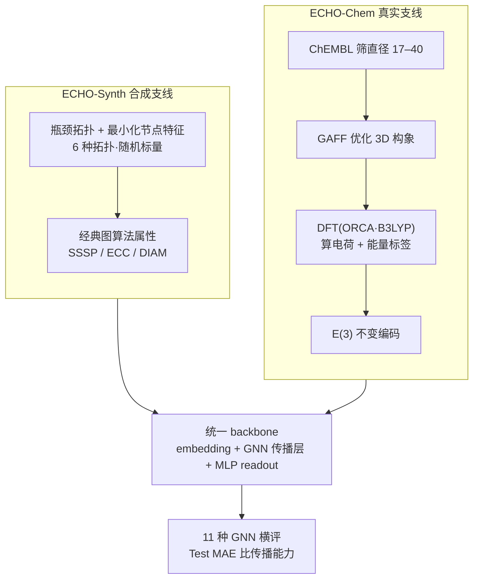

# Can You Hear Me Now? A Benchmark for Long-Range Graph Propagation and Beyond

**会议**: ICLR 2026  
**arXiv**: [2512.17762](https://arxiv.org/abs/2512.17762)  
**代码**: [GitHub](https://github.com/Graph-ECHO-Benchmark/ECHO)  
**领域**: LLM评测  
**关键词**: long-range propagation, graph benchmark, over-squashing, graph transformers, molecular property prediction

## 一句话总结

本文提出 ECHO 基准，包含 3 个合成任务和 2 个基于密度泛函理论（DFT）的真实化学任务，要求图神经网络在 17–40 跳范围内有效传播信息，系统评估了 11 种 GNN 架构的长程传播能力。

## 研究背景与动机

**GNN 的长程传播难题**：有效捕获图中远距离节点间的依赖关系是 GNN 研究的根本挑战，与过平滑（oversmoothing）、过挤压（over-squashing）和梯度消失等现象密切相关。

**已有基准的不足**：
   - LRGB (Dwivedi et al., 2022) 是最广泛使用的长程基准，但性能已趋于饱和，且部分任务被证明本质上是局部的而非长程的
   - Graph Property Prediction (Gravina et al., 2023) 使用小图且直径有限
   - 现有基准主要针对过平滑或过挤压的单一问题，未全面评估长程传播

**真实应用的需求**：分子性质预测中，原子电荷分布和分子总能量本质上依赖于远距离量子力学效应，但现有分子基准（ZINC、MoleculeNet）主要是短程任务

**模型成熟度**：Graph Transformer、多跳 GNN、微分方程启发的 GNN 等多种架构已趋成熟，需要更具挑战性的基准来区分它们的长程传播能力

**评估的科学严谨性**：需要明确定义"长程"的量化标准，并确保任务确实需要全局信息传播

## 方法详解

### 整体框架

ECHO（Evaluating Communication over long HOps）是一套专为长程传播设计的基准，核心思路是把"模型能否在 17–40 跳的尺度上把信息送到"这件事变成可控、可验证的评测题，再让所有模型在同一套脚手架下比拼。它分两条构建支线：ECHO-Synth 是合成支线，先用 6 种带瓶颈的拓扑铺底、配上最小化的节点特征，再加载 3 个对应经典图算法的属性预测任务（单源最短路 SSSP、节点离心率 ECC、图直径 DIAM），共 10,080 个图；ECHO-Chem 是真实支线，从 ChEMBL 数据库出发，经构象优化和密度泛函理论（DFT）计算，得到 2 个化学任务（原子电荷 ECHO-Charge、分子能量 ECHO-Energy）约 170K–196K 个分子图。两条支线产出的图最后都灌进同一个统一 backbone（embedding + GNN 传播层 + MLP readout），用 11 种 GNN 跑出的 Test MAE 横向比较，使性能差异只反映核心传播机制本身。

### 关键设计

**1. 合成支线的拓扑与特征：用结构瓶颈逼出过挤压、用最小特征堵死捷径**

只靠局部消息传递的 GNN 之所以在长程任务上垮掉，是因为远距离信息得挤过狭窄的结构瓶颈，挤压过程会把指数增长的信息硬塞进低维节点表示，造成过挤压（over-squashing）。ECHO-Synth 据此造了 6 种瓶颈强弱不同的拓扑：线图（line）逐跳顺序传播、每个节点都是关键瓶颈，并以 20% 概率向 2–6 跳外随机加残差边引入非局部交互；梯图（ladder）由两条平行线图横向互连、提供冗余路径；网格（grid）是二维格点并以 20% 概率随机删边打破规则通路；树（tree）用偏好连接（连接概率正比于 $k_i^{\alpha}$，$\alpha=3$）长出高度数枢纽，分支点天然是咽喉；毛虫图（caterpillar）和龙虾图（lobster）在主干上挂出一到两层枝杈，把瓶颈推得更深。光有瓶颈还不够——如果节点自带丰富特征，模型可能绕开传播、靠特征相似性蒙混。因此节点特征被压到最简：每个节点只带一个均匀随机标量 $r \sim \mathcal{U}(0,1)$，SSSP 再加一个二值位标记源节点。特征不含任何可利用的结构线索，模型想答对就只能依赖图结构上的传播，6 种拓扑上的整体表现于是干净地刻画出它对结构的真实感知，而非对某种规则布局的过拟合。

**2. 图属性任务的选择：用经典图算法锚定一个可验证的"长程"定义**

三个合成任务不是随手挑的，而是按对全局信息的依赖逐级加码：SSSP 求单个源点到其余各点的最短路；ECC 求每个节点的最长最短路（离心率）；DIAM 求全图任意两点间的最长最短路（直径）。它们恰好对应 Bellman-Ford、Dijkstra 这类必须完整遍历全图才能收敛的经典算法，于是任务本身就内含一个明确、可验证的"长程"定义——模型要做对，就得在内部学会模拟这种全局遍历，无法靠局部子结构计数取巧。配合上一条的瓶颈拓扑，这让 ECHO-Synth 比 LRGB、GPP 等用小直径稠密图的旧基准需要多得多的传播步数。

**3. 真实支线的 DFT 构建管线与 E(3) 不变编码：让物理来定义长程依赖**

量子力学里，一个原子的电荷重分布和整个分子的总能量本质上依赖远距离的电子-核、电子-电子交互，这给长程传播提供了天然且无法回避的真实需求。构建分两步走：先从 ChEMBL 筛出图直径 17–40 的分子，用 GAFF 力场把 SMILES 转成 3D 构象并优化（100 步粗最小化 + 500 步精修）；再交给 ORCA 量子化学软件用 B3LYP 泛函做 DFT 计算（开 TightSCF 收紧收敛），得到原子电荷与分子能量的基准标签。单分子平均算 634.5 秒、整套并行计算耗时约 2 个月，以保证标签精度足以暴露模型在 $10^{-4}$ 到 $10^{-6}$ e 量级上的电荷误差。编码上，节点取原子序数加上原子到分子质心的距离，边取键类型（单/双/三/芳香）加键长；这套表示在 E(3) 群（旋转、反射、平移）下不变——分子无论在空间里怎么摆，输入都相同，让模型学到的是分子内在几何而非坐标系里的偶然姿态，符合分子物理应有的对称性。

**4. 统一 backbone：把性能差异干净归因到传播机制**

要公平比较 11 种架构的长程传播能力，就不能让 readout、嵌入等辅助设计混进结论。ECHO 因此给所有模型套同一副骨架：一层线性 embedding，叠一摞各模型自己的 GNN 传播层，最后接任务相关的 readout——节点级任务（SSSP、ECC、电荷）直接对节点表示做两层 MLP，图级任务（DIAM、能量）先把节点表示用 mean、max、sum 三种聚合拼接、再过两层 MLP。这样唯一变量就是中间那摞传播层，性能差异于是只反映核心传播机制，而非花在 readout 上的额外容量（消融也确认 readout 深度对结果几乎无影响）。

### 损失函数 / 训练策略

回归目标用对数尺度的均方误差 $\log_{10}(\text{MSE}(y_{\text{true}} - y_{\text{pred}}))$，因为电荷等预测值量级很小，对数尺度能放大微小误差的区分度。优化器为 Adam，按验证集损失做 early stopping（patience 50 epochs，上限 1000 epochs）。为保证比较公平，每个"模型-数据集"组合都用贝叶斯优化（高斯过程先验）跑 100 trials 搜超参，最优配置再用 4 个随机种子重复取平均。

## 实验关键数据

### 主实验

ECHO-Synth 三个合成任务（Test MAE，越低越好）：

| 模型 | DIAM ↓ | ECC ↓ | SSSP ↓ |
|------|--------|-------|--------|
| **GRIT** | **1.014** | 5.091 | **0.121** |
| SWAN | 1.121 | 4.840 | 0.896 |
| A-DGN | 1.151 | 4.981 | 1.176 |
| **DRew** | 1.243 | **4.651** | 1.279 |
| GPS | 2.160 | 4.758 | 0.472 |
| GCN | 3.832 | 5.233 | 2.102 |
| GraphCON | 2.969 | 5.474 | 5.734 |

ECHO-Chem 两个化学任务（Test MAE，越低越好）：

| 模型 | ECHO-Energy ↓ | ECHO-Charge (×10⁻³) ↓ |
|------|--------------|----------------------|
| **GPS** | **5.257** | 6.182 |
| DRew | 11.325 | 9.086 |
| A-DGN | 12.486 | 6.543 |
| **SWAN** | 12.629 | **6.109** |
| GCN | 28.112 | 8.421 |
| GIN | 47.851 | 10.784 |

### 消融实验

深度分析（不同层数/跳数对性能的影响）：

| 分析维度 | 结论 |
|---------|------|
| 网络深度 vs 性能 | 更深的网络一致优于浅网络，验证了任务的长程性质 |
| 图直径 vs 性能 | 大直径图的误差更大，确认了长程传播的挑战 |
| Readout 深度 | 最终性能与 readout 深度无关，瓶颈在传播层 |
| 不同拓扑 | 模型相对排名跨拓扑保持一致 |
| GPS 注意力模式 | 最高注意力分数常分配给图中不直接相连的远距离节点对 |

### 关键发现

- **全局注意力机制是关键**：GRIT 在 SSSP 上 MAE 仅 0.121，远优于 GCN 的 2.102，证实 Transformer 式全局注意力大幅缓解局部消息传递的局限
- **非耗散动力学有效**：A-DGN、SWAN 等基于微分方程的非耗散 GNN 一致表现良好，说明保持信号能量对长程传播至关重要
- **仅缓解过平滑不够**：GraphCON 设计只针对过平滑，在长程任务上表现最差，证明长程传播需要专门的机制而非仅防止特征坍缩
- **精度-效率权衡**：GPS 等 Transformer 性能强但计算昂贵；A-DGN 提供更好的性价比
- **化学任务的实际价值**：即使 $10^{-4}$ 到 $10^{-6}$ e 量级的电荷误差也会影响下游分子建模

## 亮点与洞察

- **任务设计的严谨性**：合成任务与经典图算法（Dijkstra、Bellman-Ford）直接对应，明确定义了"长程"的物理含义
- **两种视角互补**：合成任务提供受控的理论测试；化学任务证明长程传播的实际必要性（DFT 计算耗时约 2 个月）
- **暴露了 LRGB 的局限**：ECHO 的传播范围（17–40 跳）远超 LRGB，且任务不可能通过局部子结构计数解决
- **公平的实验设计**：所有模型共享统一的 backbone（embedding + GNN layers + MLP readout），差异仅来自核心传播机制
- **Bayesian 超参数搜索**：100 trials per model-dataset pair，比随机搜索或手动调参更可靠

## 局限与展望

- 合成任务的图规模仍然有限（每图约 30–数百节点），可以扩展到更大规模
- 化学任务中仅使用了原子序数和距离特征，未包含更丰富的化学描述符（如角度、二面角）
- 缺少对图结构学习（graph rewiring）方法的评估
- ECHO-Synth 的随机节点特征可能对某些基于特征相似性的方法不公平
- 分子图的构建未考虑非共价交互（如氢键、范德瓦尔斯力），可能低估了实际的长程依赖
- 可以增加链接预测、图生成等更多类型的任务来全面评估长程传播

## 相关工作与启发

- **Dwivedi et al. (2022)**：LRGB 基准，目前最广泛使用但已趋饱和；ECHO 在传播范围和任务难度上显著超越
- **Gravina et al. (2023)**：GPP 数据集，使用小图和短距离；ECHO 使用更大直径和更多样的拓扑
- **Alon & Yahav (2021)**：理论分析过挤压现象；ECHO 提供实证验证平台
- **Rampášek et al. (2022)**：GPS Graph Transformer；实验证实其在长程化学任务上的优势
- **启发**：ECHO-Chem 的构建思路可以推广到蛋白质交互、晶体材料等其他需要长程建模的科学领域；不同拓扑的性能一致性分析为未来的"拓扑自适应"GNN 设计指明了方向

## 评分

- **新颖性**: ⭐⭐⭐⭐ 首个明确量化长程传播范围（17–40 跳）的综合基准，化学任务有实际科学价值
- **实验充分度**: ⭐⭐⭐⭐⭐ 11 种模型、5 个任务、Bayesian 超参搜索、多种分析维度，非常全面
- **写作质量**: ⭐⭐⭐⭐ 动机论证充分，与已有基准的对比清晰，但部分内容冗长
- **价值**: ⭐⭐⭐⭐⭐ 为 GNN 长程传播研究提供了急需的标准化评估平台，化学任务有 AI for Science 的应用前景

<!-- RELATED:START -->

## 相关论文

- [\[ICML 2026\] Beyond Trajectory-Level Attribution: Graph-Based Credit Assignment for Agentic Reinforcement Learning](../../ICML2026/llm_evaluation/beyond_trajectory-level_attribution_graph-based_credit_assignment_for_agentic_re.md)
- [\[NeurIPS 2025\] BLINK-Twice: You See But Do You Observe? A Reasoning Benchmark on Visual Perception](../../NeurIPS2025/llm_evaluation/blink-twice_you_see_but_do_you_observe_a_reasoning_benchmark_on_visual_perceptio.md)
- [\[ICLR 2026\] Can Vision–Language Models Assess Graphic Design Aesthetics? A Benchmark, Evaluation, and Dataset Perspective](can_vision_language_models_assess_graphic_design_aesthetics_a_benchmark_evaluati.md)
- [\[ACL 2026\] Contrastive Decoding Mitigates Score Range Bias in LLM-as-a-Judge](../../ACL2026/llm_evaluation/contrastive_decoding_mitigates_score_range_bias_in_llm-as-a-judge.md)
- [\[ACL 2025\] CoV-Eval: Can You Really Trust Code Copilots? Evaluating Large Language Models from a Code Security Perspective](../../ACL2025/llm_evaluation/cov_eval_evaluating_llms_from_code_security_perspective.md)

<!-- RELATED:END -->
