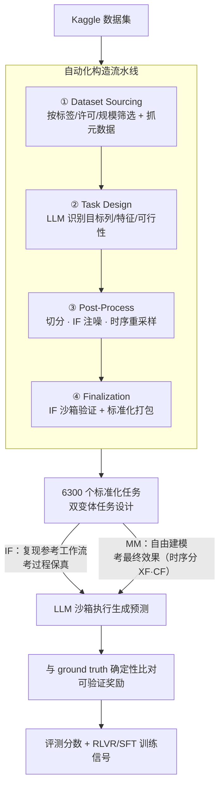

# DARE-bench: Evaluating Modeling and Instruction Fidelity of LLMs in Data Science

**会议**: ICLR 2026  
**arXiv**: [2602.24288](https://arxiv.org/abs/2602.24288)  
**代码**: [https://github.com/Snowflake-Labs/dare-bench](https://github.com/Snowflake-Labs/dare-bench)  
**领域**: LLM评测  
**关键词**: data science benchmark, instruction following, ML modeling, RLVR, LLM agent

## 一句话总结
DARE-bench 是一个面向数据科学任务的大规模可验证基准，包含 6300 个 Kaggle 衍生任务，支持 ML 建模和指令遵循两类评估，提供训练集支持 SFT 和 RL——SFT 将 Qwen3-32B 提升 1.83×，RL 将 Qwen3-4B 提升 8× 以上。

## 研究背景与动机

**领域现状**：LLM 越来越多地被用作数据科学 agent（数据读取、转换、建模），但现有基准（DS-1000、DSBench、MLE-bench 等）存在重大缺陷：大多仅评估最终答案准确性，忽略过程保真度；缺乏可验证的 ground truth；任务规模小（几百个）且不提供训练数据。

**现有痛点**：(a) 缺乏标准化的过程感知评估——agent 是否真正遵循了指定的 DS 流程？(b) 准确标注的训练数据稀缺——限制了 SFT 和 RL 的应用；(c) 现有基准主要来自 Kaggle 竞赛，领域覆盖窄（缺少时间序列预测等重要任务）。

**核心矛盾**：评估过程保真度需要确定性的 ground truth，但 DS 任务天然包含随机性和环境依赖。如何让过程评估变得可验证？

**本文目标** (a) 构建大规模、可验证、支持训练的 DS 基准；(b) 覆盖指令遵循和 ML 建模两类互补能力；(c) 支持 RLVR（强化学习 + 可验证奖励）训练。

**切入角度**：利用数据科学的高可复现性——通过控制随机种子和提供明确指令，忠实执行过程可以产生确定性结果，从而实现基于结果的过程保真度验证。

**核心 idea**：通过工程化确定性（固定种子+沙箱执行+参考解+可验证 ground truth），将 DS 过程评估转化为可自动验证的 outcome-based 评估。

## 方法详解

### 整体框架
DARE-bench 想回答一个问题：现有 LLM 能不能既严格遵循数据科学家给定的流程、又自主把模型调到最优，而且这套评估还能反过来当训练信号用。为此它把每个数据集出成两类互补的题——IF（Instruction Following）要求严格复现参考工作流、考过程保真度，MM（ML Modeling）不限方法、只看最终预测效果；时间序列任务再按测试集是否保留外生特征分成 XF 和 CF 两种难度。这些任务由一条四阶段自动化流水线从 Kaggle 数据批量生成，共 6300 个，每个都带可验证的 ground truth。评估时 LLM 在沙箱里执行自己写的代码生成预测，系统把预测与 ground truth 做确定性比对自动给分，全程不依赖人工评判或 LLM judge——正因如此，其中 95% 的任务可直接当 RLVR 的训练信号。

### 关键设计

**1. 自动化构造流水线：用 LLM 当辅助标注工，把 Kaggle 数据批量转成带 ground truth 的标准任务**

要凑齐 6300 个可验证任务，靠人工标注不现实，所以图里这条流水线是整个 benchmark 能上规模的前提。它分四阶段把原始 Kaggle 数据转成标准化 ML 任务：(1) Dataset Sourcing 用 API + 爬虫按标签、许可、规模、元数据筛选数据集；(2) Task Design 让 LLM 读数据预览和描述，判断能否支撑一个良定义的预测任务、识别目标列与特征类型（时序任务还要识别时间戳列和数据频率），只有判定可行的才进入下一阶段；(3) Post-Process 做训练/测试切分，并按变体分流——给 IF 任务注入噪声、给时序-CF 任务做重采样和实体检查；(4) Finalization 只对 IF 任务在沙箱里跑一遍参考解、确认任务确实可解（MM 任务直接用真实标签、无需沙箱），最后打包成含训练/测试数据、元数据、自然语言描述和参考解的标准格式。分寸在于 LLM 只碰辅助内容（描述、元数据、可行性判断、规则提取），训练信号本身（标签、参考解输出）始终来自真实数据和确定性执行、不由 LLM 生成，避免把噪声引入 ground truth。

**2. 双变体任务设计：把"过程对不对"和"效果好不好"拆成两套各自可验证的题**

数据科学 agent 有两种被使用的方式——要么严格按数据科学家给的方案执行，要么客户只看最终效果。DARE-bench 让流水线为每个数据集同时派生出两类互补任务来分别考这两种能力。IF 要求 LLM 严格复现参考工作流，指定的模型、超参数、预处理步骤都不能改，考的是过程保真度；这里的关键是固定随机种子，使"忠实执行"产生唯一确定的结果，过程是否走对就能直接由输出是否匹配来判定。MM 则不限定方法，只评估最终预测性能，考的是 LLM 自己挑模型、调参的建模能力。时间序列任务再细分两个变体：XF（eXogenous Features）测试集保留全部外生特征，CF（Canonical Forecasting）测试集只留时间戳和实体列、更贴近经典预测设定，难度更高。两套任务都对应真实需求，又都落到确定性数值上，这是后面可验证奖励能成立的前提。

**3. 可验证奖励设计：让 DS 任务也能像数学/代码一样做 RLVR**

RL 训练最缺的是无需人工评判就能自动给分的奖励，而前两个设计已经把 ground truth 全部钉死在确定性数值上，这里只需定义打分规则。IF 任务的 ground truth 是参考解 $\mathcal{C}_{ref}$ 在固定种子下对测试集的输出 $\mathbf{y}_{ref}$，采用严格的 0/1 匹配 $r = \mathbb{1}[\hat{\mathbf{y}} = \mathbf{y}_{ref}]$；MM 任务直接对原始数据的真实标签 $\mathbf{y}_{gt}$ 打分，分类用 macro-F1（应对类别不均衡），回归和时间序列用裁剪决定系数 $\mathrm{clip}(R^2) = \min\{1, \max\{0, R^2\}\}$。无论哪种，评分都只是把 LLM 沙箱执行的预测和 ground truth 自动比对，不依赖 LLM judge 或偏好标注，是纯 outcome-based 的验证。正因如此，DARE-bench 不只是个评测集——6300 个任务里 95% 可直接当 RLVR 的训练信号，把"数学/代码之外能不能做可验证强化学习"这个问题扩展到了数据科学场景。

### 损失函数 / 训练策略
- SFT：使用 DARE-bench 训练集对 Qwen3-32B/4B 进行微调
- RL：使用 GRPO 算法 + DARE-bench 可验证奖励，无需偏好数据
- 评估指标：分类用 accuracy/F1，回归用 R²/RMSE，时间序列用 SMAPE/MAE

## 实验关键数据

### 主实验

| 模型 | 基线总分 | SFT 总分 | RL 总分 | 提升 |
|------|---------|---------|---------|------|
| gpt-o4-mini | ~45 | - | - | 最强闭源也挣扎于 ML 建模 |
| Qwen3-32B | 23.25 | ~42.5 (1.83×) | - | SFT 大幅提升 |
| Qwen3-4B | 4.39 | ~25 | **37.40 (8.5×)** | RL 效果惊人 |

### 消融实验

| 任务类型 | 关键发现 |
|---------|---------|
| Classification-IF | LLM 不遵循种子/超参指令是主要失败原因 |
| Classification-MM | 开放建模下 LLM 仍然经常选择次优模型 |
| Time-series-CF | 最具挑战性的子任务，即使强模型也表现不佳 |
| RL vs SFT | 小模型上 RL 效果远优于 SFT；大模型上 SFT 已足够 |

### 关键发现
- **即使 gpt-o4-mini 也在 ML 建模任务上表现挣扎**，说明现有 LLM 的数据科学能力远未成熟
- **指令遵循是主要瓶颈**：模型频繁偏离指定过程（不用指定种子、改了预处理步骤等），导致 IF 任务失败
- **RL 在小模型上效果极其显著**：Qwen3-4B 从 4.39 提升到 37.40（8.5×），证明可验证奖励+RL 对提升 DS agent 能力非常有效
- **时间序列预测是最大短板**：所有模型在 CF 变体上表现最差，暗示 LLM 缺乏时间序列建模的深度知识

## 亮点与洞察
- **过程保真度→outcome-based 评估的转化**：利用数据科学的可复现性，将"过程是否正确"转化为"确定性输出是否匹配"，优雅解决了过程评估的客观性问题
- **训练 + 评测统一**：6300 个任务中 95% 可用于训练，5% 用于测试，真正支持"train on benchmark"的范式
- **RL 对小模型的极大增益**：8× 的提升说明任务特定的 RL 训练可以极大释放小模型潜力，对 DS agent 部署有重要实义
- **规模远超同类**：6300 tasks vs 现有最大的 SWE-bench（21K 但不是 DS 任务），在 DS 评估领域是量级提升

## 局限与展望
- Kaggle 数据集可能不代表工业界真实数据科学问题的复杂度
- IF 任务的"确定性"依赖于完全控制随机种子，现实中很多 DS 流程不可完全复现
- 未评估多轮交互/迭代式建模场景——实际 DS 工作往往需要多次实验迭代
- 时间序列任务的评估指标选择可能影响排名（SMAPE vs MAE 等）

## 相关工作与启发
- **vs DSBench/MLE-bench**: 规模更大（6300 vs 540/75），支持训练数据，覆盖时间序列
- **vs SWE-bench**: SWE-bench 做软件工程，DARE-bench 做数据科学，互补性强
- **vs RLVR (DeepSeek-R1 等)**: DARE-bench 提供了数学/代码之外的新 RLVR 场景——DS 任务的可验证奖励

## 评分
- 新颖性: ⭐⭐⭐⭐ IF+MM 双变体评估和 DS 过程保真度验证是新颖贡献
- 实验充分度: ⭐⭐⭐⭐⭐ 多模型评测+SFT+RL，6300 任务规模可观
- 写作质量: ⭐⭐⭐⭐ 结构清晰，流水线描述详细
- 价值: ⭐⭐⭐⭐ 填补 DS agent 训练+评估的重要空白，RL 训练结果尤其有说服力

<!-- RELATED:START -->

## 相关论文

- [\[AAAI 2026\] Benchmarking LLMs for Political Science: A United Nations Perspective](../../AAAI2026/llm_evaluation/benchmarking_llms_for_political_science_a_united_nations_perspective.md)
- [\[ICLR 2026\] ASIDE: Architectural Separation of Instructions and Data in Language Models](aside_architectural_separation_of_instructions_and_data_in_language_models.md)
- [\[ICLR 2026\] Truthfulness Despite Weak Supervision: Evaluating and Training LLMs Using Peer Prediction](truthfulness_despite_weak_supervision_evaluating_and_training_llms_using_peer_pr.md)
- [\[ACL 2026\] ScaleBox: Enabling High-Fidelity and Scalable Code Verification for Large Language Models](../../ACL2026/llm_evaluation/scalebox_enabling_high-fidelity_and_scalable_code_verification_for_large_languag.md)
- [\[ACL 2025\] SeedBench: A Multi-task Benchmark for Evaluating Large Language Models in Seed Science](../../ACL2025/llm_evaluation/seedbench_a_multi-task_benchmark_for_evaluating_large_language_models_in_seed_sc.md)

<!-- RELATED:END -->
