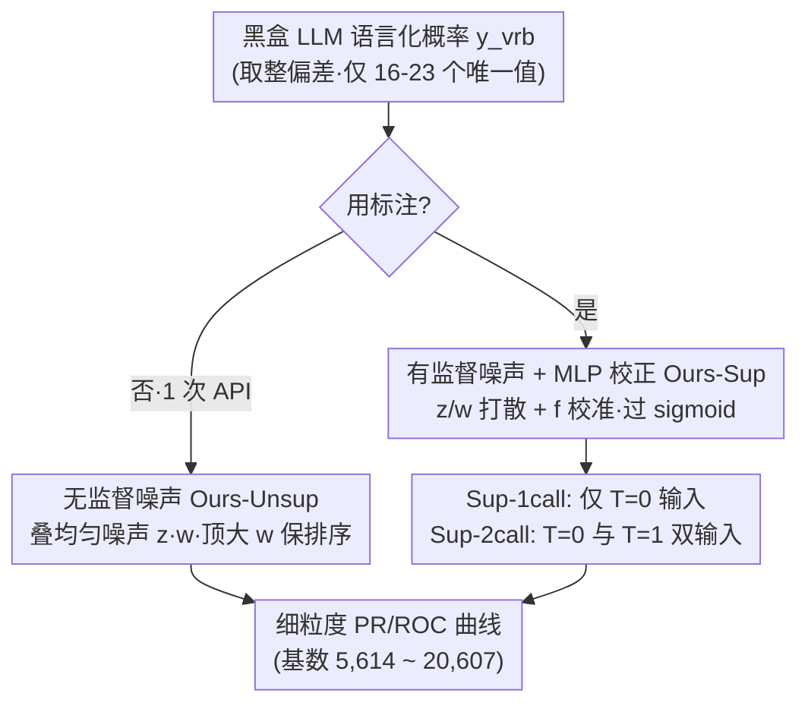

# Enabling Fine-Grained Operating Points for Black-Box LLMs

**会议**: ICLR 2026  
**arXiv**: [2510.17727](https://arxiv.org/abs/2510.17727)  
**代码**: 未公开（论文附录有代码片段）  
**领域**: LLM评测  
**关键词**: 黑盒LLM, 操作点, 概率校准, PR曲线, 置信度估计

## 一句话总结
发现黑盒 LLM 的语言化概率仅输出 16-23 个唯一值（低基数问题），导致 PR/ROC 曲线粗糙无法精细调优；通过注入参数化噪声和可选的 MLP 校正，将唯一值从 16 个提升到 20,000+，在仅需 1-2 次 API 调用的条件下达到 20 次采样的性能。

## 研究背景与动机

**领域现状**：将 LLM 部署为分类器时，需要在精确率-召回率曲线上选择合适的操作点。常见做法是让 LLM 输出[0,1]概率值作为置信度。

**现有痛点**：LLM 存在严重的"取整偏差"——输出的概率值集中在 0, 0.5, 0.85, 0.9, 0.95 等少数值上（以 0 和 5 结尾的倾向），导致 PR/ROC 曲线只有十几个离散点，无法精细控制阈值。

**核心矛盾**：PR 曲线上的粗糙间隔意味着在部署时只能选择"要么高精确率低召回率，要么低精确率高召回率"，无法找到细粒度的折中点。

**本文目标** 如何在不大幅增加 API 调用次数的前提下，让黑盒 LLM 的概率输出变得连续？

**切入角度**：向离散概率上加参数化噪声，本质上将离散分布"扩散"为连续分布。

**核心 idea**：加噪声打破取整偏差——在保持排序性能的前提下，将唯一概率值从16个扩展到20000+个。

## 方法详解

### 整体框架
问题很具体：把黑盒 LLM 当分类器用时，让它语言化输出一个 $[0,1]$ 的置信概率 $\hat{y}^{\text{vrb}}$，但由于"取整偏差"，这个值只落在 0、0.5、0.9、0.95 这十几个数上（11 数据集合并后仅 16-23 个唯一值），PR/ROC 曲线因此只有十几个离散点，没法按"精确率 ≥ 95%"这类约束精细地选操作点。论文先把"在不掉排序性能的前提下把操作点撑密"形式化成一个约束优化（式 3）：找一个映射 $f$ 把语言化概率变换成新分布，使操作粒度 $g$（沿某轴能稳定做出的最小调整步长，越小越细）最小，同时分类损失不超过原始语言化概率的损失。求解的核心手段是给这些扎堆的概率注入**参数化噪声**——连续噪声分布的基数趋于无穷，叠上去就能把离散分布"摊开"成连续分布，让排序不变但取值连续。沿这个思路给出两类做法：无监督只加均匀噪声的 **Ours-Unsup**（不需标注、1 次 API），以及在噪声之外再学一个 MLP 校正的 **Ours-Sup**（含只喂 $T=0$ 输出的 1-call 与同时喂 $T=0,T=1$ 两次采样的 2-call）。

### 关键设计

**1. 无监督噪声（Ours-Unsup）：不用标注，只靠加噪声把基数撑大**

针对的痛点是离散化本身——哪怕不碰校准，只要把扎堆的概率值打散，曲线就能变细。做法是在原始语言化概率上叠一个幅度为 $w$ 的均匀噪声 $z\sim U(0,1)$，得到 $\hat{y}_i=\text{clip}_{[0,1]}(z_i w + \hat{y}^{\text{vrb}}_i)$，并在"加噪后性能不比原来差"这个硬约束下把噪声幅度 $w$ 顶到最大：

$$\max_{w>0}\; w \quad \text{s.t.} \quad \sum_i \ell\big(y_i,\, \text{clip}_{[0,1]}(z_i w + \hat{y}^{\text{vrb}}_i)\big) \le \sum_i \ell(y_i, \hat{y}^{\text{vrb}}_i)$$

巧的是这个约束不必真去算分类损失：只要相邻两档语言化概率之间的相对排序不被噪声搅乱，PR/ROC 上的性能就不变——所以实际只需把 $w$ 设到"加噪后最大的样本仍小于上一档原始概率"那条边界即可。代价上它完全无监督、不需任何标签，就把唯一概率值从 16 个撑到 5,614 个。

**2. 有监督噪声 + MLP 校正（Ours-Sup）：噪声治基数，MLP 治校准，两件事一起学**

无监督版只摊开了分布，却没修 LLM 概率系统性偏高/偏低的校准问题（零样本下分数本就没对齐任务）。这里把式 4 推广到有监督（式 5）：引入一个 ReLU 网络 $f$ 把语言化概率映射到更准的刻度，同时联合优化噪声幅度 $w$，外层套 sigmoid 压回 $[0,1]$：

$$\arg\min_{\theta_f,\, w>0}\; \sum_i \ell\Big(y_i,\, \text{sig}\big(z_i/w + f(\hat{y}^{\text{vrb}}_i; \theta_f)\big)\Big) + \lambda w,\quad z\sim N(0,1)$$

这里 $f$ 负责把偏掉的概率拉回正确刻度（治校准），高斯噪声项 $z_i/w$ 负责把取值打散（治基数）——因为高斯的微分熵正比于标准差 $\sigma\propto 1/w$，$w$ 越小熵越高、分布越连续，正则项 $\lambda w$ 就用来把 $w$ 往小推、防止噪声学过头；当 $w\to\infty$ 噪声消失，$f$ 退化成纯校准器。它有两个变体：**Sup-1call** 只用 $T=0$ 的一次输出（1 次 API），**Sup-2call** 额外取 $T=1$ 的采样、把两个温度下的语言化概率一起喂给 MLP（训练时每样本采 20 次、推理只需 2 次 API），信息更全，最终把基数推到 20,607。

## 实验关键数据

### 基数提升

| 方法 | API 调用 | 唯一值数 | 基数倍数 |
|------|---------|---------|---------|
| Prompt-Naive | 1 | 10 | 1x |
| Sample-Class (20次) | 20 | 97 | 10x |
| **Ours-Unsup** | **1** | **5,614** | **561x** |
| **Ours-Sup-2call** | **2** | **20,607** | **2,061x** |

### 性能对比（11 数据集联合）

| 方法 | API 调用 | PRAUC | 精确率粒度 |
|------|---------|-------|----------|
| Prompt-Naive | 1 | 0.72 | 0.081 |
| Sample-Prob | 20 | 0.78 | 0.014 |
| **Ours-Sup-2call** | **2** | **0.79** | **0.016** |

### 关键发现
- Sup-2call 用 2 次 API 调用超越了 20 次采样的性能（PRAUC 0.79 vs 0.78）
- 噪声是必要的——纯 MLP 校正（无噪声）无法解决基数问题
- 在 11 个不同数据集上一致有效，从情感分类到事实验证

## 亮点与洞察
- **从工程问题出发**：发现 LLM 概率输出的取整偏差并量化其影响（16-23 个唯一值），这本身就是有价值的观察。
- **噪声作为正则化**：加噪声不是降低信号质量，反而是将过度离散化的信号"平滑"到连续空间，提升了下游决策的灵活性。
- **成本效益极高**：2 次 API 调用 > 20 次采样，节省 90% 的 API 成本。

## 局限与展望
- 有监督变体需要标注数据训练 MLP，冷启动场景不适用
- 仅在 Claude 和部分开源模型上验证，不同 LLM 的取整偏差可能不同
- 噪声幅度和 MLP 结构是固定的，自适应方案可能更好

## 相关工作与启发
- **vs 标准采样**: 多次采样（20次）提升基数但成本线性增长，本文用 1-2 次调用达到相当效果
- **vs 概率校准**: Platt Scaling 等方法校准概率但不解决基数问题，本文同时解决两者

## 评分
- 新颖性: ⭐⭐⭐⭐ 问题发现新颖（取整偏差），解决方案直观有效
- 实验充分度: ⭐⭐⭐⭐ 11个数据集 + 多种基线 + 消融
- 写作质量: ⭐⭐⭐⭐ 问题动机清晰，图表丰富
- 价值: ⭐⭐⭐⭐⭐ 对LLM部署有直接实用价值

<!-- RELATED:START -->

## 相关论文

- [\[NeurIPS 2025\] Predicting the Performance of Black-Box LLMs through Follow-Up Queries](../../NeurIPS2025/llm_evaluation/predicting_the_performance_of_black-box_llms_through_follow-up_queries.md)
- [\[ICML 2025\] Hyperband-based Bayesian Optimization for Black-box Prompt Selection](../../ICML2025/llm_evaluation/hyperband-based_bayesian_optimization_for_black-box_prompt_selection.md)
- [\[ICML 2026\] Investigating Advanced Reasoning of Large Language Models via Black-Box Environment Interaction](../../ICML2026/llm_evaluation/investigating_advanced_reasoning_of_large_language_models_via_black-box_environm.md)
- [\[ICLR 2026\] When to Ensemble: Identifying Token-Level Points for Stable and Fast LLM Ensembling](when_to_ensemble_identifying_token-level_points_for_stable_and_fast_llm_ensembli.md)
- [\[ACL 2026\] IF-Critic: Towards a Fine-Grained LLM Critic for Instruction-Following Evaluation](../../ACL2026/llm_evaluation/if-critic_towards_a_fine-grained_llm_critic_for_instruction-following_evaluation.md)

<!-- RELATED:END -->
