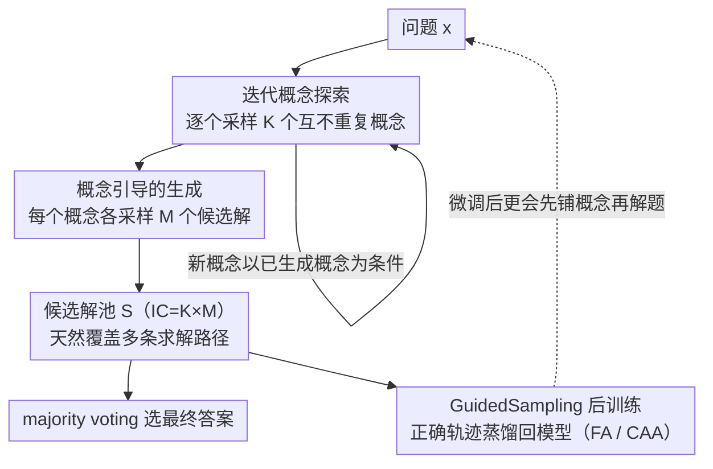

# GuidedSampling: Steering LLMs Towards Diverse Candidate Solutions at Inference-Time

**会议**: ICLR 2026  
**arXiv**: [2510.03777](https://arxiv.org/abs/2510.03777)  
**代码**: [GitHub](https://github.com/DivijH/sampling_inference)  
**领域**: LLM评测  
**关键词**: inference-time scaling, repeated sampling, diversity, concept exploration, pass@k

## 一句话总结

提出 GuidedSampling 推理算法，将重复采样（RS）的隐式探索和生成过程显式解耦为两阶段：先迭代生成多样化的解题概念/定理，再基于各概念分别生成候选解。在 pass@50 上平均提升约 21.6%，微调后 pass@5 提升约 9.7%。

## 研究背景与动机

**领域现状**：推理时计算扩展（inference-time scaling）是提升 LLM 性能的重要方向——在推理阶段多花算力，往往比把同样算力拿去训更大的模型更划算。其中最简单的算法就是重复采样（RS）：对同一输入反复采样多个候选解，再用 majority voting / pass@k 挑答案。

**现有痛点**：RS 存在严重的多样性不足——LLM 被训练为对同一输入生成单一正确响应，导致采再多次也只在少数几个概念上打转。定量分析印证了这点：Llama-3.2-3B 在 HumanEval 上生成 100 个候选解平均仅用 2.75 个不同概念，37% 的问题只尝试了一个概念；MATH 最大值题里 RS 的 892/1000 个解都用了 "AM-GM 不等式"，且大多算错。

**核心矛盾**：Tree-of-Thought（ToT）能靠树搜索提升多样性，但要在树的每一步显式评估每个中间候选思路，计算开销极高。于是问题变成：能不能既拿到 ToT 那样的多样性、又只付 RS 量级的成本？

**核心思路**：把 RS 中隐式耦合的"探索"（用哪个概念解）和"生成"（按概念写出解）两个阶段显式分离——先低成本地一次性探索出多个概念，再用它们各自引导生成，以接近 RS 的预算换来高多样性。

## 方法详解

### 整体框架

重复采样（RS）之所以多样性差，是因为它把"探索"（用哪个概念/定理来解）和"生成"（按这个概念写出完整解）这两件事隐式揉在一次采样里——模型每抽一个解都各自悄悄选一个概念，结果绝大多数撞在同一个上（MATH 最大值题里 892/1000 个解都用 AM-GM 不等式，且全错）。GuidedSampling 的核心动作就是把这两件事显式拆成前后两个阶段：先在**探索阶段**迭代采样 $K$ 个互不重复的概念，再在**生成阶段**对每个概念各生成 $M$ 个以它为条件的候选解，凑成候选池后照常用 majority voting / pass@k 选答案。总推理预算保持 $IC = K \times M$ 不变，所以花费几乎不增加，却把原本被隐式概念锁死的解空间在"概念"这一高层维度上显式撑开。更进一步，这套流程跑出来的正确轨迹本身是高质量合成数据，可以反过来蒸馏回模型做后训练，让模型把"先铺概念再解题"的习惯内化进权重。

### 关键设计

**1. 迭代概念探索：先把"用什么方法"想全，再去解题**

针对的就是 RS"所有解共享同一个隐式概念"的瓶颈。GuidedSampling 改成先专门生成一串概念：给定问题 $x$，第 $k$ 个概念以前面所有概念为条件采样

$$c_k \sim p_\theta(\cdot \mid x, c_{1:(k-1)})$$

把已生成概念喂回上下文，等于每一步都明确告诉模型"这些路子已经有了，换个新的"，从而逼出 RS 难以触及的方向；过程一直迭代到攒满 $K$ 个概念、或模型自己判断再没有有用概念可产出（支持提前停止）。这里"概念"被定义成解题用的定理/思路名（如"AM-GM 不等式""Cauchy-Schwarz 不等式"），是问题层面的高层指导，探索一次即可复用，不像 ToT 要在树的每一步显式评估每个中间 thought，开销低得多。

**2. 概念引导的生成：让每个候选解锁定一条不同的求解路径**

拿到概念集合 $\mathcal{C}=\{c_1,\dots,c_K\}$ 后，对每个 $c_k$ 单独采样 $M$ 个候选解 $s_k^{(m)} \sim p_\theta(s \mid x, c_k)$，全部候选并起来构成解池 $\mathcal{S}=\bigcup_{k=1}^{K}\mathcal{S}_k$。概念和解法被显式绑定，保证候选池天然覆盖多种不同路径，而不是像 RS 那样挤在一个隐式概念上。实测下来，GuidedSampling 产出的候选解平均比 RS 多 17.63% 的独特概念（如 MATH 最大值题里用 AM-GM 的从 892/1000 降到 77/1000，剩余预算去探索 Cauchy-Schwarz、Chebyshev 等），这正是 pass@k 提升的直接来源。这里有个关键的探索-生成权衡：$K$ 和 $M$ 在固定预算 $IC$ 下此消彼长，$K$ 太小退化成 RS、$K$ 太大则每个概念的生成预算 $M$ 不够把任何一条路走透，存在一个甜点（$K=0$ 时 GuidedSampling 恰好就是传统 RS）。

**3. GuidedSampling 后训练：把多样化轨迹蒸馏回模型**

推理阶段产出的（已验证正确的）轨迹本身就是高质量合成数据，可以反过来微调模型。论文给了两种数据格式：FA（Final-Answer Only）丢掉概念、只用最终答案 $(x, s)$ 做监督；CAA（Concept-Augmented Answer）则把概念集和答案拼成一条目标序列 $(x, \text{concat}(\mathcal{C}, s))$。CAA 让模型完整学习"先铺开多个概念、再落到一个具体解"的过程，把多种推理策略内化进权重，因此显著优于 FA——微调后 pass@5 相对最强基线平均提升约 9.7%，并能泛化到 GPQA、HumanEval、OlympiadBench 等域外基准。

### 损失函数 / 训练策略

两种格式都用标准的最大似然微调。FA 模式直接对答案做监督 $\mathcal{L}_{FA} = -\mathbb{E}_{(x,s) \sim \mathcal{D}_{FA}} [\log P_\theta(s \mid x)]$；CAA 模式则把目标换成概念与答案的拼接 $y = \text{concat}(\mathcal{C}, s)$，损失为 $\mathcal{L}_{CAA} = -\mathbb{E}_{(x,\mathcal{C},s) \sim \mathcal{D}_{CAA}} [\log P_\theta(y \mid x)]$，等价于让模型学会先输出概念再输出解。论文还给了理论保证（Theorem 1）：当 $k_{min} \cdot P(\mathcal{C}_r \mid x) > 1$，即模型有足够概率生成相关概念、且概念能带来显著放大因子时，GuidedSampling 在 pass@k 上严格优于 RS——这也解释了为何概念能力弱的模型（如 Qwen2.5-3B 在代码域）享受不到收益。

## 实验关键数据

### 主实验

pass@50 改进（平均跨 Llama-3.2-3B, Qwen2.5-3B, Gemma-3-27B）：

| 基准 | RS 基线 | GuidedSampling | 提升 |
|------|--------|---------------|------|
| MATH | — | — | +21.8% |
| GPQA-Diamond | — | — | +11.87% |
| HumanEval | — | — | +11.28% |
| OlympiadBench | — | — | +3.08% |
| **平均** | — | — | **+16.01%** |

### 消融实验

微调后 pass@5 对比（Llama-3.2-3B-Instruct）：

| 训练策略 | MATH | GPQA | HumanEval | Olympiad | 平均 |
|----------|------|------|-----------|----------|------|
| RS | 44.78 | 40.08 | 55.78 | 10.83 | 37.87 |
| STaR | 46.23 | 38.41 | 57.35 | 10.62 | 38.15 |
| ToT | 56.63 | 44.44 | 49.51 | 18.36 | 42.24 |
| FA (Ours) | 47.98 | **50.61** | 55.95 | 20.21 | 43.69 |
| CAA (Ours) | **60.06** | 40.23 | **59.03** | **21.66** | **45.25** |

多样性分析：RS 平均产生 4.04 个独特概念 vs GuidedSampling 4.75 个独特概念（+17.63%）

### 关键发现

1. GuidedSampling 在几乎所有模型-基准组合上优于 RS。唯一例外：Qwen2.5-3B 在 HumanEval 上退化，因其代码领域概念生成能力弱（平均仅 1.13 个概念）
2. 探索-生成的最佳分配存在甜点：增大 $K$ 先提升再下降（概念多但每个概念的生成预算 $M$ 不足）
3. 早期概念（$k=1$-$5$）平均质量更高（19.8%→16.2%），但后期概念（$k \geq 6$）对少数需要深度探索的难题贡献关键
4. **领域限制**：在常识推理（CommonSenseQA）上 GuidedSampling 反而比 RS 差 3.28%——概念难以良定义的领域不适用
5. CAA 训练模式显著优于 FA，说明让模型学习"先探索概念再解题"的完整轨迹更有效
6. 计算开销方面，概念生成是一次性的序列调用，远小于 RS 的 100 次采样总量

## 亮点与洞察

1. **简洁的设计哲学**：仅通过将"隐式探索+生成"解耦为"显式探索→引导生成"就获得巨大收益
2. **理论分析得当**：Theorem 1 精确描述了 GuidedSampling 优于 RS 的充要条件，两个路径（概念覆盖 + 不相关概念恢复）提供了清晰的分析框架
3. **后训练的双重价值**：GuidedSampling 不仅是推理策略，还是高质量合成数据生成器——CAA 微调显著提升 pass@k
4. AM-GM 不等式的例子极具说服力：892/1000 的 RS 解使用同一定理导致错误
5. **方法的可组合性强**：可与 RL（如 pass@k 优化）、majority voting 等技术叠加使用

## 局限与展望

1. **领域限制明显**：对概念难以良定义的任务（常识推理）效果差，适用范围受限于有明确概念/定理的领域
2. **模型依赖性强**：Qwen2.5-3B 在 HumanEval 上只能生成 1.13 个概念——概念生成能力弱的模型无法受益
3. 概念生成阶段为序列迭代，无法并行化，在极大 $K$ 时成为瓶颈
4. 仅在 3B 级小模型上做了主要实验，7B+ 大模型的表现需要验证
5. 概念质量评估完全依赖 Qwen2.5-32B 提取——如果提取器本身不准确，多样性数据可能有偏差

## 相关工作与启发

- **Repeated Sampling**（Cobbe et al., 2021）：最简单的推理时扩展，但多样性不足
- **Tree-of-Thought**（Yao et al., 2023）：结构化探索，但计算开销高；GuidedSampling 在多样性和效率间找到更好平衡
- **Self-Taught Reasoner (STaR)**（Zelikman et al., 2022）：利用推理轨迹微调，但未显式管理多样性
- 启发：探索-生成解耦思想可推广到代码生成（先规划算法再实现）、科学发现等领域

## 评分

- **新颖性**: ⭐⭐⭐⭐ 探索-生成解耦的思路简洁有效，但核心 idea 相对直觉（"先想方法再做题"）
- **实验充分度**: ⭐⭐⭐⭐ 多基准多模型、理论分析、后训练实验丰富，但主要集中在 3B 模型
- **写作质量**: ⭐⭐⭐⭐ 结构清晰，AM-GM 的 motivating example 极好，但部分细节（如概念定义的精确性）可以更明确
- **价值**: ⭐⭐⭐⭐ 在推理时计算扩展领域有实际价值，但领域限制（需要良定义的概念）降低了通用性

<!-- RELATED:START -->

## 相关论文

- [\[AAAI 2026\] Test-time Diverse Reasoning by Riemannian Activation Steering](../../AAAI2026/llm_evaluation/test-time_diverse_reasoning_by_riemannian_activation_steering.md)
- [\[AAAI 2026\] OptScale: Probabilistic Optimality for Inference-time Scaling](../../AAAI2026/llm_evaluation/optscale_probabilistic_optimality_for_inference-time_scaling.md)
- [\[ICML 2025\] Bounded Rationality for LLMs: Satisficing Alignment at Inference-Time](../../ICML2025/llm_evaluation/bounded_rationality_for_llms_satisficing_alignment_at_inference-time.md)
- [\[ICLR 2026\] In-Context Learning of Temporal Point Processes with Foundation Inference Models](in-context_learning_of_temporal_point_processes_with_foundation_inference_models.md)
- [\[ICLR 2026\] AdaBlock-dLLM: Semantic-Aware Diffusion LLM Inference via Adaptive Block Size](adablock-dllm_semantic-aware_diffusion_llm_inference_via_adaptive_block_size.md)

<!-- RELATED:END -->
