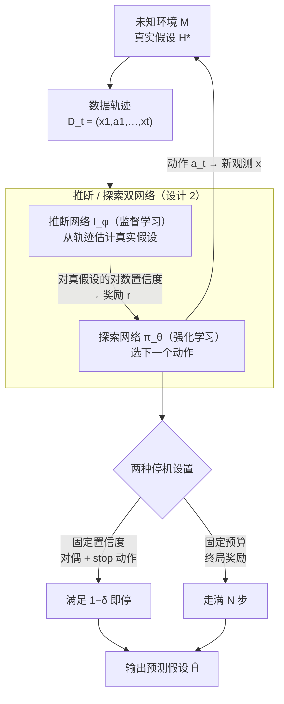

# In-Context Learning for Pure Exploration

**会议**: ICLR 2026  
**arXiv**: [2506.01876](https://arxiv.org/abs/2506.01876)  
**代码**: 有（附论文）  
**领域**: LLM评测  
**关键词**: 上下文学习, 纯探索, 假设检验, Best Arm Identification, Transformer

## 一句话总结

提出 ICPE（In-Context Pure Exploration），一种结合监督学习和强化学习的上下文学习框架，使用 Transformer 从经验中直接学习探索策略，在主动序列假设检验/纯探索问题中实现接近最优的实例自适应算法性能，无需显式建模信息结构。

## 研究背景与动机

主动序列假设检验（也称纯探索）中，agent 需要主动控制数据收集过程以高效识别正确假设。该问题广泛存在于医疗诊断、图像识别、推荐系统等领域。当前方法面临三大挑战：

**归纳偏置难以编码**：设计自适应探索策略需要对问题结构有深刻理解，但在隐含信息结构未知时尤为困难

**RL 方法的局限性**：当相关信息结构未被充分表示时，传统 RL 方法往往表现不佳

**BAI 方法的限制**：Best Arm Identification 等经典方法虽然理论优雅，但通常依赖显式的建模假设，且在复杂环境（如 MDP）中优化问题变为非凸

核心问题：能否让 agent **自主**从经验中发现和利用隐含结构来增强探索效率？

## 方法详解

### 整体框架

ICPE 要解决的是主动序列假设检验：agent 面对一个未知环境 $\mathcal{M}$（真实假设是 $H^*$），得自己决定一步步去采哪些数据，尽快又尽准地把 $H^*$ 认出来。它的核心思路是把这件事拆给一对相互喂养的 Transformer：**推断网络** $I_\phi$ 负责「读数据、下判断」，用监督学习从已收集的轨迹 $\mathcal{D}_t = (x_1, a_1, \ldots, x_t)$ 里估计真实假设；**探索网络** $\pi_\theta$ 负责「挑下一步去哪采」，用强化学习选动作，让推断网络越来越好猜。

整条流水线是个闭环：每一步探索网络选一个动作打到环境上、拿回新观测、把轨迹变长；推断网络读这条更长的轨迹给出对真假设的置信度，这个置信度又被折成奖励喂回探索网络。于是「推断越准 → 奖励越靠谱 → 探索越聪明 → 数据越有信息量 → 推断又更准」自我强化，归纳偏置不用人手写，全交给网络从经验里长出来。这套结构再按任务要求挂上两种停机设置——要么固定容错率提前停（固定置信度），要么走满固定步数（固定预算）——最后输出预测假设 $\hat{H}$。

### 关键设计

**1. 纯探索重写成 MDP：让强化学习接管「主动选数据」**

经典 Best Arm Identification 这类方法依赖显式的建模假设，环境一复杂（比如换成 MDP）优化目标就变非凸、推不动。ICPE 干脆把整段探索铺成一个序贯决策过程：状态 $s_t = (\mathcal{D}_t, \emptyset_{t:N})$ 由历史轨迹再加上把序列补齐到最大长度 $N$ 的填充 token 组成，动作空间 $\mathcal{A}$ 在固定置信度设置下还多挂一个 stop 动作。这样「下一步该采哪个数据」就成了标准的 MDP 决策，能直接用 RL 求解；隐含的信息结构不再需要事先编码进算法，而是留给网络自己从经验里发现——这正是后面在 magic-action 等结构化环境里能赢过贪心信息增益法的根。

**2. 推断 / 探索双网络：用置信度奖励把「猜得准」和「采得巧」拧成闭环**

把 MDP 求解落到实处的，是分工明确的两张 Transformer。推断网络 $I_\phi(H \mid \mathcal{D}_t)$ 用监督学习逼近后验 $\mathbb{P}(H^* = H \mid \mathcal{D}_t)$，只管在当前数据下猜假设；探索网络由 Q 网络 $Q_\theta(\mathcal{D}_t, a)$ 的贪心策略定义，只管选动作。两者解耦后并不各自为政——$I_\phi$ 对真假设给出的对数置信度被直接当作 $\pi_\theta$ 的奖励信号，推断网络变好，奖励就变得更可信，探索网络于是学到更能榨取信息的策略，反过来又喂给推断网络更有信息量的数据。这种「推断给奖励、探索给数据」的相互喂养，是 ICPE 不需要人写归纳偏置就能逼近实例最优的关键。

**3. 两种停机设置：固定置信度靠对偶 + stop 动作，固定预算靠终局奖励**

同一套架构按任务挂两种奖励。**固定置信度**要在保证 $\mathbb{P}(\hat{H}_\tau = H^*) \geq 1 - \delta$ 的前提下最小化停止时间 $\tau$，是带约束优化；ICPE 用拉格朗日乘子 $\lambda$ 转成对偶问题 $\min_{\lambda \geq 0} \max_{I, \pi} V_\lambda(\pi, I)$，把约束折进奖励

$$r_\lambda(z) = -1 + d \cdot \lambda \log I_{\bar{\phi}}(H^* \mid s')$$

每走一步扣 $-1$ 逼 agent 别磨蹭，终止指示符 $d$ 触发时按推断网络对真假设的对数置信度发一笔正奖励。妙处在那个专门的 stop 动作：它的 Q 值只依赖历史，因而可以在任意状态「假装现在停」回溯更新（哪怕实际动作不是 stop），相当于自带一层课程学习，让 agent 慢慢学会按问题难度决定何时收手。**固定预算**则简单得多——预算锁死 $N$ 步、只求识别正确率最高，于是去掉 stop 动作，中间步全零奖励，只在最后一步结算 $r_N = h(\hat{H}_N; \mathcal{M})$，逼网络在有限步里把信息榨到最干。

**4. 多时间尺度交替优化：三套变量各走各的更新节奏**

对偶变量、推断网络、策略网络耦合在一起，同速更新容易互相打架。ICPE 让它们按不同步长收敛：最慢的尺度更新对偶变量 $\lambda$（用很小的学习率 $\beta$，按预测正确率 $\hat{p}$ 做投影梯度 $\lambda \leftarrow \max[0, \lambda - \beta(\hat{p} - 1 + \delta)]$），中间的尺度用交叉熵监督学习训推断网络 $I_\phi$，最快的尺度用 DQN 配 Replay Buffer 训策略网络 $Q_\theta$；同时各自维护目标网络 $Q_{\bar{\theta}}$、$I_{\bar{\phi}}$（每 $T_\theta$ / $T_\phi$ 步同步一次）来稳住自举目标。慢尺度给出稳定的奖励地形，快尺度在其上充分探索，整套训练才不至于发散。

### 损失函数 / 训练策略

推断网络用交叉熵 $\mathcal{L}_{\text{inf}}(\phi) = -\frac{1}{|B|}\sum \log I_\phi(H^* \mid \mathcal{D}_{t+1})$（等价于最小化与真后验的 KL 散度）；策略网络用 DQN 的 TD 损失，固定置信度下再加上专门的 stopping action 损失。骨干是 GPT-2 配置的 Transformer——3 层、2 个注意力头、隐藏维 256、GELU 激活，用 Adam 优化，学习率在 $10^{-4}$ 到 $10^{-6}$ 之间退火。固定预算和固定置信度实际训练成两个独立模型，各用各的奖励与 Q 函数。

## 实验关键数据

### 主实验

**1. 确定性 Bandit（固定预算）**

| K（动作数） | ICPE 正确率 | DQN | Uniform | I-DPT |
|-----------|-----------|-----|---------|-------|
| 4-20 | ≈1.0 | 逐渐下降 | 快速下降 | 中等 |

- ICPE 自发学会了"每个动作恰好选一次"的最优策略

**2. 随机 Bandit（固定置信度，$\delta=0.1$）**

| K | ICPE 平均停止时间 | TaS | TTPS | Uniform |
|---|----------------|-----|------|---------|
| 4-14 | 最低 | 中等 | 中等 | 最高 |

- ICPE 在样本复杂度上接近理论下界

**3. Magic Action Bandit（隐含信息结构）**

| $\sigma_m$ | ICPE | I-IDS | 理论下界 |
|-----------|------|-------|---------|
| 0.0-1.0 | 接近下界 | 明显更高 | - |

- ICPE 在所有噪声水平下均优于 I-IDS

**4. MNIST 像素采样**

| 方法 | 准确率 | 平均采样区域数 |
|------|--------|-------------|
| ICPE | 最高 | 更少 |
| Deep CMAB | 中等 | 较多 |
| Uniform | 最低 | 相同 |

### 消融实验

| 配置 | 关键指标 | 说明 |
|------|---------|------|
| 固定置信度 vs 固定预算 | 固定置信度更优 | stop 动作引入了课程学习效果 |
| ICPE 策略 vs 近似 TaS | 总变差有差异 | ICPE 利用了先验信息 |
| 类别特定采样 | ICPE 显示最多变化 | 卡方检验证实数字间策略显著不同 |

### 关键发现

1. **ICPE 自发发现最优策略**：在确定性 bandit 中学会每个动作恰好选一次，在二分搜索任务中学会 $O(\log_2 K)$ 的搜索策略
2. **在有隐含结构的环境中优势最大**：Magic action 环境中，ICPE 能发现并利用信息链，而 IDS 等基于贪心信息增益的方法无法做到
3. **固定置信度中的 stop 动作起关键作用**：相当于一种课程学习，使 agent 学会适应问题难度
4. **策略具有实质性的上下文适应能力**：在 MNIST 任务中，不同数字类别的采样策略显著不同

## 亮点与洞察

- **双网络设计的优雅性**：推断网络 $I$ 提供奖励信号给探索网络 $\pi$，形成良性循环——$I$ 变好 → 奖励信号更准确 → $\pi$ 学到更好的探索策略 → 数据更有信息量 → $I$ 进一步改善
- **算法发现能力**：ICPE 在二分搜索任务中自动发现了概率版本的二分搜索算法（停止时间精确匹配 $\log_2 K$）
- **IDS 非最优的理论证明**（Theorem B.1）：在有 magic action 的结构化环境中，贪心信息增益策略（IDS）是次优的，因为它无法做长程规划
- **连接认知科学**：ICPE 的双网络架构类似于认知地图（探索网络）+ 目标导向评估（推断网络）

## 局限与展望

1. **有限的假设空间 $\mathcal{H}$**：当前假设 $\mathcal{H}$ 是有限集，需要扩展到连续情况（主动回归）
2. **依赖先验分布 $\mathcal{P}(\mathcal{M})$**：需要假设任务分布已知且静态
3. **Oracle 假设**：训练时需要完美验证器，实际中可能不可用
4. **Transformer 的水平线限制**：受限于固定的最大视野 $N$
5. **扩展性**：当前在小规模问题上验证，扩展到更大问题需要架构和训练方面的改进
6. 可探索与 LLM 的结合，利用语言先验来辅助探索

## 相关工作与启发

- **与 RL² 的关系**：类似地将策略表示为 RNN/Transformer 的隐藏状态，但目标不同（识别 vs 累积奖励）
- **与 ICEE 的区别**：ICEE 处理探索-利用权衡（返回条件学习），ICPE 专注于纯识别目标
- **与 Track-and-Stop 的联系**：ICPE 学到的策略在某些情况下与 TaS 相似，但能利用先验信息做得更好
- 启发：上下文学习能力 + 序列建模 = 自动化的算法设计平台

## 评分

- 新颖性: ⭐⭐⭐⭐⭐ （将 ICL 引入纯探索问题，双网络设计优雅）
- 实验充分度: ⭐⭐⭐⭐⭐ （从简单 bandit 到 MNIST 到 MDP，层层递进）
- 写作质量: ⭐⭐⭐⭐ （理论和实验结合好，但论文较长）
- 价值: ⭐⭐⭐⭐⭐ （为主动假设检验提供了通用的深度学习框架）

<!-- RELATED:START -->

## 相关论文

- [\[ICLR 2026\] In-Context Learning of Temporal Point Processes with Foundation Inference Models](in-context_learning_of_temporal_point_processes_with_foundation_inference_models.md)
- [\[ICML 2025\] Sample Efficient Demonstration Selection for In-Context Learning](../../ICML2025/llm_evaluation/sample_efficient_demonstration_selection_for_in-context_learning.md)
- [\[ICLR 2026\] Human-LLM Collaborative Feature Engineering for Tabular Learning](human-llm_collaborative_feature_engineering_for_tabular_data.md)
- [\[NeurIPS 2025\] ConTextTab: A Semantics-Aware Tabular In-Context Learner](../../NeurIPS2025/llm_evaluation/contexttab_a_semantics-aware_tabular_in-context_learner.md)
- [\[ACL 2026\] CUB: Benchmarking Context Utilisation Techniques for Language Models](../../ACL2026/llm_evaluation/cub_benchmarking_context_utilisation_techniques_for_language_models.md)

<!-- RELATED:END -->
