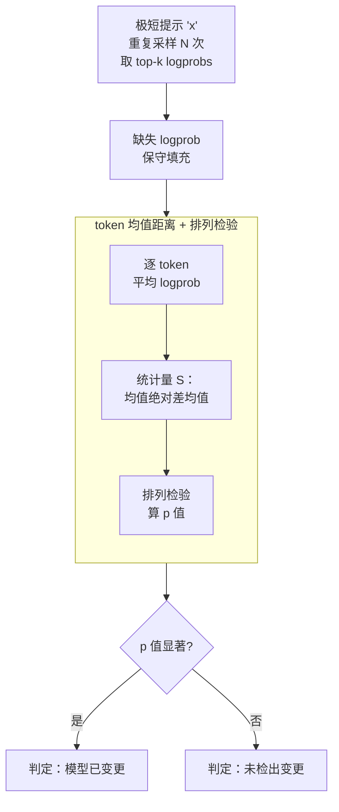

# Log Probability Tracking of LLM APIs

**会议**: ICLR 2026  
**arXiv**: [2512.03816](https://arxiv.org/abs/2512.03816)  
**代码**: [有](https://github.com/timothee-chauvin/track-llm-apis)  
**领域**: LLM评测  
**关键词**: LLM API监控, log概率, 模型变更检测, 假设检验, 非确定性

## 一句话总结

提出 Logprob Tracking (LT) 方法，仅用单token输入和单token输出的log概率即可检测LLM API的微小变更（如单步微调），灵敏度比现有方法高2-3个数量级，成本低1000倍。

## 研究背景与动机

LLM API提供商通常提供版本固定的端点，暗示模型保持一致。用户（开发者、研究者、监管者）依赖这种一致性来保证应用可靠性和研究可复现性。然而用户缺乏实际验证一致性的手段。

实际中，提供商可能因多种原因改变模型：
- **性能优化**：更新推理软件/硬件基础设施
- **安全响应**：应对新的越狱攻击或修改模型行为
- **成本节省**：悄悄部署量化版本
- **流量管理**：高峰期切换到更轻量的模型
- **安全事件**：如Grok在2025年经历的三次被篡改系统提示事件

现有变更检测方法（如MET、MMLU基准测试）代价昂贵，需要大量查询和token生成，导致LLM API在实践中几乎不受第三方监控。

核心洞察：虽然log概率在实践中是非确定性的，但通过简单的统计检验，单token的logprob仍然包含足够丰富的分布信息来检测极微小的变更。

## 方法详解

### 整体框架

LT 想回答一个很朴素的问题：一个号称"版本固定"的 LLM API，今天和上周到底是不是同一个模型？它不去跑昂贵的基准，而是抓住一个被低估的信号——单个 token 的 log 概率。具体地，对要比较的两个时间点（或两个端点），LT 向 API 发同一个极短的提示（短到一个字母 "x"），只要求返回 1 个输出 token 及其 top-k logprobs，把这次采样重复 $N$ 次。由于 API 只回 top-k，某些 token 在个别采样里会缺失，LT 先做一次保守填充把缺口补齐，再对每个 token 的 logprob 均值算检验统计量、做一次排列检验（permutation test），最后用 p 值判断"两批分布是否一致"。整条 pipeline 没有训练、没有生成长文本，单次比较只花几十个 token。此外，为了量化"能检出多细微的改动"，作者还配套构造了 TinyChange 基准（详见关键设计 4），但它属于评测侧，不参与上面这条检测流水线。

### 关键设计

**1. 把非确定性当成分布来处理，而不是当噪声去消除**

LLM 返回的 logprob 在实践中并不稳定，麻烦在于它有两种抖动来源。一种是**有意的非确定性**，即温度采样——但 LT 直接读 logprob 而非采样出来的 token，所以根本不受温度影响；另一种是**无意的非确定性**，来自批处理时同 batch 内其他请求的干扰、以及请求被路由到不同 GPU 带来的数值差异。LT 的态度是不跟这些抖动硬碰：它把每个 logprob 看作从某个底层分布里抽出的一个样本，于是"模型有没有变"就被翻译成"两个分布是否相同"这一标准假设检验问题，抖动自然被吸收进分布的方差里。

**2. 用 token 均值距离 + 排列检验做两样本检测**

设 $\mathcal{V} = \{t_1, \dots, t_{n_{\text{tok}}}\}$ 为所有观察到的 token 集合。对两个时间点、每个 token 分别算平均 logprob：

$$\bar{a}_i^{(1)} = \frac{1}{N}\sum_{j=1}^{N} T_{j,i}^{(1)}, \quad \bar{a}_i^{(2)} = \frac{1}{N}\sum_{j=1}^{N} T_{j,i}^{(2)}$$

检验统计量取各 token 上两均值绝对差的平均，衡量两个分布整体偏了多少：

$$S = \frac{1}{n_{\text{tok}}} \sum_{i=1}^{n_{\text{tok}}} |\bar{a}_i^{(1)} - \bar{a}_i^{(2)}|$$

p 值不靠任何分布假设，而用排列检验得到：把两组共 $2N$ 个样本混在一起随机重新分成两半，重算 $B$ 次得到 $S^{(b)}$，看有多少次随机重排的统计量比真实的 $S$ 还大，

$$\hat{p} = \frac{1}{B}\sum_{b=1}^{B} \mathbf{1}\{S^{(b)} \geq S\}$$

p 值越小，说明真实差异越不像随机抖动能解释的，越有理由判定模型发生了变更。这样一来，即便单 token 的 logprob 很吵，只要分布层面有系统性偏移就能被捕捉到，这正是 LT 灵敏度远超基准方法的根源。

**3. 对 top-k 截断造成的缺失 logprob 做保守填充**

API 只返回 top-k logprob，不同次采样里露出的 token 集合并不完全一致，于是某些 token 在某次采样中是"缺失"的。直接丢弃会偏置统计量，LT 的处理是：对某次采样中缺失的 token，用这次采样里观测到的最小 logprob 来填充。理由很直接——既然这个 token 没进 top-k，它的真实 logprob 一定不大于已观测到的最小值，用这个上界填充是保守的，不会人为夸大差异。

**4. TinyChange Benchmark：把"微小变更"做成可量化的标尺**

为了系统衡量灵敏度，作者专门构造了 TinyChange 基准，把模型改动按强度铺成谱系，覆盖三类修改：常规微调与 LoRA 微调（1 到 512 步的单样本微调）、非结构化权重剪枝（按幅度或随机，移除比例从 $2^{-10}$ 到 $1$）、以及参数噪声（高斯噪声标准差 $\sigma$ 从 $2^{-15}$ 到 $1$）。这些修改施加到 5 个开源模型（0.5B–8B 参数）上，每个强度级别对应一档变体，最终得到约 290 个变体（其中含 58 种核心变体、5 个强度级别）。有了这把从"几乎没动"到"动很多"的连续标尺，才能客观比较不同方法能检出多细微的改动。

### 损失函数 / 训练策略

LT 是纯统计推断方法，没有任何训练过程，只有几个推断侧的超参：采样数 $N=10$、排列检验次数 $B$、显著性水平 $\alpha$，以及一个仅需 1–2 个 token 的极短提示。

## 实验关键数据

### 主实验

| 方法 | Overall AUC (95% CI) | 输入token/测试 | 输出token/测试 | 年度成本(GPT-4.1价格) |
|------|:-:|:-:|:-:|:-:|
| MMLU-ALG | 0.878 | $2.1 \times 10^5$ | $9.9 \times 10^3$ | $332 |
| MET | 0.670 | $2.9 \times 10^4$ | $2.0 \times 10^4$ | $146 |
| **LT (Ours)** | **0.915** | **28** | **20** | **$0.14** |

LT不仅AUC最高(0.915)，token成本仅需48个(28输入+20输出)，比MET便宜约1000倍，比MMLU-ALG便宜约2400倍。

| 修改类型 | LT达到AUC>0.9的最高难度 | MET | MMLU-ALG |
|---------|:-:|:-:|:-:|
| 权重剪枝 | $\leq 2^{-10}$ | $2^{-1}$ | $2^{-4}$ |

LT在权重剪枝灵敏度上比MET高 $2^9=512$ 倍，比MMLU-ALG高 $2^6=64$ 倍。

### 消融实验

**提示长度影响**：最短提示(1.5 tokens)和最长提示(33 tokens)之间的AUC差异仅约1%，表明极短提示即可有效检测。

**真实世界部署**：监控189个端点超过4个月，收集170万+响应，检测到37次疑似变更，涉及29个端点和7个提供商。几乎所有检测到的变更(34/37)影响开源权重模型。

### 关键发现

- 短至单字母"x"的提示就足以可靠检测变更
- LoRA微调对所有方法都最难检测
- 开源权重模型同样频繁遭受未公开变更
- 部分提供商（如OpenAI）开始限制最小输出token数（≥16），可能是为了阻碍监控

## 亮点与洞察

1. **极致简约**：1-token输入 + 1-token输出 + 简单统计检验 = 超越复杂方法
2. **信息密度观点**：logprobs比生成的tokens包含更丰富的分布信息，是被严重低估的信号源
3. **实用性极强**：每小时监控一次、一年仅需$0.14的成本，使大规模持续监控成为可能
4. **透明度呼吁**：34/37变更涉及开源模型，揭示开源权重并不等于部署透明

## 局限与展望

- 需要API支持返回logprobs（目前仅约23%的端点支持）
- 无法区分基础设施变更和模型更新的具体类型
- 提供商可能通过缓存logprobs或识别监控查询来规避
- 某些修改（如调整end-of-sequence偏置）可能不影响首token
- 方法侧重于变更检测，不提供变更性质的详细信息

## 相关工作与启发

- 与模型指纹识别(LLM fingerprinting)高度相关但目标不同：LT追求对微小变化的敏感性
- 零知识证明(zkLLM, TOPLOC)提供更强保证但计算开销大得多
- 可与现有审计管线互补：LT作为低成本高灵敏度的第一道防线
- 对AI安全和可复现性研究有直接意义

## 评分

- 新颖性：⭐⭐⭐⭐⭐ — logprob作为监控信号的洞察极具创新
- 技术深度：⭐⭐⭐⭐ — 统计方法简单但有效，理论分析清晰
- 实验充分度：⭐⭐⭐⭐⭐ — TinyChange benchmark + 大规模真实部署验证
- 实用价值：⭐⭐⭐⭐⭐ — 直接可部署，成本极低

<!-- RELATED:START -->

## 相关论文

- [\[ICML 2026\] Beyond Log Likelihood: Probability-Based Objectives for Supervised Fine-Tuning across the Model Capability Continuum](../../ICML2026/llm_evaluation/beyond_log_likelihood_probability-based_objectives_for_supervised_fine-tuning_ac.md)
- [\[ICLR 2026\] Human-LLM Collaborative Feature Engineering for Tabular Learning](human-llm_collaborative_feature_engineering_for_tabular_data.md)
- [\[ICLR 2026\] BiasScope: Towards Automated Detection of Bias in LLM-as-a-Judge Evaluation](biasscope_towards_automated_detection_of_bias_in_llm-as-a-judge_evaluation.md)
- [\[ACL 2026\] AgentEval: DAG-Structured Step-Level Evaluation for Agentic Workflows with Error Propagation Tracking](../../ACL2026/llm_evaluation/agenteval_dag-structured_step-level_evaluation_for_agentic_workflows_with_error_.md)
- [\[ICLR 2026\] AdaBlock-dLLM: Semantic-Aware Diffusion LLM Inference via Adaptive Block Size](adablock-dllm_semantic-aware_diffusion_llm_inference_via_adaptive_block_size.md)

<!-- RELATED:END -->
