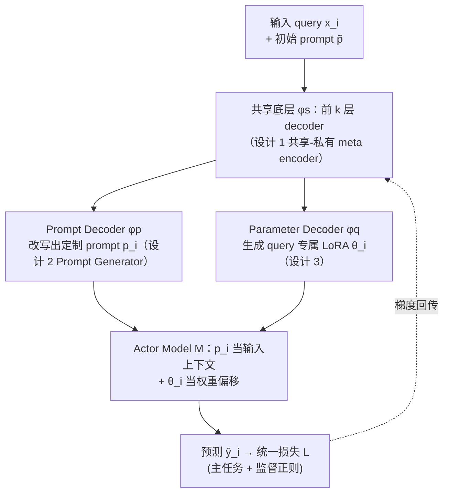

# Prompt and Parameter Co-Optimization for Large Language Models

**会议**: ICLR 2026  
**arXiv**: [2509.24245](https://arxiv.org/abs/2509.24245)  
**代码**: [https://github.com/BoXiaohe/MetaTuner](https://github.com/BoXiaohe/MetaTuner)  
**领域**: LLM评测  
**关键词**: prompt优化, 微调, 联合优化, LoRA, 离散-连续优化

## 一句话总结
提出 MetaTuner 框架，通过共享 meta encoder 同时生成 prompt 和 LoRA 参数，将离散 prompt 优化与连续参数微调统一为端到端可优化的联合框架，在数学推理和问答任务上大幅超越单独优化的方法。

## 研究背景与动机

**领域现状**：LLM 的后训练主要有两大路线——prompt 优化（如 OPRO、RLPrompt、BPO）通过寻找合适的输入上下文激活模型已有能力；微调（如 SFT、RLHF、DPO）通过更新参数适配目标数据分布。二者通常被独立研究和使用。

**现有痛点**：prompt 优化虽可引导模型行为，但无法适配大规模任务数据中的复杂模式，尤其当 prompt 信息和参数内编码的知识冲突时效果打折。微调虽可适配数据，但通常使用人工设计的 prompt 作为输入，而 prompt 的选择对微调效果影响极大——使用次优 prompt 甚至可能比纯 prompt 优化还差。

**核心矛盾**：prompt 是离散优化空间（文本 token），参数是连续优化空间（浮点权重），二者的优化目标和执行流程本质不同。如何在一个统一框架中同时优化两个互补维度，并解决混合离散-连续优化的不可微分问题？

**本文目标** (a) 如何设计框架让 prompt 和参数互相增强？(b) 如何在离散-连续混合空间中进行有效梯度优化？(c) 最优的 prompt-参数组合能否超越单独优化的上界？

**切入角度**：通过预实验发现微调方法对 prompt 选择极其敏感——使用不同 prompt 的 SFT 性能差异巨大，甚至可低于 prompt 优化方法。这证实了联合优化的必要性。

**核心 idea**：将 prompt 视为"特殊参数"，通过共享编码器同时生成 prompt 和模型参数，实现互补增强。

## 方法详解

### 整体框架
MetaTuner 想把一直被分开做的「调 prompt」和「调参数」塞进同一个端到端可训练的框架，核心洞察是把 prompt 当成一种「特殊参数」、用同一张网络把它和 LoRA 权重一起生成出来。具体来说：一条 query $x_i$ 配上一条人工写的初始 prompt $\tilde{p}$ 进来后，先经过共享底层的 Meta Encoder $\phi_s$，再分流到两个私有头——Prompt Decoder（私有参数 $\phi_p$）把它改写成定制 prompt $p_i$，Parameter Decoder（私有参数 $\phi_q$）则吐出一组 query 专属的 LoRA 参数 $\theta_i$。两者一起作用到下游的 Actor Model $\mathcal{M}$ 上：prompt 决定输入上下文，LoRA 决定权重偏移，$\mathcal{M}$ 据此预测，损失再沿整条链路回传。两条分支共用 $\phi_s$ 是关键——prompt 侧学到的东西能渗透到参数侧、反之亦然；而把「在 token 空间里搜 prompt」改写成「对 $\phi_p$ 做连续优化」后，原本不可微的混合离散-连续问题就被拉回到一个可微的统一目标里。

### 关键设计

**1. 共享-私有 meta encoder：让 prompt 分支和参数分支互相纠错**

如果 prompt 侧和参数侧各自为政，两边的次优解就会各自固化、谁也救不了谁。MetaTuner 把 prompt 生成器 $\mathcal{G}$ 的参数拆成 $\phi = \{\phi_s, \phi_p\}$：$\phi_s$ 是共享底层（前 $k$ 层 Transformer decoder，充当 meta encoder），$\phi_p$ 是 prompt 专用的上层；Parameter Decoder $\mathcal{F}$ 直接复用同一份 $\phi_s$，再叠上自己的私有参数 $\phi_q$。整个系统在一个统一目标下联合优化：

$$\min_{\phi_s, \phi_p, \phi_q} \sum_{i=1}^N \mathcal{L}(\mathcal{M}_{\mathcal{F}_{(\phi_s,\phi_q)}(\tilde{p},x_i)}(\mathcal{G}_{(\phi_s,\phi_p)}(\tilde{p},x_i), x_i), y_i)$$

共享的 $\phi_s$ 起到互相正则的作用——任何一条分支给出的次优解，都会在统一损失里被另一条分支拉回来；而私有的 $\phi_p$、$\phi_q$ 又保留了各自独立探索最优解的余地，不至于被共享层压成一个模子。共享深度 $k$ 是个可调的权衡：7B 模型表征力足、留更多私有层（$k=K/4$）更好，3B 模型则靠更高共享比例（$k=3K/4$）增强两支的一致性。消融里「不共享参数（w/o S，即 $k=0$）」明显掉点，正说明这层互相增强不是摆设。

**2. Prompt Generator $\mathcal{G}$：把不可微的离散 prompt 搜索变成连续优化**

离散 prompt 优化最大的麻烦是它在 token 空间里搜，目标不可微、没法跟梯度训练拼在一起。MetaTuner 的做法是绕开「从零生成 prompt」，改成「在一个初始 prompt 上重写」：给定人工写的初始 prompt $\tilde{p}$，用可学习的 LLM $\mathcal{G}_\phi$ 针对每条 query 改写出定制版 $p_i = \mathcal{G}_\phi(\tilde{p}, x_i)$。这样要优化的不再是离散 token，而是 $\mathcal{G}$ 的连续参数 $\phi$，搜索空间被 rewrite 策略大幅压缩；同时所有 query 共享同一个 $\tilde{p}$ 作为起点，省掉了逐条标注 prompt 的人工成本。正是这一步把整个问题转成「fully continuous」，后续才能跟参数分支拼进同一个可微目标。

**3. Parameter Decoder：从隐状态直接生成 query 专属的 LoRA 权重**

参数分支要解决的是「怎么把共享编码器的隐状态变成可用的权重偏移」。它对 LoRA 更新 $\Delta W = \theta_i^b \cdot \theta_i^a$ 的两个低秩矩阵，分别用一个两层「矩阵乘法 + ReLU」的小网络从隐状态 $h_i$ 生成，例如 $\theta_i^b = \text{MM}(\text{ReLU}(\text{MM}(W_d^b, h_i)), W_u^b)$，对应的 decoder 参数为 $\phi_q = \{W_d^b, W_u^b, W_d^a, W_u^a\}$，并用缩放因子 $\lambda$ 控制生成的 LoRA 加权强度。选 LoRA 而非全参数微调是为了训练效率，而「每条 query 各生成一套 LoRA」则把适配做到了输入粒度——不同问题拿到的权重偏移不一样，比所有输入共用一套要更有针对性。

### 损失函数 / 训练策略

核心挑战：prompt decoder 输出离散 token，梯度无法直接反传到 $\phi_p$。解决方案——**监督正则化损失**：

$$\min_{\phi_s, \phi_p, \phi_q} \sum_{(x_i,y_i) \in D_1} \mathcal{L}(\mathcal{M}_{\mathcal{F}}(\mathcal{G}_{(\phi_s,\phi_p')}(\tilde{p},x_i), x_i), y_i) + \sum_{(x_i,p_i) \in D_2} \alpha \cdot \mathcal{L}(\mathcal{G}_{(\phi_s,\phi_p)}(\tilde{p},x_i), p_i)$$

- 第一项：主任务损失，但 $\phi_p'$（prompt 私有参数）冻结，保证全可微
- 第二项：监督正则化，用 rollout 生成的最优 prompt 对 $D_2 = \{(x_i, p_i)\}$ 进行有监督学习
- 定期将更新后的 $\phi_p$ 同步到 $\phi_p'$
- 尝试过 Gumbel-Softmax 但效果远不如监督正则化——因为 Gumbel-Softmax 的连续松弛引入梯度偏差
- 两种优化策略：MetaTuner-I（交替优化两项）和 MetaTuner-J（联合优化）

**训练流程**：先用 SFT 分别热身 $\mathcal{G}$（Qwen2.5-7B）和 $\mathcal{M}$（Qwen2.5-3B），再进行联合训练。

## 实验关键数据

### 主实验

在 4 个基准上对比（Qwen2.5-7B 作为生成器，Qwen2.5-3B 作为 actor）：

| 方法 | MATH | GSM8K | HotpotQA | CosmosQA | 类型 |
|------|------|-------|----------|----------|------|
| Qwen2.5 (zero-shot) | 18.44 | 51.63 | 19.85 | 36.80 | Vanilla |
| BPO | 32.67 | 58.00 | 43.90 | 82.05 | Prompt |
| OPRO | 22.00 | 75.06 | 25.55 | 69.10 | Prompt |
| SFT | 41.33 | 61.41 | 43.20 | 82.65 | Fine-tune |
| DPO | 43.78 | 63.68 | 44.70 | 87.90 | Fine-tune |
| BetterTogether | 41.56 | 67.93 | 52.30 | 89.80 | Hybrid |
| **MetaTuner-J** | **48.67** | **78.92** | **54.56** | **92.25** | Hybrid |

MetaTuner-J 相对 BetterTogether 平均提升 10.15%（7B backbone），在 MATH 上提升 +7.11、GSM8K 上提升 +10.99。

### 消融实验

| 配置 | MATH | GSM8K | HotpotQA | CosmosQA | 说明 |
|------|------|-------|----------|----------|------|
| MetaTuner (w/o F) | 48.00 | 77.79 | 54.05 | 91.10 | 去掉微调分支，均降 |
| MetaTuner (w/o P) | 46.22 | 78.54 | 53.90 | 91.00 | 去掉prompt分支，MATH降2.45 |
| MetaTuner (w/o S) | 46.67 | 77.86 | 53.65 | 91.50 | 不共享参数，均降 |
| **MetaTuner (full)** | **48.67** | **78.92** | **54.56** | **92.25** | 完整模型最优 |

### 关键发现
- **两个分支缺一不可**：去掉微调或 prompt 分支分别导致约 0.99% 和 1.12% 的平均下降
- **共享参数至关重要**：不共享参数（w/o S）性能不如完整模型，证明互相增强的有效性
- **共享比例与模型大小相关**：7B 模型最优共享为 K/4（保留更多私有层），3B 模型最优为 3K/4（更多共享增强一致性）
- **监督正则化优于 Gumbel-Softmax**：因为直接在离散空间优化避免了连续松弛的近似误差
- **Rollout 采样数不宜过多**：过多的样本导致过度探索，干扰已学到的有效信息
- **联合优化（MetaTuner-J）略优于交替优化（MetaTuner-I）**，但在 HotpotQA 上交替优化更好

## 亮点与洞察
- **将 prompt 视为"特殊参数"**：这一统一视角打破了 prompt 优化和微调的传统隔阂，让二者在同一目标函数下互补。这个思路可以迁移到其他需要协调离散决策和连续优化的场景
- **监督正则化解决离散-连续混合优化**：巧妙地用 rollout 最优 prompt 构建有监督信号来训练 prompt decoder，避免了 Gumbel-Softmax 等松弛方法的梯度偏差问题。这个技巧可推广到其他涉及离散结构生成的任务
- **query-specific 的 prompt 和 LoRA 参数**：不是给所有输入用同一个 prompt 或同一套 LoRA，而是根据每个 query 动态生成两者，实现了细粒度的适配

## 局限与展望
- **计算开销**：需要一个 7B 模型作为生成器来服务 3B 的 actor 模型，实际部署时生成器本身的推理开销不可忽视
- **依赖热身阶段**：需要先分别 SFT 两个模型再联合训练，pipeline 复杂度较高
- **仅验证了 Qwen 系列**：未在多种架构（如 Llama、Mistral）上验证通用性
- **离散 prompt 的长度有限**：prompt 是几十到上百个词的文本，信息容量有限，对于需要大量领域知识的任务可能不够

## 相关工作与启发
- **vs BetterTogether**：BetterTogether 也做联合优化，但其 prompt 和参数没有共享底层知识、没有端到端的可微训练。MetaTuner 通过 shared encoder + supervised regularization 实现了更深层的协同，平均提升 10%+
- **vs OPRO/CFPO**：纯 prompt 优化方法在数学推理上有"天花板"——不能适配参数。MetaTuner 在 MATH 上从 OPRO 的 22.00 提升到 48.67
- **vs DPO/PPO**：纯微调方法受限于固定 prompt。MetaTuner 在 GSM8K 上从 DPO 的 63.68 提升到 78.92

## 评分
- 新颖性: ⭐⭐⭐⭐ 联合优化 prompt 和参数的想法有新意，shared-private 架构和监督正则化是扎实的技术贡献，但核心思路相对直觉
- 实验充分度: ⭐⭐⭐⭐⭐ 4 个数据集、10+ 基线、详细消融、泛化实验、超参分析全面覆盖
- 写作质量: ⭐⭐⭐⭐ 公式化推导清晰，从问题到方法到实验逻辑连贯，但 Section 3 的符号较重
- 价值: ⭐⭐⭐⭐ 为 LLM 后训练提供了新范式，在多个任务上大幅提升，但计算成本和 pipeline 复杂度可能限制实用性

<!-- RELATED:START -->

## 相关论文

- [\[ICML 2025\] Hyperband-based Bayesian Optimization for Black-box Prompt Selection](../../ICML2025/llm_evaluation/hyperband-based_bayesian_optimization_for_black-box_prompt_selection.md)
- [\[ACL 2025\] Mis-prompt: Benchmarking Large Language Models for Proactive Error Handling](../../ACL2025/llm_evaluation/mis-prompt_benchmarking_large_language_models_for_proactive_error_handling.md)
- [\[ICLR 2026\] ASIDE: Architectural Separation of Instructions and Data in Language Models](aside_architectural_separation_of_instructions_and_data_in_language_models.md)
- [\[ICLR 2026\] vCache: Verified Semantic Prompt Caching](vcache_verified_semantic_prompt_caching.md)
- [\[NeurIPS 2025\] Hyperbolic Fine-Tuning for Large Language Models](../../NeurIPS2025/llm_evaluation/hyperbolic_fine-tuning_for_large_language_models.md)

<!-- RELATED:END -->
