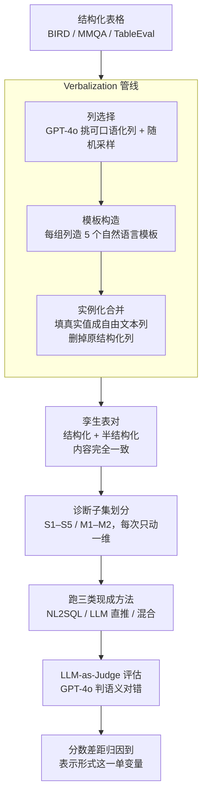

# Same Content, Different Representations: A Controlled Study for Table QA

**会议**: ICLR 2026  
**arXiv**: [2509.22983](https://arxiv.org/abs/2509.22983)  
**代码**: [https://github.com/megagonlabs/RePairTQA](https://github.com/megagonlabs/RePairTQA)  
**领域**: LLM评测  
**关键词**: Table QA, 结构化表格, 半结构化表格, 表示形式, 诊断基准  

## 一句话总结
首个控制变量研究：在保持表格内容完全相同的条件下变换表示形式（结构化 vs 半结构化），系统评估 NL2SQL、LLM、混合三类方法在不同表格大小/模式质量/查询复杂度下的鲁棒性，发现表示形式是影响 Table QA 性能的一阶因素。

## 研究背景与动机

**领域现状**：Table QA 方法主要分三个范式：NL2SQL（将自然语言转换为 SQL 执行）、LLM 直接推理、混合方法（SQL 检索 + LLM 推理）。现有基准数据集固定了表格格式，模型针对单一表示形式优化。

**现有痛点**：实际场景中表格既有严格 schema 的结构化形式，也有列不规则、单元格含自由文本的半结构化形式。但现有基准未系统研究"表示形式本身"对模型性能的影响，导致模型在跨格式场景下表现未知。

**核心矛盾**：要公平比较不同表示形式的影响，必须保证表格"内容完全相同"只改变"表示方式"。现有数据集无法满足这一条件，因为结构化和半结构化基准的底层数据本身就不同。

**本文目标**：(a) 如何在控制内容不变的条件下生成成对的结构化/半结构化表格？(b) 表格大小、连接操作、查询复杂度、模式质量各自如何影响不同范式？(c) 实际部署时如何选择最佳方法？

**切入角度**：通过 verbalization pipeline 将结构化表格中的列转化为自然语言描述，生成语义等价但结构不同的成对表格。

**核心 idea**：表示形式是 Table QA 的一阶变量——NL2SQL 在结构化输入上最强但半结构化下暴跌 30-45%，LLM 最鲁棒但精度有限，混合方法在半结构化场景最优。

## 方法详解

### 整体框架
这篇论文要回答的问题是：当表格"内容一字不差、只换表示形式"时，不同 Table QA 范式会不会翻车？为此它不提新的 QA 模型，而是构建一个诊断基准 **RePairTQA**，把"表示形式"做成可以单独拨动的实验旋钮。整条流水线分三段：第一段拿一批带严格 schema 的结构化表格，用一个 verbalization 管线把其中若干列改写成自由文本，得到语义等价、只是形式不同的半结构化"孪生表"；第二段把数据按表格大小、连接操作、查询复杂度、模式质量四个维度切成 7 个诊断子集，每个子集只让一个维度变化；第三段把三类**现成**方法丢进去跑——LLM 直推（GPT-4o、Gemini-2.5-flash、Qwen3-235B）、NL2SQL（LLM-NL2SQL、XiYan）、混合（H-STAR、Weaver）——并用同一套 LLM-as-Judge 协议打分。因为每对孪生表内容完全一致，任意结构化与半结构化之间的分数差距都只能归到"表示形式"这一个变量上，这正是"控制变量"的关键。

### 关键设计

**1. Verbalization 管线：在不动内容的前提下把结构化表"翻"成半结构化**

公平比较的前提是两张表语义完全相同、只有形式不同——但现有结构化与半结构化基准的底层数据本就不一样，没法直接对比，所以必须自己造孪生表。管线分三步：先用 GPT-4o 从结构化表里挑出适合口语化的候选列，并对列的组合做随机采样以增加实例间多样性（作者另试过"只选问题相关列""只选无关列""全部列"等策略，结论趋势相近，故默认用随机）；再针对每种选中的列组合生成以表 schema 为条件的自然语言模板，每组造 5 个不同模板避免句式单一；最后把模板用该行的真实值实例化，合并成一个自由文本列，并删掉对应的原始结构化列。这样改写后单元格里的事实没有增减，变的只是"以列存"还是"以句子存"，于是后续任何性能差异都能干净地归因到表示形式本身。

**2. 诊断子集划分：每次只动一个变量，隔离单因素影响**

总体准确率会把多个因素混在一起，看不清到底是表大、schema 脏还是查询难导致的下降，所以要做受控切分。基准从三个互补数据集拼成——BIRD 提供干净 schema 的最佳情形、MMQA 提供多表推理、TableEval 提供真实网页表的噪声 schema——再切成 7 个子集（单表 S1–S5、多表 M1–M2），每个子集固定其余维度、只让一个维度变化：S1 vs S4/S5 比表格长度、S1 vs S2 比 schema 质量、S1/S4 的 lookup vs S3/S5 的组合查询比查询复杂度、S1–S5 vs M1–M2 比有无跨表连接。这种"控制其余、单独拨动一个旋钮"的设计，让每个因素的影响都能被单独读出来，避免在基准级总分里被混杂效应掩盖。

**3. LLM-as-Judge 评估协议：放宽到语义判对，不被表面形式卡住**

半结构化答案往往换了数字格式或同义说法，传统 Exact Match / Partial Match 这类严格字符串匹配会把语义正确但表面不同的答案判错，进而冤枉那些输出更自然语言化的方法。于是改用 GPT-4o 当裁判，给它金标准答案与模型预测、只判语义是否一致，容忍数字四舍五入、格式差异、同义替换等表面变化。为确认这个裁判靠谱，作者跨所有数据集和模型族随机抽 100 个样例做人工标注校验，与 GPT-4o 判断的一致率达 96%，足以支撑大规模基准评测。

## 实验关键数据

### 主实验（RQ1: 结构化 vs 半结构化总体对比）

| 模型 | 结构化准确率(%) | 半结构化准确率(%) | 下降(%) |
|------|---------------|-----------------|---------|
| GPT-4o | 45.37 | 41.93 | 3.44 |
| Gemini-2.5-flash | 52.07 | 50.78 | 1.29 |
| LLM-NL2SQL | 69.14 | 38.65 | **30.49** |
| XiYan | 69.55 | 24.08 | **45.47** |
| H-STAR | 49.48 | 47.14 | 2.34 |
| Weaver | 62.19 | 57.70 | 4.49 |

### 消融实验（按维度分析）

| 因素 | 关键发现 | 影响最大的方法 |
|------|---------|---------------|
| 表格大小 | 长表格导致所有方法下降，LLM 最敏感 | GPT-4o: 70%→28.9% |
| 连接操作 | NL2SQL 在结构化多表上受益(+10%)，半结构化下崩溃 | LLM-NL2SQL: 82.3%→多表结构化 |
| 查询复杂度 | LLM 在 lookup 上~70%，组合推理下大幅下降 | 所有方法都受影响 |
| Schema质量 | 噪声 schema 严重影响 NL2SQL，混合方法最鲁棒 | XiYan: 结构化→半结构化暴跌 |

### 关键发现
- **表示形式是一阶因素**：NL2SQL 方法在半结构化下性能暴跌 30-45%，是最脆弱的范式
- **没有万能方法**：结构化用 NL2SQL，半结构化用混合方法，简单查询用 LLM
- **Verbalization 有时反而帮助 LLM**：半结构化的自然语言描述更贴近 LLM 预训练数据，在 lookup 任务上混合方法甚至在半结构化下更好
- **长表格是普遍难点**：所有方法在长表格上都显著下降，但 NL2SQL 在长结构化表格上保持 62.9%
- **模型规模不能解决表示敏感性**：Gemini-2.5-Pro 也展现出相同的结构化 vs 半结构化差距

## 亮点与洞察
- **控制变量的实验设计**极为巧妙：保持信息内容完全相同只变表示形式，使所有性能差异都可归因于表示本身。这种方法论可迁移到其他模态（如知识图谱 vs 文档）的对比研究。
- **决策树式方法选择指南**非常实用：根据数据条件（结构化/半结构化 × 表格大小 × schema 质量 × 查询复杂度）给出最优方法推荐，直接指导实际部署。
- 发现 verbalization 有时反而帮助 LLM 推理，挑战了"结构化一定更好"的直觉。

## 局限与展望
- 仅覆盖三个基准数据集，领域多样性不足（缺少金融、生物医学等专业领域）
- 表格大小限制在能放入上下文窗口内，未考虑需要分块或检索的超长表格
- Verbalization 由 GPT-4o 生成模板，可能引入模型偏差
- 未评估更多新兴方法（如基于 RAG 的表格问答系统）
- Multi-table 场景下混合方法的支持有限，未来需设计更好的跨表推理模块

## 相关工作与启发
- **vs BIRD/Spider**: 这些基准固定结构化格式，RePairTQA 通过 verbalization 增加半结构化维度，是首个控制变量基准
- **vs H-STAR/Weaver**: 本文不是提出新方法，而是系统评估这些方法的表示鲁棒性
- 对实际系统设计的启示：应根据数据条件自适应选择推理范式，而非使用单一方法

## 评分
- 新颖性: ⭐⭐⭐⭐ 首个控制变量的表格表示研究，实验设计新颖
- 实验充分度: ⭐⭐⭐⭐⭐ 7个诊断子集、7个模型、5个研究问题，分析极为系统
- 写作质量: ⭐⭐⭐⭐ 结构清晰，图表丰富，决策树总结实用
- 价值: ⭐⭐⭐⭐ 对 Table QA 方法选择有重要指导意义

<!-- RELATED:START -->

## 相关论文

- [\[ACL 2026\] Same Voice, Different Lab: On the Homogenization of Frontier LLM Personalities](../../ACL2026/llm_evaluation/same_voice_different_lab_on_the_homogenization_of_frontier_llm_personalities.md)
- [\[ACL 2025\] RealHiTBench: A Comprehensive Realistic Hierarchical Table Benchmark for Evaluating LLM-Based Table Analysis](../../ACL2025/llm_evaluation/realhitbench_a_comprehensive_realistic_hierarchical_table_benchmark_for_evaluati.md)
- [\[ACL 2026\] Pressure-Testing Deception Probes in LLMs: Scaling, Robustness, and the Geometry of Deceptive Representations](../../ACL2026/llm_evaluation/pressure-testing_deception_probes_in_llms_scaling_robustness_and_the_geometry_of.md)
- [\[ACL 2026\] Beyond Static Benchmarks: Synthesizing Harmful Content via Persona-based Simulation for Robust Evaluation](../../ACL2026/llm_evaluation/beyond_static_benchmarks_synthesizing_harmful_content_via_persona-based_simulati.md)
- [\[ACL 2026\] arXiv2Table: Toward Realistic Benchmarking and Evaluation for LLM-Based Literature-Review Table Generation](../../ACL2026/llm_evaluation/arxiv2table_toward_realistic_benchmarking_and_evaluation_for_llm-based_literatur.md)

<!-- RELATED:END -->
