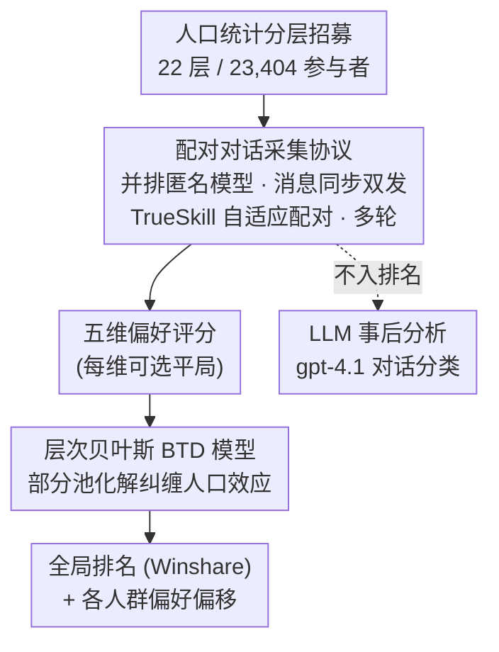

# Unpacking Human Preference for LLMs: Demographically Aware Evaluation with the HUMAINE Framework

**会议**: ICLR2026  
**arXiv**: [2603.04409](https://arxiv.org/abs/2603.04409)  
**代码**: [Leaderboard](https://huggingface.co/spaces/ProlificAI/humaine-leaderboard) / [Dataset](https://huggingface.co/datasets/ProlificAI/humaine-evaluation-dataset)  
**领域**: LLM评测  
**关键词**: human evaluation, preference heterogeneity, demographic bias, Bradley-Terry-Davidson, LLM leaderboard, psychometrics

## 一句话总结
提出 HUMAINE 框架，通过 23,404 名人口统计分层参与者对 28 个 SOTA 模型进行多维度（5 维）、多轮对话的人类偏好评估，用层次贝叶斯 BTD 模型揭示年龄是偏好异质性的最大驱动因素（平均排名偏移 ±2.8），证明单一聚合排行榜不足以反映不同人群的真实偏好。

## 研究背景与动机

1. **评估鸿沟**：LLM 评测存在两大范式缺陷：
    - **自动化 benchmark**（MMLU、HELM、BIG-Bench）：测技术能力但忽略人机交互质量，存在 Goodhart's Law 问题（优化指标而非用户体验）
    - **人类偏好平台**（Chatbot Arena）：存在三大方法学缺陷——(a) 匿名自选用户致非代表性采样；(b) 极少交互的浅层评估；(c) 二元投票的单指标简化
2. **偏好异质性被忽视**：Santurkar et al. (2023) 已证明评估者的人口统计特征显著影响 LLM 偏好，但现有排行榜将所有人群聚合为单一分数。
3. **第三范式的偏见**：LLM-as-a-judge 有缩放优势但存在系统性偏见（偏好冗长输出、位置偏见等），不应替代人类评估。
4. **本文目标**：设计一个多维度、人口统计感知的评估框架，解决采样偏差、评估深度不足和指标简化三个有效性威胁。

## 方法详解

### 整体框架

HUMAINE 把「谁在评、评什么、怎么聚合」三件事一起重做：先按人口统计分层从 Prolific 招募 23,404 名代表性参与者，让他们在两个匿名模型间进行多轮真实对话，再沿五个维度而非单一二元投票给出偏好，最后用一个层次贝叶斯 Bradley-Terry-Davidson（BTD）模型把全部 119,890 条评判同时解算出「全局排名」和「各人群的偏好偏移」。整套流程刻意把人类打分和 LLM 分析隔离开：gpt-4.1 只在评分结束后对全部对话做结构化分类（任务类型、领域、复杂度、目标达成度），用来事后解释「用户都在聊什么」，绝不进入任何排名计算，从而规避 LLM-as-a-judge 已知的冗长偏好、位置偏见等系统性偏差。

### 关键设计

**1. 人口统计分层招募：用代表性样本取代自选偏差**

Chatbot Arena 这类平台让匿名用户自愿参与，样本天然偏向技术社区，无法代表真实用户。HUMAINE 改在 Prolific 上按 £9/hr 推荐费率招募，并预先划好 22 个人口统计层，覆盖地理（美国/英国）、年龄（18-34、35-54、55+）、种族（亚裔、黑人/非裔、白人、其他）和政治倾向（美国的民主党/共和党/独立，英国的保守党/工党/自由民主党/绿党/Reform UK）。每一层都收集 1,848–2,636 次比较，保证任何一个子人群都有足够样本支撑统计推断，这也是后面能做后向分层、把结果校准到人口普查分布的前提。

**2. 配对对话采集协议：在公平比较和信息增益之间取平衡**

参与者面对两个并排显示的匿名模型，自选话题、至少聊 3 轮（中位达 6 轮），关键是每条消息会**同时发给两个模型**，从而保证两者始终处在完全相同的上下文下被比较。配对不是随机的：系统用 **TrueSkill** 维护每个模型的技能均值和不确定度，每次优先安排「胜负最不确定」的两个模型对战，把有限的人力预算投到信息增益最高的比较上。同时 gpt-4o-mini 实时监控低质量输入（单词回复、重复粘贴），累计三次警告即移除，最终仅影响不到 1.6% 的数据。

**3. 五维偏好评分：打破二元投票的信息压缩**

一次「谁更好」的投票会把语言风格、推理质量、安全性等不同诉求糊成一个数。HUMAINE 让参与者在每场对话后沿五个维度分别表态（可选平局），其中各维度的平局率本身就成了「该维度能否区分模型」的诊断信号——平局越多，说明模型在该维度上越难分高下。

| 维度 | 描述 | 区分力 |
|------|------|--------|
| Core Task Performance & Reasoning | 任务完成和推理质量 | 中等 |
| Communication Style & Presentation | 语言风格、语调、细节适当性 | 中等 |
| Interaction Fluidity & Adaptiveness | 对话流畅度和上下文适应性 | 中等 |
| Trust, Ethics & Safety | 可靠性、透明度、伦理和安全 | 最低（65% 平局） |
| Overall Winner | 综合偏好判断 | 最高（10% 平局） |

**4. 层次贝叶斯 BTD 模型：在处理平局的同时解纠缠人口效应**

这是整个框架的统计引擎，它把经典 Bradley-Terry 模型扩展到能同时容纳平局和人群异质性。对指标 $k$ 上模型 $i$ 战胜 $j$ 的概率，其 logit 写成全局技能差再叠加各人口统计组的调整：

$$\text{logit}(P_{ij}^{(k)}) = \theta_i^{(k)} - \theta_j^{(k)} + \sum_g u_{ig}^{(k)} - \sum_g u_{jg}^{(k)}$$

其中 $\theta_i^{(k)}$ 是模型 $i$ 在指标 $k$ 上的全局技能，$u_{ig}^{(k)}$ 是人口统计组 $g$ 对模型 $i$ 的偏好偏移，平局倾向参数 $\nu_k$ 量化该指标的区分力，异质性参数 $\tau_g$ 量化组间偏好的变异幅度。由于一个参与者往往同时属于多个组（如亚裔 + 18-34 + 民主党），模型靠**部分池化（partial pooling）**同时学习全局技能和各组调整，从而把混合在一起的人口效应归因到正确的来源，而不是简单地按子群切分数据导致样本稀疏。最终排名用 Winshare 度量，即一个模型在和其余所有模型的循环赛中的期望总分（赢计 1、平计 0.5，满分 27）。

## 实验关键数据

### 总体排名（Overall Winner）

| 排名 | 模型 | 得分（Winshare） | P(best) |
|------|------|----------------|---------|
| 1 | google/gemini-2.5-pro | 最高 | **95.6%** |
| 2 | deepseek/deepseek-chat-v3-0324 | 次高 | - |
| 3–5 | mistral/magistral-medium, x-ai/grok-4, x-ai/grok-3 | 紧密竞争 | - |

Gemini-2.5-pro 以绝对优势领先，后续模型间置信区间高度重叠。

### 人口统计异质性

| 人口统计轴 | 平均排名偏移 | 说明 |
|-----------|-------------|------|
| **年龄** | **±2.8 ranks** | 最大异质性驱动因素 |
| 政治倾向 | ±1.5 ranks | 中等 |
| 种族 | ±1.3 ranks | 最小 |

**年龄效应具体案例**：
- mistral/magistral-medium：年轻用户（18-34）中排名 1-2，**55+ 用户中降至 5-10**
- google/gemini-2.5-pro：随年龄增长排名提升，在 55+ 组稳居第一
- 平局率从 18-34 的 9.7% 升至 55+ 的 12.5%（+29%），老年用户更难决断

### 维度间排名变化

| 模型 | Task Performance | Communication Style | Interaction Fluidity | Trust & Safety |
|------|-----------------|--------------------|--------------------|---------------|
| x-ai/grok-3 | **2** | 8 | 8 | - |
| mistral/magistral-medium | 7 | - | **2** | 12 |
| google/gemini-2.5-pro | 1 | 1 | 1 | 1 |

Gemini-2.5-pro 的优势在于**全维度一致性**；其他模型各有偏科。

### 评估维度区分力

| 维度 | 平局率 | 解读 |
|------|--------|------|
| Overall Winner | **10%** | 最具决断力——用户能形成明确的整体偏好 |
| Core Task Performance | ~30% | 中等 |
| Communication Style | ~35% | 中等 |
| Interaction Fluidity | ~40% | 中偏高 |
| Trust, Ethics & Safety | **65%** | 极高模糊性——模型在安全方面趋同，或短对话中难以评估 |

### 对话数据分析

| 维度 | 统计 |
|------|------|
| 任务类型 | 信息检索 71.5%，个人建议 10.5%，项目规划 2.7% |
| 领域 | 41 个领域；健康/医疗 12.9%，体育 8.8%，技术 8.1% |
| 任务复杂度 | 均值 3.54/5，43.2% 中等复杂，12.3% 高复杂 |
| 目标达成 | 均值 4.32/5，92.6% 达成目标 |

## 亮点与洞察
- **年龄是最大的偏好分歧因素**：模型排名可随年龄组偏移高达 ±2.8 位——这挑战了所有使用匿名无分层样本的排行榜
- **"最好"是上下文依赖的幻觉**：Gemini-2.5-pro 在 HELM 技术 benchmark 上仅排 13，但在人类偏好中以 95.6% 概率排第一——技术准确度和用户满意度之间存在巨大鸿沟
- **安全维度几乎不可区分**：65% 平局率意味着开放对话中的安全评测需要完全不同的方法论设计
- **方法学创新**：层次贝叶斯 BTD + 人口统计后分层 + TrueSkill 自适应配对的组合，在统计严谨性上明显超越 Chatbot Arena

## 局限性 / 可改进方向
- **地理局限**：仅覆盖美国和英国英语用户，未涉及非英语语言和其他文化背景
- **开放对话偏向信息检索**：71.5% 为信息检索任务，低估编程、创作等专业场景的偏好差异
- **安全评测失效**：开放对话中安全维度区分力极低，需设计针对性场景（adversarial prompting、敏感话题）
- **参与者可重复参加**：同一人可在多个 tournament 中参与，虽有层次模型处理但可能引入学习效应
- **快照式评测**：28 个模型是写作时的快照，模型持续更新使结论时效性有限

## 相关工作与启发
- **vs Chatbot Arena (Zheng et al., 2023)**：HUMAINE 在三个关键维度上改进——代表性采样（分层 vs 自选）、评估深度（多轮 + 多维 vs 单轮 + 二元）、统计方法（层次贝叶斯 vs 简单 ELO）
- **vs Santurkar et al. (2023)**：先前证明人口统计影响偏好但未提供系统性框架，HUMAINE 将这一发现工程化为可操作的评估系统
- **vs LLM-as-a-judge**：明确将 LLM 定位为解释性工具而非替代品——人类偏好数据不可替代
- **启发**：未来 LLM 评测应考虑为不同用户群体提供定制化排行榜——"谁在评"和"评什么"同样重要

## 评分
- 新颖性: ⭐⭐⭐⭐ 多维度人口统计感知评测框架是新范式，但核心统计方法（BTD）是成熟技术的工程化应用
- 实验充分度: ⭐⭐⭐⭐⭐ 23,404 参与者 × 28 模型 × 5 维度 × 22 个人口统计层，数据规模和覆盖面极强
- 写作质量: ⭐⭐⭐⭐ 结构清晰，发现呈现有力，但篇幅较长、部分可压缩
- 价值: ⭐⭐⭐⭐⭐ 揭示了当前 LLM 评测的根本缺陷，数据集和排行榜的开放发布极具社区价值

<!-- RELATED:START -->

## 相关论文

- [\[ICLR 2026\] Preference Leakage: A Contamination Problem in LLM-as-a-judge](preference_leakage_a_contamination_problem_in_llm-as-a-judge.md)
- [\[ICLR 2026\] Subliminal Signals in Preference Labels](subliminal_signals_in_preference_labels.md)
- [\[ICLR 2026\] Talk, Evaluate, Diagnose: User-aware Agent Evaluation with Automated Error Analysis](talk_evaluate_diagnose_user-aware_agent_evaluation_with_automated_error_analysis.md)
- [\[ACL 2026\] AJ-Bench: Benchmarking Agent-as-a-Judge for Environment-Aware Evaluation](../../ACL2026/llm_evaluation/aj-bench_benchmarking_agent-as-a-judge_for_environment-aware_evaluation.md)
- [\[ICML 2026\] From Human-Level AI Tales to AI Leveling Human Scales](../../ICML2026/llm_evaluation/from_human-level_ai_tales_to_ai_leveling_human_scales.md)

<!-- RELATED:END -->
