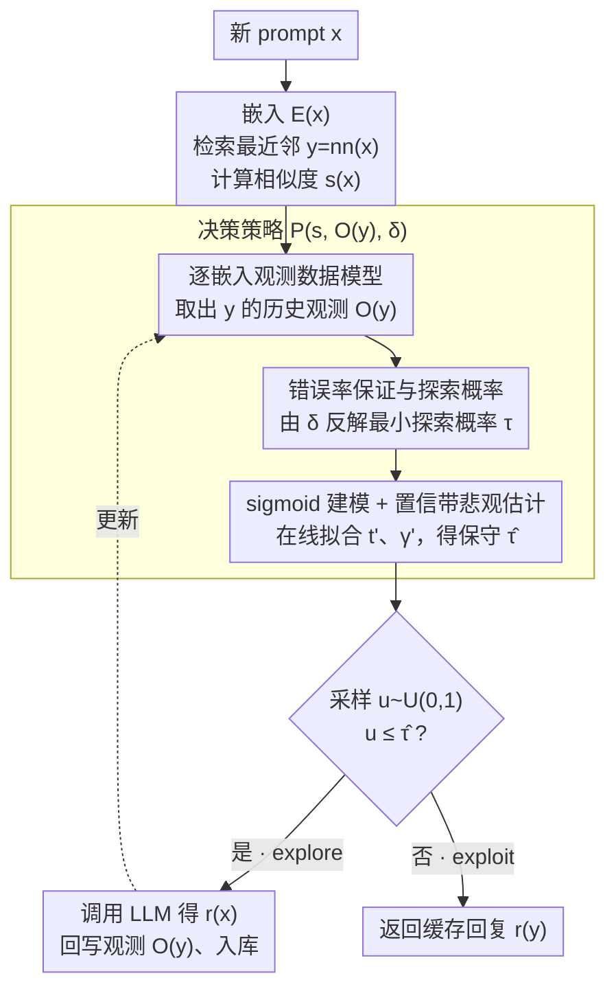

# vCache: Verified Semantic Prompt Caching

**会议**: ICLR2026  
**arXiv**: [2502.03771](https://arxiv.org/abs/2502.03771)  
**代码**: [GitHub](https://github.com/vcache-project/vCache) | [Benchmarks](https://huggingface.co/vCache)  
**领域**: LLM评测  
**关键词**: Semantic Caching, LLM Inference Optimization, Error-Rate Guarantee, online learning, Per-Embedding Threshold  
**作者**: Luis Gaspar Schroeder, Aditya Desai, Alejandro Cuadron, Kyle Chu, Shu Liu, Mark Zhao, Stephan Krusche, Alfons Kemper, Matei Zaharia, Joseph E. Gonzalez（UC Berkeley, TU Munich, ETH Zurich, Stanford）

## 一句话总结

提出 vCache——首个具有**用户定义错误率保证**的语义缓存系统，通过在线学习为每个缓存嵌入独立估计最优相似度阈值，无需预训练即可在满足正确性约束下实现最高 12.5× 缓存命中率提升和 26× 错误率降低。

## 研究背景与动机

**LLM 推理成本高**：每次 prompt 需要多次前向传播，部署昂贵且延迟大。

**语义缓存的价值**：对"加拿大首都是哪里？"已有缓存时，"Which city is Canada's capital?" 应复用同一回复，最高可降低 100× 延迟。

**静态阈值的根本缺陷**：
   - 现有系统（GPTCache、Azure、AWS 等）使用**全局固定阈值** $t$，对所有 prompt 一视同仁
   - 但实验发现（Figure 3）：正确和错误缓存命中的相似度分布**高度重叠**
   - **每个嵌入的最优阈值差异极大**，单一阈值不可能同时兼顾低错误率和高命中率

**无错误率保证**：现有系统无法保证返回的缓存回复的正确性，在生产环境中难以被信任

**嵌入微调的局限**：需要监督训练、仅限开源模型、对 OOD 数据泛化差

## 核心贡献

1. 首个提供**用户定义错误率保证**的可验证语义缓存
2. **在线阈值学习算法**：无需预训练，为每个缓存嵌入独立学习阈值，与嵌入模型无关
3. 证明**动态逐嵌入阈值**优于静态阈值和微调嵌入
4. 开源 4 个语义缓存基准（LMArena/Classification/SearchQueries/Combo）

## 方法详解

### 整体框架

vCache 要解决的是语义缓存的"信任"问题：现有系统都用一个全局阈值 $t$ 判断新 prompt 与缓存条目够不够像，但相同的相似度在不同条目上可能一个该命中、一个该重算，单一阈值既保不住正确率又压不高命中率。vCache 的思路是把"是否命中"从一刀切的阈值比较，换成一个**带用户错误率保证的概率决策**：对每条新 prompt $x$，先嵌入为 $\mathcal{E}(x)\in\mathbb{R}^d$、从向量库检索最近邻 $\text{nn}(x)=\arg\max_{y\in C}\text{sim}(\mathcal{E}(x),\mathcal{E}(y))$ 并算出相似度 $s(x)$；再调出这条最近邻自己积累的历史观测，在线拟合一条"相似度→正确概率"曲线，由此算出当前该以多大概率去探索（调 LLM）才能守住用户设定的错误率 $\delta$；最后掷一次随机数决定 exploit（直接返回缓存回复 $r(\text{nn}(x))$）还是 explore（调用 LLM，并把这次结果写回该条目，让它越用越准）。整套流程在推理时边走边学，不需要任何离线训练或标注集。

### 关键设计

**1. 逐嵌入观测数据模型：让每个缓存条目记住自己的历史**

静态阈值之所以失效，是因为不同嵌入的"安全相似度"差异巨大（Figure 3 显示正确与错误命中的相似度分布高度重叠、各条目最优阈值天差地别），而全局阈值无从知晓这种差异。vCache 把缓存存成三元组 $\mathcal{D}=\{(\mathcal{E}(x_i),r(x_i),\mathcal{O}(x_i))\}_{i=0}^{n}$，其中观测集 $\mathcal{O}(x_i)=\{(s(x_j),c(x_j))\mid \text{nn}(x_j)=x_i\}$ 记录了所有把 $x_i$ 当最近邻的后续 prompt 的相似度及其正确标签 $c(x)=\mathbb{1}[r(\text{nn}(x))=r(x)]$。这样每个嵌入都积累起一份属于自己的"相似度 vs 正确性"局部经验，为后续逐条目估计阈值、而非全局共用一个阈值提供了素材。

**2. 错误率保证与探索概率：把约束翻译成该探索多少**

用户只需指定最大错误率 $\delta$，vCache 承诺 $\Pr(\mathbf{vCache}(x)=r(x))\ge 1-\delta$。要兑现这个承诺，先把"答对"拆成两个互斥来源——要么探索（调 LLM 必对），要么命中且命中恰好正确：

$$\Pr(\text{正确})=\Pr(\text{explore})+(1-\Pr(\text{explore}))\cdot\Pr(c(x)=1)$$

令上式 $\ge 1-\delta$ 反解，就得到满足约束所需的**最小探索概率**

$$\Pr(\text{explore}\mid x,\mathcal{D})\ge\frac{(1-\delta)-\Pr(c(x)=1)}{1-\Pr(c(x)=1)}=\tau_{\text{nn}(x)}(s(x))$$

直觉很清楚：当前缓存越可能答对（$\Pr(c(x)=1)$ 越大），需要的探索就越少、命中率越高；越没把握就越该去问 LLM。这正是把"全局阈值比大小"替换成"按条目算一个探索概率"的核心——决策从此随每条 prompt 的把握程度连续变化，而不是非黑即白地卡一个数。

**3. sigmoid 建模 + 置信带悲观估计：在线拟合阈值并守住保证**

上式里的 $\Pr(c(x)=1)$ 是未知量，vCache 对每个嵌入用 sigmoid 拟合它与相似度的关系

$$\mathcal{L}(s(x),t,\gamma)=\frac{1}{1+e^{-\gamma(s(x)-t)}}$$

其中 $t$ 是该嵌入专属的决策边界、$\gamma$ 控制曲线陡峭度，二者通过对观测 $\mathcal{O}_{\text{nn}(x)}$ 做二元交叉熵的最大似然估计在线求出 $\hat{t},\hat{\gamma}$，因此无需任何预训练或标注集。但有限样本下点估计不可靠，直接代入会让保证失真，于是 vCache 不用点估计，而是取 $(1-\epsilon)$ 置信带上的**保守值** $t'(\epsilon),\gamma'(\epsilon)$，并在 $\epsilon$ 上取最紧的探索概率

$$\hat{\tau}=\min_{\epsilon\in(0,1)}\frac{(1-\delta)-(1-\epsilon)\mathcal{L}(s(x),t'(\epsilon),\gamma'(\epsilon))}{1-(1-\epsilon)\mathcal{L}(s(x),t'(\epsilon),\gamma'(\epsilon))}\ge\tau_{\text{nn}(x)}(s(x))$$

这种悲观处理把样本不确定性折算进探索次数：观测越少、不确定性越大，置信带越宽、$\hat\tau$ 越保守（多探索），守住保证；观测累积后置信带收窄、$\hat\tau$ 下降，命中率自然爬升。它也正是 Theorem 4.1（i.i.d. 与 sigmoid 建模假设下，对任意 $x$、任意时刻 $n$ 都有 $\Pr(\mathbf{vCache}(x)=r(x)\mid\mathcal{D})\ge 1-\delta$）能成立的关键。

### 一个完整示例

一条新 prompt $x$ 到来时（Algorithm 1）：先算嵌入并检索最近邻 $y=\text{nn}(x)$、相似度 $s(x)$；调出 $y$ 的历史观测 $\mathcal{O}(y)$ 拟合 sigmoid 得到 $\hat{t},\hat{\gamma}$；遍历 $\epsilon\in(0,1)$ 算出当前相似度下满足 $\delta$ 的探索概率 $\hat{\tau}$；采样 $u\sim\text{Uniform}(0,1)$，若 $u\le\hat{\tau}$ 就 explore——调用 LLM 得 $r(x)$，把这次 $(s(x),c(x))$ 写回 $\mathcal{O}(y)$ 让该嵌入的阈值估计越用越准，并把 $x$ 入库；否则 exploit，直接返回 $r(y)$。冷启动时新嵌入没有历史观测，$\hat\tau$ 取到最保守值（几乎全探索），随观测累积命中率自然上升，而错误率始终被 $\delta$ 约束。

## 实验关键数据

### 实验设置
- **嵌入模型**：GteLargeENv1-5、E5-large-v2、OpenAI text-embedding-3-small
- **LLM**：Llama-3-8B-Instruct、GPT-4o-mini
- **向量数据库**：HNSW + 余弦相似度
- **硬件**：Intel Xeon Platinum 8570 + NVIDIA Blackwell 192GB

### 基准数据集

| 基准 | 规模 | 特点 |
|------|------|------|
| SemCacheLMArena | 60K | LM-Arena 开放用户 prompt |
| SemCacheClassification | 45K | 3 个分类数据集 |
| SemCacheSearchQueries | 150K | Web 搜索查询 |
| SemCacheCombo | 27.5K | 混合，含无命中 prompt |

### 核心结果

**vs 静态阈值（GPTCache）**：
- SemCacheLMArena 上：最高 **26× 更低错误率**，**12.5× 更高命中率**
- SemCacheClassification 上：在 $\delta > 1.5\%$ 时全面优于静态基线
- $\delta < 1.5\%$ 时更保守（优先保证正确性，增加探索）

**错误率保证验证**（Figure 4）：
- vCache 在所有 $\delta$ 值下**始终满足错误率约束**
- GPTCache 错误率随样本增加**持续上升**，暴露静态阈值缺陷
- vCache 的缓存命中率持续增长（在线学习效应）

**Pareto 前沿对比**（Figure 5）：
- 在 error rate vs cache hit rate 的 Pareto 图中，vCache 在所有数据集上都支配（dominate）静态阈值方案
- 即使与微调嵌入的 GPTCache 对比，vCache 仍表现更优

### vs 微调嵌入基线
- vCache **无需训练**即可匹配/超越 Zhu et al. (2024) 的微调嵌入方法
- 微调嵌入在 OOD 数据上泛化差，vCache 的在线学习天然适应分布变化

## 亮点

1. **形式化正确性保证**：首次在语义缓存中提供用户可控的错误率上界 $\delta$，解决了生产级部署的信任问题
2. **逐嵌入自适应阈值**：Figure 3 展示了不同嵌入的最优阈值差异巨大，单一全局阈值不可行；vCache 自然捕捉这种变异
3. **零预训练在线学习**：模型无关、嵌入模型无关、无需标注数据，边推理边学习
4. **优雅的概率框架**：将 explore/exploit 决策形式化为在正确性概率约束下的最优化问题
5. **理论+实践统一**：既有 Theorem 4.1 的理论保证，又在大规模基准上验证

## 局限与展望

1. **长回复需 LLM-as-a-judge 判断等价**（Algorithm 1 L8），引入额外 LLM 调用（但可异步执行不影响延迟）
2. **依赖 i.i.d. 假设**：若 prompt 分布发生突变，保证可能暂时失效
3. **sigmoid 建模假设**：若真实正确性概率与相似度非 sigmoid 关系，分析可能不成立
4. **冷启动问题**：新嵌入无历史观测时，vCache 倾向保守（全部 explore）
5. **仅限语义相似场景**：对需要精确推理的 prompt（如数学计算），语义缓存本身不适用
6. **未评估多轮对话缓存**（论文聚焦单轮 prompt）

## 与相关工作的对比

| 方法 | 阈值类型 | 错误率保证 | 需要训练 | 模型无关 | 在线学习 |
|------|----------|:----------:|:--------:|:--------:|:--------:|
| GPTCache | 全局静态 | ✗ | ✗ | ✓ | ✗ |
| Azure/AWS Cache | 全局静态 | ✗ | ✗ | ✓ | ✗ |
| Zhu et al. 2024 | 全局静态 | ✗ | ✓ | ✗ | ✗ |
| SCalM | 全局静态 | ✗ | ✗ | ✓ | ✗ |
| EVM (Rudd et al.) | 逐类别 | ✗ | ✓ | — | ✗ |
| **vCache** | **逐嵌入动态** | **✓** | **✗** | **✓** | **✓** |

## 启发与关联

- **语义缓存 + RAG**：vCache 可直接集成到 RAG 系统中，缓存高频查询的检索结果
- **与 conformal prediction 的联系**：vCache 的概率保证框架与 conformal prediction 异曲同工，但无需标注校准集
- **在线学习范式**：将 explore/exploit 框架与正确性保证结合是一种可推广的设计模式（如推荐系统、A/B 测试）
- **多模态扩展**：语义缓存原理可扩展到图像/视频 prompt，vCache 的逐嵌入阈值机制天然适用

## 评分
- 新颖性: ⭐⭐⭐⭐⭐ — 首个有正确性保证的语义缓存，逐嵌入在线阈值学习是全新方向
- 实验充分度: ⭐⭐⭐⭐ — 3 嵌入模型 × 2 LLM × 4 基准，但缺乏真实部署延迟对比
- 写作质量: ⭐⭐⭐⭐⭐ — 形式化严谨，motivation 清晰，图表设计出色（Figure 1-3 特别直观）
- 综合价值: ⭐⭐⭐⭐⭐ — 解决了语义缓存的核心信任问题，理论优雅且实用性极强，开源完善

<!-- RELATED:START -->

## 相关论文

- [\[ICLR 2026\] Prompt and Parameter Co-Optimization for Large Language Models](prompt_and_parameter_co-optimization_for_large_language_models.md)
- [\[ICLR 2026\] AdaBlock-dLLM: Semantic-Aware Diffusion LLM Inference via Adaptive Block Size](adablock-dllm_semantic-aware_diffusion_llm_inference_via_adaptive_block_size.md)
- [\[ICCV 2025\] Supercharging Floorplan Localization with Semantic Rays](../../ICCV2025/llm_evaluation/supercharging_floorplan_localization_with_semantic_rays.md)
- [\[ACL 2026\] Revisiting a Pain in the Neck: A Semantic Reasoning Benchmark for Language Models](../../ACL2026/llm_evaluation/revisiting_a_pain_in_the_neck_a_semantic_reasoning_benchmark_for_language_models.md)
- [\[ACL 2026\] The Silent Vote: Improving Zero-Shot LLM Reliability by Aggregating Semantic Neighborhoods](../../ACL2026/llm_evaluation/the_silent_vote_improving_zero-shot_llm_reliability_by_aggregating_semantic_neig.md)

<!-- RELATED:END -->
