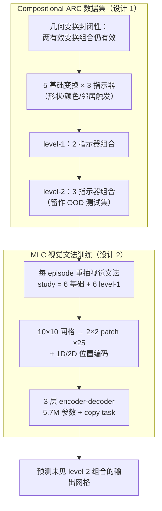

# Compositional-ARC: Assessing Systematic Generalization in Abstract Spatial Reasoning

**会议**: ICLR 2026  
**arXiv**: [2504.01445](https://arxiv.org/abs/2504.01445)  
**代码**: 待确认  
**领域**: LLM/NLP  
**关键词**: systematic generalization, meta-learning for compositionality, ARC, abstract reasoning, few-shot learning

## 一句话总结
提出 Compositional-ARC 数据集评估模型在抽象空间推理中的系统性泛化能力——从已知基础几何变换（如平移、旋转）泛化到未见过的变换组合。一个仅 5.7M 参数的 MLC 训练的 encoder-decoder 模型在系统性任务上达到 78.26%，与 ARC Prize 2024 冠军的 8B 模型+TTT 持平，远超 GPT-4o、o3-mini 等（<3%）。

## 研究背景与动机

**领域现状**：系统性泛化（systematic generalization）是人类认知的核心能力——理解已知组件后能自动推广到新组合。LLM 虽在各领域取得进展，但在组合性泛化测试中表现不佳。

**现有痛点**：Lake & Baroni (2023) 提出的 Meta-Learning for Compositionality (MLC) 在伪语言任务上实现了人类级别的系统性泛化，但这一方法是否适用于非语言领域（如空间推理）仍未探索。

**核心矛盾**：当前 LLM（包括 o3-mini、GPT-4o）在标准推理任务上表现优异，但面对需要从基础组件重组到新组合的场景时系统性失败——不是因为能力不够，而是缺乏组合性泛化的训练范式。

**本文目标**：(1) 设计一个评估空间推理系统性泛化的 benchmark；(2) 验证 MLC 可超越语言领域。

**切入角度**：利用几何变换的封闭性（两个有效变换的组合仍为有效变换），设计 ARC 风格的 2D 网格任务，测试模型能否从基础变换和 level-1 组合推断未见过的 level-2 组合。

**核心 idea**：将 MLC 从语言推广到视觉空间推理，证明小模型 + 正确的训练范式可以在组合性泛化上大幅超越万倍参数的 LLM。

## 方法详解

### 整体框架

这篇论文要回答的问题是：MLC 这种「在语言上能逼出人类级系统性泛化」的训练范式，换到视觉空间推理上还成不成。为此作者干两件事——先造一个能精确隔离「组合泛化」的数据集 Compositional-ARC，再用 MLC 训练一个极小的 encoder-decoder 去刷它。

数据这一侧是分层搭起来的：靠几何变换的封闭性（两个有效变换组合仍是有效变换），先定义 5 种基础变换、由 3 类指示器（形状/颜色/邻居）触发，两两指示器叠成 level-1 组合、三三叠成 level-2 组合，再把 level-2 划到训练时没见过的 OOD 测试集。模型这一侧走的是 episode 流程：每个 episode 临时抽一套「视觉解释文法」（哪类属性触发哪种变换），把 10×10 网格切成 2×2 patch 编码喂进 encoder-decoder，模型只能看几对 study examples、从中反推当前文法再套到 query 上预测输出网格。评估时只给基础变换和 level-1 组合的示例，逼它推断从没见过的 level-2 组合。

### 关键设计

**1. Compositional-ARC 数据集：用几何变换的封闭性造一个干净可控的组合泛化测试床**

要测「系统性泛化」，关键是任务必须能把「见过的组件」和「没见过的组合」干净地分开，否则刷分到底靠的是泛化还是记忆说不清。作者利用几何变换的一个性质——两个有效变换的组合仍是有效变换——在 ARC 风格的 2D 网格上搭起一套分层任务。底层是 5 种基础变换：平移、旋转、反射、扩展、变色；触发条件由 3 类指示器决定：形状（如 L 形物体做平移）、颜色（如绿色物体做水平反射）、邻居（与指定物体同格时向相邻行扩展）。

组合则按指示器个数分层：level-1 是 2 个指示器叠加（如形状+颜色 → 平移+反射），level-2 是 3 个指示器叠加（形状+颜色+邻居 → 平移+反射+扩展）。系统性测试的核心安排是：study examples 只展示基础变换和 level-1 组合，把 level-2 组合留作测试集——模型必须从「会单个变换、会两两组合」推断出「三三组合」该怎么做。更关键的是数据划分让 query 的 level-2 组合在训练/评估集之间互不重叠（如训练见过 平移+旋转+反射、测试考 平移+旋转+扩展），是真正的 OOD 评估，泛化能力被精确隔离出来。

**2. Meta-Learning for Compositionality（MLC）扩展到空间推理：用动态文法逼模型学规则而非记映射**

通用 LLM 在这类任务上失败，是因为它倾向于记住固定的「属性→变换」映射，一旦组合换新就崩。MLC 的破法是让映射本身在训练中不断漂移：每个 episode 都重抽一套视觉解释文法（「黄色物体做平移」在另一个 episode 里可能变成「黄色物体做水平反射」），固定记忆因此毫无用处，模型唯一能做的就是从当前 study examples 里现场推断文法、再组合应用。

具体实现上，10×10 网格被切成 2×2 的 patch（每张网格 25 个 patch），每个 patch 映射成一个嵌入向量（一个 patch 最多 $10^4$ 种取值，对应 1 万个嵌入），并用特殊 token `|`、`→` 标记 study examples 与输入输出网格的边界；再叠加 1D 位置编码标记 grid pair 的先后顺序、2D 位置编码（行/列分量）保留空间位置。训练时还挂了一个辅助 copy task——要求模型把 study examples 的输出也复现出来，逼它更扎实地读懂示例而不是草草扫一眼。模型本体很小：3 层 encoder + 3 层 decoder，8 个 head，dim=128，FFN=768，GELU 激活，总共只有 5.7M 参数。

### 损失函数 / 训练策略

主损失是标准交叉熵，预测输出网格的 patch 序列；外加辅助 copy task 损失（复现 study examples 的输出）；decoder 端还以 0.001 的概率随机扰动目标网格单元颜色以增强鲁棒性。数据共生成 10 万个 episode（每个配一套唯一的视觉解释文法），按 82,908 / 8,546 / 8,546 划分为训练 / 验证 / 测试，且训练与测试用的 level-2 组合互不重叠，保证 OOD 评估。

## 实验关键数据

### 主实验

系统性泛化任务（Systematicity）上的 Exact Match Accuracy：

| 模型 | 参数量 | Exact Match (%) | 备注 |
|------|--------|----------------|------|
| GPT-4o | ~数百B | 0.99 | 通用 LLM |
| Gemini 2.0 Flash | ~数百B | 2.66 | 通用 LLM |
| o3-mini (low) | ~数百B | 0.53 | 通用 LLM（推理增强） |
| Llama-3.2-3B-ReARC | 3B | 0.87 | ARC 专用 |
| Llama-3.2-3B-ReARC + TTT | 3B | 73.70 | +测试时训练 |
| Mistral-8B-Full + TTT | 8B | 78.20 | ARC Prize 2024 冠军 |
| **MLC (ours)** | **5.7M** | **78.26** | 与冠军持平！ |

### 消融实验

| 配置 | Exact Match (%) | 说明 |
|------|----------------|------|
| MLC 完整 | 86.73 ± 6.03 | 4 个 split 均值 |
| - 去掉 copy task | 69.05 ± 9.23 | 辅助任务很重要 |
| - 去掉基础变换 examples | 75.27 ± 12.95 | 适度下降 |
| - 去掉 level-1 组合 examples | 21.01 ± 19.07 | 严重崩溃 |
| MLC (更复杂数据集) | 88.10 | 变换种类增加后仍有效 |

### 关键发现
- **5.7M << 8B 但表现持平**：MLC 训练的微型模型在系统性泛化上与 ARC Prize 2024 冠军（8B + TTT + 大量工程优化）持平，参数量差 1400 倍。
- **通用 LLM 系统性泛化近乎为零**：GPT-4o (0.99%)、o3-mini (0.53%) 在 3-shot 任务上分别达 22%/64%，但在需要组合泛化的 Systematicity 任务上几乎完全失败。
- **Level-1 组合 examples 是关键**：去掉 level-1 examples 导致准确率从 87% 降至 21%，说明中间层次的组合示例对推断更高层次组合至关重要。
- **Copy task 是隐藏增益**：辅助 copy task 贡献了 ~18pp 的提升，迫使模型更深入地理解 study examples。
- **错误模式不同**：LLM 主要错误是预测错误形状或只做基础变换；MLC 主要错误是形状微小偏差（很少退化为基础/level-1 变换）。

## 亮点与洞察
- **"正确的训练范式 > 大模型"的绝佳例证**：5.7M 参数 vs 8B 参数，核心差异不在模型大小而在 MLC 训练策略。这对"大力出奇迹"的 scaling 叙事是一个有力的反例。
- **MLC 从语言到视觉的成功迁移**：证明 MLC 不是语言特定的 trick，而是一种通用的组合性泛化训练范式——通过动态变换训练文法迫使模型学习规则而非记忆。
- **研究设计精巧**：level-0/1/2 的层次化任务设计既干净又有深度，能精确地隔离和测量组合性泛化能力。

## 局限与展望
- **任务相对简单**：5 种基础变换、10×10 网格、2 个物体，与真实世界的空间推理相比仍很受限。
- **组合层次仅到 level-2**：更深层次的组合（3+变换组合）是否仍可泛化未测试。
- **固定网格大小**：未测试对不同大小网格的泛化能力。
- **与 ARC 原始数据集的差异**：Compositional-ARC 的变换规则比原始 ARC 更规则化，原始 ARC 的多样性和抽象性更高。

## 相关工作与启发
- **vs Lake & Baroni (2023, MLC 原文)**：原文在伪语言任务上验证 MLC，本文首次扩展到视觉空间推理，证明 MLC 的通用性。
- **vs ARC Prize 2024 冠军 (Franzen et al.)**：冠军使用 8B 模型 + 定制 tokenizer + 数据增强 + TTT + DFS 搜索等大量工程优化，MLC 模型仅 5.7M 参数+简单训练即达到同等水平。
- **vs GPT-4o / o3-mini**：暴露了当前最强 LLM 在组合性泛化上的根本缺陷——它们可以做 pattern matching 但无法做 systematic composition。

## 评分
- 新颖性: ⭐⭐⭐⭐⭐ 首次将 MLC 推广到视觉空间推理，数据集设计精巧，实验结论有冲击力。
- 实验充分度: ⭐⭐⭐⭐⭐ 多个模型对比、4 个 split 验证、详细消融、错误分析、复杂度扩展实验一应俱全。
- 写作质量: ⭐⭐⭐⭐⭐ 图文并茂，逻辑清晰，概念引入循序渐进。
- 价值: ⭐⭐⭐⭐⭐ 对 AI 系统性泛化能力的理解有重要贡献，5.7M 参数超越 GPT-4o 的结果极具启发性。

<!-- RELATED:START -->

## 相关论文

- [\[ACL 2025\] A Systematic Study of Compositional Syntactic Transformer Language Models](../../ACL2025/llm_nlp/a_systematic_study_of_compositional_syntactic_transformer_language_models.md)
- [\[ACL 2025\] Systematic Generalization in Language Models Scales with Information Entropy](../../ACL2025/llm_nlp/systematic_generalization_in_language_models_scales_with_information_entropy.md)
- [\[ICLR 2026\] Is the Reversal Curse a Binding Problem? Uncovering Limitations of Transformers from a Basic Generalization Failure](is_the_reversal_curse_a_binding_problem_uncovering_limitations_of_transformers_f.md)
- [\[ACL 2025\] Revisiting Compositional Generalization Capability of Large Language Models Considering Instruction Following Ability](../../ACL2025/llm_nlp/compositional_generalization_instruction.md)
- [\[AAAI 2026\] Learning Spatial Decay for Vision Transformers](../../AAAI2026/llm_nlp/learning_spatial_decay_for_vision_transformers.md)

<!-- RELATED:END -->
