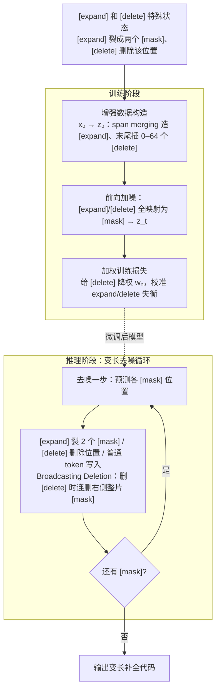

# DreamOn: Diffusion Language Models For Code Infilling Beyond Fixed-size Canvas

**会议**: ICLR 2026  
**arXiv**: [2602.01326](https://arxiv.org/abs/2602.01326)  
**代码**: [https://github.com/DreamLM/DreamOn](https://github.com/DreamLM/DreamOn)  
**领域**: LLM/NLP  
**关键词**: diffusion language model, code infilling, variable-length generation, discrete diffusion, DLM

## 一句话总结
DreamOn 通过引入 [expand] 和 [delete] 两个特殊状态解决了扩散语言模型（DLM）的固定长度生成限制，无需架构修改即可实现变长代码填充，在 HumanEval-Infilling 上比扩散基线平均提升 26.4%，达到与 SOTA 自回归模型持平的水平。

## 研究背景与动机

**领域现状**：扩散语言模型（DLM，如 LLaDA、Dream、DiffuCoder）通过迭代去噪实现灵活的任意顺序生成，天然适合代码填充（infilling）——在给定前缀和后缀之间生成缺失代码。自回归模型做填充需要笨拙的 FIM（Fill-in-the-Middle）hack，破坏自然上下文结构。

**现有痛点**：DLM 的致命瓶颈——**必须预先指定固定长度的 mask 序列**。输入输出必须等长，模型无法动态决定生成长度。当预设 mask 长度与真实补全长度不匹配时：mask 太少→补全不完整；mask 太多→生成多余错误代码。实测平均性能下降 38%！

**核心矛盾**：DLM 的双向注意力天然适合 infilling，但固定长度约束完全抵消了这一优势。如何在保持 DLM 架构不变的前提下让它学会动态调整输出长度？

**本文目标** 让 DLM 在生成过程中自主决定扩展或收缩序列长度。

**切入角度**：在扩散过程中引入两个特殊状态作为长度控制信号——预测 [expand] 表示"这里需要更多空间"，预测 [delete] 表示"这里多余了"。

**核心 idea**：将长度控制编码为扩散词表中的两个特殊 token（[expand]→分裂为两个 [mask]，[delete]→删除该位置），通过数据增强训练模型预测这些状态，实现零架构改动的变长生成。

## 方法详解

### 整体框架
DreamOn 要解决的是 DLM「生成前就把序列长度钉死」的死结，思路是往扩散词表里加 [expand] 和 [delete] 两个特殊状态，把「改长度」变成一次普通的 token 预测，全程不动模型架构。整条管线分训练、推理两段：训练时先把原始代码序列 $\mathbf{x}_0$ 增强成含特殊状态的序列 $\mathbf{z}_0$（span merging 制造 [expand]、末尾插入 [delete]），再对 $\mathbf{z}_0$ 跑标准 masked diffusion 加噪，用加权交叉熵学着把被 mask 的位置还原成普通 token 或特殊状态；推理时从一段初始 [mask] 出发循环去噪，每步预测出 [expand] 就把该位置裂成两个 [mask]（序列变长）、预测出 [delete] 就删掉该位置（序列变短），直到没有 [mask] 为止，输出长度由模型自己收敛到真实补全所需。

### 关键设计

**1. [expand] 和 [delete] 特殊状态：把"改长度"编码成两个可预测的 token**

DLM 的死结是序列长度在生成前就被 mask 数量钉死，无法改动。DreamOn 不去碰架构，而是往扩散词表里塞两个额外 token 当长度控制信号：模型在某个位置预测出 [expand] 就把该位置替换成两个 [mask]（序列变长一格），预测出 [delete] 就删掉该位置（序列变短一格）。这两个原语是图灵完备的——任意初始长度都能靠若干次 expand/delete 收敛到真实补全所需的长度，于是"动态决定输出多长"这件原本要改模型结构才能做的事，被降维成了一次普通的 token 预测。

**2. 增强数据构造：训练时人为制造 [expand] 和 [delete] 让模型见过它们**

模型要学会预测这两个特殊 token，前提是训练数据里得有它们，但原始代码 $\mathbf{x}_0$ 里并没有。DreamOn 在加噪前先把 $\mathbf{x}_0$ 改造成含特殊 token 的增强序列 $\mathbf{z}_0$：[expand] 通过 span merging 制造——把一段连续的 [mask] 合并成单个 [expand]，等于告诉模型"这一格以后要还原成多个 token"；[delete] 则通过在序列末尾追加 0–64 个随机 delete token 制造，等于喂给模型"这些是多余的、该删掉"的样本。[expand] 的比例由 merge scheduling 控制，用静态调度器和动态逆调度器按 1:1 混合，目的是别让特殊 token 占比过高而拖累原始生成质量。

**3. 加权训练损失：给 [delete] 降权，防止它在 loss 里喧宾夺主**

构造方式带来一个失衡：每个 [delete] 对应一个 [mask]，而一个 [expand] 是多个 [mask] 合并来的，结果 [delete] 在交叉熵损失里的占比被天然放大，模型容易学偏成"爱删不爱扩"。DreamOn 给 [delete] 引入权重 $w_n$，让一连串 [delete] 的总贡献等价于单个 [mask]，把损失分布校准回来，确保 expand 和 delete 被同等地学到。

**4. Broadcasting Deletion：删一个连带删掉右侧整片冗余 mask**

推理时若靠模型一个一个地 delete 来收缩长度，要跑很多次前向传递、非常慢。DreamOn 观察到：一旦某位置被判为 [delete]，它右侧那串连续的 [mask] 大概率也是多余的。于是检测到 [delete] 时直接把右侧所有连续 [mask] 一并删除，把多步删除压成一步，显著加速推理而不损精度。

### 损失函数 / 训练策略
- 标准 masked diffusion 的加权交叉熵损失，扩展词表包含 [expand] 和 [delete]
- 基于 DreamCoder-7B/DiffuCoder-7B 微调，仅 110K Python 代码对，10 个 epoch，8×H800 约 5 小时
- **训练计算量仅为预训练的 0.15%**——极其轻量

## 实验关键数据

### 主实验

| 模型 | HE-Single (Pass@1) | HE-Multi (Pass@1) | SantaCoder (EM) |
|------|--------------------|--------------------|-----------------|
| Qwen2.5-Coder-7B (AR) | 92.6 | 58.7 | 79.8 |
| Seed-Coder-8B (AR) | 89.7 | 59.3 | 77.2 |
| DreamCoder-7B (DLM) | 55.5 | 43.2 | 59.3 |
| **DreamCoder + DreamOn** | **92.1** (+36.6) | **63.8** (+20.6) | **79.0** (+19.7) |
| DiffuCoder + DreamOn | 92.2 (+38.5) | 63.1 (+18.1) | 77.4 (+19.4) |

DreamOn 使 DLM 在 multi-line infilling 上甚至**超越** SOTA 自回归模型！

### 消融实验

| 配置 | Single-line Avg | Multi-line Avg | 说明 |
|------|----------------|----------------|------|
| DreamCoder-7B 基线 | 55.3 | 26.0 | 固定 mask=64 |
| + DreamOn (完整) | **90.8** | **57.1** | 两个状态都有 |
| w/o Delete | 67.4 | 39.2 | 无法缩短，mask 多时退化 |
| w/o Expand | 73.4 | 43.2 | 无法扩展，mask 少时退化 |
| Oracle（真实长度） | 91.6 | 69.0 | 上界参考 |

### 关键发现
- **DreamOn 几乎达到 Oracle 水平**（单行：90.8 vs 91.6），证明长度适配非常有效
- **Expand 和 Delete 互补且缺一不可**：去掉 Delete 在长 mask 时退化严重；去掉 Expand 在短 mask 时退化严重
- **对初始 mask 长度高度鲁棒**：初始 mask 从 4 到 64 变化时，DreamOn 性能几乎不变（88.7-92.1），而基线从 24.9 变到 55.5
- **仅 0.15% 预训练计算量**的微调就实现了巨大提升，证明方法的轻量性
- Broadcasting Deletion 显著减少推理步数，不损失精度

## 亮点与洞察
- **优雅的最小化设计**：仅在词表中添加两个特殊 token + 数据增强，零架构改动。这种"用词表操作编码结构操作"的思路非常巧妙
- **DLM infilling 首次达到 AR 水平**：证明了 DLM 的天然 infilling 优势一旦解决长度问题就能完全释放
- **可迁移性**：DreamOn 在 Dream-7B、DiffuCoder-7B、DreamCoder-7B 三个不同 DLM 上都有效，说明是 model-agnostic 的增强
- **Broadcasting Deletion 的洞察**：推理时如果模型预测 delete，其后续全 mask 区域大概率也是多余的——这个简单启发式大幅加速推理

## 局限与展望
- 每次 [expand] 只能扩展为 2 个 [mask]，大幅度长度扩展需要多步前向传递
- 目前仅在代码 infilling 验证，自然语言 infilling（如文本编辑、故事续写）的效果待探索
- 最大扩展长度 $L_{max}=128$ 是人为限制，更长的代码填充可能受限
- 训练数据仅 110K Python 代码，多语言代码 infilling 的泛化性待验证

## 相关工作与启发
- **vs 自回归 FIM（Qwen2.5-Coder 等）**：FIM 需要在训练时重排序列（把 middle 挪到末尾），推理时需要特殊 prompt。DLM + DreamOn 天然支持双向上下文的 infilling，更自然
- **vs 固定长度 DLM（LLaDA、Dream）**：DreamOn 解决了 DLM 最关键的实用性瓶颈，使 DLM 首次在 infilling 上具有竞争力
- **vs Edit-based 方法**：一些方法通过显式的 insert/delete 操作做文本编辑，DreamOn 将这些操作融入扩散过程中，更优雅且端到端可训练

## 评分
- 新颖性: ⭐⭐⭐⭐⭐ 用两个特殊 token 解决 DLM 的根本性限制，思路简洁有力
- 实验充分度: ⭐⭐⭐⭐ 三个 DLM 基线 + 两个 benchmark + 详细消融，但仅限代码任务
- 写作质量: ⭐⭐⭐⭐⭐ motivation 图例直观，算法描述清晰，消融分析透彻
- 价值: ⭐⭐⭐⭐⭐ 解决了 DLM 领域的根本性瓶颈，使 DLM 在 infilling 场景上首次可与 AR 模型竞争

<!-- RELATED:START -->

## 相关论文

- [\[ICLR 2026\] Toward Safer Diffusion Language Models: Discovery and Mitigation of Priming Vulnerabilities](toward_safer_diffusion_language_models_discovery_and_mitigation_of_priming_vulne.md)
- [\[ACL 2026\] Unlocking the Potential of Diffusion Language Models through Template Infilling](../../ACL2026/llm_nlp/unlocking_the_potential_of_diffusion_language_models_through_template_infilling.md)
- [\[ICLR 2026\] d²Cache: Accelerating Diffusion-Based LLMs via Dual Adaptive Caching](d2cache_accelerating_diffusion-based_llms_via_dual_adaptive_caching.md)
- [\[ICLR 2026\] Stopping Computation for Converged Tokens in Masked Diffusion-LM Decoding](stopping_computation_for_converged_tokens_in_masked_diffusion-lm_decoding.md)
- [\[ICLR 2026\] Rethinking Code Similarity for Automated Algorithm Design with LLMs](rethinking_code_similarity_for_automated_algorithm_design_with_llms.md)

<!-- RELATED:END -->
