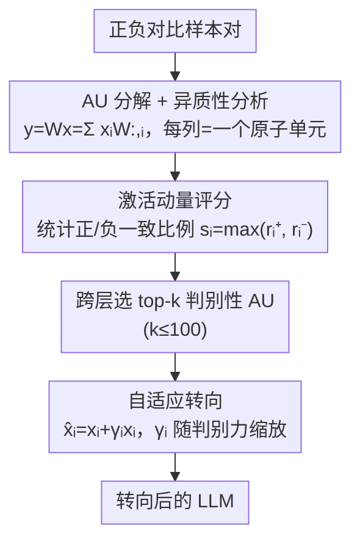

# Fine-Grained Activation Steering: Steering Less, Achieving More

**会议**: ICLR 2026  
**arXiv**: [2602.04428](https://arxiv.org/abs/2602.04428)  
**代码**: [https://github.com/zijian678/AUSteer](https://github.com/zijian678/AUSteer)  
**领域**: LLM NLP  
**关键词**: 激活转向, 原子单元, 细粒度干预, 可解释性, 推理时对齐

## 一句话总结
AUSteer 发现块级激活转向（steering）本质上是异质的——不同维度控制不同 token 分布，混合转向既放大有益信号也放大有害信号。提出原子单元（AU）级细粒度转向：用激活动量定位判别性维度，自适应调节转向强度，仅转向 ≤100 个维度即大幅超越转向数千维度的 SOTA 方法。

## 研究背景与动机

**领域现状**：激活转向（activation steering）是低成本修改 LLM 行为的方法——提取转向向量在推理时注入到中间激活中。ITI、CAA、SADI 等方法在注意力头、FFN 或残差流的**块级别**操作。

**现有痛点**：
   - 块级激活包含数百到数千维，混合了有益、无关和有害特征
   - 块级转向不可避免地同时移动有用和有害的 token 方向——粗粒度、低效、过度侵入
   - 单一维度的转向效果可能**超过**整个块的转向——说明块级操作是次优的

**核心矛盾**：块级转向把所有维度绑定在一起，但不同维度控制不同输出token的概率分布——这是根本性的异质性问题

**切入角度**：将权重矩阵的每一列定义为"原子单元"（AU），对应激活的单一维度。通过分解 $\mathbf{y} = \mathbf{W}\mathbf{x} = \sum_i x_i \mathbf{W}_{:,i}$，将块级干预分解为 AU 级标量干预。

**核心 idea**：转向更少的维度反而效果更好——因为只转向有益 AU 避免了有害 AU 的副作用。

## 方法详解

### 整体框架
AUSteer 想解决的是一个看似反直觉的问题：为什么转向几千个维度的块级方法，效果反而不如只转向几个维度？它的答案是把权重矩阵的每一列视为一个"原子单元"（AU）——因为 $\mathbf{y} = \mathbf{W}\mathbf{x} = \sum_i x_i \mathbf{W}_{:,i}$，块级激活其实是若干 AU 标量贡献的叠加，于是粗粒度的块级干预可以拆成对单个维度的标量干预。沿着这个分解视角，作者先证明这些 AU 是异质的（不同维度推向互相冲突的 token 分布），从而说明块级转向把有益、有害维度绑在一起同时放大才是低效的根因；再据此设计一条完全 training-free 的两步流水线：用激活动量在对比样本上给所有 AU 的判别力打分、跨层挑出最有益的 top-k 个，再对这少数 AU 按各自的判别强度做输入自适应的转向。这样只动 ≤100 个维度，就能避开有害 AU 的副作用、稳超动辄数千维的 SOTA。

### 关键设计

**1. AU 分解与异质性：为什么块级转向是次优的**

AUSteer 的出发点是把块级激活拆成 AU 标量贡献的叠加 $\mathbf{y} = \mathbf{W}\mathbf{x} = \sum_i x_i \mathbf{W}_{:,i}$，从而能逐维讨论每个维度的作用。在这个粒度下作者发现了关键的异质性：同一个块里的不同维度控制的是完全不同的输出 token 分布。把转向强度记作 $s$，随着 $s$ 增大，模型输出会收敛到被转向那个 AU 所偏好的 token 分布；而两个不同 AU 之间，输出分布的 KL 散度随 $s$ 单调增大，说明它们把模型推向互相冲突的方向。具体到一道判断题，转向有益维度（如 $x_{84}$）会抬高正确 token "yes" 的概率，转向有害维度（如 $x_{44}$）却抬高了不相关 token 的概率。块级转向把这两类绑在一起同时移动，于是有益信号和有害信号被一起放大——这正是"转向越多反而越差"的来源，也直接论证了只挑有益 AU 单独转向的必要性。

**2. 激活动量定位判别性 AU：用计数而非幅度做跨层可比的全局评分**

要在成千上万个 AU 里找出真正有益的少数，关键是有一个能跨层比较的评分。对每个 AU $u_i$，在 $N$ 对正负对比样本上算出激活差 $m_i^j = x_i^{j,pos} - x_i^{j,neg}$，再统计差值为正的样本占比 $r_i^{pos}$ 和为负的占比 $r_i^{neg}$，最终判别分数取 $s_i = \max(r_i^{pos}, r_i^{neg})$。之所以用"一致为正/负的样本比例"而不是直接用激活差的幅度，是因为激活幅度会随层深累积增大，跨层直接比大小会偏向深层；而基于计数的比例落在 $[0,1]$ 内，天然支持把全模型所有层的 AU 放在一起排序，挑出 top-k。

**3. 自适应转向：按当前激活和判别力同时缩放，保方向不破坏输入**

对选中的 AU 不是加一个固定常数，而是做比例缩放 $\hat{x}_i = x_i + \gamma_i x_i$——这样既保持了该维度原本的符号方向，又能适配不同输入样本各自的激活大小，避免一刀切的常数把弱激活样本推过头。缩放系数 $\gamma_i$ 进一步与判别力挂钩：促进型 AU 取 $\gamma_i = \alpha \cdot r_i^{pos}$、抑制型取 $\gamma_i = -\alpha \cdot r_i^{neg}$，其中 $\alpha$ 是全局强度超参。判别一致性越高的 AU 转得越多，弱判别的 AU 几乎不动，把有限的干预预算集中在最可靠的维度上。

### 损失函数 / 训练策略
方法完全 training-free，不需要任何梯度更新，全部信息都来自对比样本上的激活动量统计。每次只转向 $k \leq 100$ 个维度，远少于块级方法动辄数千维的干预，并且可以作用在 MHA、FFN 或残差流的任意位置。

## 实验关键数据

### 主实验（LLaMA2-7B-Chat，常识推理）

| 方法 | 转向维度数 | BoolQ↑ | COPA↑ | WinoGrande↑ |
|------|----------|--------|-------|------------|
| Baseline | 0 | 70.5 | - | - |
| ITI (块级) | 128 | 71.6 | - | - |
| SADI (块级) | 4224 | 73.7 | - | - |
| **AUSteer** | **≤100** | **76.0+** | **提升** | **提升** |

### 消融实验

| 配置 | 效果 |
|------|------|
| 单维度转向 $x_{84}$ | 74.5%（超过块级 SADI 的 73.7%） |
| 4 个正向维度组合 | 76%+ |
| 混合正向+负向维度 | 性能下降（验证异质性） |
| 转向维度数 k 的影响 | k=50-100 最优，过多反而下降 |

### 关键发现
- **单个维度 > 整个块**：第 84 维单独转向（74.5%）超过 128 维块级 ITI（71.6%）和 4224 维 SADI（73.7%）
- **100 维 > 4000 维**：AUSteer 用 ≤100 个 AU 显著优于转向数千维的 SOTA
- **跨模型一致**：在 LLaMA2-7B/13B、Mistral-7B 等多个模型上均有效
- **多任务通用**：常识推理、数学问题求解、去毒化、人类偏好对齐均有效
- **激活动量跨层可比**：基于计数的评分避免了层深导致的幅度偏差

## 亮点与洞察
- **"Steering Less, Achieving More"是一个反直觉但深刻的发现**：传统直觉是"干预越多控制越强"，但在异质系统中，精确干预少数关键点远胜于粗粒度的全局干预。这个原则可推广到剪枝、知识编辑等领域。
- **AU 的 token 分布解释**为激活转向提供了清晰的理论基础——每个 AU 就像一个"微型专家"，控制特定 token 类型的输出概率。这也暗示了 Transformer 内部的模块化结构。
- **完全 training-free + 仅需对比样本统计**使得 AUSteer 极其轻量——比 SAE 方法（STA）通用得多（STA 需要特定模型的预训练 SAE）。

## 局限与展望
- 激活动量是基于对比样本的统计——样本质量和数量影响 AU 选择的可靠性
- 目前每个任务需要独立的 AU 定位——缺乏跨任务可迁移性
- 理论分析主要基于线性投影的分解——注意力机制的非线性交互未充分建模
- 未探索 AU 级转向与 LoRA/SFT 的结合
- 大模型（70B+）上的效果待验证

## 相关工作与启发
- **vs ITI (Li et al.)**: ITI 在注意力头级别转向（128维）；AUSteer 进一步分解到单维度，效果更好且干预更少
- **vs SADI (Wang et al.)**: SADI 是块级 SOTA（4224维）；AUSteer 用 ≤100 维度即超越
- **vs STA (Wang et al.)**: STA 用 SAE 中的"原子"但仍在残差流块级注入；AUSteer 直接操作原始权重矩阵的列，不依赖 SAE

## 评分
- 新颖性: ⭐⭐⭐⭐⭐ AU 分解 + 异质性分析 + 动量定位，完整的新范式
- 实验充分度: ⭐⭐⭐⭐⭐ 多模型、多任务、消融、理论验证、人工评估全面
- 写作质量: ⭐⭐⭐⭐⭐ "Steering Less, Achieving More"的故事线极其清晰
- 价值: ⭐⭐⭐⭐⭐ 对激活转向领域的根本性贡献，简单实用可推广

<!-- RELATED:START -->

## 相关论文

- [\[ACL 2025\] Steering off Course: Reliability Challenges in Steering Language Models](../../ACL2025/llm_nlp/steering_off_course_reliability_challenges_in_steering_language_models.md)
- [\[ICLR 2026\] Spectral Attention Steering for Prompt Highlighting](spectral_attention_steering_for_prompt_highlighting.md)
- [\[ICML 2026\] The Cylindrical Representation Hypothesis for Language Model Steering](../../ICML2026/llm_nlp/the_cylindrical_representation_hypothesis_for_language_model_steering.md)
- [\[ACL 2026\] CoSToM: Causal-oriented Steering for Intrinsic Theory-of-Mind Alignment in Large Language Models](../../ACL2026/llm_nlp/costomcausal-oriented_steering_for_intrinsic_theory-of-mind_alignment_in_large_l.md)
- [\[ACL 2025\] Language Models, Graph Searching, and Supervision Adulteration: When More Supervision is Less and How to Make More More](../../ACL2025/llm_nlp/lm_graph_search_supervision.md)

<!-- RELATED:END -->
