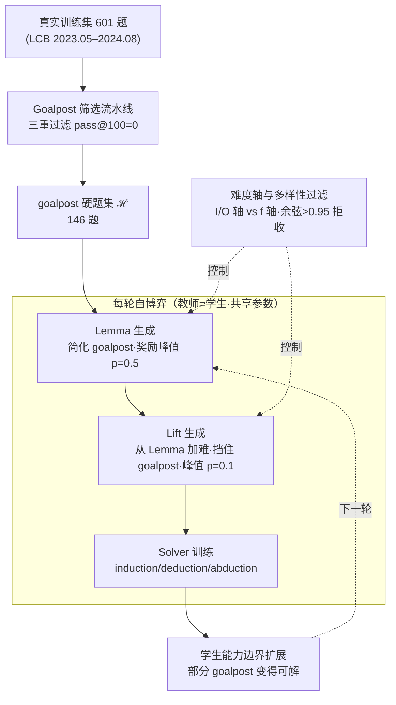

# GASP: Guided Asymmetric Self-Play For Coding LLMs

**会议**: ICLR 2026  
**arXiv**: [2603.15957](https://arxiv.org/abs/2603.15957)  
**代码**: 无  
**领域**: LLM训练/代码推理  
**关键词**: 非对称自博弈, 代码生成, 课程学习, RLVR, 目标引导

## 一句话总结
提出GASP框架，在非对称自博弈中引入"goalpost"（硬目标题）引导教师生成有针对性的训练问题，通过lemma（简化变体）→lift（加难变体）的课程结构逐步逼近困难目标，在LiveCodeBench上超越无引导自博弈2.5%且解决了所有baseline无法解决的难题。

## 研究背景与动机

**领域现状**：非对称自博弈（如Absolute Zero/AZR）让LLM同时扮演教师（出题）和学生（解题），实现无人工数据的开放式训练。RLVR通过可验证奖励训练代码/数学推理能力。

**现有痛点**：现有自博弈是目标无关的——教师只关注学生的可学习性（题目不能太简单也不能太难），但不关注生成的题目是否"有趣"或"对下游任务有帮助"。结果是：很多在学习边界的难题对提升模型实际编程能力并不重要。

**核心矛盾**：自博弈需要探索困难问题来推进能力边界，但无引导的探索效率低——很多"难"题是人为构造的无意义难题，不代表真实编程挑战。

**本文目标**：(1) 能否用真实世界的难题引导自博弈？(2) 这种引导是否能提升下游编程能力？

**切入角度**：从训练集中筛选出RLVR训练后仍无法解决的硬题作为"goalpost"，教师被引导生成这些goalpost的简化版（lemma），再从lemma出发生成加难版（lift），形成逐步逼近的课程。

**核心 idea**：用真实难题做goalpost引导自博弈教师，通过lemma-lift踏脚石课程逐步突破能力边界。

## 方法详解

### 整体框架
GASP 要治的是无引导自博弈"瞎探索"的毛病：AZR 这类方法让教师只盯着"学生能不能学得动"出题，却不管题目对真实编程能力有没有用，结果造出一堆人为的无意义难题。GASP 的做法是先给教师一个明确的攻坚靶子——goalpost，再让它朝这个真实难题逼近出题。

整体分一个离线准备步 + 一个在线自博弈循环。离线时，从 601 道真实训练题里筛出 146 道模型反复训练后仍 pass@100=0 的硬题，组成 goalpost 集合 $\mathcal{H}$。在线每一轮里：教师先看着某道 goalpost $h$ 生成一道够得着的简化题（Lemma $\ell_0$），再从这道简化题出发、但**不让它看 goalpost** 地生成一道更难的题（Lift $\ell_1$）；这一对踏脚石 $(\ell_0,\ell_1)$ 交给学生（Solver）训练。教师和学生是**同一套参数**，只靠角色提示切换身份、统一更新。随着迭代推进，学生能力边界被一对对踏脚石顶上去，原本解不动的 goalpost 逐渐有一部分变得可解。

### 关键设计

**1. Goalpost 筛选流水线：把"真正解不动的题"挑出来当攻坚靶子**

无引导自博弈的根本缺陷是没有方向，所以第一步要先把"方向"定义出来——一批确实超出模型当前能力、又来自真实任务的硬题。GASP 用三重过滤来保证这点：先在 base 模型 Qwen2.5-Coder-7B 上跑三个种子的 RL，对每个种子每 50 步存的所有检查点都要求 pass@100=0；再用一个 AZR 训练出的检查点过滤一遍；最后在剩余难题上额外跑一轮 RL，把任何还能解出来的剔除。三道关卡全跑下来仍 pass@100=0 的题才入选，最终从 601 道训练题里得到 146 道 goalpost（约占 25%）。这种反复验证不是随便挑难题，而是要确保 goalpost 是 genuinely hard——既被多次确认超出当前边界，又来自真实训练集、和真实编程挑战相关，从而避免教师对着人为构造的无意义难题使劲。

**2. Lemma 生成：把遥不可及的硬题降到学生够得着的难度**

直接让学生啃 goalpost 是学不动的（pass@100=0 意味着完全没有正反馈），所以需要一块"踏脚石"。给定一个 goalpost $h$，教师生成它的简化变体 $\ell_0$，要求保留高层的算法主题，但把难度降到学生可学习的区间，只有学生通过率落在 $0.3 \leq p \leq 0.7$ 才被接受。控制难度落点的是基于 learnability（$p(1-p)^\alpha$）的奖励函数

$$r_{\text{lemma}} = \begin{cases}[4p(1-p)]^5, & 0.3 \leq p \leq 0.7 \\ -0.5, & \text{否则}\end{cases}$$

其中 $p$ 是学生在该题上的通过率，函数在 $p=0.5$ 处取峰值，把教师推向"中等难度"——既不会简单到没信息量，也不会难到学不动，同时仍与 goalpost 的主题相关。

**3. Lift 生成：从简化版往上加难，但故意不让教师看 goalpost**

只有 Lemma 还不够，课程得能往难处推，才能逼近 goalpost。于是教师从 Lemma $\ell_0$ 出发，生成一道更难的变体 $\ell_1$（接受区间 $0.1 \leq p \leq 0.5$）。这一步最关键的设计是教师**看不到原始 goalpost**，只能基于 $\ell_0$ 递增。奖励函数把难度落点压得更狠：

$$r_{\text{lift}} = \begin{cases}10p\left(\dfrac{1-p}{0.9}\right)^9, & 0.1 \leq p \leq 0.5 \\ -0.5, & \text{否则}\end{cases}$$

峰值落在 $p=0.1$，鼓励教师生成更难的题。之所以刻意挡住 goalpost，是为了避免教师走捷径——如果让它直接对照目标，它会倾向于复制 goalpost 的表面特征；挡住之后，它只能从学生当前的能力边界一点点往上递增，让难度增长更贴合学习的渐进性。

**4. 难度轴与多样性过滤：让加难沿一条可控的维度发生、且课程不塌缩**

要让 Lemma 简化、Lift 加难有章可循，GASP 把题目难度拆成两条正交的轴：I/O 轴改变输入输出的复杂度（如把一个列表换成嵌套列表，或换一组更难推断 $f$ 的样例），f 轴改变算法本身的复杂度（如增加约束或组合新操作）。每生成一道 Lemma 时**均匀随机**选定一条轴，随后的 Lift 就沿同一条轴继续加难——这样一对踏脚石在"变难"时只动一个维度，难度变化是可解释、可累积的，而不是同时改一堆东西让课程失控。光控轴还不够，自博弈容易反复生成雷同题导致模式塌缩（mode collapse），所以每个候选题还要过一道**多样性过滤**：把题面文本与生成代码的 embedding 和历史缓冲区里已接受的题做余弦相似度，超过 $0.95$ 就拒收（叠加格式/安全/可复现的拒绝采样）。正是这道过滤让课程保持广度，也对应了实验里"$k$ 越大 GASP 相对 AZR 优势越明显"的现象。

### 损失函数 / 训练策略
RL 更新沿用 AZR 的 Task-Relative REINFORCE++，教师和学生共享参数、统一更新。教师阶段只生成 induction 题（从多组输入输出推函数 $f$）；到 Solver 阶段，每道接受的 Lemma/Lift 会被均匀随机地保留为 induction，或转成 deduction（给 $f$ 和输入预测输出）/ abduction（给 $f$ 和输出反推一个输入），沿用 AZR 的结论以维持学生训练的任务多样性。

## 实验关键数据

### 主实验
LiveCodeBench v5（base 模型 Qwen2.5-Coder-7B，三种子均值）：

| 方法 | 真实数据训练 | goalpost 引导 | pass@1 | pass@20 |
|------|:---:|:---:|--------|---------|
| Qwen2.5-Coder-7B（base） | — | — | 13.55 | — |
| AZR（无引导自博弈） | ✗ | ✗ | 17.49 | 31.15 |
| Real-data RL（RLVR 上界参考） | ✓ | ✗ | 18.91 | 33.10 |
| **GASP** | ✗ | ✓ | **18.26** | **33.69** |
| **GASP + Real-data RL** | ✓ | ✓ | **19.93** | **34.46** |

纯自博弈的 GASP 在 pass@20 上比 AZR 高 2.5%（33.69 vs 31.15），且已逼近用真实数据训练的 RLVR；叠加真实数据后的 GASP + Real-data RL 进一步刷到全场最佳，说明引导自博弈既能独立见效、又能与真实监督互补。

### Goalpost进展

| 训练迭代 | 可解goalpost数 | 说明 |
|---------|-------------|------|
| 初始 | 0/146 | 全部无法解决 |
| RLVR | 0/146 | 标准RLVR仍无法解决 |
| AZR | 0/146 | 无引导自博弈仍无法解决 |
| GASP | **>0/146** | 部分goalpost被解决！ |

### 关键发现
- GASP在pass@20上超越AZR 2.5%，在大k时优势更大（说明课程增加了多样性）
- 最重要的是：GASP成功解决了所有baseline（RLVR/AZR）无法解决的部分goalpost题目
- 教师生成的lemma-lift课程质量随训练提升——后期lemma更接近goalpost难度
- 不给lift看goalpost很重要——直接给lift看goalpost导致教师复制表面特征而非递增式增难

## 亮点与洞察
- **目标引导自博弈**：在完全无监督的自博弈中引入外部"目标"信号，让教师的创造力有方向感。类似于RL中的goal-conditioned learning思想。
- **Lemma-Lift踏脚石**：不直接攻克难题，而是通过简化→逐步加难的课程逼近。这种curriculum设计思路可推广到其他领域的难题攻克。
- **"不给lift看goalpost"的巧妙设计**：强制教师从学生当前能力递增式增难，而非跳跃式复制目标，更符合学习的渐进性。

## 局限与展望
- 仅在代码领域验证，数学/通用推理领域的goalpost定义和效果未知
- Goalpost筛选依赖大量RL训练（多种子+多检查点），计算代价高
- Lemma-lift只有两级踏脚石，更长的课程链可能更有效
- 教师和学生共享参数限制了教师的出题能力，独立教师可能更好

## 相关工作与启发
- **vs AZR**: GASP在AZR基础上增加goalpost引导，证明了引导的价值。AZR是目标无关的，GASP有方向感。
- **vs SOAR**: SOAR用元学习rewarding教师，GASP更简单——不reward教师对goalpost的改善，解goalpost是课程学习的副产品
- **vs 标准RLVR**: RLVR用静态数据集，GASP自动生成新的训练数据且有方向引导

## 评分
- 新颖性: ⭐⭐⭐⭐⭐ 目标引导自博弈概念新颖，lemma-lift设计精巧
- 实验充分度: ⭐⭐⭐⭐ 与多个baseline比较，goalpost进展分析有说服力
- 写作质量: ⭐⭐⭐⭐ 动机清晰，算法描述详细
- 价值: ⭐⭐⭐⭐⭐ 对自博弈训练范式有重要推进，突破了无引导自博弈的天花板

<!-- RELATED:START -->

## 相关论文

- [\[NeurIPS 2025\] AceSearcher: Bootstrapping Reasoning and Search for LLMs via Reinforced Self-Play](../../NeurIPS2025/llm_nlp/acesearcher_bootstrapping_reasoning_and_search_for_llms_via_reinforced_self-play.md)
- [\[NeurIPS 2025\] Triplets Better Than Pairs: Towards Stable and Effective Self-Play Fine-Tuning for LLMs](../../NeurIPS2025/llm_nlp/triplets_better_than_pairs_towards_stable_and_effective_self-play_fine-tuning_fo.md)
- [\[ICLR 2026\] ELLMob: Event-Driven Human Mobility Generation with Self-Aligned LLM Framework](ellmob_event-driven_human_mobility_generation_with_self-aligned_language_models.md)
- [\[ICLR 2026\] Enhancing Persona Following at Decoding Time via Dynamic Importance-Guided Token Estimation for Role-Playing Agents](enhancing_persona_following_at_decoding_time_via_dynamic_importance-guided_token.md)
- [\[NeurIPS 2025\] SPACE: Noise Contrastive Estimation Stabilizes Self-Play Fine-Tuning for Large Language Models](../../NeurIPS2025/llm_nlp/space_noise_contrastive_estimation_stabilizes_self-play_fine-tuning_for_large_la.md)

<!-- RELATED:END -->
