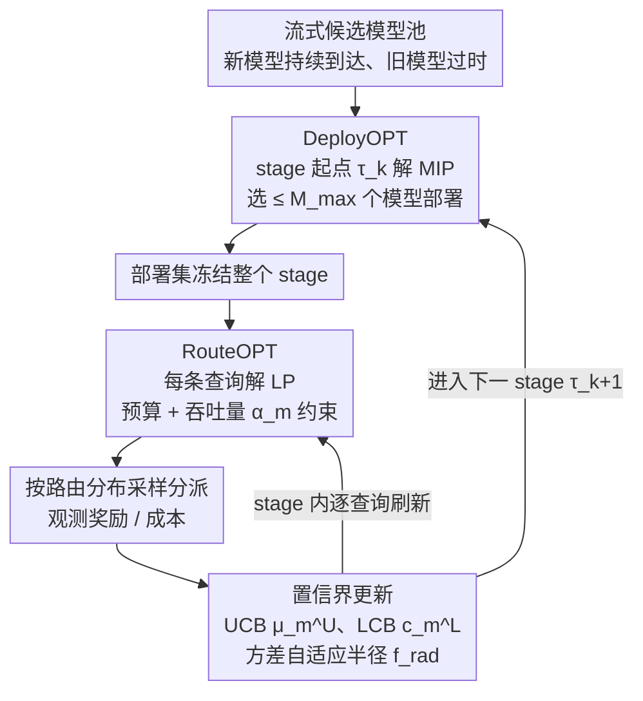

# Near-Optimal Online Deployment and Routing for Streaming LLMs

**会议**: ICLR 2026  
**arXiv**: [2506.17254](https://arxiv.org/abs/2506.17254)  
**代码**: 无  
**领域**: LLM NLP / 系统优化  
**关键词**: LLM路由, 在线部署, streaming bandits, 并发上限, 预算约束

## 一句话总结
首次形式化 LLM 流式在线部署+路由联合问题：新模型持续出现、旧模型可能过时，在并发部署上限 $M_{\max}$ 和成本预算约束下，提出 StageRoute 分层算法，证明 $\tilde{\mathcal{O}}(T^{2/3})$ 遗憾界并给出匹配下界，达到近最优。

## 研究背景与动机

**领域现状**：LLM 路由（按查询选模型）已有大量工作（RouteLLM、Hybrid-LLM、Zooter 等），但都假设模型集合固定不变。然而实际中新模型持续发布，旧模型逐渐过时——例如 Azure OpenAI 每个资源限 32 个标准部署+5 个微调部署，GPT-4.1 有 1000 RPM 和 1M TPM 的速率上限。

**两个时间尺度的决策耦合**：实际 LLM 服务面临两个根本不同时间尺度的决策：
   - **宏观（stage-wise）**：决定哪些模型保持部署（受并发上限 $M_{\max}$ 约束，整个 stage 不可更改）。这是一个**高风险决策**——激活不确定的新模型可能需要驱逐已知可靠模型一整个 stage
   - **微观（per-query）**：每个查询路由到哪个已部署模型（受预算+吞吐量约束）
   - 部署决策**决定了**路由的整个动作空间——这是此前路由工作忽略的根本前置问题

**现有方法的缺口**：静态池路由（RouteLLM）无动态部署；预算感知路由（TensorOpera）无并发上限；流式 bandits（UniRoute/CSCR）无 stage-level 承诺；BwK 建模消耗性预算但无主动集替换。没有现有框架同时处理**流式到达+动态部署+并发上限+预算+吞吐量**这五个维度

**核心idea**：将 LLM 部署和路由建模为耦合两个时间尺度的在线决策问题，提出 StageRoute——宏观用乐观估计选部署集，微观用 LP 做实时路由——达到近最优 $\tilde{\mathcal{O}}(T^{2/3})$ 遗憾界

## 方法详解

### 整体框架
StageRoute 要解决的是一个被现有路由工作忽略的前置问题：当新模型持续上线、旧模型逐渐过时，到底该把哪几个模型挂在线上、再把每条查询发给谁。它把整个时间轴 $T$ 切成 $K$ 个 stage，在两个时间尺度上分层决策。每个 stage 的起点 $\tau_k$ 先做一次"战略层"部署：把这段时间新到达的模型并入候选池，再从中挑出 $\leq M_{\max}$ 个模型部署、并冻结一整个 stage 不变——这是高风险且不可中途撤换的承诺。stage 内每条查询到达时再做"战术层"路由：在已冻结的部署集上实时解一个线性规划，得到一个分派分布并采样发送，观测到奖励/成本后立即刷新各模型的置信估计，供后续查询的路由和下一个 stage 的部署复用。部署决策决定了路由的整个动作空间，因此二者被耦合进同一个算法、而非各自为政；置信界则像一根贯穿两层的纽带，既喂给战略层的部署优化，也喂给战术层的路由优化。

### 关键设计

**1. 部署优化 DeployOPT：用乐观估计圈定一个 stage 的可用模型集**

部署是高风险决策——一旦在 stage 起点激活某个还没摸清的新模型，就可能整段时间都被它拖累，而且无法中途撤换。为此 DeployOPT 在每个更新点 $\tau_k$ 求解一个带并发上限的优化（Eq. 3）：决策向量 $d$ 给每个候选模型一个权重，约束其支撑集大小 $|\text{supp}(d)| = \min(M_{\max}, |\mathcal{M}_{\tau_k}|)$，并满足预算 $b$ 与每个模型的吞吐量上限 $\alpha_m$；目标是用性能上界 $\mu_m^U$（UCB）和成本下界 $c_m^L$（LCB）最大化"乐观"效用。最优解 $d^*$ 的非零支撑就是本 stage 的部署集 $\mathcal{D}_k(\mathcal{A}) = \{m \mid d^*_m > 0\}$。这里的乐观估计鼓励算法去试探尚未充分采样的新模型，对抗"模型发现"的探索难题。关键的是，$d^*$ **只被用来确定部署哪些模型，不直接当作路由概率**——这一步把"部署什么"和"如何路由"解耦，使得 stage 内的查询级路由仍能基于实时统计量快速适应，即便底层部署一整个 stage 固定不变。

**2. 路由优化 RouteOPT：stage 内每条查询实时解 LP 做分派**

部署集冻结后，stage 内的探索-利用全靠路由层完成。每条查询到达时，RouteOPT 在已部署模型 $\mathcal{D}_k(\mathcal{A})$ 上求解一个线性规划（Eq. 7），以 UCB 奖励 $\mu_m^U$ 和 LCB 成本 $c_m^L$ 组合出的期望奖励为目标，约束为预算（经由成本下界）和每个模型的吞吐量上限 $p_t(m) \leq \alpha_m$，解出路由分布 $p_t^*$ 后按 $m_t \sim p_t^*$ 采样分派。服务完成后观测实际奖励 $r_t$、成本 $c_t$，刷新该模型的经验均值 $\bar\mu_m$、$\bar c_m$ 与采样数 $N_m$，重算其置信界。因为它持续用最新统计量收紧估计，所以即便部署集整个 stage 不动，路由仍能逐查询逼近最优分派；吞吐量约束 $\alpha_m$ 顺带把高负载模型节流、缓解延迟尖峰。

**3. 置信界设计：用方差自适应的置信半径平衡探索与利用**

UCB/LCB 的松紧直接决定算法敢不敢上新模型，它是 DeployOPT 与 RouteOPT 共用的估计纽带。性能上界取 $\mu_m^U = \text{proj}_{[0,1]}(\bar\mu_m + 2f_{rad})$、成本下界取 $c_m^L = \text{proj}_{[c_1,c_2]}(\bar c_m - 2f_{rad})$，置信半径

$$f_{rad}(v,n) = \sqrt{\frac{\gamma v}{n}} + \frac{\gamma}{n}$$

随采样次数 $n$ 增大而收缩、随经验方差 $v$ 增大而放宽，参数取 $\gamma = \Theta(\log(NT/\delta))$ 以保证整体 $1-\delta$ 置信。投影到合法区间保证估计值不越界，方差项让采样充分的模型置信区间快速收窄，从而把宝贵的探索预算集中到真正不确定的新模型上。

**4. 遗憾界与匹配下界：把"路由学习"和"模型发现"两类代价拆开**

算法好不好，最终由遗憾界刻画。Theorem 1 给出上界 $\text{Regret} \leq \mathcal{O}(\sqrt{M_{\max}KT\log(NT/\delta)} + NT/(M_{\max}K))$：第一项是已部署集内路由的统计学习代价，第二项是结构性的模型发现瓶颈，即在 $N$ 个候选里、每次只能挂 $M_{\max}$ 个、逐 stage 发掘好新模型的难度。两项此消彼长——stage 数 $K$ 越多、并发上限 $M_{\max}$ 越大，发现越快但单 stage 的学习成本越高。平衡两项后整体收敛到近最优的 $\tilde{\mathcal{O}}(N^{1/3}T^{2/3})$。Theorem 2 进一步证明 $\Omega(T^{2/3})$ 的匹配下界，说明这个速率是问题固有难度而非算法缺陷——即便给再强的自适应和再大的在线集，系统追赶不断移动的性能前沿都有一个根本速率上限，StageRoute 已达近最优。

## 实验关键数据

### 与现有 LLM 路由框架的对比

| 方法 | 流式模型 | 动态部署($M_{\max}$限制) | 预算感知 | 吞吐量限制 |
|------|---------|----------------------|---------|----------|
| RouteLLM | ✗ | ✗ | ✓ | ✗ |
| UniRoute | ✓ | ✗ | ✓ | ✗ |
| CSCR | ✓ | ✗ | ✓ | ✗ |
| **StageRoute** | **✓** | **✓** | **✓** | **✓** |

### 仿真实验（RouterBench 真实成本/分数数据）

| 实验设置 | StageRoute vs Oracle 差距 | 说明 |
|---------|------------------------|------|
| 紧预算 $(b=0.3)$ | <5% sub-optimality | 在严格预算下仍紧跟 oracle |
| 宽预算 $(b=0.7)$ | <2% sub-optimality | 预算宽裕时几乎最优 |
| $M_{\max}$ 变化 | 性能随 $M_{\max}$ 单调提升 | 验证理论中并发上限的作用 |
| $K$ 变化 | $K=T^{1/3}$ 附近最优 | 验证理论最优 stage 数 |
| 多任务/多语言查询 | 一致有效 | 跨多样负载鲁棒 |

### 关键发现
- 两项遗憾分解清晰揭示了"路由学习"vs"模型发现"的根本权衡
- StageRoute 在紧预算下尤其优于静态部署策略——动态替换过时模型带来显著收益
- 吞吐量约束自然节流高负载模型，缓解延迟尖峰

## 亮点与洞察
- **问题形式化创新**：首次将 LLM 部署+路由建模为耦合两个时间尺度的在线决策问题，涵盖流式到达+并发上限+预算+吞吐量约束的完整实际场景
- **遗憾界的双项分解**深具洞察——统计学习代价 vs 结构发现瓶颈的权衡关系为系统设计提供指导
- **匹配下界**证实了 $\tilde{\mathcal{O}}(T^{2/3})$ 的不可改进性——这是问题本身的固有难度，非算法缺陷
- DeployOPT 的解仅用于选模型而非做路由概率，将部署与路由执行解耦——允许 stage 内的快速查询级适应

## 局限与展望
- 假设每个模型的性能分布是固定的（均值 $\mu_m$ 不变），未建模模型退化或查询分布漂移
- 路由是无上下文的（非 contextual bandit），未利用查询特征信息——加入 contextual estimator 可能进一步提升
- 吞吐量约束通过概率 $p_t(m) \leq \alpha_m$ 建模，假设瞬时负载共享，实际中可能需考虑排队延迟
- 仿真实验基于 RouterBench 的离线数据，未在真实部署环境中验证

## 相关工作与启发
- **vs RouteLLM/Hybrid-LLM**：固定模型池+无并发限制→StageRoute 处理完整动态场景
- **vs BwK (Bandits with Knapsacks)**：BwK 建模消耗性预算但无 stage-level 承诺和主动集替换
- **vs CMAB (Combinatorial MAB)**：CMAB 从固定基集选超臂而无流式到达
- **vs Streaming Bandits**：允许流式到达但不耦合 stage 部署与查询路由
- **启发**：两层决策分离（战略部署+战术路由）的架构思想可推广到其他资源受限的在线服务系统

## 评分
- 新颖性: ⭐⭐⭐⭐⭐ 首次完整形式化+近最优算法+匹配下界
- 实验充分度: ⭐⭐⭐ 仿真为主，缺乏真实部署验证
- 写作质量: ⭐⭐⭐⭐⭐ 理论推导严谨，问题动机清晰
- 价值: ⭐⭐⭐⭐ 对 LLM 服务系统设计有理论指导意义

<!-- RELATED:START -->

## 相关论文

- [\[ICML 2025\] BEST-Route: Adaptive LLM Routing with Test-Time Optimal Compute](../../ICML2025/llm_nlp/best-route_adaptive_llm_routing_with_test-time_optimal_compute.md)
- [\[ICLR 2026\] BOTS: A Unified Framework for Bayesian Online Task Selection in LLM Reinforcement Finetuning](bots_a_unified_framework_for_bayesian_online_task_selection_in_llm_reinforcement.md)
- [\[ICML 2026\] In-Context Routing (ICR): 一次训练、处处可用的 attention-level 隐式 ICL](../../ICML2026/llm_nlp/train_once_reuse_everywhere_generalizable_implicit_in-context_learning_by_routin.md)
- [\[AAAI 2026\] ICL-Router: In-Context Learned Model Representations for LLM Routing](../../AAAI2026/llm_nlp/icl-router_in-context_learned_model_representations_for_llm_routing.md)
- [\[ACL 2025\] Are Optimal Algorithms Still Optimal? Rethinking Sorting in LLM-Based Pairwise Ranking with Batching and Caching](../../ACL2025/llm_nlp/are_optimal_algorithms_still_optimal_rethinking_sorting_in_llm-based_pairwise_ra.md)

<!-- RELATED:END -->
