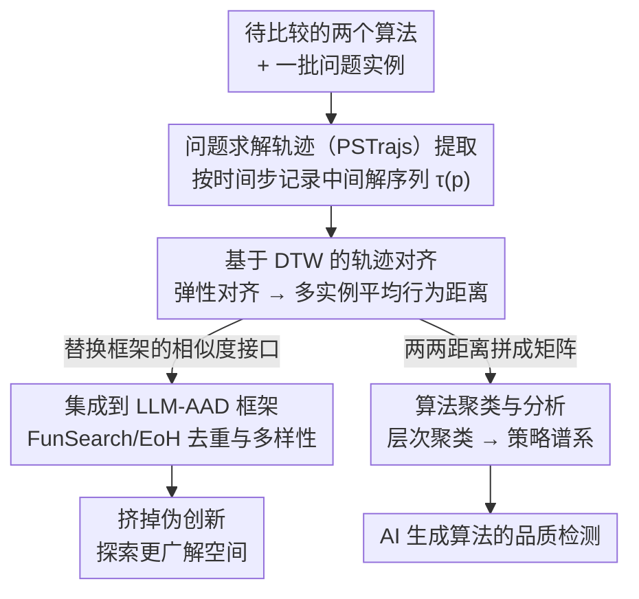

# Rethinking Code Similarity for Automated Algorithm Design with LLMs

**会议**: ICLR 2026  
**arXiv**: [2603.02787](https://arxiv.org/abs/2603.02787) ⚠️ arXiv 号与代码链接存疑，以原文为准  
**代码**: [https://github.com/RayZhhh/behavesim](https://github.com/RayZhhh/behavesim)  
**领域**: LLM / 自动算法设计 / 代码相似度  
**关键词**: LLM-AAD, 代码相似度, 行为相似度, 动态时间规整, FunSearch, EoH, 算法多样性

## 一句话总结
提出 BehaveSim，一种基于"问题求解轨迹"（PSTrajs）和动态时间规整（DTW）的算法相似度度量方法，从执行行为层面而非语法或输出层面衡量算法差异，集成到 FunSearch/EoH 等 LLM-AAD 框架后显著提升性能。

## 研究背景与动机
**领域现状**：LLM 驱动的自动算法设计（LLM-AAD）已成为算法开发的新范式——FunSearch、EoH 等框架可以自主生成专家级算法的代码实现，在 Online Bin Packing、Cap Set、TSP 等经典问题上取得了令人瞩目的成果。

**现有痛点**：在 LLM-AAD 中，算法的核心设计原理隐含在生成的代码中，而非显式的数学公式或伪代码。现有代码相似度指标（如语法树编辑距离、BLEU、代码嵌入余弦相似度）只能捕捉表面语法差异，无法判断两段代码是否实现了本质不同的算法逻辑。

**核心矛盾**：两段语法截然不同的代码可能实现了相同的算法思路（仅变量名、循环结构不同），而语法相似的代码可能蕴含完全不同的求解策略。现有度量无法区分"真正的算法创新"与"表面的代码变体"。

**关键缺口**：LLM-AAD 框架在种群维护/多样性管理中需要用相似度来去重或选择。如果相似度指标不准确，框架会保留冗余的"伪创新"算法，挤掉真正有价值的多样性，导致搜索效率下降。

**输出等价的局限**：另一类方法比较算法的最终输出（如目标函数值），但不同算法可能在相同输入上偶然得到相同输出，却在不同输入上表现迥异。输出等价无法揭示求解过程的差异。

**核心 idea**：通过记录算法在执行过程中产生的中间解序列（问题求解轨迹），用 DTW 对齐这些轨迹来度量算法间的行为相似度——关注"怎么解"而非"解了什么"。

## 方法详解

### 整体框架
BehaveSim 要解决的是一件别的代码相似度指标做不到的事：判断两段 LLM 生成的算法是不是"真的不一样"。它的做法是绕开代码文本和最终输出，转而盯着算法运行时的行为——也就是它一步步生成中间解的过程。整条 pipeline 是这样转的：先让算法在一批问题实例上跑一遍，按时间步把每一步的中间解记录成一条"问题求解轨迹"（PSTrajs）；再用动态时间规整（DTW）把两个算法的轨迹对齐、算出一个行为距离；这个行为距离有两条下游通路——既可以接进 FunSearch、EoH 这类 LLM-AAD 框架替换它们原有的去重/多样性机制，也可以拿来对一大堆 AI 生成算法做聚类分析。两个算法的轨迹越对得齐，说明它们的求解策略越接近。

### 关键设计

**1. 问题求解轨迹（PSTrajs）提取：把"算法怎么解"记成一条可比较的序列**

现有指标卡在"看不出算法逻辑"上，根源是它们看的都是静态的代码或孤立的输出。PSTrajs 换了个观测点——在算法执行过程中，按时间步记录每个中间解的状态。对算法 $A$ 在问题实例 $p$ 上的一次执行，它得到一条轨迹 $\tau_A(p) = (s_1, s_2, \ldots, s_T)$，其中 $s_t$ 是第 $t$ 步的中间解状态。轨迹的粒度由问题本身决定：对 bin packing 就是每个物品落在哪个箱子的装箱决策，对 TSP 就是路径逐步选择的下一个城市。这一点要和程序 profiling 区分开——profiling 关心的是 CPU、内存这类资源消耗，PSTrajs 记录的是解一步步演化的过程，捕捉的是算法的"思考方式"，而这正是判断两个算法是否本质相同的关键。

**2. 基于 DTW 的轨迹对齐：用弹性时间轴解决执行步数不一致**

直接逐点比两条轨迹是不行的，因为不同算法的执行步数往往对不上——贪心算法步数少、回溯算法步数多，硬对齐会把同一种策略误判成两种。DTW（Dynamic Time Warping）允许时间轴非线性拉伸，能在两条长短不一的轨迹间找到最优对齐。BehaveSim 在多个问题实例上取 DTW 距离的平均作为最终相似度：

$$\text{BehaveSim}(A_1, A_2) = \frac{1}{|P|} \sum_{p \in P} \text{DTW}(\tau_{A_1}(p), \tau_{A_2}(p))$$

其中对齐时每两个状态之间的距离 $d(s_i, s_j)$ 也按具体问题定义，比如装箱方案之间用 Jaccard 距离、路径之间用编辑距离。在多个实例上平均是为了让相似度反映稳定的行为模式，而不是被某个特定输入上的偶然一致带偏。

**3. 集成到 LLM-AAD 框架：作为即插即用的行为多样性模块**

度量本身有了，剩下的是怎么让它真正改善搜索。BehaveSim 被设计成模块化组件，只替换框架里的相似度度量接口、不动核心逻辑。在 FunSearch 的种群管理中，它替掉原有基于语法的去重/多样性机制，保证留在种群里的算法是行为层面真正不同的；在 EoH（Evolution of Heuristics）里，它指导交叉/变异操作、优先保留行为差异大的个体。两处替换的共同效果是把"伪创新"挤出去——以前那些只是换了变量名和循环写法、其实策略雷同的算法会被识别出来，腾出名额给真正不同的策略，框架因此能探索更广的解空间、不至于过早收敛到局部最优。

**4. 算法聚类与分析：给一大批 AI 生成的算法理出策略谱系**

BehaveSim 不只服务于搜索循环，它两两算出的距离还能拼成一个完整的距离矩阵，进而对 LLM 生成的大量算法做层次聚类、按行为模式分组。这样研究者就能系统地看清 LLM 到底生成了哪些类型的求解策略、哪些是真正新颖的设计。聚类结果可以画成算法策略的树状图或热力图，直观展示算法家族的多样性分布——这在 AI 生成算法数量爆炸的当下，提供了一个此前没有的"算法品质检测"视角。

## 实验关键数据

### 主实验：BehaveSim 集成后的 AAD 性能提升

| 任务 | 框架 | 原始性能 | +BehaveSim | 提升幅度 | 说明 |
|------|------|---------|-----------|---------|------|
| Online Bin Packing | FunSearch | baseline 得分 | 显著提升 | 多样性驱动 | 经典 NP-hard 问题 |
| Cap Set | FunSearch | baseline 得分 | 显著提升 | 发现更多策略 | 数学组合优化 |
| TSP (旅行商问题) | EoH | baseline 启发式 | 显著改进 | 避免策略冗余 | 路径优化 |

### BehaveSim vs 现有代码相似度指标对比

| 相似度指标 | 能区分语法变体？ | 能区分算法逻辑？ | AAD 提升？ | 说明 |
|-----------|---------------|---------------|----------|------|
| 语法树编辑距离 | ✓ | ✗ | 有限 | 只看代码结构 |
| 代码嵌入(CodeBERT等) | 部分 | ✗ | 有限 | 表示层面的语义 |
| 输出等价 | N/A | 部分 | 有限 | 忽略求解过程 |
| **BehaveSim (本文)** | ✓ | **✓** | **显著** | 捕捉执行行为 |

### 关键发现
- BehaveSim 能有效区分语法相似但算法逻辑不同的代码，也能识别语法不同但行为相同的"伪创新"。
- 在三个 AAD 任务上，集成 BehaveSim 后框架性能均显著提升，证明行为多样性是提升 LLM-AAD 效果的关键。
- 聚类分析揭示 LLM 生成的算法可按行为模式分为若干明确的策略族群，有助于理解 AI 的"算法设计思维"。

## 亮点与洞察
- **从"看代码"到"看行为"的范式转换**：BehaveSim 提出了一个优雅的洞察——衡量算法相似度应该关注算法"做了什么"而非"写了什么"。这一思路对代码理解、软件工程、程序合成等领域都有启发意义。
- **DTW 的巧妙应用**：将时间序列分析中的经典工具引入代码相似度领域，用弹性时间对齐解决不同算法执行步数不一致的问题。
- **LLM 生成算法的可分析性**：通过行为聚类，首次提供了系统化分析 AI 生成算法策略谱系的工具，这对理解 LLM 的代码生成能力和局限性有重要价值。
- **对 AAD 生态系统的基础设施贡献**：随着 LLM 生成的算法数量爆炸式增长，BehaveSim 提供了急需的"算法品质检测"工具，帮助筛选真正的创新而非冗余变体。

## 局限与展望
- **问题特定的轨迹定义**：PSTrajs 的提取需要针对每个问题定义"中间解状态"的格式，泛化到任意编程任务需要额外的工程工作。对于没有明确中间解概念的问题（如分类器设计），轨迹定义本身就是开放性问题。
- **计算开销**：DTW 的时间复杂度为 $O(T_1 \times T_2)$，对于长轨迹或大种群，成对相似度计算可能成为瓶颈。
- **轨迹粒度的选择**：记录粒度太粗会丢失行为差异，太细会引入噪声。目前粒度选择依赖问题领域知识。
- **仅验证三个任务**：虽然覆盖了组合优化的代表性问题，但对更广泛的 AAD 任务（如机器学习超参优化、程序合成、约束满足问题）的适用性尚待验证。
- **随机性算法的处理**：对于包含随机性的算法（如随机贪心、模拟退火），同一算法在不同运行中的轨迹可能差异很大，需要多次采样取统计量来稳定度量。
- **轨迹长度差异极端情况**：当两个算法的执行步数差距悬殊时（如 O(n) vs O(n²)），DTW 可能产生不可靠的对齐，需要额外的归一化策略。
- **多目标场景**：当算法同时优化多个目标时（如延迟+吞吐量），单一轨迹可能无法充分表征行为差异，需要多维轨迹的联合对齐。

## 相关工作与对比
- **vs FunSearch (Romera-Paredes et al., 2024)**：FunSearch 是 Google DeepMind 的 LLM-AAD 框架，用 LLM 进化生成算法。BehaveSim 作为即插即用的多样性模块集成到 FunSearch 中，增强了其种群多样性管理。
- **vs EoH (Liu et al., 2024)**：EoH 是另一个 LLM-AAD 框架，通过进化算法启发式设计。BehaveSim 在 EoH 中替换了原有的基于语法的去重机制。
- **vs 代码克隆检测文献**：传统代码克隆检测关注的是"这两段代码是否在做同一件事"，BehaveSim 则关注"这两段代码是否用同一种策略做事"——粒度更细，对 AAD 更有价值。
- **vs 程序等价检验**：程序等价是判断两个程序是否总产生相同输出（不可判定问题），BehaveSim 则是度量行为相似的程度，是一个更实用的近似方案。
- **vs Algorithm Selection / AutoML**：算法选择关注"哪个算法最适合给定问题"，BehaveSim 关注"这些算法有多相似"——后者为前者提供了更精细的算法空间结构化表示。
- **vs Neural Program Embedding**：Code2Vec 等方法将程序嵌入向量空间，但捕获的是静态语义。BehaveSim 的动态行为视角与之互补——可以想象将两者结合用于更全面的算法表征。

## 评分
- 新颖性: ⭐⭐⭐⭐ 从行为角度定义代码相似度是很有创意的切入点
- 实验充分度: ⭐⭐⭐⭐ 三个 AAD 任务 + 多种相似度对比 + 聚类分析
- 写作质量: ⭐⭐⭐⭐ 动机清晰，方法描述直观
- 价值: ⭐⭐⭐⭐ 对 LLM-AAD 生态系统有实用价值，DTW+轨迹的思路可迁移到其他问题

<!-- RELATED:START -->

## 相关论文

- [\[ACL 2026\] Solver-Independent Automated Problem Formulation via LLMs for High-Cost Simulation-Driven Design](../../ACL2026/llm_nlp/solver-independent_automated_problem_formulation_via_llms_for_high-cost_simulati.md)
- [\[CVPR 2025\] Rethinking Spiking Self-Attention Mechanism: Implementing a-XNOR Similarity Calculation in Spiking Transformers](../../CVPR2025/llm_nlp/rethinking_spiking_self-attention_mechanism_implementing_a-xnor_similarity_calcu.md)
- [\[ICLR 2026\] DreamOn: Diffusion Language Models For Code Infilling Beyond Fixed-size Canvas](dreamon_diffusion_language_models_for_code_infilling_beyond_fixed-size_canvas.md)
- [\[ICML 2026\] Automated Formal Proofs of Combinatorial Identities via Wilf–Zeilberger Guidance and LLMs](../../ICML2026/llm_nlp/automated_formal_proofs_of_combinatorial_identities_via_wilf-zeilberger_guidance.md)
- [\[ACL 2026\] Generative Floor Plan Design with LLMs via Reinforcement Learning with Verifiable Rewards](../../ACL2026/llm_nlp/generative_floor_plan_design_with_llms_via_reinforcement_learning_with_verifiabl.md)

<!-- RELATED:END -->
