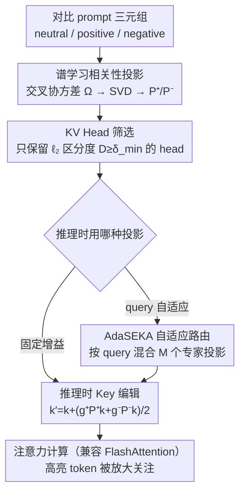

# Spectral Attention Steering for Prompt Highlighting

**会议**: ICLR2026  
**arXiv**: [2603.01281](https://arxiv.org/abs/2603.01281)  
**代码**: [waylonli/SEKA](https://github.com/waylonli/SEKA)  
**领域**: LLM评测  
**关键词**: attention steering, prompt highlighting, spectral decomposition, FlashAttention, key embedding editing  
**作者**: Weixian Waylon Li, Yuchen Niu, Yongxin Yang, Keshuang Li, Tiejun Ma, Shay B. Cohen（University of Edinburgh, RayNeo, Huawei Research, QMUL）

## 一句话总结

提出 SEKA/AdaSEKA，通过对 key embedding 进行谱分解学习"相关性子空间"，在注意力计算前直接编辑 key 向量来实现 prompt highlighting，无需存储完整注意力矩阵，与 FlashAttention 完全兼容，且开销极低（+0.03s/sample）。

## 研究背景与动机

**Prompt Highlighting 的实际需求**：在高风险场景中，需要精确引导 LLM 关注 prompt 中用户指定的关键文本（如事实冲突中的新知识、指令跟随中的核心约束），即 attention steering。

**现有方法的效率瓶颈**：PASTA 等 SOTA 方法在注意力矩阵计算完成后对其进行后处理修改（post-hoc），必须存储完整的 $T \times T$ 注意力矩阵，与 FlashAttention 等 IO-aware 高效实现不兼容。

**额外开销巨大**：PASTA 导致推理延迟增加 +1.03s/sample，内存增加 +23.12 GB；SPA 基于 logit 分布操作，不支持 batch 处理，速度最慢（+5.32s）。

**需要昂贵的 head search**：PASTA 还需要针对不同任务做 attention head 搜索来确定应该 steer 哪些 head，增加了部署成本。

**Key embedding 的结构化信号**：作者通过对比实验发现，当 prompt 中问题从不相关变为相关时，特定 layer/head 的 key embedding 呈现出一致的方向性偏移（如 PCA 可视化所示），说明"相关性"被编码在 key 表示的结构化子空间中。

**Pre-attention 干预的可行性**：注意力分数 $\text{Attn}(i,j) = \frac{\boldsymbol{q}_i^\top \boldsymbol{k}_j}{\sqrt{d_k}}$ 取决于 query-key 内积，等价的控制可通过编辑 key 端实现，且 key 按 token position 索引，天然适合控制单个 token 被关注的程度。

## 方法详解

### 整体框架

SEKA 想解决的问题是 prompt highlighting——精确放大模型对 prompt 中指定 token 的关注——同时不破坏 FlashAttention 这类 IO 高效实现。它的核心思路是"离线学谱、在线编辑"：先用合成的对比 prompt 在每个 layer/head 上谱分解出一个"相关性子空间"，把它固化成投影矩阵；同时挑出真正能区分相关性的少数 head；推理时只在这些 head 上、对要高亮的 token 把它的 key 向量沿相关性子空间方向放大。因为全程只动 key、从不显式取出 $T\times T$ 注意力矩阵做后处理，所以天然能套在 FlashAttention 上跑。基础版用一组固定增益的投影；进阶版 AdaSEKA 则离线备好多个领域专家投影，推理时按 query 动态混合，省去跨任务反复调参。

### 关键设计

**1. 谱学习相关性投影：把"相关性"提炼成一个可离线复用的子空间**

PASTA 这类方法需要针对任务在线搜哪些 head 该 steer，部署成本高；SEKA 想把这件事一次性离线学好。作者构造三类 prompt——neutral（仅上下文）、positive（上下文 + 相关问题）、negative（上下文 + 无关问题），抽取同一 token span 在三种条件下的 key embedding $\boldsymbol{h}, \boldsymbol{h}^+, \boldsymbol{h}^-$，然后用 neutral 与 positive 的交叉协方差 $\boldsymbol{\Omega}_{\ell,h}^{+} = \boldsymbol{h}^\top \boldsymbol{h}^+ / n$ 做 SVD 得到 $\boldsymbol{\Omega}_{\ell,h}^{+} = \boldsymbol{U}_{\ell,h}^{+} \boldsymbol{S}_{\ell,h}^{+} \boldsymbol{V}_{\ell,h}^{+\top}$。正投影取前 $k^+$ 个最大奇异值对应的左奇异向量（这些方向最能解释"相关"特征）、负投影取最小的 $k^-$ 个（对应与相关性最无关的方向），构成两个投影算子 $\boldsymbol{P}_{\ell,h}^{+} = \boldsymbol{U}_{:,:k^+}^{+}(\boldsymbol{U}_{:,:k^+}^{+})^\top$ 与 $\boldsymbol{P}_{\ell,h}^{-} = \boldsymbol{U}_{:,k^-:}^{-}(\boldsymbol{U}_{:,k^-:}^{-})^\top$；保留几个奇异向量由累积奇异值比例阈值 $\gamma$ 控制（$\sum_{i\le k^+} S_i^+ / \sum_i S_i^+ \ge \gamma$）。这样"哪个方向代表相关"就被固化成一个矩阵，推理时直接调用，不必再做 head search。

**2. KV Head 筛选：只在真正区分相关性的 head 上动手**

并非所有 head 都对相关性敏感，对不敏感的 head 强行投影反而会注入噪声，因此在动 key 之前要先选好作用对象。SEKA 用正/负 key embedding 的平均 $\ell_2$ 距离 $D_{\ell,h} = \frac{1}{N}\sum_i \|\boldsymbol{h}_{\ell,h,i}^+ - \boldsymbol{h}_{\ell,h,i}^-\|_2$ 衡量每个 $(\text{layer}, \text{head})$ 对的区分度——这个距离越大，说明该 head 的 key 表示对"问题相关与否"越敏感。只有 $D_{\ell,h} \ge \delta_{\min}$（$\delta_{\min}$ 在验证集上 grid search，通常落在 $[0, 0.6]$）的 head 才被施加投影。可视化显示中后层 head 区分度明显更高，这与"retrieval head 主要集中在中后层"的研究相互印证；消融也证实去掉这一步会带来灾难性退化（见实验）。

**3. 推理时 Key 编辑：在注意力之前把 key 推向相关方向**

注意力分数 $\text{Attn}(i,j) = \boldsymbol{q}_i^\top\boldsymbol{k}_j / \sqrt{d_k}$ 只取决于 query-key 内积，而 key 又恰好按 token position 索引，所以编辑某个 token 的 key 就能精确控制它被关注的程度。对每个高亮 token，SEKA 在选中的 head 上施加 $\boldsymbol{k}_j' = \boldsymbol{k}_j + (g^+ \boldsymbol{P}_{\ell,h}^+ \boldsymbol{k}_j + g^- \boldsymbol{P}_{\ell,h}^- \boldsymbol{k}_j)/2$，其中 $g^+, g^-$ 是两个独立可调的放大/抑制增益。代入注意力公式后，这等价于在原分数 $A_{ij} = \boldsymbol{q}_i^\top\boldsymbol{k}_j/\sqrt{d_k}$ 上叠加一个 key 相关的偏置 $B_{ij} = \boldsymbol{q}_i^\top(g^+\boldsymbol{P}^+\boldsymbol{k}_j + g^-\boldsymbol{P}^-\boldsymbol{k}_j)/2\sqrt{d_k}$。关键在于这个偏置是通过改 key 实现的，全程不需要把 $T\times T$ 注意力矩阵显式拿出来后处理，因此天然兼容 FlashAttention，几何上也很直观——就是把 key 沿相关性子空间拉长一点。

**4. AdaSEKA 自适应路由：让一组专家投影按 query 自动配比**

固定投影在多任务/多模型间需要反复调参，AdaSEKA 改为离线学 $M$ 个领域专家投影（论文从 4 个不同数据集各学一个），推理时按当前输入动态混合。它取 prompt 最后一个 token 的 query 向量 $\boldsymbol{q}_{\ell,h}$，用它与各专家主方向的对齐度（奇异值加权内积，再除以最大值归一化）算出路由权重

$$\alpha_{m,\ell,h}(\boldsymbol{q}) = \frac{\sum_k (\boldsymbol{q}^\top \boldsymbol{u}_m^{+(k)})\,\sigma_m^{+(k)}}{\max_{m'}\left|\sum_k (\boldsymbol{q}^\top \boldsymbol{u}_{m'}^{+(k)})\,\sigma_{m'}^{+(k)}\right|},$$

最终投影是各专家的加权组合 $\boldsymbol{P}_{\text{dynamic}} = \sum_m \alpha_m \boldsymbol{U}_m^{+}(\boldsymbol{U}_m^{+})^\top$，随后照样按 $\boldsymbol{k}_j' = \boldsymbol{k}_j + g\,\boldsymbol{P}_{\text{dynamic}}\boldsymbol{k}_j$ 编辑 key。好处有三：新领域加一个专家即插即用、不必重算已有专家；跨任务少调参；路由权重本身可解释——能看出当前 prompt 更像哪个领域。

## 实验

### 主实验：标准 Benchmark

在 CounterFact（知识冲突）、Bias in Bios（职业提取）、Pronoun Changing（代词重写指令跟随）三个任务上评测：

| 模型 | 方法 | CounterFact ES | CounterFact PS | Bias in Bios Acc | Pronoun P.Score | Pronoun A.P.Score |
|------|------|:-:|:-:|:-:|:-:|:-:|
| Qwen3-4B | Original | 45.00 | 45.64 | 79.84 | 93.14 | 90.52 |
| | PASTA | 97.16 | 96.03 | 89.58 | 95.82 | 94.64 |
| | SPA | 65.24 | 57.71 | 68.00 | 80.27 | 78.19 |
| | **SEKA** | **99.02** | **98.61** | **91.02** | 95.18 | 93.26 |
| | **AdaSEKA** | 98.90 | 98.72 | **91.86** | 94.54 | 92.08 |
| Qwen3-8B | Original | 39.04 | 39.59 | 76.08 | 98.00 | 97.84 |
| | PASTA | 92.70 | 91.68 | 86.32 | 98.86 | 98.72 |
| | **SEKA** | **99.08** | **98.96** | **88.74** | 98.56 | 98.26 |
| | **AdaSEKA** | 99.00 | 98.97 | 88.50 | **99.68** | **99.52** |
| Qwen3-14B | Original | 37.56 | 36.12 | 85.22 | 98.42 | 98.22 |
| | PASTA | 76.84 | 66.33 | 88.46 | 90.98 | 90.94 |
| | **SEKA** | **98.92** | **99.02** | 90.28 | 98.66 | 98.54 |
| | **AdaSEKA** | 99.00 | 99.15 | **91.22** | **99.88** | **99.86** |

### 效率对比

| 方法 | 延迟 (s/sample) | 峰值内存 (GB, B=10) | 峰值内存 (GB, B=1) |
|------|:-:|:-:|:-:|
| Original | 0.55 | 27.63 | 16.72 |
| PASTA | 1.58 (+1.03) | 50.75 (+23.12) | - |
| SPA | 5.87 (+5.32) | - | 17.71 (+0.99) |
| **SEKA** | **0.58 (+0.03)** | **27.66 (+0.03)** | **16.75 (+0.03)** |
| AdaSEKA | 0.82 (+0.27) | 43.22 (+15.59) | 18.23 (+1.51) |

SEKA 几乎零开销，PASTA 内存翻倍、延迟翻三倍。

### 消融实验

| 配置 | CounterFact ES (Qwen3-4B) | Bias in Bios Acc | Pronoun A.P.Score |
|------|:-:|:-:|:-:|
| SEKA (完整) | **99.02** | **91.02** | **93.26** |
| w/o learn (随机投影 + head 筛选) | 94.96 | 86.62 | 88.66 |
| w/o learn & filt (随机投影 + 无筛选) | 86.12 | 71.76 | **36.95** |

关键发现：

- 去掉谱学习用随机投影 → 性能明显下降，证明学到的相关性子空间具有实质意义
- 同时去掉 head 筛选 → 灾难性下降（Pronoun 从 90.52 降到 36.95），比不做任何 steering 还差，说明对不敏感的 head 做投影会引入严重干扰

### Lost-in-the-Middle 实验

- **SEKA 对中间段落做 highlighting 可反转 U-shape 性能曲线**：中间位置的 exact match 显著提升
- 对所有段落统一做 highlighting 反而可能加剧 lost-in-the-middle 效应
- 通过调节 $\delta_{\min}$ 控制被 steer 的 head 数量，可以实现 U-shape 曲线的平坦化
- PASTA 在此任务上不如 baseline，说明 post-hoc 方法在长上下文场景的局限性

## 亮点

1. **与 FlashAttention 完全兼容**：这是同类方法中首个做到的，通过 pre-attention key editing 绕开了必须存储注意力矩阵的限制
2. **几乎零开销**：SEKA 仅增加 0.03s/sample 延迟和 0.03 GB 内存，相比 PASTA +1.03s/+23.12 GB 优势极大
3. **几何可解释性强**：$\boldsymbol{k}' = \boldsymbol{k} + g \boldsymbol{P} \boldsymbol{k}$ 的投影变换具有清晰的几何含义——将 key 向相关性子空间方向放大
4. **Training-free**：不需要任何微调，仅依赖少量合成对比 prompt 做离线谱分解
5. **AdaSEKA 的自适应路由机制**减少了跨任务/跨模型的超参调节需求，4 个专家即插即用
6. **Lost-in-the-Middle 的 U-shape 反转**是一个有趣的新发现，展示了 attention steering 对位置敏感性的精准控制能力

## 局限与展望

1. **离线阶段依赖合成数据质量**：对比 prompt triplet 的构建策略会影响学到的投影质量，泛化到新领域需要重新构建
2. **超参数仍需调节**：虽然 AdaSEKA 减少了部分调参，但 $g^+, g^-, \gamma, \delta_{\min}$ 仍需 grid search，且不同模型/任务的最优值不同
3. **仅限 prompt highlighting 场景**：方法聚焦于"让模型关注指定 token"，不涵盖更广泛的 activation steering 目标（如风格控制、安全性）
4. **Lost-in-the-Middle 实验中 highlighting 范围粗糙**：位置 5-25 是人工指定的，实际应用中需要知道哪些段落是 gold passage
5. **AdaSEKA 内存开销非忽略**：batch=10 时 +15.59 GB，主要来自存储多专家的 SVD 分量

## 与相关工作的对比

- **vs PASTA**（Zhang et al., 2024）：PASTA 后处理注意力矩阵，不兼容 FlashAttention，延迟/内存代价高；SEKA 在精度上全面超越且开销可忽略
- **vs SPA**（Tian & Zhang, 2025）：SPA 操作 logit 分布，不支持 batch，速度最慢；在 CounterFact 上远不如 SEKA
- **vs Activation Steering**（SEA, RepE 等）：activation steering 修改 MLP 层的隐状态来控制语义属性，而 SEKA 控制注意力机制决定模型看哪里，二者正交互补
- **与 Retrieval Head 研究的呼应**：Wu et al., 2025; Qiu et al., 2025 发现 retrieval head 集中在中后层，SEKA 的 head 筛选策略与此一致

## 评分

- ⭐ 新颖性: 8/10 — 从 key embedding 端做 pre-attention steering 是新颖且有实际意义的 idea，谱分解 + 自适应路由设计精巧
- ⭐ 实验充分度: 8/10 — 覆盖 5 个模型 × 3 个标准 benchmark + lost-in-the-middle + 消融 + 效率分析，较为全面
- ⭐ 写作质量: 8/10 — 逻辑清晰，可视化（PCA、heatmap）直观，公式推导完整
- ⭐ 综合价值: 8/10 — 解决了 attention steering 与 FlashAttention 不兼容的实际痛点，方法简洁高效，工程落地友好

<!-- RELATED:START -->

## 相关论文

- [\[NeurIPS 2025\] Spectral Conditioning of Attention Improves Transformer Performance](../../NeurIPS2025/llm_nlp/spectral_conditioning_of_attention_improves_transformer_performance.md)
- [\[ICLR 2026\] Statistical Advantage of Softmax Attention: Insights from Single-Location Regression](statistical_advantage_of_softmax_attention_insights_from_single-location_regress.md)
- [\[ICLR 2026\] Fine-Grained Activation Steering: Steering Less, Achieving More](fine-grained_activation_steering_steering_less_achieving_more.md)
- [\[ACL 2025\] Beyond Prompt Engineering: Robust Behavior Control in LLMs via Steering Target Atoms](../../ACL2025/llm_nlp/beyond_prompt_engineering_robust_behavior_control_in_llms_via_steering_target_at.md)
- [\[ACL 2025\] OPTS: Bandit-Based Prompt Design Strategy Selection Improves Prompt Optimizers](../../ACL2025/llm_nlp/bandit-based_prompt_design_strategy_selection_improves_prompt_optimizers.md)

<!-- RELATED:END -->
