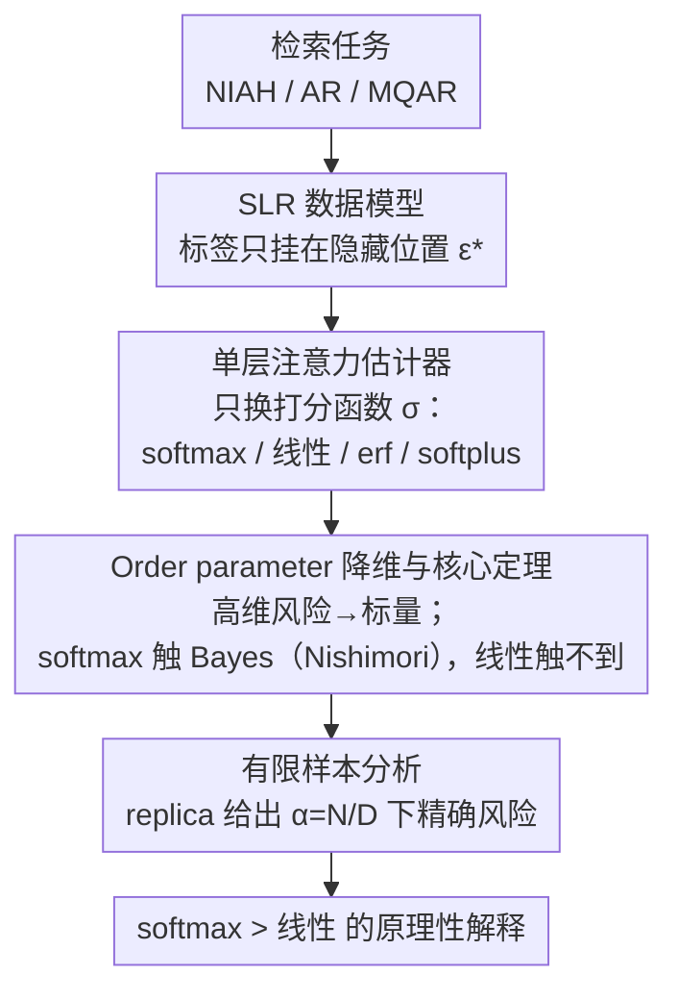

# Statistical Advantage of Softmax Attention: Insights from Single-Location Regression

**会议**: ICLR2026  
**arXiv**: [2509.21936](https://arxiv.org/abs/2509.21936)  
**代码**: 已提供（论文附带复现代码）  
**领域**: LLM/NLP  
**关键词**: softmax attention, linear attention, 信息检索, 统计物理, 高维分析, Bayes最优, 单位置回归  

## 一句话总结

通过提出"单位置回归"(Single-Location Regression, SLR) 理论框架，结合统计物理中的 order parameter 方法，在高维极限下严格证明了 softmax attention 在种群层面达到 Bayes 风险而线性 attention 本质上无法做到，并在有限样本情形下证实 softmax 始终优于线性 attention，为 softmax 在检索任务中的优势提供了首个原理性解释。

---

## 研究背景与动机

**Softmax 的实践主导地位**：当前大语言模型（LLM）的核心是 Transformer 架构中的 softmax attention，但 softmax 的二次复杂度促使大量替代方案出现（线性 attention、核化 attention、SSM 等）。

**替代方案在检索任务上的短板**：Shen et al. (2024) 的大规模实验显示，核化 attention 和 SSM（如 HGRN2）在语言能力基准上与 softmax 相当，但在检索任务（如 Needle-in-a-Haystack）上系统性地落后于 softmax attention。

**理论理解的空白**：现有理论工作多聚焦于更容易分析的线性 attention（如 in-context learning 的梯度下降解释），对 softmax 本身的优势缺乏原理性解释。为什么 softmax 的**指数非线性**和**归一化**如此关键？

**线性 attention 被过度研究**：大量理论文献（Ahn et al., 2023; von Oswald et al., 2023; Bai et al., 2023 等）以线性 attention 作为分析对象，隐含假设其可以近似 softmax 的行为，但这一假设在检索场景下并不成立。

**检索任务的形式化需求**：Needle-in-a-Haystack、Associative Recall (AR)、Multi-Query AR (MQAR) 等经典任务缺乏统一的数学框架来支撑理论分析。

**弥合表达力与统计/计算优势的鸿沟**：已有工作（Arora et al., 2024）从表达力角度解释 SSM 的不足，但本文进一步深入到**统计**层面（有限样本）和**计算**层面（SGD 收敛性），提供更完整的图景。

---

## 方法详解

### 整体框架

本文要回答一个长期悬而未决的问题：为什么 softmax attention 在检索任务上稳稳压过线性 attention？作者的做法是把检索任务抽象成一个可以严格分析的统计模型——"单位置回归"(Single-Location Regression, SLR)：序列 $X \in \mathbb{R}^{L \times D}$ 的标签 $y$ 只由某个隐藏位置 $\epsilon^*$ 上的 token 决定，模型必须先沿键方向 $k^*$ 把这个位置"捞"出来、再沿值方向 $v^*$ 读出它的信息。有了这个模型，作者把各种 attention 统一写成"只换打分函数 $\sigma$"的单层估计器，于是 softmax、线性、erf、softplus 能放在同一框架里逐一比较；再借统计物理的 order parameter，在 $D \to \infty$ 的高维极限下把高维风险压成几个标量的函数，从而严格证明谁能触到 Bayes 最优；最后用 replica method 把分析从"无穷样本的逼近能力"推进到"有限样本 $\alpha = N/D$ 的统计效率"。整条链路环环相扣：**建模 → 统一估计器 → 降维与定理 → 有限样本**，最终给出 softmax 优势的原理性解释。

### 关键设计

**1. SLR 数据模型：把"大海捞针"写成可分析的回归**

检索任务（NIAH、AR、MQAR）此前缺一个能撑起理论推导的统一形式，作者用单位置依赖来抓住其本质——标签

$$y = \frac{1}{\sqrt{D}} X_{\epsilon^*} v^* + \Delta \xi$$

只挂在一个隐藏位置 $\epsilon^*$ 上（$\xi$ 为高斯噪声，$\Delta$ 控噪声强度）。位置信息通过加权高斯分布 $P(x \mid L, \epsilon^*, k^*) = g_\nu(\epsilon^*, \chi^*) \prod_\ell \mathcal{N}(x_\ell; 0, I_D)$ 注入，其中 $\chi = \tfrac{1}{\sqrt{D}}Xk^*$ 是 token 在键方向上的投影。权重函数 $g_\nu$ 有两种实例化：**Spiked-SLR** 取 $g_\nu=e^{\sqrt{\nu}\chi_\epsilon-\frac12\nu}$，让相关 token 在 $k^*$ 方向有一个均值 spike；**Max-SLR** 取 $g_\nu=L\,e^{\nu\chi_\epsilon}/\sum_\ell e^{\nu\chi_\ell}$，让相关 token 是与 $k^*$ 内积最大的那个。$\nu$ 是信号强度，越大相关位置越突出。这两种变体分别覆盖了"偏移检索"和"argmax 检索"两类典型机制，让后面所有结论都建立在一个干净、可推导、又抓住检索本质的玩具模型上。

**2. 单层注意力估计器：用打分函数解耦 softmax 的两种能力**

要搞清 softmax 到底强在哪，关键是别把它当黑箱，而是把它的"指数非线性"和"全局归一化"两种能力拆开单独归因。作者把估计器统一写成

$$f_{\sigma, k, v}(X) = \sigma(\chi)^\top z, \quad \chi = \frac{1}{\sqrt{D}} X k, \quad z = \frac{1}{\sqrt{D}} X v,$$

只换打分函数 $\sigma$ 就能对比四种 attention：Softmax $\sigma(\chi)_\ell=e^{\chi_\ell}/\sum_{\ell'}e^{\chi_{\ell'}}$ 同时具备指数非线性和全局归一化；Linear $\sigma(\chi)_\ell=1+\chi_\ell$ 是它在原点的线性化（两者都没有）；Element-wise erf $\sigma(\chi)_\ell=1+\text{erf}(c+\chi_\ell)$ 有非线性但缺归一化；Softplus 核化 $\sigma(\chi)_\ell=\text{softplus}(\chi_\ell)/\sum_{\ell'}\text{softplus}(\chi_{\ell'})$ 有归一化但增长慢于指数。这样一组"两两差一个属性"的对照，能把后面观察到的性能差距精确归因到底是缺了哪个属性，而不是笼统地说"softmax 就是更好"。

**3. Order parameter 降维与核心定理：把高维风险压成标量，证明 softmax 触到 Bayes 下界**

直接分析高维向量 $k,v$ 不可行，作者借统计物理在 $D \to \infty$ 下用 7 个 order parameter 完全刻画种群风险：恢复参数 $m_{kk^*}=\tfrac1D k^\top k^*$、$m_{vv^*}=\tfrac1D v^\top v^*$ 衡量对隐藏方向 $k^*,v^*$ 的还原程度，范数参数 $q_{kk}=\tfrac1D k^\top k$、$q_{vv}=\tfrac1D v^\top v$ 控制尺度，剩下 $m_{kv^*},m_{vk^*},q_{vk}$ 是交叉项；在流形 $\mathcal{M}=\{(k,v): m_{kv^*}=m_{vk^*}=q_{vk}=0\}$ 上交叉项为零，风险进一步收成 4 个标量的函数，高维优化问题就变得可处理。降维之后两条核心定理随之而来。Proposition 4.2 表明：只要权重函数满足 $g_\nu(\epsilon,\chi)/g_\nu(\epsilon',\chi)=e^{c_\nu(\chi_\epsilon-\chi_{\epsilon'})}$（spiked 和 max 两种 SLR 都满足），softmax 就能在 $k=c_\nu k^*,\,v=v^*$ 处取到 Bayes 风险 $\min_{f}\mathcal{E}(y,f_{k,v}(X))=\mathcal{E}_{\text{Bayes}}$——这恰好对应统计物理里的 **Nishimori 条件**，正是 softmax 的指数形式与贝叶斯后验形式相容的结构性原因。Corollary 4.3 进一步量化差距：spiked-SLR 中当 $\nu\to\infty$，线性 attention 的误差只以多项式速率 $\mathsf{E}_{\text{lin}}\sim\frac{L}{L-1}\cdot\frac1\nu$ 衰减，softmax 却以指数速率 $\mathsf{E}_{\text{softmax}}=e^{-c_L\nu+o(\nu)}$ 衰减；max-SLR 中当 $L\to\infty$，线性 attention 的误差趋向 1（退化成平凡预测器），softmax 仍为 0。这说明线性 attention 不是"常数倍变差"，而是本质上够不到最优。

**4. 有限样本分析：replica method 给出 $\alpha=N/D$ 下的精确风险**

种群层面的结论假设样本无穷，但实际更关心样本有限时谁更好——这正是逼近能力之外的"统计效率"问题。作者在 $N,D\to\infty$ 且比例 $\alpha=N/D=\Theta(1)$ 的高维极限下用 replica method 推导，把经验风险最小化(ERM)的测试风险收敛到一个由自洽方程决定的确定性量 $\mathsf{E}_\sigma(\alpha)$，需迭代求解 6 个 order parameter。这把分析从"无穷样本的逼近能力"推进到"有限样本的统计效率"，给出可与数值优化直接对照的预测曲线，也让后面 Figure 3 中理论实线与实际优化点能严丝合缝地比对。

---

## 实验关键数据

### 主实验：种群风险比较 (Figure 2)

| 激活函数 | Spiked-SLR ($L=2$, $\nu=5$) | Max-SLR ($L=2$, $\nu \to \infty$) | Max-SLR ($L \sim \text{Unif}\{1,2,3\}$) |
|:---|:---|:---|:---|
| **Softmax** | $= \mathcal{E}_{\text{Bayes}}$ ✅ | $= 0$ ✅ | $= \mathcal{E}_{\text{Bayes}}$ ✅ |
| **Softplus 核化** | 接近 Bayes | $> 0$，有间距 | 不受变长影响 |
| **Element-wise erf** | 介于 linear 和 softmax 之间 | $> 0$，有间距 | **受变长严重影响** |
| **Linear** | 远离 Bayes | $\to 1$（$L \to \infty$） | **受变长严重影响** |

**关键发现**：只有 softmax 在所有设置下达到 Bayes 风险；归一化（softplus 核化）帮助处理变长序列；但指数增长不够快的核函数（softplus vs. exp）在大 $L$ 时差距会拉大。

### 有限样本实验：测试风险 vs. 样本复杂度 (Figure 3)

| 任务 | 信号强度 $\nu$ | $L$ | Softmax ($\alpha=20$) | Linear ($\alpha=20$) | Bayes-optimal ($\alpha=20$) |
|:---|:---|:---|:---|:---|:---|
| Spiked-SLR | $\nu=1$ | 3 | $\approx 0.35$ | $\approx 0.55$ | $\approx 0.30$ |
| Spiked-SLR | $\nu=2$ | 3 | $\approx 0.15$ | $\approx 0.40$ | $\approx 0.10$ |
| Max-SLR | $\nu \to \infty$ | 3 | $\approx 0.20$ | $\approx 0.55$ | $\approx 0.15$ |

**关键发现**：

1. **Softmax 始终优于 Linear**：在所有测试的超参数组合下，softmax 的测试风险均低于线性 attention。
2. **与 Bayes-optimal 的距离**：softmax 在有限样本下不再是 Bayes-optimal，但随着 $\alpha$ 增大差距快速缩小。
3. **理论预测与实验吻合**：replica method 的预测（实线）与准 Newton 方法的实际优化结果（标记点，$\sqrt{ND} = 10^4$）高度一致，验证了理论框架的准确性。

### 消融分析

**变长序列的影响**（Corollary 4.4）：

| 设置 | Linear Attention | Softmax Attention |
|:---|:---|:---|
| $L = 2$（定长） | 基准性能 | $= \mathcal{E}_{\text{Bayes}}$ |
| $L \sim \text{Unif}\{1,2,3\}$（变长） | **性能显著下降** | $= \mathcal{E}_{\text{Bayes}}$（不受影响） |

**信号强度 $\nu$ 的影响**：

- Linear attention 的误差以 $O(1/\nu)$ 多项式速率下降
- Softmax attention 的误差以 $e^{-c_L \nu}$ 指数速率下降
- 差距随 $\nu$ 增大而**指数级扩大**

**不同激活函数的消融**（Figure 2 汇总）：

- **指数非线性**是必需的：softplus 核化虽有归一化但增长不够快，在大 $L$ 时仍有差距
- **全局归一化**也是必需的：element-wise erf 虽有非线性但不做归一化，变长序列时性能严重退化
- 两者缺一不可：softmax 之所以最优，正因为它**兼具指数增长和全局归一化**

---

## 亮点

1. **理论优雅**：将检索任务形式化为 SLR 模型，巧妙地将复杂的 softmax 分析通过 order parameter 降维为低维问题，实现了对 softmax 的首次可处理的理论分析。

2. **多层次论证**：从种群风险（approximation）→ 有限样本风险（statistical）→ 优化可行性（computational）三个层面系统地论证 softmax 的优势，层次清晰递进。

3. **Nishimori 条件的发现**：揭示 softmax 达到 Bayes 风险背后的机制——softmax 的数学形式恰好满足统计物理中的 Nishimori 条件，这是一个深刻的结构性洞察。

4. **分离两个关键属性**：通过对比四种激活函数，清晰地解耦了"指数非线性"和"全局归一化"各自的贡献，为理解 softmax 提供了可操作的指导。

5. **有限样本理论**：不仅讨论了 $N \to \infty$ 的极限，还通过 replica method 给出了有限 $\alpha = N/D$ 下的精确刻画，更贴近实际。

---

## 局限与展望

1. **模型简化程度高**：SLR 模型只考虑单 token 依赖、单头 attention、无 query 向量、无多层堆叠，与实际 Transformer 差距较大。

2. **高斯数据假设**：所有 token 服从高斯分布，实际语言数据的分布远非高斯，结论的迁移性需要验证。

3. **流形假设未严格证明**：虽然数值实验支持 $\mathcal{M}$ 上的分析有效，但严格证明 SGD 收敛到流形上的极小值仍是开放问题。

4. **Replica method 非严格**：有限样本分析基于非严格的 replica 方法，虽然在相关模型中已有严格化的先例（Vilucchio et al., 2025），但尚未完成。

5. **缺乏实际语言任务验证**：所有实验都在合成数据上进行，没有在真实 NLP 任务（如 NIAH、AR）上验证理论预测。

6. **序列长度有限**：实验中 $L$ 较小（$L=2, 3$），是否在 $L$ 很大时（如数千 token）结论仍然成立需要进一步研究。

---

## 与相关工作的对比

| 工作 | 关注点 | 与本文的区别 |
|:---|:---|:---|
| Marion et al. (2025) | 固定序列长度的 SLR | 本文推广到变长序列，引入通用 $g_\nu$ 权重 |
| Arora et al. (2024) | SSM 在 MQAR 上的表达力不足 | 本文从表达力深入到统计和计算层面 |
| Shen et al. (2024) | 实验观察 softmax 在检索上的优势 | 本文提供理论解释 |
| Cui (2025); Troiani et al. (2025) | 序列多索引模型的一般理论 | 本文聚焦 SLR 特例，给出具体洞察 |
| Dohmatob (2025) | 大信号强度下的 softmax 分析 | 并行工作，关注不同参数区间 |
| Dragutinović et al. (2025) | 上下文分类中 softmax > linear | 并行工作，不同任务和证明技术 |
| Barnfield et al. (2026) | 稀疏 token 分类的高维分析 | 并行工作，分析 SGD 逐步训练 |

---

## 评分

- **新颖性**: ⭐⭐⭐⭐⭐ — 首次从统计物理角度严格建立 softmax attention 在检索任务上的优势理论，Nishimori 条件的联系尤为新颖
- **实验充分度**: ⭐⭐⭐⭐ — 合成实验与理论预测高度吻合，但缺少真实语言任务的验证
- **写作质量**: ⭐⭐⭐⭐⭐ — 论证层次从种群到有限样本再到计算递进清晰，数学严谨与直觉解释并重
- **价值**: ⭐⭐⭐⭐ — 为理解 Transformer 架构选择提供了坚实的理论基础，但简化假设限制了直接实用性

<!-- RELATED:START -->

## 相关论文

- [\[ICLR 2026\] Spectral Attention Steering for Prompt Highlighting](spectral_attention_steering_for_prompt_highlighting.md)
- [\[ICML 2025\] Binary Hypothesis Testing for Softmax Models and Leverage Score Models](../../ICML2025/llm_nlp/binary_hypothesis_testing_for_softmax_models_and_leverage_score_models.md)
- [\[ACL 2025\] Mitigate Position Bias in LLMs via Scaling a Single Hidden States Channel](../../ACL2025/llm_nlp/mitigate_position_bias_in_large_language_models_via_scaling_a_single_dimension.md)
- [\[ECCV 2024\] Reprojection Errors as Prompts for Efficient Scene Coordinate Regression](../../ECCV2024/llm_nlp/reprojection_errors_as_prompts_for_efficient_scene_coordinate_regression.md)
- [\[ACL 2025\] Unintended Harms of Value-Aligned LLMs: Psychological and Empirical Insights](../../ACL2025/llm_nlp/unintended_harms_of_value-aligned_llms_psychological_and_empirical_insights.md)

<!-- RELATED:END -->
