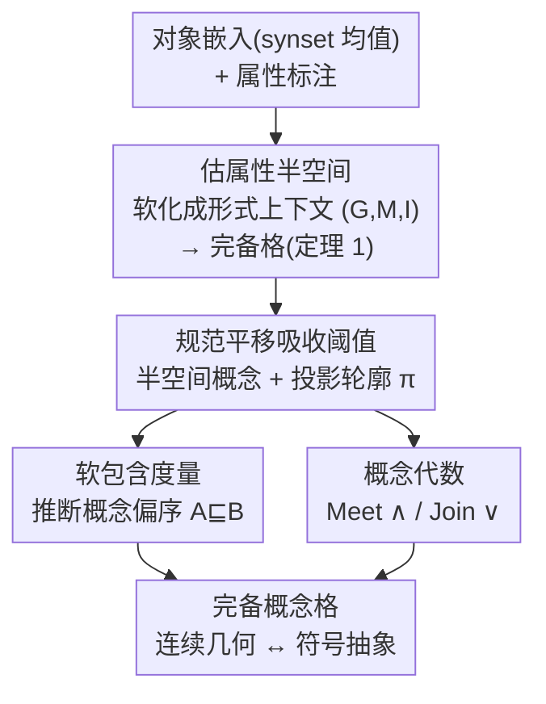

# The Lattice Representation Hypothesis of Large Language Models

**会议**: ICLR2026  
**arXiv**: [2603.01227](https://arxiv.org/abs/2603.01227)  
**作者**: Bo Xiong (Stanford University)  
**领域**: LLM/NLP (表示学习 / 可解释性)  
**关键词**: 线性表示假说, 形式概念分析, 概念格, 半空间模型, 嵌入几何, 符号推理  

## 一句话总结

提出 LLM 的**格表示假说 (Lattice Representation Hypothesis)**：通过将线性表示假说与形式概念分析 (FCA) 统一，证明 LLM 嵌入空间中的属性方向通过半空间交集隐式编码了一个**概念格 (concept lattice)**，从而实现了连续几何与符号抽象之间的桥接。

---

## 研究背景与动机

**LLM 的概念知识之谜**：LLM 在概念知识捕获和逻辑推理方面表现出色，但这些符号化的概念层次结构如何编码在连续的嵌入几何空间中，仍然缺乏系统性的理论解释。

**线性表示假说的局限**：现有的线性表示假说 (LRH) 指出语义特征以线性方向编码在嵌入空间中，但主要关注二元概念的线性可分性，对于**组合语义**（如概念包含、交集、并集）缺乏解释力。

**外延视角的不足**：Park et al. (2025) 将概念建模为 token 集合（外延视角），如 $Y(\text{animal}) = \{\text{predator}, \text{bird}, \text{dog}, \ldots\}$，但忽略了概念的**内涵性质**（定义概念的属性和关系），难以解释集合论语义如概念归约、交集和并集。

**形式概念分析 (FCA) 的启示**：FCA 通过对象-属性的二元关系定义概念，每个概念是一个 (外延, 内涵) 对，这种对偶视角自然诱导出一个概念格结构。

**AI 安全与可控性需求**：理解 LLM 的隐藏几何结构对于可靠地控制和引导模型推理行为至关重要，是推进 AI 安全的基础步骤。

**理论统一的空白**：线性表示假说与符号 AI 中的形式概念分析之间缺乏系统性的理论桥梁，本文填补了这一空白。

---

## 方法详解

### 整体框架

本文要回答的问题是：LLM 把概念的层次结构（谁是谁的下位、两个概念怎么交怎么并）藏在了连续嵌入几何的哪里？它的回答是一条从嵌入到概念格的构造管线。先把每个属性 $m$ 看成嵌入空间里的一道线性分界——属性方向 $\bar{\ell}_m$ 加阈值 $\tau_m$ 划出一个半空间，对象嵌入 $\mathbf{v}_g$ 落在哪一侧就决定它有没有这条属性；属性方向和阈值由带标注的对象集合统计估出，再软化成可微的关联关系，从而读出一份 FCA 的形式上下文 $(G, M, I)$。接着用一次全局平移把所有阈值吸收掉，让半空间都过原点，于是"一个概念"就落成"若干半空间的交集"这块几何区域，并附带一个连续的投影轮廓当它的"指纹"。最后在轮廓上定义软包含度量（推断概念偏序）和概念代数 Meet/Join（做交并组合），整条管线在外延包含序下恢复出一个**完备的概念格**，把连续几何与符号抽象接到了一起。

### 关键设计

**1. 估属性半空间，软化成形式上下文：把统计估出的线性分界读成可微的"对象-属性"关联**

要从嵌入里读出 FCA 的形式上下文，第一步得拿到每条属性的几何分界。属性方向用正则化 Fisher 判别分析估计，$\bar{\ell}_m := (\Sigma_+ + \Sigma_- + \lambda I)^{-1}(\bm{\mu}_+ - \bm{\mu}_-)$，协方差用 Ledoit-Wolf 收缩稳定求逆；阈值取正负对象投影均值的中点 $\tau_m := \frac{1}{2}(\mathbb{E}_{g \in G_+}[\text{Proj}_m(\mathbf{v}_g)] + \mathbb{E}_{g \in G_-}[\text{Proj}_m(\mathbf{v}_g)])$；对象嵌入取 WordNet 同义词集（synset）的平均嵌入，以压低单词级的词汇噪声。拿到方向和阈值后，理想情况下用硬判据 $\mathbf{v}_g \cdot \bar{\ell}_m \geq \tau_m$ 就能定下对象 $g$ 有没有属性 $m$，但这种硬判定不可微、对噪声敏感，于是本文把关联软化为

$$P_\alpha(m(g) = 1) := \sigma\!\left(\alpha \cdot (\mathbf{v}_g \cdot \bar{\ell}_m - \tau_m)\right),$$

其中 $\sigma$ 是 sigmoid，$\alpha > 0$ 控制分界面的锐度，$\alpha \to \infty$ 时退化回硬阈值。给定置信水平 $\delta$ 把概率截断成二元关联 $I_\delta := \{(\mathbf{v}_g, \bar{\ell}_m) \mid P_\alpha(m(g) = 1) \geq \delta\}$，就得到一份确定的形式上下文 $(G, M, I_\delta)$。这步为什么关键：定理 1 保证由此诱导出的形式概念集 $\mathcal{F}_\delta$ 满足 Galois 连接的闭包性质，并在外延包含序下构成一个**完备格**——这正是"格表示假说"成立的几何地基，后面所有概念操作都建在这块地基上。

**2. 规范平移与半空间概念：用一次全局平移把阈值清零，让符号概念落成过原点的几何区域**

不同属性各有自己的阈值 $\tau_m$，分界面散落在空间各处，做交集和代数运算很别扭。命题 1 给出一个清场办法：把属性方向按行排成矩阵 $D$、阈值排成向量 $\bm{\tau}$，若存在一点 $\mathbf{c} \in \mathbb{R}^d$ 满足 $D\mathbf{c} = \bm{\tau}$（属性方向线性无关时成立），那么对所有嵌入平移 $\mathbf{v}_g \mapsto \mathbf{v}_g - \mathbf{c}$ 就能把阈值整体消掉，且不改变诱导的格：$\sigma(\alpha(\mathbf{v}_g \cdot \mathbf{d}_i - \tau_i)) = \sigma(\alpha((\mathbf{v}_g - \mathbf{c}) \cdot \mathbf{d}_i))$。平移后每个属性都对应一个**过原点的半空间**，于是一个由属性集 $Y \subseteq M$ 定义的概念就是这些半空间的交集

$$\mathcal{R}(Y) := \{\mathbf{v} \in \mathbb{R}^d \mid \mathbf{v} \cdot \mathbf{d}_m \geq 0,\ \forall m \in Y\},$$

几何上是一个凸的多面锥——这就是概念的外延区域。为了同时刻画概念的内涵、并把硬区域软化以容忍噪声，本文给每个概念 $C$ 再配一个投影轮廓 $\pi_C(m) := \frac{1}{n} \sum_{i=1}^{n} \mathbf{v}_i \cdot \mathbf{d}_m$，即概念内所有对象嵌入在属性方向 $m$ 上投影的均值，可看作离散 FCA 内涵的连续推广；所有轮廓向量经 $\ell_2$ 归一化以保证不同概念可比。轮廓把"概念满足哪些属性、满足到什么程度"压成一个稠密向量，是后面包含度量和概念代数的统一计算基底。

**3. 软包含度量：不查 ground-truth 层次，直接从投影轮廓判断谁是谁的下位**

有了轮廓，判断概念归约 $A \sqsubseteq B$（$A$ 是 $B$ 的特例）就不必查真实层次，而是看 $A$ 的轮廓有没有满足 $B$ 所强调的那些属性：

$$\text{Inclusion}(A \sqsubseteq B) = \frac{\sum_{m \in M} \phi(\pi_B(m)) \cdot \sigma(\pi_A(m))}{\sum_{m \in M} \phi(\pi_B(m))},\quad \phi(x) = \log(1 + e^x).$$

这里用 softplus $\phi$ 给 $B$ 中越显著的属性越大的权重，使弱表达或未激活的属性被平滑下调；再用 $\sigma(\pi_A(m))$ 把 $A$ 在该属性上的投影读作"$A$ 满足此属性的软似然"。于是包含被建模成一个连续、几何驱动的轮廓兼容度，而非严格的集合包含——好处是整个度量只依赖嵌入算出的轮廓，可以在完全不访问真实层次结构的前提下推断偏序关系。

**4. 概念代数：把 Meet 与 Join 直接定义在嵌入区域上，让组合推理变成几何运算**

概念组合也落到半空间模型里直接算。交 Meet 是同时满足两者全部属性的更窄区域 $A \wedge B := \mathcal{R}(Y_A \cup Y_B)$（几何上即两组半空间的交集）；并 Join 是同时覆盖两者的最小区域 $A \vee B := \mathcal{R}(Y_A) \cup \mathcal{R}(Y_B)$，可用两者属性方向张成的凸锥（conic hull）近似。落到连续轮廓上，则用模糊逻辑的 t-norm / co-norm 实现 $\pi_{A \wedge B}(m) = \min\{\pi_A(m), \pi_B(m)\}$、$\pi_{A \vee B}(m) = \max\{\pi_A(m), \pi_B(m)\}$，软等价则把包含度量做调和平均对称化得到。这样概念组合推理（如 dog∨wolf 取上位、horse∧zebra 取精化交集）就成了可直接在嵌入上执行的代数运算，符号抽象因此从连续几何里自然涌现，无需显式的符号系统介入。

---

## 实验

### 实验设置

- **数据集**：基于 WordNet 层次结构构建 5 个领域数据集（WN-Animal, WN-Plant, WN-Food, WN-Event, WN-Cognition），前三个为物理领域、后两个为抽象领域
- **属性标注**：使用 GPT-4o 生成属性模式并标注二元属性矩阵作为 ground truth
- **模型**：LLaMA3.1-8B, Gemma-7B, Mistral-7B
- **基线**：Random、Mean（质心嵌入）

### 主实验表 1：形式上下文恢复（半空间模型验证）

| 模型 | 方法 | WN-Animal F1 | WN-Plant F1 | WN-Food F1 | WN-Event F1 | WN-Cognition F1 |
|------|------|:---:|:---:|:---:|:---:|:---:|
| LLaMA3.1-8B | Random | 45.3 | 47.3 | 46.4 | 48.6 | 50.1 |
| LLaMA3.1-8B | Mean | 63.7 | 63.3 | 68.1 | 63.9 | 68.4 |
| LLaMA3.1-8B | **Linear** | **82.5** | **82.4** | **80.1** | **71.5** | **75.0** |
| Gemma-7B | Random | 45.3 | 47.3 | 46.3 | 47.8 | 50.1 |
| Gemma-7B | Mean | 50.1 | 51.3 | 51.2 | 52.2 | 56.3 |
| Gemma-7B | **Linear** | **83.2** | **83.2** | **80.0** | **71.4** | **75.4** |
| Mistral-7B | Random | 45.0 | 47.5 | 45.5 | 49.0 | 49.3 |
| Mistral-7B | Mean | 62.0 | 61.4 | 62.1 | 56.5 | 63.3 |
| Mistral-7B | **Linear** | **81.8** | **81.7** | **78.2** | **69.7** | **74.1** |

**发现**：Linear 方法在所有模型和领域上均显著优于基线，物理领域 F1 > 78%，抽象领域 > 69%，验证了半空间模型的有效性。

### 主实验表 2：偏序推理（格几何验证）

| 模型 | 方法 | WN-Animal F1 | WN-Plant F1 | WN-Food F1 | WN-Event F1 | WN-Cognition F1 |
|------|------|:---:|:---:|:---:|:---:|:---:|
| LLaMA3.1-8B | Random | 47.3 | 47.6 | 33.3 | 50.2 | 49.8 |
| LLaMA3.1-8B | Mean | 66.7 | 63.8 | 55.7 | 59.1 | 56.8 |
| LLaMA3.1-8B | **Linear** | **77.1** | **70.4** | **75.4** | **68.3** | **69.6** |
| Gemma-7B | Random | 50.6 | 49.5 | 39.1 | 49.9 | 49.5 |
| Gemma-7B | Mean | 63.4 | 60.9 | 50.6 | 55.6 | 53.4 |
| Gemma-7B | **Linear** | **75.1** | **71.4** | **75.6** | **65.6** | **66.4** |
| Mistral-7B | Random | 49.3 | 48.2 | 33.3 | 49.2 | 48.8 |
| Mistral-7B | Mean | 64.9 | 60.5 | 54.8 | 55.0 | 52.6 |
| Mistral-7B | **Linear** | **72.1** | **57.1** | **62.0** | **61.8** | **61.1** |

**发现**：基于投影轮廓的软包含度量可直接从嵌入几何推断概念归约关系，无需访问 ground-truth 层次结构。

### 消融与补充分析

- **概念代数定性验证 (Table 3)**：Join 操作可靠返回上位概念（如 dog∨wolf → predator/canine/mammal），Meet 操作产生精化交集（如 horse∧zebra → pony/stallion/foal），与 WordNet 上下位关系一致。
- **物理 vs. 抽象领域**：物理领域（Animal, Plant, Food）一致优于抽象领域（Event, Cognition），原因是物理概念基于具象的感知属性，而抽象概念依赖更复杂的情境属性。
- **模型规模效应 (LLaMA-3, 3B→70B)**：规模增大对物理领域提升有限（小模型已较好编码感知属性），但在抽象领域提升显著，说明大模型分配了更多容量给抽象概念结构。
- **属性相关性分析**：PCA 可视化显示属性方向自然组织成语义簇（如"吃草"与"吃植物"接近，"水中游"与"海中生活"聚集），验证了属性方向的语义连贯性。

---

## 亮点

1. **理论统一优雅**：首次正式将线性表示假说与形式概念分析通过半空间交集统一，提供了理解 LLM 概念编码的全新数学框架。
2. **从连续到符号的桥梁**：证明了符号化的概念格结构可以从连续嵌入几何中自然涌现，无需显式的符号系统介入。
3. **概念代数的可操作性**：定义了直接在嵌入空间上运作的 Meet/Join 操作，使得概念组合推理成为可能。
4. **实验设计全面**：从半空间验证→偏序推理→概念代数三个层面递进验证理论假说，定量与定性结合。
5. **对 AI 安全的潜在价值**：理解概念的几何编码有助于可靠地控制和引导 LLM 的推理行为。

---

## 局限性

1. **属性标注依赖 GPT-4o**：ground-truth 形式上下文由 GPT-4o 生成，可能引入标注偏差，严格意义上并非真正的 ground truth。
2. **仅在 WordNet 子层次上验证**：实验局限于 WordNet 的 5 个领域，未在更大规模或更多样的知识体系上验证。
3. **抽象领域性能仍有差距**：Event 和 Cognition 领域的 F1 显著低于物理领域，说明对非感知概念的建模仍需改进。
4. **单层嵌入**：仅使用最后一层隐藏状态，未探索不同层的格结构差异。
5. **线性假设的强约束**：要求属性方向线性可分，对高度纠缠或上下文依赖的属性可能不成立。
6. **缺乏下游任务验证**：未展示格表示假说对实际推理任务（如自然语言推理、知识图谱补全）的实用价值。

---

## 相关工作

- **LLM 中的概念知识探测**：通过二元探针或层次聚类验证 LM 捕获了 WordNet 等本体中的概念知识 (Wu et al., 2023; Lin & Ng, 2022)，但未解释*如何*编码。
- **线性表示假说**：从 Word2Vec (Mikolov et al., 2013) 到现代 LLM，语义特征以线性方向编码 (Park et al., 2024a/b; Gurnee & Tegmark, 2024)；本文在此基础上扩展到格结构。
- **因果内积统一**：Park et al. (2024a) 通过因果内积统一上下文嵌入和 token 反嵌入空间，本文在此统一空间上构建格几何。
- **多面体涌现**：Elhage et al. (2022) 在玩具模型中观察到多面体结构的涌现，暗示超越单一方向的更丰富几何。
- **FCA 与语言模型**：Xiong & Staab (2025) 首次将 FCA 与语言模型关联，但仅限于掩码语言模型，本文扩展到自回归 LLM。

---

## 评分

- **新颖性**: ⭐⭐⭐⭐⭐ — 首次将线性表示假说与 FCA 统一，提出格表示假说，理论视角极为新颖
- **实验充分度**: ⭐⭐⭐⭐ — 三层递进验证，多模型多领域对比，但属性标注的可靠性和实验规模仍可加强
- **写作质量**: ⭐⭐⭐⭐⭐ — 数学形式化严谨，概念清晰，图示直观
- **价值**: ⭐⭐⭐⭐ — 为理解 LLM 表示提供了深刻的理论框架，但缺乏下游任务验证限制了即时实用价值

<!-- RELATED:START -->

## 相关论文

- [\[ICML 2026\] The Cylindrical Representation Hypothesis for Language Model Steering](../../ICML2026/llm_nlp/the_cylindrical_representation_hypothesis_for_language_model_steering.md)
- [\[ACL 2025\] Leveraging Large Language Models to Measure Gender Representation Bias in Gendered Language Corpora](../../ACL2025/llm_nlp/leveraging_large_language_models_to_measure_gender_representation_bias_in_gender.md)
- [\[ACL 2025\] Representation Bending for Large Language Model Safety](../../ACL2025/llm_nlp/repbend_representation_bending_safety.md)
- [\[ACL 2025\] SR-LLM: Rethinking the Structured Representation in Large Language Model](../../ACL2025/llm_nlp/sr-llm_rethinking_the_structured_representation_in_large_language_model.md)
- [\[ICLR 2026\] PT2-LLM: Post-Training Ternarization for Large Language Models](pt2-llm_post-training_ternarization_for_large_language_models.md)

<!-- RELATED:END -->
