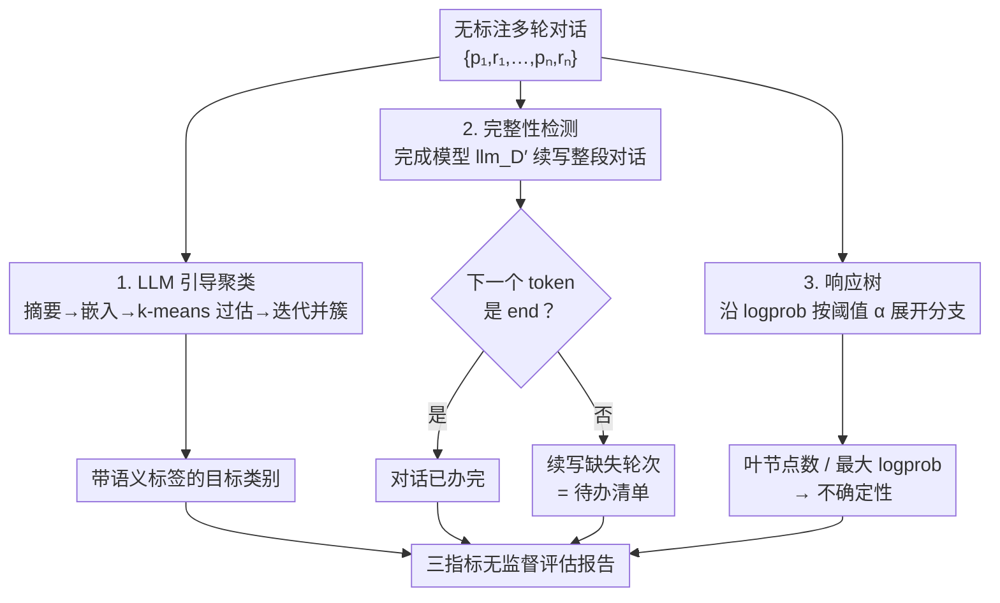

# Unsupervised Evaluation of Multi-Turn Objective-Driven Interactions

**会议**: ICLR2026  
**arXiv**: [2511.03047](https://arxiv.org/abs/2511.03047)  
**代码**: 未公开（论文提及最终版将发布）  
**领域**: LLM/NLP  
**关键词**: Unsupervised Evaluation, Multi-Turn Dialogue, Goal Completion, LLM Uncertainty, Response Tree, LLM-Guided Clustering  
**作者**: Emi Soroka, Tanmay Chopra, Krish Desai, Sanjay Lall（Stanford & Emissary Technologies）

## 一句话总结

提出三种**无监督**指标——LLM 引导聚类（目标识别）、基于微调完成模型的交互完整性检测、响应树（LLM 不确定性量化）——用于评估多轮目标驱动对话，无需标注数据或 LLM-as-a-judge，仅用 8B 模型即可匹配/超越 70B judge 的性能。

## 研究背景与动机

**企业 LLM 系统评估困难**：任务导向对话、AI agent、客服系统等目标驱动交互日益普及，但评估手段严重落后——数据复杂且无标注，人工标注不可扩展。

**LLM-as-a-judge 不可靠**：已知存在位置偏差、冗余偏差、熟悉偏差、输出不一致性和 prompt 措辞敏感性等问题。

**分布漂移问题**：目标驱动系统引入推理、工具调用、多 agent 交互、共享环境操作等，偏离 LLM 预训练的基础对话分布，使评估更困难。

**现有指标局限**：ROUGE/BLEU 需参考答案，perplexity 信息有限，自定义指标只能监控已知错误类型。

**核心目标**：设计**零标注**、**零参考答案**的评估指标，能自动发现用户目标、检测交互完整性、量化 LLM 不确定性。

## 方法详解

### 整体框架

本文不训练一个统一的评估器，而是把"多轮目标驱动对话好不好"拆成三个互补问题，各自配一个无监督指标：用户想干什么（目标识别）、对话有没有把事办完（完整性检测）、模型回复有多大把握（不确定性量化）。同一批无标注对话 $\{p_1, r_1, \dots, p_n, r_n\}$ 同时喂进这三条独立支路——LLM 引导聚类把对话长成带语义标签的目标类别、完成模型判断对话该不该收尾、响应树沿 logprob 展开估不确定性，最后汇成一份评估报告。三者都不需要人工标注、参考答案或更大的 LLM judge，最大只用到 8B 规模的开源模型加 LLM 嵌入。

### 关键设计

**1. LLM 引导聚类：从无标注对话里自动长出带语义标签的目标类别**

要回答"用户想干什么"，纯 k-means 能聚类却给不出可读标签、还得预先知道簇数，纯 LLM 标注又容易把所有样本塌缩成一个笼统类别（实验里 GPT-4.1 在 WebShop 上就退化成单一的"Online Shopping and Purchase"，且打乱数据顺序结果就变）。本文把两者缝起来：先对每个对话 $c_i$ 让 LLM 写一句自由文本目标摘要 $s_i$，用 text-embedding-3-small 嵌成 $v_i \in \mathbb{R}^{1536}$，对这些向量跑 k-means 得到 $k_1$ 个初始簇（$k_1$ 故意取偏大的过估值，宁可先碎再合）。随后每个簇抽 10 正 10 负样本让 LLM 生成簇描述 $L_i$ 并嵌入为 $d_i$，迭代阶段反复算描述间余弦相似度 $D_{ij} = \frac{d_i^\top d_j}{\|d_i\|_2 \|d_j\|_2}$，每次挑最相似的一对、再给 LLM 各 10 个正负样本判断是否真该合并，合并后重写描述、并把该行列置 $-\infty$，直到连续 $|L|$ 次都被拒绝才停。这样 k-means 提供稳定的几何骨架，LLM 只在"要不要并这两簇"这一处做语义判断，输出的是既稳定又可解释的目标分类。

**2. 完整性检测：用微调出的"完成分布"判断对话该不该结束**

要回答"事办完了没"，核心是教模型学会一条对话什么时候算到头了。给定完成对话的分布 $D$，构造一个新分布 $D'$，把每条已完成对话的最后回复后面接上一个 `end` 标签，于是"对话 $c$ 已完成"的概率就可以写成模型在拼接序列后输出 `end` 的概率：

$$P_{D'}(\texttt{end} \mid c) = P\big(\text{llm}_{D'}(\text{concat}(p_1, r_1, \dots, p_n, r_n)) = \texttt{end}\big)$$

对完整对话 $c$ 与只取前 $k<n$ 轮的截断对话 $c'$，期望模型给出 $P_{D'}(\texttt{end} \mid c) > P_{D'}(\texttt{end} \mid c')$，即越接近真正办完越倾向于收尾。落地分两档：对接近预训练分布的基础对话（如 LMSYS）直接拿 LLaMA3.1-8B-Instruct 加一段短 prompt 就够；对偏离基础分布的专用领域（保险核保、代码调试等）则用 LoRA 微调 LLaMA3.2-8B 完成模型来逼近 $D'$，输入 $\text{concat}(p_1, r_1, \dots, p_n)$、目标是 $r_n$ 加 `end` 标签，训练用 8-bit AdamW、学习率 0.0002、weight decay 0.01、跑 3 个 epoch、只用 50% 数据（另一半留作测试）。`end` 标签是这套设计的命门——Insurance 上去掉它，F1 会从 0.91 掉到 0.72。一个额外的好处是：遇到没办完的对话，模型不会吐 `end`，而是顺着生成后续轮次 $p_{n+1}, r_{n+1}, \dots$，这些续写恰好把"还差哪些事没做"具体描述出来，等于免费给出一份待办清单。

**3. 响应树：不靠反复高温采样就量化回复的不确定性**

要回答"模型有多大把握"，semantic entropy 这类方法要对同一 prompt 采样很多次才能估不确定性，成本高。响应树改成沿着 logprob 展开一棵分支树，逼近条件分布 $P_D(\mathbf{r} \mid \mathbf{p} = p)$：给定 prompt $p$ 和阈值概率 $\alpha$，$\text{rtree}_{D,\alpha}(p)$ 收集所有遍历概率不低于 $\alpha$ 的分支。构建时先生成一条回复及其每步 top-$k$ logprobs，凡是非首选候选 token 的遍历概率超过 $\alpha$ 就为它单独拉一条分支，递归展开直到没有候选超过 $\alpha$ 或触及算力上限。读这棵树有两个量：叶节点越多说明高概率的可选回复越多、不确定性越高，而一个 prompt 若只有一个正确答案、却分出多条彼此发散的回复，就提示模型很可能答错；最大 logprob 越高则说明模型对最优回复越有信心。两个量与对话长度的相关性都很弱（$r$ 落在 $-0.25$ 到 $0.41$），说明响应树捕到的不是"对话长所以难"这种表层信号，而是更内在的不确定性结构。

## 实验关键数据

### 数据集

| 数据集 | 规模 | 主题 | 目标驱动 | 工具使用 |
|--------|------|------|:--------:|:--------:|
| LMSYS-Chat-1M | 1000 | 非结构化对话 | ✗ | ✗ |
| Code-Feedback | 1000 | 代码生成调试 | ✓ | ✗ |
| Insurance | 380 | 保险核保 | ✓ | ✓ |
| WebShop | 351 | 网购交互 | ✓ | ✓ |
| SQL+OS+KB | 1043 | SQL/终端/知识库 | ✓ | ✓ |

### 完整性检测结果

| 数据集（评估器） | Accuracy | Precision | Recall | F1 |
|------------------|----------|-----------|--------|-----|
| LMSYS（70B judge） | 0.43 | 0.77 | 0.25 | 0.38 |
| **LMSYS（8B completion）** | **0.74** | **0.79** | **0.85** | **0.82** |
| Code-Feedback（70B judge） | 0.53 | 0.53 | 0.46 | 0.49 |
| Code-Feedback（FT 8B） | 0.47 | 0.71 | 0.12 | 0.21 |
| Insurance（70B judge） | 0.95 | 1.0 | 0.91 | 0.95 |
| **Insurance（FT 8B）** | **0.91** | **0.94** | **0.87** | **0.91** |
| WebShop（70B judge） | 0.92 | 1.0 | 0.83 | 0.91 |
| **WebShop（FT 8B）** | **0.92** | **0.89** | **1.0** | **0.94** |
| SQL+OS+KB（70B judge） | 0.97 | 0.96 | 0.97 | 0.96 |
| **SQL+OS+KB（FT 8B）** | **0.98** | **0.99** | **0.98** | **0.99** |

**关键发现**：
- 8B 微调模型在多数数据集上**匹配或超越 70B LLM judge**
- `end` 标签是关键设计（Insurance 无 end tag 时 F1 从 0.91 降至 0.72）
- Code-Feedback 难度最高（对话结构松散，随时可续）

### 响应树统计

| 指标 | LMSYS | Code-Feedback | Insurance | WebShop | KB+OS+SQL |
|------|-------|---------------|-----------|---------|-----------|
| Max logprob vs 长度 | -0.11 | -0.19 | -0.25 | 0.16 | 0.41 |
| Max logprob vs 叶节点数 | -0.49 | -0.46 | -0.10 | -0.19 | -0.06 |

- KB+OS+SQL 不确定性最高（工具调用、SQL、终端交互偏离基础分布最大）
- LMSYS 和 Code-Feedback 置信度最高（更接近预训练分布）

### 聚类稳定性
- LMSYS、WebShop、SQL+OS+KB 跨运行产生**高度稳定聚类**
- Code-Feedback 和 Insurance 稳定性稍低（可多维度标注：语言 vs 任务类型）
- 对比 GPT-4.1 纯 LLM 标注基线：LLM-only 方法在 WebShop 上退化为单一聚类"Online Shopping and Purchase"

## 亮点

1. **三指标体系互补完整**：目标识别（what）+ 完成检测（whether）+ 不确定性量化（how confident），覆盖评估核心维度
2. **零标注零参考**：真正的无监督，不依赖 ground truth 或 LLM judge
3. **小模型大效果**：8B 微调模型匹配/超越 70B judge，适合在线部署和实时监控
4. **响应树创新**：比 semantic entropy（需多次高温采样）更结构化、信息更丰富
5. **分布适应性**：通过 LoRA 微调适应不同领域的 token 分布

## 局限与展望

1. **聚类算法依赖初始 $k_1$ 设定**，限制了可发现的最大聚类数
2. **完整性检测对松散结构对话效果不佳**（如 Code-Feedback，第一轮即可回答后续为追问）
3. **未做多标签分类**（一个对话可能涉及多个目标）
4. **响应树缺乏 ground truth 验证**（无法直接证明高不确定性 = 错误）
5. **微调数据量有限**（Insurance 仅 190 样本训练，性能波动较大）
6. **仅在合成/公开数据上验证**，未在真实企业系统中部署测试

## 与相关工作的对比

| 方法 | 需要标注 | 需要参考答案 | 需要 LLM judge | 模型规模 | 支持多轮 |
|------|:--------:|:----------:|:--------------:|:--------:|:--------:|
| ROUGE/BLEU | ✗ | ✓ | ✗ | — | ✗ |
| BERTScore | ✗ | ✓ | ✗ | ~110M | ✗ |
| HelpSteer | ✓ | ✗ | ✗ | — | ✓ |
| G-EVAL | ✗ | ✗ | ✓ | >70B | ✓ |
| DeepEval | ✗ | ✗ | ✓ | >70B | ✓ |
| **本文** | **✗** | **✗** | **✗** | **8B** | **✓** |

## 启发与关联

- **在线干预潜力**：完整性检测可用于提前终止无效对话节省 token；不确定性量化可触发人工介入
- **响应树 + 采样策略**：若知道 LLM 的采样策略，可通过响应树给出输出概率的统计保证
- **与 conformal prediction 互补**：本文聚焦无监督场景，conformal 方法提供有监督保证，二者可结合
- **LoRA 微调作为分布适配器**：通用范式——用小数据 LoRA 微调让 8B 模型适配特定领域的 token 分布

## 评分
- 新颖性: ⭐⭐⭐⭐ — 三个指标各有创新，LLM 引导聚类和响应树是新颖贡献
- 实验充分度: ⭐⭐⭐⭐ — 6 个数据集、多个消融，但响应树缺乏直接效果验证
- 写作质量: ⭐⭐⭐⭐ — 问题定义清晰，形式化严谨，附录详尽
- 综合价值: ⭐⭐⭐⭐ — 填补了多轮目标驱动对话无监督评估的空白，实用性强

<!-- RELATED:START -->

## 相关论文

- [\[ICLR 2026\] LLEMA: Evolutionary Search with LLMs for Multi-Objective Materials Discovery](llema_evolutionary_search_with_llms_for_multi-objective_material_design.md)
- [\[AAAI 2026\] Quantifying Conversational Reliability of Large Language Models under Multi-Turn Interaction](../../AAAI2026/llm_nlp/quantifying_conversational_reliability_of_large_language_models_under_multi-turn.md)
- [\[ICML 2026\] T$^2$PO: Uncertainty-Guided Exploration Control for Stable Multi-Turn Agentic Reinforcement Learning](../../ICML2026/llm_nlp/t2po_uncertainty-guided_exploration_control_for_stable_multi-turn_agentic_reinfo.md)
- [\[ACL 2025\] Gradient-Adaptive Policy Optimization: Towards Multi-Objective Alignment of Large Language Models](../../ACL2025/llm_nlp/gapo_multi_objective_alignment.md)
- [\[NeurIPS 2025\] PluralisticBehaviorSuite: Stress-Testing Multi-Turn Adherence to Custom Behavioral Policies](../../NeurIPS2025/llm_nlp/pluralistic_behavior_suite_stress-testing_multi-turn_adherence_to_custom_behavio.md)

<!-- RELATED:END -->
