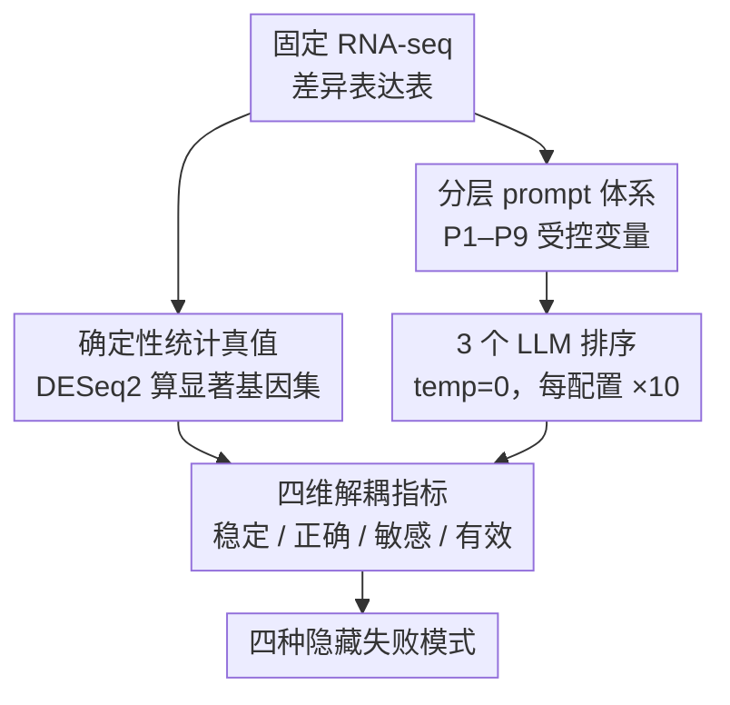

# When Stability Fails: Hidden Failure Modes of LLMs in Data-Constrained Scientific Decision-Making

**会议**: ICLR 2026  
**arXiv**: [2603.15840](https://arxiv.org/abs/2603.15840)  
**代码**: [https://github.com/NaziaRiasat/llm-prompt-sensitivity](https://github.com/NaziaRiasat/llm-prompt-sensitivity)  
**领域**: LLM/NLP  
**关键词**: LLM可靠性, 稳定性与正确性, prompt敏感性, 科学决策, 基因优先级排序

## 一句话总结

通过控制性行为评估框架，揭示 LLM 在数据约束的科学决策任务中的四种隐藏失败模式：高稳定性≠正确性、prompt 措辞敏感性、放宽阈值下的过度选择、以及幻觉产生无效标识符。

## 研究背景与动机

LLM 正被越来越多地用作科学工作流中的决策支持工具，包括数据解读、假设生成、候选基因优先级排序等。在这些场景中，研究者常常将 LLM 输出的**运行间稳定性（stability）**作为可靠性的指标——如果模型多次查询返回一致结果，就倾向于信任其输出。

然而，**稳定性并不等同于正确性**。这一直觉在非结构化任务中容易被忽视，但在统计分析驱动的科学任务中可以被精确量化。本文的核心问题是：

> 当存在可靠的统计参考真值时，LLM 输出的高稳定性是否意味着高正确性？

作者选择差异表达基因分析作为测试平台——DESeq2 提供确定性的统计参考答案，允许精确对比 LLM 输出与统计真值的吻合程度。

## 方法详解

### 整体框架

本文不训练任何模型，而是搭一台"控制性行为评估"的台子，专门把 LLM 在科学决策里"靠不靠谱"这件含糊的事拆开看。做法是：拿一份固定的 RNA-seq 差异表达表当输入，一路交给 DESeq2 算出确定性的统计真值（哪些基因显著有客观答案），另一路用一组受控的 prompt（P1–P9）喂给三个 LLM，让它们在同一张表上做基因优先级排序；模型用确定性解码、每个配置重复跑 10 次。最后把模型输出沿四个互相独立的维度——稳定性、正确性、prompt 敏感性、输出有效性——逐一对照真值打分。因为输入和解码都钉死、只系统性地拨动 prompt 的阈值与措辞，就能精确看出"模型到底在响应什么"，进而把平时被一句"它挺稳定的"掩盖掉的失败模式一一逼出来。

### 关键设计

**1. 确定性统计真值：让"正确性"第一次有把客观的尺**

评估正确性的前提是先有一把谁都改不动的尺，而非结构化任务里这把尺往往不存在，正确与否只能靠人主观判断。本文把这件事钉死：用 DESeq2 对一份固定的 RNA-seq 差异表达表（含 gene、log2FoldChange、padj 等列）做确定性统计分析，算出的显著基因集就是真值——FDR≤0.05 时命中 0 个基因，0.05<FDR≤0.10 区间有 35 个，0.05<FDR≤0.15 的边界区间有 127 个。模型在这张表上做基因优先级排序，输出可以逐一和这把统计尺数值比对，于是"对不对"从主观印象变成可量化的吻合度。这正是该框架区别于一般 LLM benchmark 的地方：后者通常没有这种确定性参考，只能比相对好坏。

**2. 分层 prompt 体系：用受控变量逐一逼出失败模式**

有了真值，还需要一组探针去触发不同的崩坏方式，否则只能笼统说"模型有时不行"。本文把 prompt 设计成一组单变量受控的 P1–P9：P1 用严格阈值（FDR≤0.05）、P5 放宽到 0.05<FDR≤0.10、P6 要求在 127 个边界基因里选 Top-20、P9 显式输出排序并检查有效性，逐步把模型推向统计上的不确定区；P7a/P7b 则是一对语义相同、只在"强调统计显著性"与"强调效应量"上措辞微调的变体，专门用来单独分离 prompt 敏感性。每改一个 prompt 只动一处，配合固定输入与确定性解码（三个模型 ChatGPT/GPT-5.2、Gemini 3、Claude Opus 4.5 全用 temperature=0，每配置重复 10 次），就能把"放宽阈值下的过度选择""措辞引发的决策漂移""幻觉出无效标识符"等失败模式一一定位到具体 prompt 上，而不是混成一团。

**3. 四维解耦：把混在一起的"可靠性"拆成可单测的指标**

模型输出回来后，本文坚持沿四个互相独立的维度分别打分，而不是揉成一个"靠谱"印象——这正是框架的核心创新。稳定性指多次运行间的输出一致性，用 Jaccard 相似度 $J(A,B)=|A\cap B|/|A\cup B|$ 衡量；正确性指与上面统计真值的一致性，同样用 Jaccard；prompt 敏感性指 P7a/P7b 这类语义等价但措辞不同的 prompt 之间的输出差异，因两次返回的基因集大小可能不等，除 Jaccard 外还报告 overlap coefficient（Szymkiewicz–Simpson 系数）$O(A,B)=|A\cap B|/\min(|A|,|B|)$ 以捕捉"一个集合基本被另一个包含"的情形；输出有效性指模型给出的基因标识符是否真实存在于输入表中。正因为四者分开测，才可能观察到"稳定性满分（Jaccard=1.00）而正确性为零"这种平时被一句"它很稳定"掩盖掉的解耦现象。

## 实验关键数据

### 主实验

三个 LLM 在不同 prompt 体系下的行为对比：

| Prompt | 任务类型 | 指标 | ChatGPT | Gemini | Claude | 解读 |
|--------|---------|------|---------|--------|--------|------|
| P1 (FDR≤0.05) | 阈值筛选 | Jaccard vs 真值 | 1.00 | 1.00 | 0.00 | Claude 完全失败 |
| P5 (FDR≤0.10) | 放宽阈值 | Jaccard vs 真值 | 0.47 | 0.28 | 0.00 | 各模型普遍退化 |
| P6 (边界排序) | 不确定性排序 | Jaccard vs 真值 | 0.14 | 1.00 | 0.00 | 仅 Gemini 恢复真值 |
| P6 (稳定性) | 内部一致性 | Pairwise Jaccard | 1.00 | 1.00 | 1.00 | **所有模型完美稳定** |
| P7a vs P7b | Prompt 敏感性 | Jaccard | 0.74 | 0.08 | 1.00 | Gemini 对措辞极度敏感 |
| P9 (排序验证) | 输出有效性 | 无效基因/次 | 0 | 0 | 20 | Claude 系统性幻觉 |

这是全文最关键的发现：**P6 行的稳定性全部为 1.00（完美稳定），但正确性分别为 0.14、1.00、0.00** —— 稳定和正确被彻底解耦。

### 消融实验

Prompt 措辞敏感性的量化分析（P7a vs P7b，仅措辞微调，语义相同）：

| 模型 | Jaccard (P7a vs P7b) | Overlap Coefficient | 解读 |
|------|---------------------|---------------------|------|
| ChatGPT | 0.74 | 0.85 | 中度敏感 |
| Gemini | 0.08 | 0.15 | **极度敏感** |
| Claude | 1.00 | 1.00 | 不敏感（但输出无效） |

Gemini 的 Jaccard 仅为 0.08，意味着两个语义几乎相同的 prompt 产生了几乎完全不重叠的基因选择——微小的措辞差异导致了截然不同的决策结果。

### 关键发现

1. **稳定性≠正确性**：这是最核心的发现。所有模型都能在重复运行中展现近乎完美的稳定性，但与统计真值的一致性可能为零
2. **放宽阈值触发过度选择**：从 FDR≤0.05 到 FDR≤0.10 时，模型倾向于过度包含而非改善精度，表现为"宽泛纳入"或"完全崩溃"
3. **Claude 的系统性幻觉**：在排序任务中每次运行产生 20 个不存在于输入表中的基因标识符，且这些幻觉在多次运行中持续出现（不是随机的）
4. **Prompt 作为隐式决策变量**：措辞变化不仅是"表面噪声"，而是会改变模型对任务目标的解读，相当于 prompt 本身成了一个被忽视的实验变量

## 亮点与洞察

- **极其简洁但深刻的发现**：用一个精心控制的实验就揭示了 LLM 在科学场景中的多重失败模式，比复杂的 benchmark 更有说服力
- **四维评估框架**的抽象非常有价值：稳定性、正确性、敏感性、有效性——这四个维度在以往的 LLM 评估中经常被混为一谈
- "**稳定性是正确性的必要非充分条件**"这一结论对所有使用 LLM 做科学决策的研究者都是重要警示
- 实验设计的精妙之处：选择差异表达分析作为测试平台，因为它有确定性的统计参考答案，完美适合量化评估

## 局限与展望

1. **单一数据集**：仅使用一个 RNA-seq 数据集（GSE239514），泛化性有待验证
2. **单一统计范式**：仅使用 DESeq2，未探索其他统计方法作为参考
3. **任务范围窄**：仅评估基因优先级排序，论文的跨领域推广需要更多证据支持
4. 评估了 3 个模型，但缺少开源模型（Llama、Mistral 等）的对比
5. 未分析根因——为什么某些模型会系统性地偏离统计真值？这需要更深层的机制分析

## 相关工作与启发

- **Singhal et al., 2023**：LLM 在临床推理中的应用，本文揭示的问题对临床场景的影响更大
- **Li et al., 2024**：LLM 幻觉的系统分析，本文发现的基因标识符幻觉是其在科学场景的具体表现
- **Zhu et al., 2023**：prompt 敏感性的文档化，本文在控制条件下精确量化了这一现象
- 启发：**任何在科学工作流中使用 LLM 的系统都应该同时实施真值验证和输出有效性检查**，不能仅凭输出一致性来建立信任

## 评分

- **新颖性**: 7/10 — "稳定性≠正确性"的观察虽直觉上不意外，但在控制实验中的精确量化很有价值
- **技术深度**: 5/10 — 主要是实验评估，缺乏理论分析和机制解释
- **实验充分度**: 6/10 — 评估维度设计精巧，但数据集和任务范围受限
- **写作质量**: 7/10 — 结构清晰，但部分内容稍显冗余
- **实用价值**: 8/10 — 对所有在科学流程中使用 LLM 的研究者都有即时参考价值

<!-- RELATED:START -->

## 相关论文

- [\[ACL 2025\] Biased LLMs Can Influence Political Decision-Making](../../ACL2025/llm_nlp/biased_llms_can_influence_political_decision-making.md)
- [\[ICLR 2026\] Is the Reversal Curse a Binding Problem? Uncovering Limitations of Transformers from a Basic Generalization Failure](is_the_reversal_curse_a_binding_problem_uncovering_limitations_of_transformers_f.md)
- [\[ICLR 2026\] Trapped by simplicity: When Transformers fail to learn from noisy features](trapped_by_simplicity_when_transformers_fail_to_learn_from_noisy_features.md)
- [\[ICML 2026\] Position: Adversarial ML for LLMs Is Not Making Any Progress](../../ICML2026/llm_nlp/position_adversarial_ml_for_llms_is_not_making_any_progress.md)
- [\[ICLR 2026\] First is Not Really Better Than Last: Evaluating Layer Choice and Aggregation Strategies in Language Model Data Influence Estimation](first_is_not_really_better_than_last_evaluating_layer_choice_and_aggregation_str.md)

<!-- RELATED:END -->
