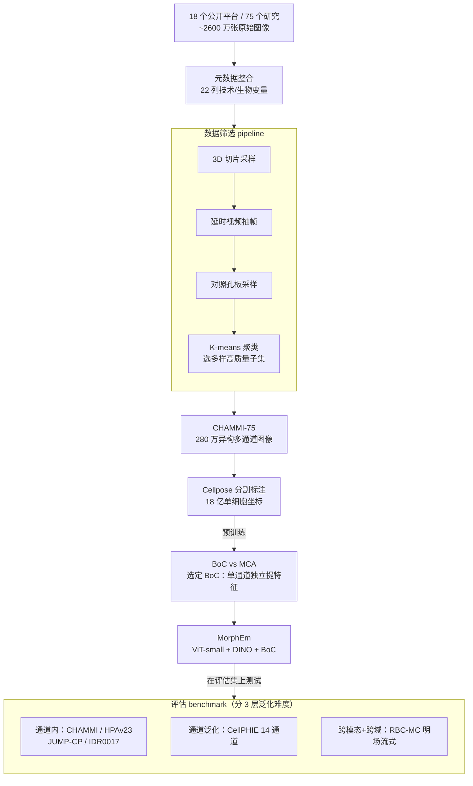

# CHAMMI-75: Pre-training multi-channel models with heterogeneous microscopy images

**会议**: ICLR2026  
**arXiv**: [2512.20833](https://arxiv.org/abs/2512.20833)  
**代码**: [https://github.com/CaicedoLab/CHAMMI-75](https://github.com/CaicedoLab/CHAMMI-75)  
**领域**: LLM预训练  
**关键词**: microscopy, multi-channel imaging, dataset curation, self-supervised learning, cell morphology

## 一句话总结
构建 CHAMMI-75——最大的异构多通道显微镜图像预训练数据集（280 万图像，75 个来源，25 种通道类型，16 种物种），证明成像模态多样性是提升多通道模型泛化能力的关键因素，训练的 MorphEm 模型在 7 个 benchmark 中 6 个达到 SOTA。

## 研究背景与动机

**领域现状**：显微镜成像是生物实验研究的基础工具。与 RGB 自然图像不同，显微镜图像的通道数量可变（1-数十个），每个通道编码不同的荧光信号。深度学习广泛用于分析显微镜图像，但通常需要固定通道数的模型——不同实验用不同通道配置，模型无法跨实验复用。

**现有痛点**：(a) **通道固定**——现有模型修改 RGB 架构为特定通道数，无法处理新的通道组合；(b) **数据碎片化**——多通道显微镜图像散布在各种公开平台上，格式不一、元数据不一致，难以统一使用；(c) **规模不足**——现有数据集如 IDRCell100k 仅 10 万图像。

**核心矛盾**：要训练通用的细胞形态学基础模型，需要覆盖多种成像模态、多种物种、多种通道组合的大规模数据——但这样的数据集不存在。

**本文目标** 构建首个大规模异构多通道显微镜图像数据集 + 系统评估其作为预训练资源的有效性。

**切入角度**：从 18 个公开数据托管平台采集 75 个生物学研究的图像，统一元数据标注，精心筛选去冗余，构建高质量预训练数据集。

**核心 idea**：数据多样性（尤其是成像模态多样性）是训练通道自适应细胞形态学模型的关键——CHAMMI-75 提供了这种多样性。

## 方法详解

### 整体框架
这篇论文要解决的是"显微镜图像没有自己的 ImageNet"——多通道显微镜数据散落在各个平台、格式各异、通道数千变万化，没人把它们整理成一个能拿来预训练通用细胞形态学模型的资源。整套工作沿三条线展开。第一条是**造数据**：从 18 个公开平台下载 75 个生物研究、约 2600 万张原始图像，先做元数据整合（把各源的实验细节归到 22 列变量里），再用一套元数据驱动的筛选 pipeline 去冗余、保多样，收敛到 280 万张高质量异构图像，命名为 CHAMMI-75，最后用 Cellpose 对每张图做细胞分割、记录 18 亿个单细胞坐标供训练时裁剪。第二条是**搭评估**：组织 6 个 benchmark（含 3 个新提出的），故意按泛化难度分层，从"训练时见过的通道"一路覆盖到"完全没见过的通道组合甚至新成像方式"。第三条是**做实验**：在 CHAMMI-75 上系统比较多通道策略（BoC vs MCA）、自监督算法（DINO/MAE/SimCLR）和模型/数据/算力的 scaling，最终筛出一套最优配置训成发布模型 MorphEm，回答"这份数据作为预训练资源到底值不值、哪个因素最关键"。

### 关键设计

**1. 数据筛选 pipeline：把 2600 万张图里的近似重复挤掉，留下 280 万张真正多样的**

显微镜数据天然充满近似重复——同一个 3D 体的相邻切片几乎一样、延时视频的连续帧只差一点、对照条件下的重复孔板内容雷同，如果直接全量喂进去训练，模型会在这些冗余上严重过拟合。筛选 pipeline 先做元数据整合，把各源实验细节解析进 22 列变量（靠资源描述文件、文件名编码、源论文三路信息，并用 LLM 辅助提取、再人工校验），然后用这些元数据驱动四步去冗余：(a) 对 3D 图像只随机采样少量 2D 切片；(b) 对活体延时视频只随机采样少量帧；(c) 对对照重复样本只随机采样少量孔板；(d) 最后用 K-means 聚类挑出多样化、高质量的子集。四步下来从约 2600 万下载图像收敛到 280 万张，靠的是系统化地按元数据剔冗余、保多样，而不是简单按数量截断；筛完还用 Cellpose 标注出 18 亿个单细胞中心坐标，让训练时能裁到真正含细胞的区域、避开空白噪声。

**2. Bag of Channels (BoC) vs Multi-Channel Attention (MCA)：两种处理可变通道数的策略，谁更适合自监督？**

显微镜图像的核心难点是通道数不固定且每通道含义不同，论文对比了两条路线。BoC 把每个通道当作独立模态、各自送进同一个 backbone 提特征、最后拼接，因此与通道数无关、天然可扩展到任意通道组合；MCA 则把所有通道的 token 展开成一条长序列、用注意力显式建模跨通道关联，信息更丰富但序列更长、算力是 BoC 的 3-5×。实验给出了明确答案：在自监督（SSL）设定下 BoC 一致性地优于 MCA，相对提升高达 19%。原因是无监督下"学习不同荧光通道之间的关联"本就极难，MCA 的额外建模能力反而成了负担，BoC 既更实用又更省算力、也更容易 scale。

**3. MorphEm 模型：把系统实验筛出的最优配置训成发布模型**

把前面的结论组合起来就得到 MorphEm（Morphology Embeddings）——ViT-small 主干 + DINO 自监督 + BoC 多通道策略，在完整的 280 万张 CHAMMI-75 上训练，总计 2352 GPU 小时。这套配置不是拍脑袋定的，而是三维 scaling 实验筛出来的：多通道策略上 BoC > MCA（决定性因素），自监督方法上 DINO 比 MAE 高约 15%、比 SimCLR 高约 7%，主干尺寸越大越好（ViT-small→large 还能再涨 10%，但 small 在学术算力下既跑得动效果又够）。相比 dataset scaling 阶段的最好结果，用全量数据训的 MorphEm 又拿到 9.8% 的相对提升。

**4. 评估 benchmark 设计：故意按"泛化难度"分层，专门压测最难的场景**

真实世界里新实验经常换用新的通道组合、甚至换一种成像方式，所以评估必须覆盖这种分布外的泛化，而不只是同分布精度。这套 6 个 benchmark 因此分三层：通道内任务（CHAMMI、HPAv23、JUMP-CP、IDR0017，通道配置训练时见过）、通道泛化任务（CellPHIE 用 14 通道，是训练时未见的全新组合）、以及跨模态+跨域任务（RBC-MC 用明场成像的流式细胞术，连成像物理过程都变了，还跨两个临床站点做交叉验证）。其中 IDR0017、CellPHIE、RBC-MC 是本文新提出的，CellPHIE 和 RBC-MC 正是用来逼出模型在最难泛化场景下的真实能力。

### 训练策略
DINO-BoC 自监督学习：每个通道分别输入同一个 ViT-small，走 student-teacher 框架训练。预训练完成后冻结权重、不做微调，直接在下游任务上用线性探针或 nearest neighbor 评估特征质量。

## 实验关键数据

### 主实验（6 个 benchmark 对比）

| 模型 | 多通道 | 预训数据 | CHAMMI ↑ | HPAv23 ↑ | JUMP-CP1 ↑ | CellPHIE ↑ | RBC-MC ↑ |
|------|-------|---------|---------|---------|-----------|-----------|---------|
| SubCell (WSL, ViT-B) | 手动选 | HPAv23 | 53.38 | **69.33** | 77.60 | 71.23 | 59.10 |
| DINOv2 | BoC | LVD-142M | 37.93 | 53.76 | 75.84 | 72.27 | 59.41 |
| OpenPhenom | MCA | RxRx+JUMP | 38.22 | 49.13 | 74.26 | 75.56 | 64.43 |
| IDRCell100k | BoC | IDRCell | 37.38 | 44.05 | 72.37 | 79.14 | 55.85 |
| **MorphEm** | BoC | **CHAMMI-75** | **48.75** | **58.87** | **76.32** | **80.51** | **68.34** |

### 消融实验（数据因素影响 - 相对性能差异）

| 因素 | 使用该因素 | 不使用该因素 | 影响程度 |
|------|----------|-----------|---------|
| 异构 vs 专用数据 | +38% | -27% | **最大** |
| 多成像模态 vs 仅荧光 | +15% | -13% | **次大** |
| 不同放大倍率 | +3% | -3% | 中等 |
| 不同细胞系 | +1% | -1% | 较小 |
| 不同通道数 | +1% | -1% | 较小 |

### 关键发现
- **数据异构性 >> 数据量**：仅 10 万异构图像（IDRCell100k）vs 280 万异构图像（CHAMMI-75），后者大幅领先。而同为 10 万级的专用数据完全无法匹敌异构数据
- **成像模态多样性是关键**：仅用少数非主流成像模态（12 种）训练的模型比仅用两种主流模态训练的好 28%。这说明模型通过学习不同物理成像过程的变化来获得更鲁棒的表征
- **SSL 下 BoC >> MCA**：BoC 一致性地优于 MCA 19%，且计算量低 3-5×。无监督设定下学习跨通道关联很难
- **小模型+好数据可超大模型**：ViT-small MorphEm（SSL）在 CellPHIE 上超 SubCell（WSL, ViT-base）13%，在 RBC-MC 上超 15%——数据质量和多样性比模型大小更重要
- **DINO > MAE > SimCLR**：在显微镜图像 SSL 中 DINO 一致性最佳，可能因为其 teacher-student 框架更适合捕捉生物形态学的全局特征

## 亮点与洞察
- **数据筛选方法论的价值**：从 2600 万→280 万的筛选过程本身就是贡献——系统化的去冗余和多样性保持策略可以作为模板应用于其他领域的大规模数据集构建
- **成像模态多样性的洞察**：不是简单的"越多数据越好"，而是"越多类型的成像方式越好"。这对基础模型的数据策略有直接指导意义——应优先收集不同物理成像过程的数据
- **通道泛化到 14 通道**：训练时最多见 7 通道，但能零样本泛化到 14 通道的 CellPHIE。BoC 的通道独立处理使这种泛化自然成立——这与自然图像领域的 patch 独立处理（ViT）异曲同工

## 局限与展望
- **计算资源限制**：受限于学术机构计算资源，仅测试了 ViT-small。论文自己的 scaling 实验表明 ViT-large 还能提升 10%——更大规模训练有空间
- **BoC 丢失跨通道信息**：BoC 策略虽然实用，但忽略了通道间的生物学共定位信息（如 DAPI + phalloidin 的空间关系）。未来需要找到在 SSL 下也能有效利用跨通道信息的方法
- **元数据噪声**：尽管做了大量标注工作，元数据仍有噪声，影响弱监督学习的效果
- **长尾分布未解决**：通道组合的分布极其长尾（Figure 4b）——某些通道只在少数研究中出现，模型对这些稀有通道的表征质量未知

## 相关工作与启发
- **vs IDRCell100k**：相同数量的源（79 vs 75）但 CHAMMI-75 图像量 30×、筛选质量更高。同一 BoC 模型在 IDRCell100k 上训练全面落后于 CHAMMI-75，证明数据质量+规模的价值
- **vs SubCell**：SubCell 用弱监督+大模型+手工选通道组合在部分任务上最强。但在泛化场景（新通道、新域）上，CHAMMI-75 的 SSL 小模型大幅领先——说明多样性训练数据是泛化的根基
- **类比 ImageNet/LAION**：正如 ImageNet 推动了自然图像的历史性进步，CHAMMI-75 有潜力成为显微镜成像领域的"ImageNet"——系统性的数据工程推动模型突破

## 评分
- 新颖性: ⭐⭐⭐⭐ 数据集构建和多因素消融分析深入，但方法上主要用已有技术（DINO+BoC）
- 实验充分度: ⭐⭐⭐⭐⭐ 7 个 benchmark、6 因素消融、3 维度 scaling、BoC vs MCA 对比极其全面
- 写作质量: ⭐⭐⭐⭐⭐ 数据集的动机、构建过程、实验设计都叙述清晰，图表丰富
- 价值: ⭐⭐⭐⭐⭐ 对生物成像基础模型领域有开创性贡献，数据+代码+模型全部开源

<!-- RELATED:START -->

## 相关论文

- [\[ACL 2025\] Pre-Training Curriculum for Multi-Token Prediction in Language Models](../../ACL2025/llm_pretraining/pre-training_curriculum_for_multi-token_prediction_in_language_models.md)
- [\[ACL 2025\] Meta-rater: A Multi-dimensional Data Selection Method for Pre-training Language Models](../../ACL2025/llm_pretraining/metarater_a_multidimensional_data_selection_method.md)
- [\[ACL 2026\] Toward Consistent World Models with Multi-Token Prediction and Latent Semantic Enhancement](../../ACL2026/llm_pretraining/toward_consistent_world_models_with_multi-token_prediction_and_latent_semantic_e.md)
- [\[ICLR 2026\] Common Corpus: The Largest Collection of Ethical Data for LLM Pre-Training](common_corpus_ethical_data_for_llm_pretraining.md)
- [\[ICLR 2026\] Pre-training LLM without Learning Rate Decay Enhances Supervised Fine-Tuning](pre-training_llm_without_learning_rate_decay_enhances_supervised_fine-tuning.md)

<!-- RELATED:END -->
