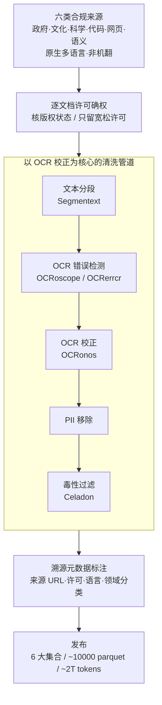

# Common Corpus: The Largest Collection of Ethical Data for LLM Pre-Training

**会议**: ICLR 2026 Oral  
**arXiv**: [2506.01732](https://arxiv.org/abs/2506.01732)  
**代码**: [HuggingFace](https://huggingface.co/datasets/PleIAs/common_corpus)  
**领域**: LLM 预训练数据 / 数据工程 / AI 合规  
**关键词**: pre-training data, ethical data, open data, multilingual, data curation, copyright, AI legislation

## 一句话总结
构建 Common Corpus——约 2 万亿 token 的最大规模合法授权 LLM 预训练数据集，覆盖 6 大集合（政府/文化/科学/代码/Web/语义），多语言（含低资源语言），所有数据均为无版权或宽松许可来源，配有完整数据溯源和多阶段过滤管道，已被 Anthropic 等行业领导者采用。

## 研究背景与动机
**领域现状**：LLM 预训练需万亿 token 级数据（最新模型如 DeepSeek v3、Llama 4 使用 14-36T tokens），但主流数据集（The Pile、RefinedWeb、C4）大量使用版权内容。

**现有痛点**：
   - **法律风险加剧**：NYT 起诉 OpenAI、EU AI Act 立法、C4 中 45% 内容已被 ToS 限制爬取
   - **开放科学受损**：Books3、LAION、MATH benchmark 等关键资源先后被 DMCA/法律挑战下架——之前的研究不可复现
   - **现有合规数据集不足**：C4C（228B tokens，仅英语）、KL3M（1.2T tokens，仅美国行政文本）、Common Pile（1T tokens，仅英语）——规模小或语言单一

**核心矛盾**：训练强大 LLM 需要海量数据，但合规数据规模远不够；多语言和低资源语言的合规数据更为匮乏

**核心 idea**：系统性地从无版权/宽松许可来源（政府文件、公共领域文学、开放科学论文、开源代码、Creative Commons Web 内容）收集和过滤约 2T tokens，建立 AI 训练数据的开放科学基础设施

## 方法详解

### 整体框架
Common Corpus 要解决的事其实很朴素：在不碰任何版权内容的前提下，凑出一个能真正用于 LLM 预训练的万亿 token 级语料库。整条流水线是"先选源、再确权、然后清洗、最后留痕"的链路——先从六类天然合规、且原生覆盖多语言的来源（政府文件、公共领域文化文献、开放获取论文、宽松许可代码、Creative Commons 网页、结构化语义知识）里识别候选文档；逐文档核验它的版权与许可状态，只留"使用无需许可"的内容；再过一条以 OCR 修复为核心的清洗管道（文本分段 → OCR 错误检测 → OCR 校正 → PII 移除 → 毒性过滤），因为大量公共领域文献来自图书馆扫描件、OCR 噪声极重；最后给每份文档打上完整的溯源元数据并按领域归类，发布成约 10000 个 parquet 文件。最终汇成 6 大集合、约 2T tokens：

| 集合 | Documents | Tokens | 来源 |
|------|-----------|--------|------|
| Open Government | 74.7M | 406.6B | 多国政府文件、法律文本、议会记录 |
| Open Culture | 93.2M | 886.0B | 公共领域书籍、历史文献、图书馆数字化 |
| Open Science | 19.2M | 281.2B | 开放获取论文、预印本（arXiv 等） |
| Open Code | 202.8M | 283.2B | 宽松许可开源代码（MIT/Apache/BSD 等） |
| Open Web | 96.2M | 73.2B | Creative Commons 授权网页内容 |
| Open Semantic | 30.1M | 68.0B | 结构化知识（Wikipedia 等） |
| **总计** | **517.0M** | **~2.0T** | |

### 关键设计

**1. 原生多语言的合规来源覆盖：用原生文本补上合规数据集只剩英语的短板**

C4C、KL3M、Common Pile 这些已有的合规数据集几乎清一色只有英语，直接卡死了多语言 LLM 的合规训练。Common Corpus 从一开始就把"广覆盖 + 多语言"作为选源原则：六类来源横跨政府、文化、科学、代码、网页、语义知识，时间从古代文献一直到最新 CC 网页；语言上英语 968.8B tokens 仍是大头（约 48.5%），但法语 275.4B、德语 112.1B 紧随其后，前九种语言每种都 ≥10B tokens，整体覆盖含低资源语言在内的 50+ 种。最关键的一条是所有非英语数据都是**原生文本、绝不机器翻译**——机翻会把翻译腔和事实漂移灌进语料，而原生文本保住了各语言真实的分布，这正是它区别于其他合规数据集的核心差异。

**2. 逐文档许可确权：把"合规"从粗筛升级为逐份核验**

主流数据集默认"网上爬得到就能用"，可 2024 年的分析显示 C4 里已有 45% 的 token 被 ToS 限制爬取。Common Corpus 反过来对**每一份文档**单独确认版权状态与许可类型，标准对齐 Open Source Initiative 对"开放"的最强定义——不只是数据可获得，连"用于任何目的、无需申请许可"都要满足。具体怎么判：公共领域内容按各国版权法逐条核（如早期出版物、作者身后版权期满）；代码只保留无需署名的宽松许可（MIT、Apache 2.0、BSD 等），把带传染性条款的 GPL 排除在外。这样收上来的每份文档都是"使用无需许可"，从源头规避了 NYT 诉 OpenAI 那类法律风险，也让基于它训练的模型可以合法开源、无需再依赖 fair use 抗辩。

**3. 以 OCR 校正为核心的多阶段清洗管道：把"来源合规"打磨成"内容可用"**

确权只解决"能不能用"，质量这关还得靠清洗，而这条管道有个鲜明特点：五道工序里有三道围着 OCR 转。原因是大量公共领域文献来自图书馆扫描件，原始 OCR 噪声极重——作者用 OCRoscope 自测，公共领域部分的 OCR 质量率仅约 59%（按"可识别 7-gram 占比"度量，即 1 − 41% 无法识别的 7-gram）。管道依次是：先用 Segmentext 做**文本分段**，让它对版式错乱、数字化失真的文档也能切对结构；再用 OCRoscope / OCRerrcr 做 **OCR 错误检测**，靠统计无法识别的 7-gram 比例给出标准化质量分；接着用基于 Llama 3 8B 的 OCRonos 做 **OCR 校正**，它能修错字、错误的断词/合词乃至整段崩坏的结构，对严重退化的内容更像"合成重写"而非逐字纠错；之后过 **PII 移除**清掉受 GDPR 等约束的个人身份信息；最后用自训的多语言毒性分类器 Celadon（DeBERTa-v3-small、约 140M 参数，沿种族/性别/宗教/能力/暴力五个维度判定）做**毒性过滤**，命中的内容要么删除、要么无害化重写。这套以 OCR 修复为主轴的管道，正是让"古籍扫描件"这类别处用不了的资源真正进入预训练的关键。

**4. 全程溯源元数据：让整个语料库可被完整审计**

为了撑起"开放科学基础设施"这个定位，每份文档都附带一整套溯源元数据：来源 URL、许可类型、语言标签、集合/领域分类等。好处是审计链条能一路打通——从训练出的模型回溯到它吃了哪些数据，再回溯到每条数据的原始出处与许可凭证；用户也能据此自行过滤掉某些可能有问题的集合。这正是 The Pile 这类数据集做不到的：它们因含 Books3 等版权内容、又缺溯源，一旦被 DMCA 挑战就只能整体下架，研究随之不可复现。

## 实验关键数据

### 数据集规模对比

| 数据集 | 规模 | 语言 | 合规性 |
|--------|------|------|--------|
| C4 | 156B | 英语为主 | 部分受限 |
| RefinedWeb | 5T | 英语 | 版权争议 |
| C4C | 228B | 英语 | 合规 |
| KL3M | 1.2T | 英语 | 合规（美国行政文本） |
| Common Pile | 1T | 英语 | 合规 |
| **Common Corpus** | **~2.0T** | **50+ 语言** | **完全合规** |

Common Corpus 是唯一一个同时满足"万亿规模 + 多语言 + 完全合规"的数据集。

### 数据多样性

| 维度 | 特征 |
|------|------|
| 时间跨度 | 古代到现代（公共领域历史文献→最新 CC 网页） |
| 领域范围 | 法律、科学、文学、代码、百科、社区内容 |
| 语言多样性 | 50+ 种语言，含非洲/亚洲低资源语言 |

### 社区影响
- 已被 Anthropic 用于模型训练
- 多个 LLM 训练项目采用
- 基于 Common Corpus 衍生的多模态数据集、分类器、合成数据集和基准

### 关键发现
- **"开放数据悖论"**：大量公共领域/开放许可内容在网上可见性低、不在主流预训练数据源中——需要主动挖掘，不能只依赖 Common Crawl
- 政府和文化机构数字化的文档是被低估的数据源——质量高、无版权问题、多语言
- 即使是最宽松的许可，合规数据的多样性和质量仍有差距——需要更多社区努力

## 亮点与洞察
- **AI 合规基础设施的里程碑**：在 EU AI Act、版权诉讼潮的背景下，Common Corpus 证明了"合规+大规模"是可能的，为整个行业提供了合规训练数据的"公地"
- **开放科学的实践典范**：完整的数据溯源、许可验证、处理工具全部开源——其他项目可复用整个 pipeline
- **语义覆盖的独特性**：非常不同于 web-crawled 数据——包含历史文献、法律文本、科研论文等，可能带来不同于网页文本的知识分布

## 局限与展望
- **规模上限**：~2T tokens 远小于非合规数据集（RefinedWeb 5T+），在 scaling law 下可能不足以训练最大模型
- **质量差距**：公共领域文献（OCR 质量、古老语言风格）可能与现代网页文本有分布差异，对模型性能影响未量化
- **缺乏训练验证**：未报告在 Common Corpus 上训练的模型与在非合规数据上训练的模型的性能对比（这是关键缺失）
- **代码数据** 283B tokens 远少于 The Stack 等专门代码数据集
- **低资源语言** 虽有覆盖但数据量可能仍不足以训练高质量模型

## 相关工作与启发
- **vs The Pile**：开创性预训练数据集但含 Books3 等版权内容，已被部分下架
- **vs RefinedWeb**：5T 规模但全部来自 Common Crawl 无许可过滤
- **vs KL3M**：合规但仅美国行政文本（领域单一）
- **对行业的启示**：Common Corpus 表明合规数据收集是一个需要持续投入的基础设施项目，不是一次性工作。社区协作（如 BLOOM 的 ROOTS）模式可能是可持续路径

## 评分
- 新颖性: ⭐⭐⭐ 主要是数据工程贡献，方法学创新有限
- 实验充分度: ⭐⭐⭐ 数据集描述详尽，但缺乏关键的模型训练性能对比
- 写作质量: ⭐⭐⭐⭐ 数据来源和管道描述清晰，遵循最佳实践指南
- 价值: ⭐⭐⭐⭐⭐ ICLR Oral 实至名归——对 AI 行业合规化有巨大推动，是开放科学基础设施的重要贡献

<!-- RELATED:START -->

## 相关论文

- [\[ACL 2026\] Demystifying Data Organization for Enhanced LLM Training](../../ACL2026/llm_pretraining/demystifying_data_organization_for_enhanced_llm_training.md)
- [\[ICLR 2026\] Pre-training LLM without Learning Rate Decay Enhances Supervised Fine-Tuning](pre-training_llm_without_learning_rate_decay_enhances_supervised_fine-tuning.md)
- [\[ICLR 2026\] Token-level Data Selection for Safe LLM Fine-tuning](token-level_data_selection_for_safe_llm_fine-tuning.md)
- [\[ICLR 2026\] Scaling with Collapse: Efficient and Predictable Training of LLM Families](scaling_with_collapse_efficient_and_predictable_training_of_llm_families.md)
- [\[AAAI 2026\] ELSPR: Evaluator LLM Training Data Self-Purification on Non-Transitive Preferences](../../AAAI2026/llm_pretraining/elspr_evaluator_llm_training_data_self-purification_on_non-transitive_preference.md)

<!-- RELATED:END -->
