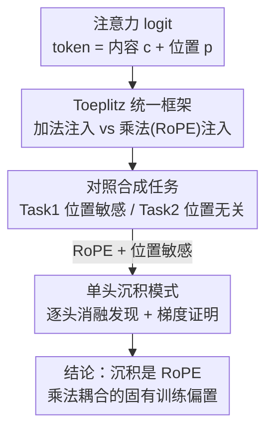

# Deconstructing Positional Information: From Attention Logits to Training Biases

**会议**: ICLR2026  
**arXiv**: [2505.13027](https://arxiv.org/abs/2505.13027)  
**代码**: 待确认  
**领域**: LLM预训练  
**关键词**: 位置编码, RoPE, Toeplitz矩阵, 注意力机制, 单头沉积模式  

## 一句话总结
提出基于 Toeplitz 矩阵的统一分析框架，将位置编码分为加法（Absolute/T5/ALiBi）和乘法（RoPE）两类；通过合成任务发现 RoPE 在位置敏感任务上优势显著但存在"单头沉积模式"（single-head deposit pattern）——浅层几乎所有位置推理集中于单个注意力头；理论证明该模式是 RoPE 乘法结构的固有属性。

## 研究背景与动机

**领域现状**：位置编码（PE）是 Transformer 的核心组件，从加法式（Sinusoidal、T5 Bias、ALiBi）演化到乘法式（RoPE），但其机制理解停留在距离衰减和平移不变性两个性质上。

**现有痛点**：RoPE 虽有理论上的优良性质（如支持长度泛化的衰减特性），但在某些任务上反而不如简单相对PE甚至无PE模型，这一"性能悖论"缺乏解释。

**核心idea**：将注意力logit计算解构为内容和位置的交互项，用 Toeplitz 矩阵统一描述；揭示加法PE通过独立偏置项引入位置，而乘法PE（RoPE）通过 Hadamard 积将位置信号与内容耦合——这种强耦合导致位置推理过度集中。

## 方法详解

### 整体框架
本文不提出新方法，而是把注意力 logit 的计算拆开来看位置信息从哪里进入、又如何在训练中沉淀。整条分析链分四步走：先把每个 token 表示分解为内容分量与位置分量 $x_i = c_i + p_i$，展开 query-key 内积，从而把所有主流位置编码归并到 Toeplitz 矩阵这一统一视角下，区分出"加法注入"与"乘法注入"两条路径；再用一对精确对照的合成任务，把模型的内容-位置耦合能力从纠缠的自然语言里单独抠出来观察；接着在这对探针上做逐头消融，发现 RoPE 浅层把位置推理沉积进单独一个头（单头沉积模式）；最后用梯度分析证明这一沉积是乘法注入的固有训练偏置，而非训练偶然。

### 关键设计

**1. Toeplitz 统一框架：把位置编码归并为加法与乘法两条注入路径**

位置编码过去多用"距离衰减""平移不变"等零散性质描述，缺乏统一的代数刻画，于是 RoPE 为何在某些任务上反而吃亏一直说不清。本文抓住"任意两 token 的关系只取决于相对距离"这条平移不变性，把它对应到 Toeplitz 矩阵（每条对角线元素恒定）的结构上，再把 logit 矩阵按内容-位置交叉项展开。展开后两条路径泾渭分明：加法式 PE（Absolute、T5 Bias、ALiBi）把位置信号作为独立可加项注入，logit 矩阵写成 $\mathbf{L}_{\text{Add}} = G_{q^c,k^c} + G_{q^c,k^p} + G_{q^p,k^c} + G_{q^p,k^p} + \mathbf{B}$，位置项（相对 PE 给出 $\mathbf{B}$、绝对 PE 给出 $G_{q^p,k^p}$）与内容项相互独立；而 RoPE 这类乘法式 PE 不另加位置项，而是用一个只依赖相对位置 $i-j$ 的 Toeplitz 核 $G_{\mathbf{e}}$ 去逐元素调制整个内容交互，logit 矩阵呈 $\mathbf{L}_{\text{RoPE}} = \text{Re}\{(G_{q,k}+G_{q,p}+G_{p,k}+G_{p})\circ G_{\mathbf{e}}\}$ 的 Hadamard 积形式。两类注入都落到同一个 Toeplitz 表述里，差别仅在"相加"还是"逐元素相乘"——正是这个乘法耦合让位置信号无法与内容解绑，成为后续解释 RoPE 反常行为的代数基础。

**2. 一对对照合成任务：把内容-位置耦合能力单独隔离出来**

自然语言任务里内容和位置纠缠在一起，无法判断模型究竟在用哪种信息，框架推出的"乘法耦合更强"也就无从验证。为此本文设计两个共享相同 token 分布、只在"是否需要位置"上对立的合成任务：Task 1（位置敏感）放两个 trigger 词，要求预测它们之间的相对距离，模型必须同时知道"是什么"和"在哪里"才能答对，正好考验内容-位置耦合；Task 2（位置无关）则要求统计某个 trigger 词出现的次数，此时位置纯属干扰变量，理想模型应当忽略它。两个任务一正一反构成干净对照，任何性能差异都能归因到位置编码对耦合的处理方式，也为下一步逐头分析提供了可控探针——实验如框架所料：RoPE 在 Task 1 上以 92.64% 大幅领先，在 Task 2 上反而落后。

**3. 单头沉积模式：从消融现象追到训练动力学的成因**

有了干净探针，本文在 Task 1 上做逐头消融（把单个注意力头置零）时撞见反直觉现象：移除第一层某一个特定的头，准确率从 92.64% 暴跌约 60 个百分点，而移除其余任意头几乎不影响结果——浅层几乎全部位置推理沉积在了单独一个头里。这一"单头沉积"只在"RoPE + 位置敏感任务"组合下出现，NoPE 在同一任务上没有、RoPE 在位置无关的 Task 2 上也没有，说明它是乘法耦合的特有产物而非 Transformer 训练的通病。本文进一步用梯度分析坐实成因：Proposition 6.1 证明 RoPE 的乘法结构使位置学习梯度存在不可抵消的非零"种子"，必有某个头率先获得正向信号；Proposition 6.2 反衬出 ALiBi 的加法偏置在批次聚合时梯度相互抵消，形不成稳定种子；Theorem 6.1 则表明反向传播会把这一初始优势逐层指数放大，主导头与次主导头的间距满足 $\text{Margin}_l \geq \text{Margin}_L \prod_{k=l}^{L-1}\gamma_k$（每层增益 $\gamma_k>1$），最终让单个头垄断位置推理。至此现象、隔离、证明形成闭环：沉积不是训练偶然，而是 RoPE 乘法注入的固有训练偏置；这也解释了 RoPE 理论优势与实际表现之间的落差，以及为何 MLA 用并行的 NoPE+RoPE 通路能把沉积消解掉。

## 实验关键数据

### 合成任务性能

| PE方法 | Task 1（位置敏感）Acc | Task 2（位置无关）Acc |
|--------|---------------------|---------------------|
| RoPE | **92.64%** | 69.43% |
| MLA | 88.34% | **97.41%** |
| Absolute | 次优 | 中等 |
| ALiBi | 失败 | 最差（强偏置有害） |
| NoPE | 失败 | **77.69%** |

### 消融实验：最少 RoPE 头数

| RoPE头数 | Task 1 Acc |
|----------|-----------|
| 全部头 | 92.64% |
| 2头 | ≈90%+ |
| **1头** | **≈90%** |

### 关键发现
- RoPE 仅需 1-2 个头即可完成全部位置推理，其余头对位置任务冗余
- 混合架构 MLA（DeepSeek-V3 的注意力设计）成功消除沉积模式，同时在两个任务上达到近最优（88.34% / 97.41%）
- RoPE 会抑制隐式位置表示的形成：在 Absolute+RoPE 混合模型中，Layer 2 之后加法位置方向被完全置换

## 亮点与洞察
- **优雅的理论框架**：用 Toeplitz 矩阵将所有 PE 方法统一到"加法 vs 乘法"的二分法中，解释力强
- **从现象到机制的完整链条**：合成任务发现 → 消融验证 → 数学证明，三步闭环
- **对 MLA 的理论验证**：首次从位置编码角度解释了为什么 DeepSeek-V3 的 MLA 设计有效

## 局限与展望
- 沉积模式与长度外推能力之间的因果关系仅为假设，未直接验证
- 合成任务过于简化，在复杂NLP任务（如序列反转、Dyck语言）上的适用性未知
- 仅分析 6 层小模型，大规模模型中沉积模式是否持续存在尚不清楚

## 相关工作与启发
- 解释了 Kazemnejad et al. (2023) 的反直觉发现：NoPE 在某些任务上优于 RoPE → 因为乘法偏置在位置无关任务上有害
- 为未来 PE 设计提供原则：应避免纯乘法耦合，采用 MLA 式的混合策略（NoPE + RoPE 并行通路）

## 评分
- 新颖性: ⭐⭐⭐⭐⭐ Toeplitz统一框架 + 沉积模式的发现和理论证明
- 实验充分度: ⭐⭐⭐⭐ 合成实验设计精巧，消融充分，但缺少自然语言实验
- 写作质量: ⭐⭐⭐⭐⭐ 理论叙述清晰，从框架到发现到证明的逻辑链完整
- 价值: ⭐⭐⭐⭐ 对位置编码的机制理解有重要推进，对MLA等新设计有指导意义

<!-- RELATED:START -->

## 相关论文

- [\[ICLR 2026\] Explaining Grokking and Information Bottleneck through Neural Collapse Emergence](explaining_grokking_and_information_bottleneck_through_neural_collapse_emergence.md)
- [\[CVPR 2025\] Robust Message Embedding via Attention Flow-Based Steganography](../../CVPR2025/llm_pretraining/robust_message_embedding_via_attention_flow-based_steganography.md)
- [\[ICML 2025\] Benign Overfitting in Token Selection of Attention Mechanism](../../ICML2025/llm_pretraining/benign_overfitting_in_token_selection_of_attention_mechanism.md)
- [\[ICML 2026\] Focus and Dilution: The Multi-stage Learning Process of Attention](../../ICML2026/llm_pretraining/focus_and_dilution_the_multi-stage_learning_process_of_attention.md)
- [\[AAAI 2026\] No-Regret Strategy Solving in Imperfect-Information Games via Pre-Trained Embedding](../../AAAI2026/llm_pretraining/no-regret_strategy_solving_in_imperfect-information_games_via_pre-trained_embedd.md)

<!-- RELATED:END -->
