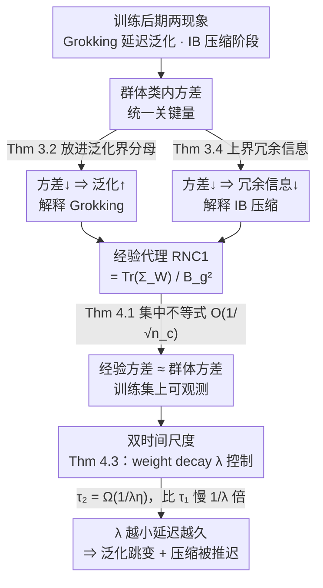

# Explaining Grokking and Information Bottleneck through Neural Collapse Emergence

**会议**: ICLR2026  
**arXiv**: [2509.20829](https://arxiv.org/abs/2509.20829)  
**代码**: [keitaroskmt/collapse-dynamics](https://github.com/keitaroskmt/collapse-dynamics)  
**领域**: LLM预训练  
**关键词**: Grokking, 信息瓶颈, Neural Collapse, 训练动态, 类内方差, 泛化理论, Lyapunov 时间尺度

## 一句话总结
通过 Neural Collapse 的视角统一解释 Grokking（延迟泛化）和 Information Bottleneck（压缩阶段）两大训练后期现象，证明群体类内方差的收缩是两者的共同关键因素，并揭示训练损失收敛与 Neural Collapse 发生存在由 weight decay 控制的不同时间尺度。

## 背景与动机
1. **Grokking 现象之谜**：训练损失早已收敛但测试精度在长时间后突然跃升，过拟合解突然转为泛化解，机制不明。
2. **Information Bottleneck 的两阶段**：DNN 训练中先出现拟合阶段（I(Z;X) 和 I(Z;Y) 同时增大），后出现压缩阶段（I(Z;X) 减小而 I(Z;Y) 保持），但压缩阶段的触发机制缺乏严格理论解释。
3. **两现象的共性**：Grokking 和 IB 压缩都发生在训练后期，暗示网络内部在此阶段发生了某种共同的结构性变化。
4. **Neural Collapse 的潜力**：Neural Collapse 描述训练后期表示空间的几何结构（类内坍缩、类均值形成 ETF），但其与上述后期现象的联系从未被建立。
5. **现有理论的局限**：Grokking 解释多停留在参数压缩、复杂度度量等经验层面；IB 分析在连续确定性网络中互信息可能无穷大，且缺乏与网络参数的直接联系。
6. **时间尺度分析缺失**：即便知道类内方差收缩可改善泛化，也需要理解其收敛速度相对于训练损失收敛的关系，才能解释为何泛化/压缩"延迟"发生。

## 方法详解

### 整体框架
这是一篇纯理论工作，目标是把 Grokking（延迟泛化）和 Information Bottleneck（压缩阶段）这两个看似无关的训练后期现象，归并到同一个内在驱动量——群体类内方差——之上。论文用一条定理链把"现象 → 关键量 → 可观测代理 → 收敛时间尺度"四层逐级打通：先证明类内方差同时控制泛化界和冗余信息（解释两现象因何同源），再证明它可由训练集上的经验指标 RNC1 逼近（让理论可观测），最后刻画 RNC1 收敛比训练损失收敛慢一个由 weight decay 决定的因子（解释两现象为何"延迟"出现）。下图把这条定理链画成自上而下的因果流，三个关键设计正对应链上的三段。

### 关键设计

**1. 类内方差是统一关键量：让 Grokking 与 IB 共享同一个驱动因子**
两个现象各自的痛点都是"机制说不清"——Grokking 不知道为何泛化会突然跳变，IB 不知道压缩阶段被什么触发。论文的切入点是证明二者其实被同一个量牵着走：群体类内方差 $\mathbb{E}\big[\|\tilde g(X) - \mathbb{E}[\tilde g(X)\mid Y]\|^2\big]$。一方面，对固定特征提取器 $g$ 和分类器 $W$，基于 Chebyshev 不等式推出的分类错误上界（Theorem 3.2）把这个方差放在分母位置——方差越小界越紧，于是类内坍缩直接换来泛化提升，对应 Grokking 的测试精度跃升。另一方面，在表示 $Z = g(X) + B_g\cdot E$（加一个微小高斯噪声使确定性网络的互信息有限）的设定下，冗余信息 $I(Z;X) - I(Z;Y) = I(Z;X\mid Y)$ 同样被群体类内方差上界控制（Theorem 3.4）——方差收缩即冗余信息减少，正是 IB 的压缩阶段。两条不等式把同一个量分别接到了泛化和压缩上，统一性由此成立；Proposition 3.3 进一步补出 IB 第一阶段（拟合阶段）的必要性，闭环了两阶段叙事。

**2. 用经验 RNC1 逼近群体方差：把不可观测的理论量落到训练集上**
群体类内方差是对真实分布求期望，训练中无法直接测量，理论会因此停在纸面。论文先证一个集中不等式（Theorem 4.1）：基于谱范数的均匀收敛分析给出群体类内方差与训练集经验类内方差之差为 $O(1/\sqrt{n_c})$（$n_c$ 为每类样本数），即样本足够时二者可互相替代。在此保障下定义可观测代理 RNC1 $= \frac{1}{B_g^2}\mathrm{Tr}(\Sigma_W)$，它直接度量归一化后的训练集类内方差。相比 Neural Collapse 文献里常用的 NC1（还要再除以类间方差），RNC1 故意不做类间归一化——因为泛化界里需要的恰恰是类内方差本身，类间项的引入反而会模糊与泛化的对应关系。这一步让后续所有结论都能在训练曲线上被直接验证。

**3. 双时间尺度刻画：解释"延迟"为何由 weight decay 决定**
即便知道类内方差收缩有益，也还要回答它为什么总是滞后发生——这正是 Grokking 和 IB 压缩都出现在训练后期的根源。论文在带 weight decay $\lambda$ 的梯度下降下证明（Theorem 4.3）：训练损失在 $\tau_1 = \Omega\big(\frac{1}{\eta}\log\frac{1}{\varepsilon_1}\big)$ 步内收敛，而 RNC1 要到 $\tau_2 = \Omega\big(\frac{1}{\lambda\eta}\log\frac{1}{\varepsilon_2}\big)$ 步才收敛。关键差异是 $\tau_2$ 多出一个 $1/\lambda$ 因子：当 $\lambda$ 很小时 $\tau_2 \gg \tau_1$，Neural Collapse 远滞后于损失收敛，于是泛化跳跃与 IB 压缩被"推迟"——延迟越久 Grokking 越戏剧化。反过来，增大 weight decay 缩小 $\tau_2/\tau_1$ 比值、加速类内坍缩，从而同时加速 Grokking 的泛化跳变和 IB 的压缩阶段。整条逻辑链可读作：weight decay 控制的时间尺度 → Neural Collapse 动态 → 经验类内方差（RNC1）收缩 → 群体类内方差收缩 → Grokking / IB 压缩。

## 实验关键数据

### 表1：Grokking 实验——不同 weight decay 下的训练动态（MLP on MNIST）

| Weight Decay λ | 训练精度达100%的步数 τ₁ | 测试精度开始提升的步数 τ₂ | RNC1 下降与泛化同步 |
|---|---|---|---|
| 0.3 | ~5,000 | ~10,000 | ✓（两者几乎同步下降） |
| 0.1 | ~5,000 | ~20,000 | ✓ |
| 0.01 | ~5,000 | ~60,000 | ✓（延迟越大 grokking 越明显） |
| 0.003 | ~5,000 | ~100,000+ | ✓（极端 grokking） |

关键观察：RNC1 下降始终与测试精度提升同步，而非与训练损失收敛同步。λ 越小，两个时间尺度分离越严重。

### 表2：IB 实验——冗余信息与 RNC1 的同步性

| Weight Decay λ | RNC1 开始下降时间 | MI估计的冗余信息下降时间 | nHSIC 冗余信息下降时间 |
|---|---|---|---|
| 0.3 | 早（~10K步） | 同步 | 同步 |
| 0.1 | 中（~20K步） | 基本同步 | 同步 |
| 0.01 | 晚（~60K步） | 略滞后但趋势一致 | 同步 |

两种不同的冗余信息估计方式（MI 和 nHSIC）均与 RNC1 行为定性一致，支持 Theorem 3.4。

- 在 CNN 和 Transformer 架构上重复实验，结论一致（附录 D.1/D.2）。
- 表示空间可视化（Figure 2）：过拟合阶段训练样本可分但测试类内方差大；Neural Collapse 后训练样本坍缩为点、测试方差同步收缩。
- NC2（类均值条件数）与 RNC1 高度同步，趋近于 1，表明完整 Neural Collapse 结构在 Grokking 过程中浮现。

## 亮点
- **统一理论框架**：首次用 Neural Collapse 统一解释 Grokking 和 Information Bottleneck 两个看似不同的后期训练现象。
- **强理论支撑**：完整的定理链（3.2→3.4→4.1→4.3），从现象到机制到时间尺度层层递进，逻辑严密。
- **RNC1 优于 NC1**：提出 rescaled NC1 度量直接对应泛化分析，避免了传统 NC1 被类间方差归一化的混淆。
- **时间尺度刻画精确**：明确给出 weight decay 如何定量影响 Grokking 延迟程度的理论表达。
- **实验-理论高度对应**：每个定理都有对应实验验证，Figure 3/4 中不同 λ 下的曲线行为与定理预测完美吻合。
- **Figure 2 的表示可视化极具说服力**：直观展示过拟合阶段 vs Neural Collapse 阶段表示空间的结构差异。
- **实用指导意义**：结论直接指向实践——tracking RNC1 可判断是否值得继续训练，增大 weight decay 可加速泛化跳跃。
- **Proposition 3.3 补全了 IB 第一阶段**：证明当网络初始状态丢失信息时拟合阶段是必要的，与第二阶段的分析形成完整闭环。
- **多验证手段**：同时使用 MI 估计和 nHSIC 两种独立方法验证 IB 压缩行为，增强结论可靠性。

## 局限与展望
- 理论分析依赖特定假设：金字塔网络架构、光滑激活函数、特殊初始化条件，对 ReLU 等非光滑激活的适用性需进一步验证。
- 实验主要在 MNIST 等相对简单的数据集和 MLP/小型CNN 上验证，大规模视觉模型（ResNet、ViT）上的 Grokking/IB/NC 三者关系有待探索。
- 仅考虑带 weight decay 的梯度下降，对 Adam/AdamW 的理论分析尚未完成（实验用 AdamW 但定理基于 GD）。
- 未讨论 Neural Collapse 在不使用 weight decay 时的隐式出现条件，这可能限制理论的通用性。
- Theorem 3.2 的泛化界基于 Chebyshev 不等式，可能较松；更紧的界或数据依赖的界是改进方向。
- IB 分析要求添加微小高斯噪声使互信息有限，该代理设定与真实确定性网络之间仍有理论间隙。
- 多类分类 (K 较大) 时 Theorem 3.2 的 union bound 较松，可能低估实际泛化能力。
- 仅聚焦分类任务，回归、生成等其他任务中 Neural Collapse 能否同样解释后期行为尚不清楚。
- 未定量比较不同优化器（SGD vs Adam）对 τ₂/τ₁ 比值的实际影响。

## 与相关工作的对比
- **vs. 参数压缩解释 Grokking (Liu et al. 2023a, Varma et al. 2023)**：前人从参数空间压缩角度解释 Grokking，本文从表示空间（类内方差收缩/Neural Collapse）给出新视角，两者可能互补。
- **vs. Kernel→Rich regime 转变 (Lyu et al. 2024)**：该工作从优化景观角度解释 Grokking，本文从几何结构角度切入，更直接。
- **vs. IB 的扩散解释 (Shwartz-Ziv et al. 2019)**：将 IB 压缩阶段归因于 SGD 的扩散成分，本文给出更明确的几何机制（类内方差收缩）。
- **vs. UFM 下的 Neural Collapse 分析**：UFM 将特征当优化变量，脱离实际训练动态；本文直接分析参数梯度下降下的 Neural Collapse 动态。
- **vs. Koch and Ghosh (2025)**：讨论了 Grokking 与几何压缩的关系，但缺乏本文这样严格的理论分析和时间尺度刻画。

## 评分
- 新颖性: ⭐⭐⭐⭐⭐ — 首次建立 Grokking、IB、Neural Collapse 三者的统一理论联系，原创性极高
- 总体: 理论深度和优雅程度属 ICLR 顶级水平，对 DNN 训练理论研究有重要推动
- 实验充分度: ⭐⭐⭐⭐ — 多架构多 λ 验证充分，但数据集规模偏小
- 写作质量: ⭐⭐⭐⭐⭐ — 定理-命题-实验层层递进，Figure 1 的逻辑图极清晰
- 价值: ⭐⭐⭐⭐ — 对理解 DNN 训练后期行为有深刻洞察，对实践中 weight decay 调参有直接指导意义

<!-- RELATED:START -->

## 相关论文

- [\[NeurIPS 2025\] Flatness is Necessary, Neural Collapse is Not: Rethinking Generalization via Grokking](../../NeurIPS2025/llm_pretraining/flatness_is_necessary_neural_collapse_is_not_rethinking_generalization_via_grokk.md)
- [\[ICLR 2026\] Deconstructing Positional Information: From Attention Logits to Training Biases](deconstructing_positional_information_from_attention_logits_to_training_biases.md)
- [\[ICLR 2026\] Understanding the Emergence of Seemingly Useless Features in Next-Token Predictors](understanding_the_emergence_of_seemingly_useless_features_in_next-token_predicto.md)
- [\[ICLR 2026\] Scaling with Collapse: Efficient and Predictable Training of LLM Families](scaling_with_collapse_efficient_and_predictable_training_of_llm_families.md)
- [\[NeurIPS 2025\] Neural Collapse under Gradient Flow on Shallow ReLU Networks for Orthogonally Separable Data](../../NeurIPS2025/llm_pretraining/neural_collapse_under_gradient_flow_on_shallow_relu_networks_for_orthogonally_se.md)

<!-- RELATED:END -->
