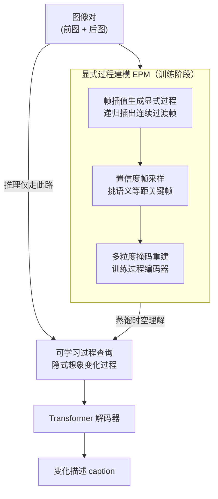

# Imagine How To Change: Explicit Procedure Modeling for Change Captioning

**会议**: ICLR 2026  
**arXiv**: [2603.05969](https://arxiv.org/abs/2603.05969)  
**代码**: [GitHub](https://github.com/BlueberryOreo/ProCap)  
**领域**: LLM预训练  
**关键词**: 变化描述, 过程建模, 帧插值, 掩码重建, 可学习查询, 视觉语言  

## 一句话总结

提出 ProCap 框架，将变化描述从静态图像对比较重新定义为动态过程建模：第一阶段通过帧插值和掩码重建训练过程编码器学习时空变化动力学，第二阶段用可学习过程查询隐式推断变化过程，在三个数据集上超越 SOTA。

## 研究背景与动机

**变化描述（Change Captioning）**是生成文本描述两张相似图像差异，应用于遥感监测、医学诊断、城市规划和工业质控。

现有方法根本局限：

**静态图像对建模**：仅比较"前"和"后"，忽略变化的**动态过程**

**缺失时间线索**：无法理解变化是"如何发生的"

**编码器局限**：各种差异提取器和对齐机制，但都是空间比较而非时空建模

**关键洞察**：两张图像间存在隐含的连续过渡过程，包含丰富的时空动力学。例如物体位移可通过中间帧揭示运动轨迹。

## 方法详解

### 整体框架

ProCap 要解决变化描述里一个被长期忽略的问题：现有方法只拿"前图"和"后图"两帧做静态比较，模型根本看不到变化"是怎么发生的"。它的破题思路是把变化建成一个**连续过程**，并拆成两个阶段来训练与推理。第一阶段叫**显式过程建模（EPM）**：用帧插值在前后两图之间"脑补"出一串连续过渡帧，再从中挑出最关键的几帧，让一个过程编码器在多粒度掩码重建任务里学会变化的时空动力学。第二阶段叫**隐式过程描述（IPC）**：把第一阶段编码器学到的时空理解蒸馏进一小撮可学习查询，推理时不再真的生成中间帧，而是让查询直接从图像对"想象"出变化过程，再由解码器翻成 caption。整条 pipeline 的核心取舍是"训练重、推理轻"——训练靠真实插值帧打底，推理只多几十个参数。

### 关键设计

**1. 帧插值生成显式过程：把"前后两图"补成一条连续轨迹**

变化描述的痛点在于只有起点和终点两帧，模型无从知道变化"怎么发生"。ProCap 用一个预训练的帧插值（FI）模型递归地在两图之间插出中间帧：FI 先预测双向光流，把起始帧和结束帧分别扭曲到中间时刻得到一对候选图，再用一个 Transformer 估计软掩码和残差，把两张扭曲图融合成中间帧。递归插值能把一次变化展开成多帧序列，物体位移这类连续变化的运动轨迹因此被显式地"画"了出来，为后续的时空建模提供了原本缺失的时间线索。

**2. 置信度帧采样：挑出"语义等距"的关键时刻**

插出来的帧可能很多且良莠不齐，直接全用既低效又引入噪声。ProCap 用一个置信度打分挑关键帧，思路是偏好那些与起始帧、结束帧语义距离尽量相等的帧——也就是处在变化"正中间"、信息量最大的过渡时刻。打分用与两端语义距离的平方差作为惩罚项 $(d_{\text{start}}-d_{\text{end}})^2$，无论某帧更偏向哪一端都会被同等惩罚，从而把采样焦点稳定在语义等距的中间帧上，而不是退化成挑出近乎复制起点或终点的"无变化"帧。

**3. 多粒度掩码重建：逼编码器从局部纹理到全帧语义都学一遍**

光有中间帧还不够，得设计任务逼模型真正理解过程。过程建模模块是一个 Transformer 编码器加图像 tokenizer，输入同时含视觉流（patch 特征）、文本流（caption token）以及负责帧一致性和跨模态对齐的特殊 token。训练时从四种掩码里随机选一种施加：整帧掩码迫使模型靠 caption 重建整帧、建立语言到画面的映射；随机 patch 掩码逼出分布式表示；块内掩码聚焦局部纹理；块外掩码学习区域与整体场景的关系。多种粒度交替施压，让同一个编码器在帧级、区域级、patch 级都被迫学到可重建的时空表示，这正是后面要蒸馏进查询的"过程理解"。

**4. 可学习过程查询：推理时把"生成中间帧"换成"想象中间帧"**

帧插值在推理时太慢，是落地的硬伤。ProCap 在第二阶段引入 $k\cdot n_I$ 个可学习过程查询来替代显式中间帧——这些查询继承了第一阶段编码器对变化动力学的理解，直接从图像对里隐式地"想象"出变化过程，再由 Transformer 解码器翻译成 caption。推理因此完全不需要跑帧插值，相比第一阶段仅多出 $k\cdot n_I$ 个参数，$k=2$ 时这点开销几乎可以忽略，却保住了显式过程建模带来的表征优势。

### 损失函数 / 训练策略

第一阶段的过程建模损失由三项构成，$L_{\text{PRO}} = L_{\text{msm}} + L_{\text{align}} + L_{\text{csy}}$。其中 $L_{\text{msm}}$ 在被掩码位置上预测离散图像 token（交叉熵），是掩码重建的主任务；$L_{\text{align}}$ 让模型区分匹配与不匹配的 caption–过程对，强化跨模态对齐；$L_{\text{csy}}$ 让模型区分正常顺序与打乱顺序的帧序列，逼它学到时间一致性而非把帧当作无序集合。第二阶段则用自回归生成损失端到端训练可学习查询和解码器，把前一阶段的时空理解蒸馏进查询里。整体上训练阶段依赖帧插值因而较重，但推理阶段只多 $k\cdot n_I$ 个参数，把"重训练、轻推理"的取舍落到了实处。

## 实验关键数据

### 主实验

**三数据集 SOTA 对比**（表1，CIDEr）：

| 方法 | CLEVR-Change | Spot-the-Diff | Image-Editing |
|------|-------------|---------------|---------------|
| DUDA (2019) | 112.3 | 32.5 | 22.8 |
| SCORER+CBR (2023) | 126.8 | 38.9 | 33.4 |
| MCT-CCDiff (2025) | 131.7 | 41.7 | 38.3 |
| FINER (LLM, 2024) | 137.2 | 61.8 | 50.5 |
| LLaVA-1.5+RP (LLM) | — | 43.2 | 60.9 |
| **ProCap (Ours)** | **135.6** | **42.7** | **40.6** |

非 LLM 方法中全面领先，与 LLM 方法差距显著缩小。

### 消融实验

**组件消融**（CLEVR-Change CIDEr）：

| EPM | IPC | k | CIDEr |
|-----|-----|---|-------|
| N | N | 0 | 108.4 |
| Y | N | 0 | 112.7 |
| N | Y | 1 | 106.2 |
| Y | Y | 1 | **128.5** |

两者结合 CIDEr +20.1（108.4 -> 128.5）。

**查询长度 k**：

| k | TPS | CIDEr |
|---|-----|-------|
| 1 | 766 | 128.5 |
| 2 | 699 | **135.6** |
| 4 | 461 | 128.7 |
| 7 | 271 | 130.5 |

k=2 最优且效率合理。

**损失消融**（CLEVR / StD CIDEr）：

| msm | align | csy | CLEVR | StD |
|-----|-------|-----|-------|-----|
| Y | N | N | 127.5 | 29.7 |
| Y | N | Y | 128.6 | 36.3 |
| Y | Y | Y | **135.6** | **42.7** |

完整组合在 StD 上比仅 msm 提升 13.0。

### 关键发现

1. **过程建模远优于静态比较**
2. **预训练+查询协同**：预训练提供时空理解，查询提供高效推理
3. **轻量但强大**：非 LLM 接近甚至超越 LLM 方法
4. **跨场景泛化**：合成/自然/开放三类均强劲

## 亮点与洞察

1. **范式转移**：从"静态空间比较"到"动态时空过程建模"
2. **两阶段精巧**：训练用显式帧，推理用隐式查询——兼顾表征和效率
3. **置信度采样创意**：选"语义等距"帧聚焦关键时刻
4. **多粒度掩码**：帧级到 patch 级多尺度理解
5. **非 LLM 竞争力**：证明架构创新而非规模也能显著提升

## 局限与展望

1. **帧插值质量依赖**：FI 质量直接影响上限
2. **假设变化可插值**：物体突然出现/消失无法通过光流建模
3. **LLM 解码器缺失**：与 LLM 结合可能更大提升
4. **仅限两张图像**：未扩展到视频变化描述
5. **置信度采样需预定义相似度函数**

## 相关工作与启发

- **DUDA** [Park et al., 2019]：开创性框架——ProCap 根本扩展范式
- **FINER** [Zhang et al., 2024]：LLM 增强——ProCap 无需 LLM 达可比性能
- **VideoMAE** [Han et al., 2022]：视频掩码自编码——ProCap 过程建模受启发
- **VQGAN** [Esser et al., 2021]：图像 tokenizer——用于重建目标
- **RIFE** [Lu et al., 2022]：帧插值——用于显式过程生成

## 评分

| 维度 | 评分 |
|------|------|
| 理论深度 | ⭐⭐⭐ |
| 新颖性 | ⭐⭐⭐⭐⭐ |
| 实验充分性 | ⭐⭐⭐⭐ |
| 写作质量 | ⭐⭐⭐⭐ |
| 实用价值 | ⭐⭐⭐⭐ |
| 总体评价 | ⭐⭐⭐⭐ |

<!-- RELATED:START -->

## 相关论文

- [\[NeurIPS 2025\] Optimal Online Change Detection via Random Fourier Features](../../NeurIPS2025/llm_pretraining/optimal_online_change_detection_via_random_fourier_features.md)
- [\[ICLR 2026\] RECON: Robust symmetry discovery via Explicit Canonical Orientation Normalization](recon_robust_symmetry_discovery_via_explicit_canonical_orientation_normalization.md)
- [\[NeurIPS 2025\] How Does Sequence Modeling Architecture Influence Base Capabilities of Pre-trained Language Models?](../../NeurIPS2025/llm_pretraining/how_does_sequence_modeling_architecture_influence_base_capabilities_of_pre-train.md)
- [\[ICLR 2026\] Identifying and Evaluating Inactive Heads in Pretrained LLMs](identifying_and_evaluating_inactive_heads_in_pretrained_llms.md)
- [\[ICLR 2026\] Pre-training LLM without Learning Rate Decay Enhances Supervised Fine-Tuning](pre-training_llm_without_learning_rate_decay_enhances_supervised_fine-tuning.md)

<!-- RELATED:END -->
