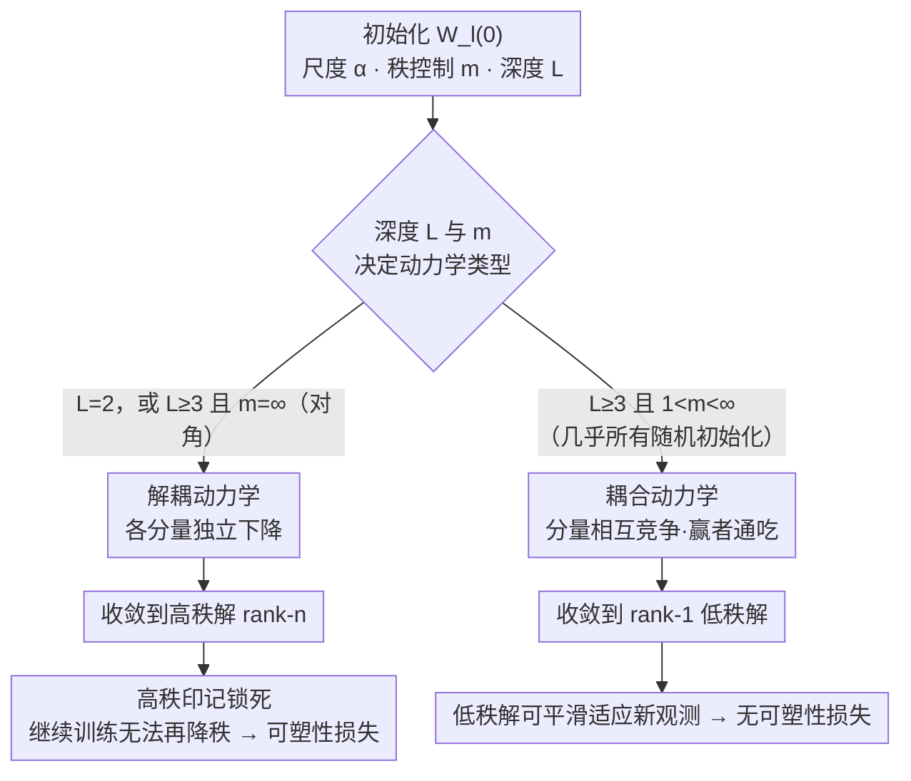

# Implicit Bias and Loss of Plasticity in Matrix Completion: Depth Promotes Low-Rank

**会议**: ICLR 2026  
**arXiv**: [2603.04703](https://arxiv.org/abs/2603.04703)  
**代码**: 无  
**领域**: LLM预训练  
**关键词**: 矩阵补全, 深度矩阵分解, 隐式偏差, 低秩偏好, 可塑性损失

## 一句话总结

通过分析深度矩阵分解（深度线性网络）在矩阵补全任务中的梯度流动力学，证明了耦合动力学是深度网络低秩隐式偏差的关键机制，且深度≥3的网络除对角初始化外必然展现耦合，从而解释了深度模型为何能避免可塑性损失。

## 研究背景与动机

矩阵补全是一个基础且重要的问题：给定矩阵的部分观测值，恢复完整矩阵。深度矩阵分解（将目标矩阵表示为多个矩阵相乘 $W = W_L \cdot W_{L-1} \cdots W_1$）等价于深度线性神经网络，是研究深度如何影响学习动力学的理想简化测试平台。

尽管深度矩阵分解已被广泛研究，现有理论存在两个关键不足：

**大多数理论聚焦于浅层（depth-2）模型**：无法完全解释更深网络中观察到的更强低秩偏好。为什么深度越大，模型越倾向于收敛到低秩解？已有工作（如 Menon, 2024）提出了这一开放问题但未解决。

**可塑性损失现象缺乏理论解释**：Kleinman et al. (2024) 发现，在矩阵补全中先用少量观测值预训练、再用更多观测值继续训练，反而会导致性能下降——这就是可塑性损失。深层网络不受此影响，但浅层网络受影响严重，其机制不明。

本文的核心贡献是识别出**耦合动力学（coupled dynamics）**这一关键机制，将深度、低秩偏差和可塑性损失三者统一到同一理论框架中。

## 方法详解

### 整体框架

这是一篇纯理论论文，要回答的核心问题是：深度网络为什么会自发偏好低秩解、又为什么能躲开浅层网络的可塑性损失？它把深度矩阵分解 $W = W_L \cdots W_1$（等价于深度线性网络）当作最小可解测试平台，在**分块对角观测**（block-diagonal observations）这一设置下，用梯度流（学习率趋零的梯度下降极限）追踪参数演化的 ODE。整条论证都围绕一个核心概念——**耦合动力学**——展开：先给它一个形式化定义，再证明"深度≥3 几乎必然耦合"，接着证明"耦合 ⟺ 收敛到 rank-1"，于是 `深度≥3 ⟹ 耦合 ⟹ 低秩` 这条因果链闭合；最后用同一条链解释可塑性损失——关键在于耦合与否决定了走向低秩还是高秩，而高秩解会把模型"锁死"。分析工具是梯度流的守恒量（约束长时间行为）与 Łojasiewicz 不等式（保证收敛），分块对角结构则把高维问题拆成可单独追踪的低维分量。下图把这条因果链按"耦合 / 解耦"两条分支画出来：

### 关键设计

**1. 耦合动力学的形式化定义：刻画分量间是否相互竞争**

在乘积矩阵 $W = W_L \cdots W_1$ 的演化中，把全部可训练参数 $\theta$ 的梯度流按观测集 $\Omega$ 的子块拆开。若能把 $\Omega$ 划分成若干互不相交的子集，使得跨子集的任意两个观测项 $w_{ij}$、$w_{pq}$ 的梯度始终正交——$\langle \nabla_\theta w_{ij}(t), \nabla_\theta w_{pq}(t)\rangle = 0,\ \forall t$——则各分量沿各自方向独立下降、互不干扰，称动力学是**解耦的**；做不到这种划分时就是**耦合的**。这个区分是整篇论文的支点：耦合让不同分量为同一份"能量"相互竞争，某些方向被持续抑制，系统自然滑向低秩解；解耦则各方向各自为政，最终保留高秩。它对应框架图里"耦合 / 解耦"这个分流节点，后面三个设计都是在它之上展开的。

**2. 深度 ≥ 3 的耦合必然性：解释为何浅网络低秩偏好更弱**

第一个核心结论（Proposition 3.2 / B.1）证明：对深度 $L \geq 3$ 的网络，除非初始化恰好取对角矩阵（$m=\infty$），否则梯度流必然耦合；而任何绝对连续分布（高斯、均匀等）的随机初始化都以概率 1 落在耦合一侧。由于对角初始化是"零测集"，这等于说深网络在实践中无可避免地进入耦合状态。相比之下 depth-2 网络在远更宽的初始化范围（所有 $m>1$）内都维持解耦，这正是浅层网络低秩偏好显著偏弱的根源：不是程度问题，而是从 depth-2 到 depth-3 发生了质变——对应框架图里那条按"深度 $L$ 与 $m$"分流的判断边。

**3. 耦合与 rank-1 收敛的等价性：给出深度促进低秩的充要条件**

第二个核心结论（Theorem 3.3 + Corollary 3.4）在分块对角设置下证明：当 $L\geq3$ 且 $1<m<\infty$（即耦合）时，随初始尺度 $\alpha\to 0$，极限乘积矩阵的**稳定秩**（stable rank，定义为 $\|W\|_F^2/\|W\|_2^2$，衡量"有效维度"）收敛到 1；而解耦情形（$L=2$，或 $L\geq3$ 且 $m=\infty$）下奇异值 $\sigma_1,\dots,\sigma_n$ 都趋于 $\sqrt{w^* s}$、与尺度 $\alpha$ 无关，得到 rank-$n$ 的高秩解。两边合起来就是一句干净的等价：**收敛到 rank-1 当且仅当动力学耦合**，直接回答了 Menon (2024) 留下的开放问题。直觉上耦合制造了分量间的"赢者通吃"竞争——能量逐步集中到主导方向、其余方向被压缩至零，于是低秩成为必然终点。结合设计 2，框架图上半段的 `深度≥3 ⟹ 耦合 ⟹ rank-1` 这条链就完整闭合了。

**4. 可塑性损失的机制揭示：把高秩"印记"锁死归因于解耦**

论文用上述框架解释 Kleinman et al. (2024) 观察到的可塑性损失：先在少量观测上预训练、再加入更多观测继续训练，浅网络反而变差。对深网络（$L\geq3$），预训练阶段已处于耦合、收敛到低秩解，继续训练仍满足耦合条件，因而能从低秩解平滑适应新数据——深度的隐式偏差是有适应性的（这一阶段还可证明损失随训练指数式下降）。对 depth-2 网络，若预训练阶段解耦，则模型收敛到高秩解；即便后续加入更多观测让条件转为耦合，从高秩解出发的梯度流也再无法下降到低秩解——预训练留下的高秩"印记"把模型锁死。这正是框架图里两条分支的终点分野：可塑性损失并非训练数据本身的问题，而是解耦动力学留下的后遗症。

## 实验关键数据

### 主实验：数值验证耦合与低秩

论文通过数值模拟验证理论结果。在合成矩阵补全任务上：

| 深度 L | 初始化类型 | 是否耦合 | 收敛秩 | 可塑性损失 |
|-------|---------|--------|-------|---------|
| 2 | 一般 | 解耦 | 高秩 | ✓ 出现 |
| 2 | 特殊 | 耦合 | Rank-1 | ✗ 无 |
| 3 | 一般 | 耦合 | Rank-1 | ✗ 无 |
| 3 | 对角 | 解耦 | 高秩 | ✓ 出现 |
| 5 | 一般 | 强耦合 | Rank-1 | ✗ 无 |

### 消融实验：深度对耦合强度的影响

| 深度 L | 耦合强度 | 收敛至 Rank-1 的速度 | 说明 |
|-------|---------|------------------|------|
| 2 | 无/弱 | 慢/不收敛 | 依赖初始化 |
| 3 | 中等 | 中等 | 几乎所有初始化都耦合 |
| 5 | 强 | 快 | 耦合効应随深度增强 |
| 10 | 很强 | 很快 | 深度越大低秩偏好越强 |

### 可塑性损失实验

| 配置 | 预训练阶段 | 继续训练阶段 | 最终性能 |
|------|---------|-----------|---------|
| Depth-2, 少量观测预训练 | 解耦→高秩 | 加入更多观测 | 性能下降（可塑性损失） |
| Depth-3, 少量观测预训练 | 耦合→低秩 | 加入更多观测 | 性能提升（无可塑性损失） |
| Depth-2, 无预训练 | - | 直接全部观测 | 正常收敛 |

### 关键发现

1. **耦合是充要条件**：Rank-1 收敛 ⟺ 耦合动力学，这一等价关系非常优美
2. **深度 ≥ 3 是质变点**：从 depth-2 到 depth-3 存在本质区别，不仅是程度差异
3. **可塑性损失是解耦的后遗症**：浅层网络在解耦条件下学到的高秩表示会"锁死"模型的后续学习能力
4. **深度提供了隐式正则化**：无需显式添加秩约束或正则化项，深度本身就偏好低秩解

## 亮点与洞察

- **理论贡献干净利落**：两个主定理各自刻画了问题的一个关键方面，合在一起完整回答了"深度如何促进低秩"这一问题
- **可塑性损失的新视角**：将神经网络中广泛讨论的可塑性损失问题与线性网络的具体数学结构联系起来，提供了一个可以精确分析的测试用例
- **开放问题的解决**：明确回答了 Menon (2024) 关于深度与低秩收敛条件的开放问题
- **对实践的启示**：虽然分析限于线性网络，但"深度带来隐式低秩偏好"这一洞察可推广到非线性设置中，对理解深度学习中的过参数化和泛化有指导意义

## 局限与展望

1. **仅限线性网络**：深度矩阵分解虽是有用的理论工具，但真实深度网络的非线性动力学可能表现出不同行为
2. **分块对角观测的特殊性**：理论结果依赖于这一结构假设，一般观测模式下的推广有待验证
3. **梯度流 vs 离散梯度下降**：分析在连续时间极限下进行，有限学习率下可能出现额外效应
4. **未讨论深度与宽度的交互**：实际网络中宽度也影响隐式偏差，二者的协同效应未涉及
5. **初始化尺度的影响**：论文主要讨论了初始化的结构（是否对角），对初始化尺度的影响讨论有限

## 相关工作与启发

- **与 Arora et al. (2019)、Razin & Cohen (2020) 的联系**：这些工作揭示了深度矩阵分解的低秩偏好，本文提供了更精确的充要条件
- **与 Lyle et al. (2023)、Kumar et al. (2024) 的可塑性损失研究互补**：后者从经验角度观察非线性网络中的可塑性损失，本文提供了线性网络中的精确理论
- **对持续学习/领域自适应的启发**：可塑性损失是持续学习中的核心挑战，本文揭示的深度-耦合-低秩机制为设计新方法提供理论依据
- **对矩阵恢复算法的影响**：说明深度参数化可以作为一种隐式核范数正则化

## 评分
- 新颖性: ⭐⭐⭐⭐⭐ (耦合动力学的形式化分析是全新视角)
- 实验充分度: ⭐⭐⭐⭐ (数值验证充分，但限于合成数据)
- 写作质量: ⭐⭐⭐⭐⭐ (理论论文典范，定理陈述清晰)
- 价值: ⭐⭐⭐⭐ (理论贡献优秀，但实际应用距离较远)

<!-- RELATED:START -->

## 相关论文

- [\[ICML 2026\] FlexRank: Nested Low-Rank Knowledge Decomposition for Adaptive Model Deployment](../../ICML2026/llm_pretraining/flexrank_nested_low-rank_knowledge_decomposition_for_adaptive_model_deployment.md)
- [\[ICCV 2025\] ETA: Energy-based Test-time Adaptation for Depth Completion](../../ICCV2025/llm_pretraining/eta_energy-based_test-time_adaptation_for_depth_completion.md)
- [\[ICML 2025\] Inductive Gradient Adjustment for Spectral Bias in Implicit Neural Representations](../../ICML2025/llm_pretraining/inductive_gradient_adjustment_for_spectral_bias_in_implicit_neural_representatio.md)
- [\[NeurIPS 2025\] Breaking the Frozen Subspace: Importance Sampling for Low-Rank Optimization in LLM Pretraining](../../NeurIPS2025/llm_pretraining/breaking_the_frozen_subspace_importance_sampling_for_low-rank_optimization_in_ll.md)
- [\[ICML 2026\] Inverse Depth Scaling From Most Layers Being Similar](../../ICML2026/llm_pretraining/inverse_depth_scaling_from_most_layers_being_similar.md)

<!-- RELATED:END -->
