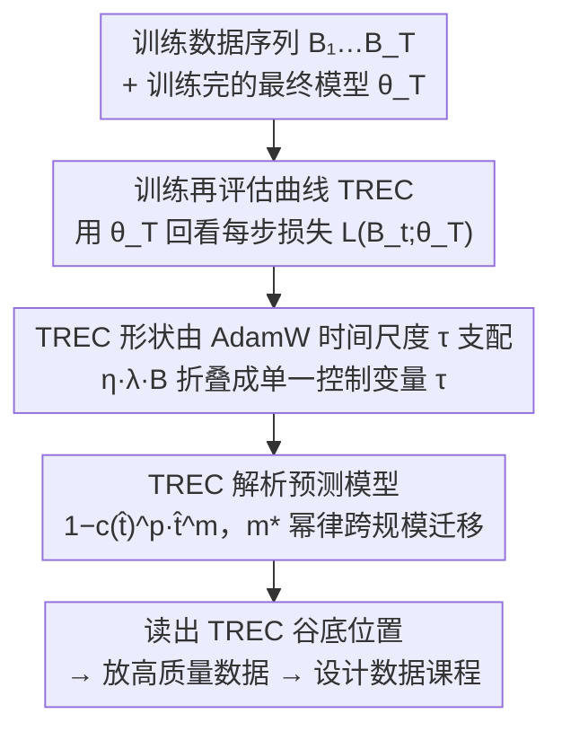

# Predicting Training Re-evaluation Curves Enables Effective Data Curriculums

**会议**: ICLR 2026  
**arXiv**: [2509.25380](https://arxiv.org/abs/2509.25380)  
**代码**: 无  
**领域**: LLM预训练  
**关键词**: 训练再评估曲线, 数据课程学习, AdamW时间尺度, 高质量数据放置, 持续预训练

## 一句话总结

提出训练再评估曲线（TREC）诊断工具，通过分析训练完成后模型在各时间步训练数据上的损失来指导高质量数据的最优放置位置，并证明 TREC 形状可通过 AdamW 的隐式 EMA 系数预测，无需实际训练即可设计数据课程。

## 研究背景与动机

当前 LLM 训练普遍采用多阶段数据课程策略：在预训练末期（退火阶段）引入高质量、特定领域或最新数据。这一做法基于一个假设——在学习率接近零时呈现数据能最大化其效果。然而，这一假设缺乏理论支撑，且"许多关于预训练最优数据分布的有趣问题仍未解答"（Anil et al., 2023）。

实践中，确定高质量数据的最佳引入时机主要依赖启发式规则或代价高昂的消融实验。例如 Llama-3 405B 在 GSM8k 训练集上退火却未获收益，OLMo-2 13B 只在最后5.7%训练中使用高质量混合。不同策略的效果差异巨大，但缺少统一的理论框架来解释和预测。

本文的核心洞察是：高质量数据不一定应放在训练末尾，而应放在模型**最能保留该数据**的位置——即 TREC 的最低点。

## 方法详解

### 整体框架

本文不改训练算法，而是给出一套"何时放高质量数据"的诊断与预测流程：先定义训练再评估曲线（TREC），用最终模型回看每一步训练数据的损失，并验证 TREC 最低点就是高质量数据的最优放置位置；再追问 TREC 形状由什么决定，发现 AdamW 的隐式 EMA 时间尺度 τ 是主导因素；最后把 EMA 系数与训练进度调整项组合成一个解析式，在不实际训练的前提下预测整条 TREC，从而直接读出谷底位置来设计数据课程。三个阶段层层递进，下面的框架图给出从训练数据到课程决策的完整链路。

### 关键设计

**1. 训练再评估曲线（TREC）：用最终模型回看，量化每一步数据被"记住"的程度**

课程设计的难点在于，训练过程中各时间步的数据对最终模型的贡献并不均等，但这种贡献在训练时无法直接观测。TREC 的做法是事后回看：给定从分布 $D$ 独立同分布采样的批次序列 $B_1,\dots,B_T$ 和训练结束时的参数 $\theta_T$，定义 $\mathcal{L}_{re}(t) := \mathcal{L}(B_t; \theta_T)$，即用最终模型在每个历史批次上重新计算损失。某个时间步的 TREC 越低，说明最终模型对该步数据的"记忆"越深，把高质量数据放在这里就越能被保留。由此得到全文的核心假设——在 TREC 最低处放置高质量数据，能最大化它对目标任务的贡献，这也解释了为什么默认"末尾退火"未必最优。

**2. TREC 形状由 AdamW 时间尺度 τ 支配：把三个超参折叠成一个变量**

要在训练前预测 TREC，必须先找到它真正依赖的量。本文把 AdamW 的参数 $\theta_t$ 视为权重更新的指数移动平均，其时间尺度为 $\tau = \frac{1}{\eta \lambda T} = \frac{B}{\eta \lambda D}$，其中 $\eta$ 为学习率、$\lambda$ 为权重衰减、$T$ 为总步数、$B$ 为批量大小、$D$ 为总 token 数。关键观察是：无论通过改 $\eta$、$\lambda$ 还是 $B$ 来调 $\tau$，只要最终 $\tau$ 相同，TREC 形状就一致——三个看似独立的超参被折叠成单一控制变量。该结论在 111M 到 3.3B 参数、计算量跨越 1000× 的模型上都成立，使后续的跨规模预测成为可能。

**3. TREC 的解析预测模型：EMA 系数加进度修正，拟合一次泛化到大模型**

仅靠 EMA 系数 $c(\hat{t})$ 还不够，因为早期梯度的效力会随"最小化器漂移"衰减，必须引入一个进度修正项。本文给出 $\hat{\mathcal{L}}_{re}(\hat{t}) = 1 - c(\hat{t})^p \cdot \hat{t}^m$，其中 $\hat{t} = t/T$ 为训练进度分数，$p$ 固定为 0.5 控制 EMA 贡献强度，$m$ 控制 TREC 何时开始反映 EMA。最优 $m^*$ 进一步服从幂律 $m^* = C \cdot (\text{TPP})^{\mu_1} \cdot (\tau)^{\mu_2}$，仅由 tokens-per-parameter（TPP）与 $\tau$ 两个变量决定。正因为这两个变量可跨规模迁移，在 111M 规模拟合出的幂律放到 3.3B 规模仍保持约 98% 的 Pearson 相关性，意味着小模型上算一次就能预测大模型的数据课程。

### 训练策略

本文不引入新的损失函数，而是把 TREC 预测转化为对已有 AdamW 训练的数据排布建议。在 step-decay 调度下，TREC 谷底出现在学习率下降之前而非训练末尾；在线性衰减到零（D2Z）调度下，谷底落在训练约 60–80% 处。此外，TREC 的绝对下降幅度随 TPP 增大而减小，说明过训练的模型更难牢记特定数据，因而高 TPP 场景下数据放置位置的收益也相应变小。

## 实验关键数据

### 主实验：数据放置验证（610M 模型，82 TPP）

对于每种学习率调度，训练10个模型，每个将5B的代码混合（CB）数据分别插入训练的不同10%段中。

| 学习率调度 | 最佳放置位置 | 是否对应 TREC 最低点 | 相比均匀混合提升 |
|-----------|------------|-------------------|--------------|
| Step-decay (70%处下降) | 段6-7 (60-70%) | ✓ | 明显优于均匀 |
| 10× 线性衰减 | 最后段 (90-100%) | ✓ | 明显优于均匀 |
| 衰减到零 (D2Z) | 最后段 | ✓ | 明显优于均匀 |

### TREC 预测准确性

| 模型规模 | m* 预测 R² | TREC 形状 Pearson rₚ |
|---------|---------|---------------------|
| 111M | 98.9% | 96.6% |
| 266M | 97.2% | 97.5% |
| 610M | 98.7% | 98.4% |
| 1.7B | 89.0% | 98.7% |
| 3.3B | 76.7% | 98.6% |

### 稀疏 MoE 实验（111M 基础模型）

| 专家数 E | 有效TPP | TREC行为 |
|---------|--------|---------|
| 1 (密集) | 20 | 最浅下降 |
| 4 | 5 | 更深更早的谷底 |
| 8 | 2.5 | 更深更早 |
| 32 | 0.625 | 最深最早的谷底 |

### 3.9B 持续预训练

| 配置 | 数学验证集表现 |
|------|-------------|
| 高质量数据放在中间（TREC谷底） | 最优（所有学习率下） |
| 高质量数据放在末尾 | 次优 |
| 无高质量数据 | 基线 |

### 消融实验

| 消融维度 | 关键发现 |
|---------|---------|
| β₁, β₂ 变化 | TREC 形状几乎不变，证明 τ 是主导因素 |
| 批量大小 > B_crit | TREC 形状显著偏离，单个批次影响减弱 |
| TPP 增大 | TREC 下降幅度减小（记忆能力减弱） |
| 不同调度间 | τ 匹配时 TREC 形状对齐 |

### 关键发现

1. **TREC 谷底 ≠ 训练末尾**：尤其在 Step-decay 调度下，高质量数据应放在学习率下降前而非末尾
2. **τ 是万能钥匙**：改变学习率、权重衰减或批量大小，只要 τ 匹配，TREC 就匹配
3. **可跨规模预测**：在 111M 模型上拟合的 m* 幂律可泛化到 3.3B（1000×计算量）
4. **解释了 Llama-3 405B 的失败**：退火阶段仅3个优化步骤且 LR 几近为零，EMA 系数本质为零
5. **MoE 专家 = 降低有效 TPP**：导致更强记忆化，TREC 分析可指导 MoE 的数据策略

## 亮点与洞察

- **TREC 是极简但深刻的诊断工具**：仅需用最终模型重新评估训练数据就能揭示数据影响力的时间结构
- **理论基础扎实**：幂律预测模型有清晰的理论动机（二次损失面上的最小化器漂移），且经过从 111M 到 3.9B 的大规模验证
- **实用价值极高**：为从业者提供了一种无需昂贵消融实验就能确定最优数据排布的方法
- **与现有工作的整合自然**：成功解释了 OLMo-2、Feng et al.、Pangu-Ultra 等已发表训练方案的数据策略选择
- **对 CPT/SFT 场景有直接指导**：TREC 预测不仅适用于预训练，也适用于持续预训练（CPT）阶段

## 局限与展望

1. **优化器范围局限**：预测模型专为 AdamW 设计，扩展到 Adagrad、Adafactor、SGD 等非 EMA 类优化器是开放问题
2. **TREC 绝对值不可跨调度比较**：TREC 在同一调度内可靠指导放置，但跨不同调度的绝对值比较会失效
3. **仅预测 TREC 形状，未预测幅度**：当前模型归一化后比较形状，绝对幅度的预测尚待探索
4. **未系统分析不同数据类型**：如事实类 vs 推理类、指令 vs 叙事内容的 TREC 差异
5. **高学习率下的异常行为**：3.9B CPT 中 η=0.015 产生最深 TREC 谷但最差验证性能，机制未明

## 相关工作与启发

- **与 AdEMAMix（Pagliardini et al., 2024）互补**：后者设计慢遗忘优化器，本文则利用遗忘结构来指导数据放置
- **与数据混合定律（Ye et al., 2024）正交**：后者研究"放什么数据"，本文研究"何时放数据"
- **为 Scaling Collapse（Qiu et al., 2025）提供互补视角**：两者都使用归一化计算/训练进度，但目标不同
- **对可重复性有实际建议**：如 Falcon-H1 的"memorization window"概念可用 TREC 精确化
- **启发了"不遗忘的学习率调度"设计**：理论上可设计使 TREC 平坦的调度，但实践中一定程度的遗忘是有益的

## 评分
- 新颖性: ⭐⭐⭐⭐⭐ (TREC概念新颖且优雅，理论与实践完美结合)
- 实验充分度: ⭐⭐⭐⭐⭐ (600+ TRECs，111M到3.9B，多调度多超参)
- 写作质量: ⭐⭐⭐⭐⭐ (逻辑清晰，层层递进，图表精美)
- 价值: ⭐⭐⭐⭐⭐ (对LLM训练的数据策略有直接实践指导意义)

<!-- RELATED:START -->

## 相关论文

- [\[ACL 2026\] Data Mixing Agent: Learning to Re-weight Domains for Continual Pre-training](../../ACL2026/llm_pretraining/data_mixing_agent_learning_to_re-weight_domains_for_continual_pre-training.md)
- [\[ACL 2025\] Model Performance-Guided Evaluation Data Selection for Effective Prompt Optimization](../../ACL2025/llm_pretraining/model_performance-guided_evaluation_data_selection_for_effective_prompt_optimiza.md)
- [\[ACL 2025\] Towards Effective and Efficient Continual Pre-training of Large Language Models](../../ACL2025/llm_pretraining/towards_effective_and_efficient_continual_pre-training_of_large_language_models.md)
- [\[ICLR 2026\] Accessible, Realistic, and Fair Evaluation of Positive-Unlabeled Learning Algorithms](accessible_realistic_and_fair_evaluation_of_positive-unlabeled_learning_algorith.md)
- [\[ICLR 2026\] A Law of Data Reconstruction for Random Features (and Beyond)](a_law_of_data_reconstruction_for_random_features_and_beyond.md)

<!-- RELATED:END -->
