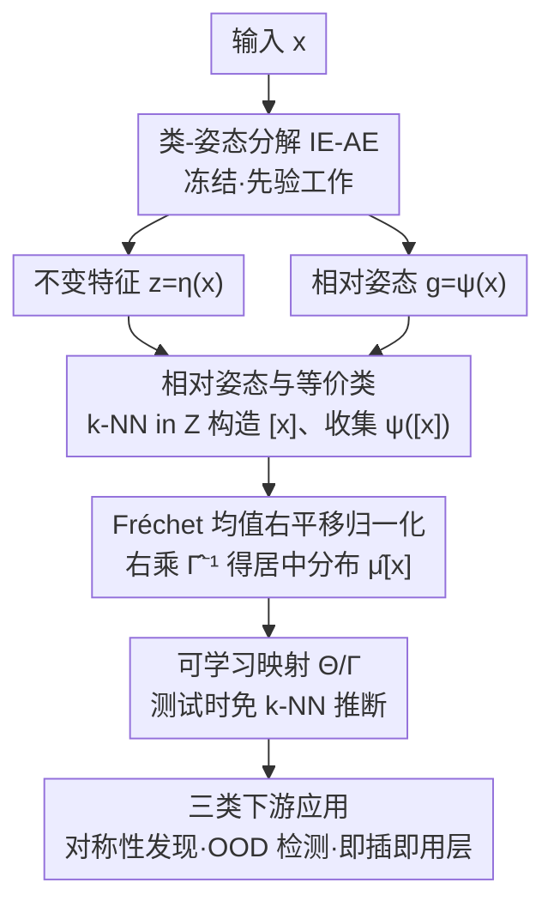

# RECON: Robust symmetry discovery via Explicit Canonical Orientation Normalization

**会议**: ICLR 2026  
**arXiv**: [2505.13289](https://arxiv.org/abs/2505.13289)  
**代码**: [ZIB-IOL/recon](https://github.com/ZIB-IOL/recon)  
**领域**: 对称性发现 / 不变性学习  
**关键词**: 对称性发现, 正则化方向, 类-姿态分解, 即插即用, 群不变性

## 一句话总结

提出 RECON，一种类-姿态无关的正则化方向归一化方法，通过简单的右平移（right translation）修正任意训练过程中产生的正则化表示，实现无监督的实例级对称性发现、OOD 姿态检测以及即插即用的测试时正则化层。

## 研究背景与动机

### 领域现状

现实世界数据通常展示出未知的、实例相关的对称性，这些对称性很少能精确匹配预先固定的变换群 $G$。传统的等变/不变网络方法要么硬编码特定群结构，要么通过数据增强隐式学习。而类-姿态分解（class-pose decomposition）方法试图将输入分解为不变特征和一个相对于某个正则化表示的姿态 $g \in G$。

### 现有痛点

然而，现有的正则化方法存在一个根本问题：**正则化表示依赖于训练过程，是任意的**。不同的训练运行、不同的初始化会产生不同的正则化选择，这带来三重困境：学到的姿态分布难以解释、跨模型比较失去意义、姿态信息无法直接用于下游任务。

RECON 的核心洞察是：任意的正则化选择可以通过简单的群运算（右平移）来修正，使其对齐到数据本身的自然正则化方向。这个修正是后处理的，不需要重新训练模型。

## 方法详解

### 整体框架

RECON 要解决的是「正则化方向任意」这个老问题。类-姿态分解方法（class-pose decomposition，代表作 IE-AE）会把一张输入 $x$ 拆成两部分：一个不变特征 $z=\eta(x)$（与姿态无关，捕捉"是什么"），和一个相对姿态 $g=\psi(x)\in G$（把网络重建出的正则表示 $\hat x$ 旋回原图所需的群变换）。痛点在于这个 $\hat x$ 的朝向完全由初始化和训练动力学决定、纯属任意，于是同一个 ±30° 旋转的"7"在不同模型里会被记成完全不同的相对姿态分布，跨实例、跨模型都没法比较。

RECON 不重训任何网络，而是在拿到任意 IE-AE 的 $(z,g)$ 之后做三步后处理：先用不变特征 $z$ 把数据无监督地聚成等价类 $[x]$，再估出这一类相对姿态分布的**偏移量**（Fréchet 均值），最后对所有姿态做一次**右平移**把分布的中心拉回群单位元 $e$。校正后的分布 $\hat\mu_{[x]}$ 就是数据"自然"的对称分布，可解释（以 $e$ 为中心）、可比较（跨类同一参考系）、可复用（喂给下游做发现 / 检测 / 即插即用归一化）。

### 关键设计

**1. 相对姿态与等价类：在无标注下凑齐归一化所需的原料**

右平移要起作用，得先有"同一类样本的一堆相对姿态"。RECON 把它建立在 IE-AE 给出的不变特征 $z$ 上：论文假设结构相似的物体在不变隐空间 $Z$ 里会落到相邻、连通的区域，于是用一个连通性等价关系定义类——$x\sim_\varepsilon y$ 当且仅当存在一条 $Z$ 里步长小于 $\varepsilon$ 的链把二者连起来，记所得等价类为 $[x]$。实践中不必真的求连通分量，直接对 $\eta(x)$ 在 $Z$ 里取 $k$ 近邻近似 $[x]$ 即可（Algorithm 1 第 2 步）。拿到 $[x]$ 后，把类内每个样本经 $\psi$ 得到的相对姿态汇成集合 $\psi([x])=\{\psi(s_j)\}$，这就是后面归一化的输入。整个过程不依赖任何标签，对称群 $G$（如 $SO(2)$、$SE(3)$）的结构是唯一需要预先指定的先验。

**2. Fréchet 均值右平移归一化：把任意正则一步拉回单位元（核心）**

这是 RECON 唯一的核心创新（Proposition 3.1）。论文用生成模型 $s=\rho_X(g)\gamma_{[x]}+\varepsilon_s,\ g\sim\mu_{[x]}$ 刻画一类样本：真实姿态服从某分布 $\mu_{[x]}$、作用在参考姿态 $\gamma_{[x]}$ 上、再叠一点非群形变 $\varepsilon_s$。理想的"自然"描述应当让 $\mu_{[x]}$ 的中心落在群单位元 $e$（即 $F(\mu_{[x]})=e$）——比如把"7"的旋转对称写成以竖直"7"为参考的 $U([-30°,30°])$，而不是以歪着的"7"为参考的 $U([150°,210°])$。问题是任意正则把观测到的 $\psi([x])$ 相对真值整体平移了一个未知偏移。RECON 的关键观察是：这个偏移恰好就是 $\psi([x])$ 这堆姿态的**Fréchet 均值**（黎曼流形上的质心）

$$\hat\Gamma_{[x]}=\arg\min_{y\in G}\sum_{g_i\in\psi([x])}d_G(y,g_i)^2,$$

于是只要对每个姿态**右乘它的逆** $\psi'([x])=\{g_i\hat\Gamma_{[x]}^{-1}\}$，就把分布的 Fréchet 中心搬回了 $e$。Proposition 3.1 证明这样得到的经验分布 $\hat\mu_{[x]}$ 在 $\varepsilon'\to0$、$N\to\infty$ 时以 Wasserstein 距离收敛到真分布 $\mu_{[x]}$。因为右平移是群上的精确代数运算，校正不引入近似、不需一次梯度更新，是真正零成本的后处理。唯一的坑是多峰分布：当 $\mu_{[x]}$ 在 $SO(2)$ 上有两个对峙的等高峰时，普通 Fréchet 均值可能落到支撑集之外、造成又一次 OOD 正则。为此论文用 Tukey biweight 损失替换平方距离，给出鲁棒的 **Tukey-Fréchet 均值** $F_r(\mu)=\arg\min_y\mathbb{E}_{g\sim\mu}[m(d_R(y,g);c)]$，它在多峰下能稳定收敛到同一个模态，可作即插即用的替换件。

**3. 可学习映射：把归一化推广到测试时未见输入**

Algorithm 1 只能对训练集里的类做归一化（要现场算 $k$ 近邻和 Fréchet 均值）。为了在测试时对全新输入也能即时输出对称分布，RECON 把训练集上估出的分布参数 $\hat\theta_{[x]}$ 和居中变换 $\hat\Gamma_{[x]}$ 当作伪标签，学两个映射：一个 $\Theta$ 直接预测输入的对称分布参数，一个预测其居中变换。这样测试时不再需要回到训练集做近邻检索，单次前向就能给出归一化后的实例级对称描述，是把后处理算法摊销成一次推理的工程化手段。

**4. 三类下游应用：同一套归一化分布的三种用法**

居中后的对称分布 $\hat\mu_{[x]}$ 一旦在手，三件事顺理成章地落地。**对称性发现**：放松"全体样本共享同一对称群"的假设后，每个实例都有自己的 $\hat\mu_{[x]}$——旋转对称的分子呈现对应其对称阶数的多峰分布、非对称分子则没有，纯靠统计校正后的姿态就能逐实例推断对称性。**OOD 姿态检测**：$\hat\mu_{[x]}$ 的支撑集刻画了"正常姿态"的样子，测试样本的姿态若落在支撑集外即判为分布外，在分子构象里这类姿态往往对应不稳定或非物理的构象，判据自带物理含义。**即插即用归一化层**：把右平移反过来用，封成一个轻量层挂在任意冻结预训练模型前面，推理时先把输入对齐到自然正则方向再送进下游网络，等价于在几何层面给模型注入群不变性、且完全不动其权重——思路类似 adapter，但操作的是输入几何朝向而非特征。

### 损失函数 / 训练策略

RECON 的核心校正是解析的群运算，不含可学习参数、不需要梯度优化；底层的类-姿态分解（IE-AE 等）用标准重建损失 $d(\rho_X(\psi(x))\,\delta(\eta(x)),x)$ 单独训练，RECON 只是事后接管其姿态输出。唯一需要训练的是第 3 点里的两个可学习映射 $\Theta/\Gamma$，它们以 Algorithm 1 估出的 $\hat\theta_{[x]}$、$\hat\Gamma_{[x]}$ 为伪标签做回归（$L_p=d_\theta(\Theta(x),\hat\theta_{[x]})$ 等），不引入额外正则项。

## 实验关键数据

### 主实验

实验在图像数据集和分子构象数据集上进行验证。

**图像分类**（旋转 MNIST 等）

| 方法 | 分类准确率 | 正则化质量 | 说明 |
|------|----------|----------|------|
| 无正则化基线 | 较低 | N/A | 不具备旋转不变性 |
| 传统正则化 | 中等 | 依赖训练 | 正则化是任意的 |
| **RECON** | **最优或持平** | **数据对齐** | 无需重新训练 |

**分子构象分析**

| 方法 | 对称性发现 | OOD 检测 | 说明 |
|------|----------|---------|------|
| 固定群方法 | 无法处理实例级差异 | 不支持 | 假设统一对称群 |
| **RECON** | **准确** | **有效** | 支持实例级对称性 |

### 消融实验

| 配置 | 关键指标 | 说明 |
|------|---------|------|
| 不同底层分解模型 | 性能稳定 | RECON 对底层模型选择不敏感 |
| 不同群结构 | 均适用 | 验证了方法的群无关性 |
| 有/无 RECON 层 | +显著提升 | 证明即插即用层的价值 |

### 关键发现

1. RECON 的正则化修正是精确的——不引入近似误差，因为基于群的代数运算
2. 发现的实例级姿态分布与物理/化学直觉一致（如分子的旋转对称阶数）
3. 即插即用层在不重新训练的情况下，就能显著提升预训练模型在变换后数据上的鲁棒性
4. 方法在图像和分子两个截然不同的领域都有效，展示了通用性

## 亮点与洞察

1. **理论优雅**：将正则化选择的任意性问题转化为群论中的一个简单平移运算，既数学上严谨又实现上简洁
2. **零成本修正**：不需要重新训练任何模型，是一个纯粹的后处理方法，这使得它在实际应用中极具吸引力
3. **实例级对称性**：突破了"所有样本共享相同对称群"的常见假设，更贴近真实世界数据的特性
4. **即插即用设计**：可以为任意预训练模型注入不变性，类似于 adapter 的思想但在几何层面操作
5. **跨领域验证**：从图像到分子，展示了群论方法的普适性

## 局限与展望

1. **依赖底层分解模型的质量**：如果底层的类-姿态分解模型本身不准确，RECON 的修正也会受影响
2. **需要知道变换群 $G$**：虽然不需要知道具体的对称性，但仍需指定作用群的结构（如 SO(2)、SE(3)）
3. **连续群上的估计挑战**：在高维连续群上估计姿态分布可能面临统计效率问题，多峰情形还要靠 Tukey-Fréchet 才能稳住居中变换
4. **依赖隐空间聚类假设**：等价类靠不变特征 $z$ 的 $k$ 近邻近似，若 IE-AE 的隐空间未把不同类分得足够开，等价类会污染相对姿态的统计
5. **可扩展方向**：将 RECON 扩展到更复杂的群结构（如无限维群、离散群的混合）

## 相关工作与启发

- **等变神经网络**（E(n)-equivariant GNN 等）：RECON 提供了一种正交的方式来实现不变性——不是改变网络架构，而是改变输入
- **正则化网络**（Canonical orientation networks）：RECON 解决了这类方法中正则化依赖训练的核心问题
- **对称性发现**：与 Lie 群发现等方法互补，RECON 关注的是实例级对称性而非全局对称性
- 启发：简单的群论运算有时比复杂的学习方法更有效；"后处理"思路在不变性学习中被低估了

## 评分

- 新颖性: ⭐⭐⭐⭐ — 右平移修正的思路优雅且新颖，但核心是群论的直接应用
- 实验充分度: ⭐⭐⭐ — 验证了图像和分子两个领域，但全文细节无法完全确认
- 写作质量: ⭐⭐⭐⭐ — 摘要清晰，理论描述精确
- 价值: ⭐⭐⭐⭐ — 为等变/不变性学习社区提供了一个实用的工具

<!-- RELATED:START -->

## 相关论文

- [\[ICLR 2026\] Imagine How To Change: Explicit Procedure Modeling for Change Captioning](imagine_how_to_change_explicit_procedure_modeling_for_change_captioning.md)
- [\[NeurIPS 2025\] A Practical Guide for Incorporating Symmetry in Diffusion Policy](../../NeurIPS2025/llm_pretraining/a_practical_guide_for_incorporating_symmetry_in_diffusion_policy.md)
- [\[ICML 2026\] MOOSE-Star: Unlocking Tractable Training for Scientific Discovery by Breaking the Complexity Barrier](../../ICML2026/llm_pretraining/moose-star_unlocking_tractable_training_for_scientific_discovery_by_breaking_the.md)
- [\[ICML 2025\] Language Models over Canonical Byte-Pair Encodings](../../ICML2025/llm_pretraining/language_models_over_canonical_byte-pair_encodings.md)
- [\[ICML 2025\] Towards Robust Influence Functions with Flat Validation Minima](../../ICML2025/llm_pretraining/towards_robust_influence_functions_with_flat_validation_minima.md)

<!-- RELATED:END -->
