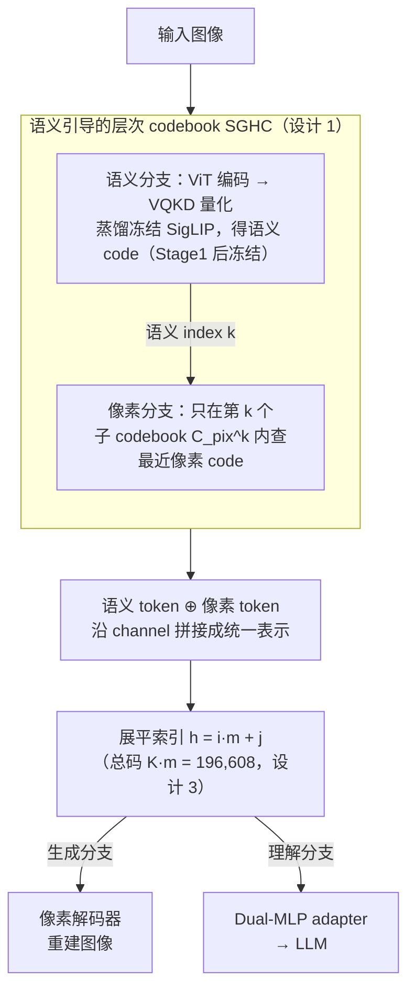

# SemHiTok: A Unified Image Tokenizer via Semantic-Guided Hierarchical Codebook

**会议**: ICLR 2026  
**arXiv**: [2503.06764](https://arxiv.org/abs/2503.06764)  
**领域**: LLM预训练  
**关键词**: 图像tokenizer, 层次codebook, 语义引导, 理解+生成统一, SGHC, MLLM

## 一句话总结
提出SemHiTok——通过语义引导层次codebook(SGHC)统一理解和生成的tokenizer：预训练语义codebook上建像素子codebook，结构和训练解耦(分阶段优化)避免联合训练的语义-像素冲突，LLaVA设定下离散tokenizer中理解和重建都SOTA。

## 研究背景与动机

**领域现状**：统一MLLM需同时支持理解(高层语义)和生成(低层像素)的tokenizer。

**现有痛点**：
   - (1) CLIP族→语义好丢像素; VQGAN族→保像素缺语义
   - (2) 联合训练(VILA-U混合loss→子最优; SDE encoder解耦但codebook混合)
   - (3) 双编码器(Janus)→token翻倍或词汇爆炸→不高效
   - (4) TokenFlow shared mapping但联合训练仍影响性能

**切入角度**：观察到同语义code的patches有相似像素→在每个语义code下建子codebook→结构+训练都解耦。

## 方法详解

### 整体框架

统一 MLLM 需要一份 tokenizer 同时喂得了"理解"（高层语义）和"生成"（低层像素）两类任务，但这两个目标在以往方法里总是互相拖累：CLIP 族保语义却丢像素，VQGAN 族保像素却缺语义，硬把两者塞进一个扁平 codebook 又会让语义和像素互相争抢码字。SemHiTok 的思路是把一张图的离散表示拆成两条互补分支、并让它们**层次嵌套**：语义分支先用 VQKD 蒸馏冻结的 SigLIP，学出一个只管高层语义的语义 codebook $C_\text{sem}$；像素分支再在每个语义 code 之下挂一组子 codebook，专门刻画该语义簇内部的像素细节。量化时一个 patch 先拿到它的语义 index，再到对应的像素子 codebook 里查像素 code，两路 token 沿 channel 维拼接成统一表示——既能解码回图像做生成，也能展平成词表 id 接进 LLM 做理解。整套设计的精髓在于让像素 codebook 寄生在语义 codebook 的层次之下，并配合分阶段训练，从结构和训练两条线上都把语义、像素两个目标解耦开。

> 分阶段训练（设计 2）是贯穿上图的训练调度：先单独训语义分支并冻结 $C_\text{sem}$，再在冻结骨架上只训像素分支。

### 关键设计

**1. 语义引导的层次 codebook（SGHC）：用"同语义 patch 像素也相近"细分像素空间**

这一步要解决的是扁平 codebook 里语义和像素互相争抢码字的核心矛盾。语义分支先以冻结的 SigLIP 特征为蒸馏目标，编码器输出经 EMA 更新的向量量化得到语义 code，再用 cosine 相似度加 $L_1$ 损失把量化后的特征对齐回 SigLIP，从而钉死一份只管"图像该被怎么理解"的语义骨架。作者进一步观察到：被分到同一个语义 code 的 patch，其像素分布也高度相似——于是不再用一个扁平像素 codebook 硬扛全图的像素多样性，而是把它拆成一组子 codebook $C_\text{pix}=\{C_\text{pix}^1,\dots,C_\text{pix}^K\}$，对应 $K$ 个语义 code、每个语义 code 下挂 $m$ 个子 code。量化 patch $i$ 时先由语义分支拿到语义 index $k$，再只在第 $k$ 个子 codebook $C_\text{pix}^k$ 里查最近的像素 code。这样每个子 codebook 只需刻画一个语义簇内部的像素细节，建模任务被天然切小、重建更精细，同时像素 code 的选择被语义结构约束，语义与像素不再争抢同一份码字。

**2. 分阶段训练：从训练流程上彻底拆开语义与像素两个目标**

即便结构上已经层次化，若两条分支联合优化，重建 loss 仍会反传去扰动语义层、把好不容易学到的语义信号冲垮。SemHiTok 干脆分两阶段：Stage 1 只训语义分支（VQKD 蒸馏 SigLIP），训完即冻结 $C_\text{sem}$，后续任何梯度都动不了它；Stage 2 在这副冻结的语义骨架上只训像素分支，用 $L_1$、perceptual 与 GAN 损失驱动重建。因为两阶段的优化目标不在同一时刻竞争，语义-像素冲突被从源头消除，理解能力也不会在重建训练中退化。这正是它相比 VILA-U（混合 loss 导致子最优）、TokenFlow（共享映射但联合训练仍互相影响）的关键区别——别人是在一个时刻里权衡两个目标，它把两个目标错开到两个时刻。

**3. 统一 MLLM 集成：把层次 index 展平成普通词表，无缝接进 LLM**

层次 codebook 若直接用，会让 token 数翻倍或词汇爆炸（双编码器路线如 Janus 就栽在这里）。SemHiTok 用展平索引 $h=i\cdot m+j$ 把"第 $i$ 个语义 code、其下第 $j$ 个像素子 code"映射成单一整数 id，总词表大小 $K\cdot m=196{,}608$，与 Qwen2 约 150K 的文本词表量级相当，不会膨胀。接入时用一个 Dual-MLP adapter 分别投影语义 token 与像素 token 再拼接送进 LLM，使理解侧吃语义、生成侧吃像素，一份 tokenizer 同时服务两类任务。

### 损失函数 / 训练策略

整体超参：SigLIP 全程冻结作为蒸馏锚点；语义码数 $K$ 个、每个语义码下子码 $m=8$，展平后总码数 196,608；统一 MLLM 以 Qwen2.5-7B-Instruct 为 base。Stage 1 用 cosine 加 $L_1$ 对齐 SigLIP，Stage 2 叠加 $L_1$、perceptual 与 GAN 三项重建损失（权重 $\lambda_1/\lambda_2/\lambda_3$）。

## 实验关键数据

### 重建(Table 1, ImageNet-50k)

| 方法 | 类型 | Codebook | rFID↓ |
|------|------|----------|-------|
| LlamaGen | Only Recon | 16,384 | 2.19 |
| IBQ | Only Recon | 262,144 | 1.00 |
| VILA-U | Unified | 16,384 | 1.80 |
| TokenFlow | Unified | 32,768 | 1.37 |
| **SemHiTok** | Unified | 196,608 | **1.16** |
| **SemHiTok-384** | Unified | 196,608 | **0.66** |

### 理解(Table 2, LLaVA-v1.5)

| 模型 | 分辨率 | POPE | MME-P | SEED | GQA |
|------|--------|------|-------|------|-----|
| SigLIP(连续) | 256 | 83.8 | 1481 | 65.3 | 61.9 |
| VILA-U | 256 | 81.6 | 1312 | 56.9 | 55.3 |
| **SemHiTok** | 256 | **82.5** | **1356** | **62.9** | **60.3** |
| **SemHiTok-384** | 384 | **86.3** | **1466** | **64.1** | **62.3** |

### 关键发现
- 离散tokenizer中理解SOTA→接近甚至部分超越连续SigLIP
- rFID 1.16/0.66→统一tokenizer中重建SOTA级
- POPE 82.5 vs VILA-U 81.6(+0.9); SEED 62.9 vs 56.9(+6.0)
- 总codebook K*m=196K与LLM文本词汇量级相当(Qwen2 ~150K)→无膨胀

## 亮点与洞察
- **SGHC设计**：同语义→相似像素的观察→子codebook细化→简洁优雅
- **分阶段训练**：完全避免语义-像素冲突→更好trade-off→关键创新
- **无token膨胀**：展平后可控(196K)→兼容现有LLM词汇→无缝集成
- **非冲突扩展**：像素训练不影响已冻结语义codebook→理解能力不退化

## 局限性
- 主要验证256/384分辨率→更高分辨率扩展性未测
- 子codebook大小m=8固定→自适应m未探索
- 仅验证Qwen2.5-7B和Vicuna-7B→更大LLM待测
- 生成质量评估(MJHQ/GenEval)篇幅有限
- 语义codebook大小K的选择对性能的影响未充分消融
- SGHC的像素子空间可能在某些语义code下数据不足→导致子codebook欠拟合
- 训练策略中各loss权重(lambda1/2/3)的敏感性分析有限

### 统一MLLM实验补充
- 在理解和生成任务上均超越先前统一离散MLLM
- Und&Gen Discrete类别中多数benchmark SOTA
- 与部分连续tokenizer(Only Und.)性能可比

## 相关工作与启发
- VILA-U联合loss→子最优→SemHiTok分阶段解决
- TokenFlow shared mapping→但联合训练冲突→SemHiTok完全解耦
- VQKD语义codebook方法→SemHiTok在此上扩展像素层
- 启发：层次结构(语义→像素)可能是统一视觉tokenizer最佳范式

## 评分
- 新颖性: ⭐⭐⭐⭐⭐ SGHC+分阶段训练首创
- 技术深度: ⭐⭐⭐⭐ 简洁有效，动机清晰
- 实验充分度: ⭐⭐⭐⭐ 重建+理解+生成覆盖
- 实用性: ⭐⭐⭐⭐⭐ 直接集成现有MLLM→统一理解+生成
- 综合: ⭐⭐⭐⭐⭐ 统一视觉tokenizer的优雅方案

<!-- RELATED:START -->

## 相关论文

- [\[NeurIPS 2025\] Next Semantic Scale Prediction via Hierarchical Diffusion Language Models](../../NeurIPS2025/llm_pretraining/next_semantic_scale_prediction_via_hierarchical_diffusion_language_models.md)
- [\[ACL 2025\] Unsupervised Morphological Tree Tokenizer](../../ACL2025/llm_pretraining/unsupervised_morphological_tree_tokenizer.md)
- [\[NeurIPS 2025\] Differentiable Hierarchical Visual Tokenization](../../NeurIPS2025/llm_pretraining/differentiable_hierarchical_visual_tokenization.md)
- [\[ACL 2026\] Toward Consistent World Models with Multi-Token Prediction and Latent Semantic Enhancement](../../ACL2026/llm_pretraining/toward_consistent_world_models_with_multi-token_prediction_and_latent_semantic_e.md)
- [\[CVPR 2025\] A Unified Framework for Heterogeneous Semi-supervised Learning](../../CVPR2025/llm_pretraining/a_unified_framework_for_heterogeneous_semi-supervised_learning.md)

<!-- RELATED:END -->
