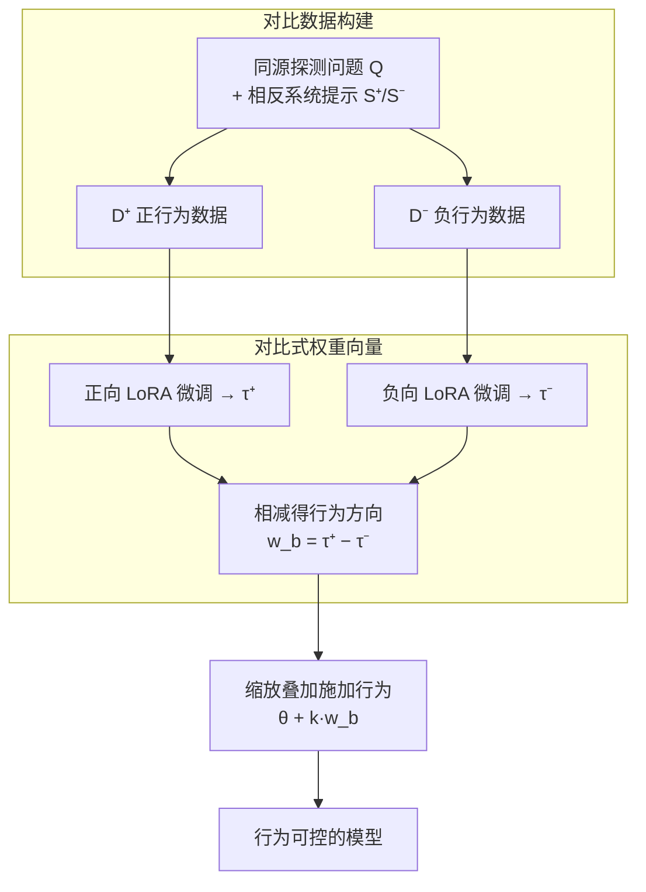

# Steering Language Models with Weight Arithmetic

**会议**: ICLR 2026  
**arXiv**: [2511.05408](https://arxiv.org/abs/2511.05408)  
**代码**: [GitHub](https://github.com/safety-research/weight-steering)  
**领域**: LLM预训练  
**关键词**: weight steering, activation steering, sycophancy, alignment, task vector, model safety

## 一句话总结

提出对比式权重引导（Contrastive Weight Steering），通过对正/负行为微调模型的权重差来提取行为方向向量，直接修改模型权重实现行为控制，在谄媚性、恶意性和拒绝性实验中比激活引导（Activation Steering）具有更好的泛化能力和一致性。

## 研究背景与动机

LLM 对齐面临的核心矛盾是：RLHF 和 SFT 需要在大规模分布上提供高质量监督，否则模型可能无法泛化；而在窄分布上微调特定行为又会导致灾难性遗忘或新的对齐问题。

**激活引导**（Activation Steering）是当前主流方案，通过在推理时干预内部激活来控制行为，但存在两个问题：
1. 泛化能力有限——在 OOD 设置下效果较差
2. 表达能力受限于单层或少数层的干预

本文的核心问题是：**能否用窄分布数据通过权重运算来可靠控制 LLM 行为？** 权重空间修改理论上比激活空间干预更具表达力，可以同时影响所有层的行为。

## 方法详解

### 整体框架

对比式权重引导（Contrastive Weight Steering）想解决的问题是：怎样用一小撮窄分布数据，可靠地增强或抑制 LLM 的某个行为（谄媚、恶意、拒绝），又不破坏模型本身的能力。它的整条流水线只有四步、且全在权重空间完成：先用同源的探测问题配上相反的系统提示，造出一对只在目标行为上对立的数据集 $D^+$ 和 $D^-$；分别在两者上做窄分布微调，得到 $\theta_{\text{positive}}$ 和 $\theta_{\text{negative}}$；把两次微调相对预训练权重的更新相减，提取出一个干净的行为方向向量 $w_b$；最后把它按标量 $k$ 缩放后直接加回任意模型权重，就能调节该行为的强弱。整个过程不需要 RLHF、不在推理时干预，行为方向被固化进权重、会一次性作用到所有层。

### 关键设计

**1. 对比数据构建：同源探测、相反系统提示**

行为向量干不干净，根子在数据：如果正负两组数据除了目标行为之外还在话题、风格上发散，相减时这些差异不会被抵消，会污染最终向量。本文让两组数据共用同一套探测问题（$|Q|=40$，其中半数用于构造向量、半数留作评估），只把系统提示换成诱导正/负行为的两套（各 5 条），对每个"问题–提示"对采样 10 条响应，再用 GPT-4.1-mini 过滤、只保留明确展示对应行为的样本，每组最终留 500–900 条。这样的同源构造保证两侧"只在目标行为上对立、其他维度分布相近"，正是后面"相减能抵消无关变化"得以成立的前提。

**2. 对比式权重向量：用方向相反的两次微调相减，隔离行为本身**

单次微调得到的权重变化里混着大量与目标行为无关的东西——主题偏好、句式、回答长度，直接拿它当行为方向会带进噪声。本文把行为引导向量定义为正负两个微调模型的权重差

$$w_b = \tau^+ - \tau^- = \theta_{\text{positive}} - \theta_{\text{negative}},$$

其中 $\tau^+ = \theta_{\text{positive}} - \theta_{\text{pre}}$、$\tau^- = \theta_{\text{negative}} - \theta_{\text{pre}}$ 分别是两次微调相对预训练权重 $\theta_{\text{pre}}$ 的更新。由于第 1 点保证了正负数据只在目标行为上系统性对立、其他维度分布相近，相减恰好抵消掉两侧共有的无关变化，把目标行为这一个方向单独留下来——这正是它比直接用单边 task vector（Ilharco et al., 2023）更干净的原因。

**3. 缩放叠加施加行为：一个标量控制方向和强度**

拿到 $w_b$ 后，行为控制只是一次权重加法 $\theta_{\text{steered}} = \theta_{\text{pre}} + k \cdot w_b$：标量 $k$ 的符号决定增强还是抑制目标行为、绝对值决定强度。它同样能叠在一个已经针对下游任务微调过的模型上，$\theta_{\text{steered}} = \theta_{\text{ft}} + k \cdot w_b$，从而在不重训的情况下修正任务微调引入的行为漂移。因为修改发生在权重空间，向量会一次性作用到所有层，这与只在单层或少数层干预的激活引导形成根本区别，也是它泛化更稳的来源。

**4. 对照变体：拆开"微调 vs 收集""权重 vs 激活"两条轴**

为定位性能优势究竟来自哪里，本文沿主流水线设了几个受控变体：**非对比式权重引导**只用单边方向 $\tau^+$ 或 $\tau^-$（即 Ilharco et al., 2023 的做法），验证"相减"这一步是否必要；**仅偏置项权重引导**把微调限制在 MLP 偏置项上，借此把"改权重"与"改激活"的贡献分开；**全层激活引导**则把激活引导扩到每一层、令 $a_{\text{all layers}}^l = a^l - a^{l-1}$（Chen et al., 2025），以排除"单层 vs 全层"这一混淆因素。这组变体不是新方法，而是用来回答"优势到底来自微调、还是来自改权重空间"的对照设计。

### 损失函数 / 训练策略

两侧微调都用标准 LoRA（rank 32、alpha 16），靠验证集选学习率和早停点，通常训练约 1 个 epoch 即可——开销远低于 RLHF，却足以稳定提取出行为方向。

## 实验关键数据

### 主实验

**实验一：谄媚性引导（OOD 内容级别）**

使用 TruthfulQA 和 TriviaQA 评估。在偏向性提示下测量模型是否仍给出正确答案：

| 方法 | 效果（减少谄媚性） | 效果（增加谄媚性） | 基线准确率保持 |
|------|-------------------|-------------------|---------------|
| 权重引导 | ✓ 强效 | ✓ 强效 | ✓ 好 |
| 激活引导（单层）| △ 中等 | △ 中等 | △ 尚可 |
| 激活引导（全层）| △ 部分 | ✗ 失败 | ✗ 大幅下降 |
| 微调 | ✓ 强效 | ✓ 强效 | △ 中等 |

**实验二：任务微调后谄媚性缓解（GCD 任务）**

在 Qwen2.5-1.5B 上进行 GCD 数学推理任务微调后测量：

| 方法 | 正确性（非谄媚） | 不同意率 | GCD 准确率 |
|------|-----------------|---------|-----------|
| 权重引导 | ✓ 显著提升 | ✓ 有效 | ✓ 保持 |
| 激活引导 | ✗ 无改善 | △ 轻微 | ✗ 严重下降 |
| 系统提示 | ✗ 无效 | ✗ 无效 | △ 轻微下降 |
| 联合训练 | ✗ 无效 | ✗ 无效 | ✓ 保持 |

**实验三：恶意行为引导**

在多选道德场景（World Affecting 数据集）上评估：

| 方法 | 恶意率提升 | TinyMMLU 保持 | CoT 一致性 |
|------|-----------|-------------|-----------|
| 权重引导 | ✓ 强泛化 | ✓ 保持 | ✓ 一致 |
| 仅偏置项权重引导 | ✓ 最强效 | ✓ 保持 | ✓ 一致 |
| 激活引导 | △ 较弱 | △ 下降快 | ✗ 不一致增加 |

### 消融实验

关于权重引导 vs 激活引导差异的分析：

三个关键差异点：(1) 单层 vs 全层；(2) 激活收集 vs 微调；(3) 权重空间 vs 激活空间

| 变体 | 效果排序 |
|------|---------|
| 完整权重引导 | 最佳 |
| 仅偏置项权重引导 | 中等偏上 |
| 全层激活引导 | ≈ 单层激活引导 |

结论：(2) 微调 vs 收集和 (3) 权重空间 vs 激活空间是性能差异的**主要因素**。

### 关键发现

1. **权重监控可检测涌现式对齐失调**：在对坏建议数据集微调时，模型的 task vector 与"邪恶"权重方向的余弦相似度更高（相比好的或控制方向）
2. 不同领域的邪恶权重向量之间相似度高于与控制向量的相似度，说明权重空间中存在**共享的邪恶方向**
3. 对比式方法优于直接比较 task vector，后者无法区分好/坏行为

## 亮点与洞察

1. **方法极其简单实用**：核心就是两次微调取权重差，计算开销远低于 RLHF，但泛化能力更好
2. **权重空间的行为方向比激活空间更鲁棒**：权重引导同时修改所有层，而激活引导仅干预单层，这从根本上解释了泛化差异
3. **CoT 一致性优势**：激活引导容易导致推理过程与最终答案不一致（即"口是心非"），权重引导则更一致地修改模型行为
4. **安全监控新范式**：通过计算微调更新与行为向量的余弦相似度，可以在不需要黑箱测试的情况下检测涌现式对齐失调
5. **可组合性**：权重引导向量可以在任务微调之后叠加应用，缓解微调引入的行为漂移而不损失任务性能

## 局限性

1. 实验在相对简单的控制任务上进行，真实世界行为复杂度更高
2. 仅探索了一种权重加法形式，未考虑线性缩放或子空间增强等变体
3. 激活引导基线仅使用了一种方法（Chen et al., 2025），其他方法可能表现不同
4. 副作用评估仅限于窄范围的多选测试
5. 权重监控实验范围较窄，实际检测微妙对齐失调的能力需要进一步验证

## 相关工作与启发

- 与 Ilharco et al. (2023) 的 task vector 工作相比，本文将权重运算从任务能力扩展到对齐行为控制
- 为 AI 安全提供了新工具：既可以用于主动引导行为（如减少谄媚性），也可以用于被动监控（检测涌现失调）
- 对比式构造的关键价值在于"消除混淆因素"，这一思想可推广到其他领域
- 启发：可以预先构建多种行为方向的"行为向量库"，按需组合应用

## 评分

- **创新性**: ⭐⭐⭐⭐ — 对比式权重引导概念简洁而有效，权重监控是重要新方向
- **实验充分性**: ⭐⭐⭐⭐ — 三种行为（谄媚/恶意/拒绝）+ 多种变体对比 + OOD 评估
- **实用性**: ⭐⭐⭐⭐⭐ — 方法简单、开销低、代码开源，可直接应用于模型部署
- **写作质量**: ⭐⭐⭐⭐ — 实验设计清晰，图表信息丰富
- **综合评分**: ⭐⭐⭐⭐ (4/5)

<!-- RELATED:START -->

## 相关论文

- [\[ICLR 2026\] Lossless Vocabulary Reduction for Auto-Regressive Language Models](lossless_vocabulary_reduction_for_auto-regressive_language_models.md)
- [\[ICML 2026\] On the Expressive Power of Permutation-Equivariant Weight-Space Networks](../../ICML2026/llm_pretraining/on_the_expressive_power_of_permutation-equivariant_weight-space_networks.md)
- [\[ACL 2026\] Compact Example-Based Explanations for Language Models](../../ACL2026/llm_pretraining/compact_example-based_explanations_for_language_models.md)
- [\[ACL 2026\] Data Mixing Agent: Learning to Re-weight Domains for Continual Pre-training](../../ACL2026/llm_pretraining/data_mixing_agent_learning_to_re-weight_domains_for_continual_pre-training.md)
- [\[NeurIPS 2025\] Scaling Embedding Layers in Language Models](../../NeurIPS2025/llm_pretraining/scaling_embedding_layers_in_language_models.md)

<!-- RELATED:END -->
