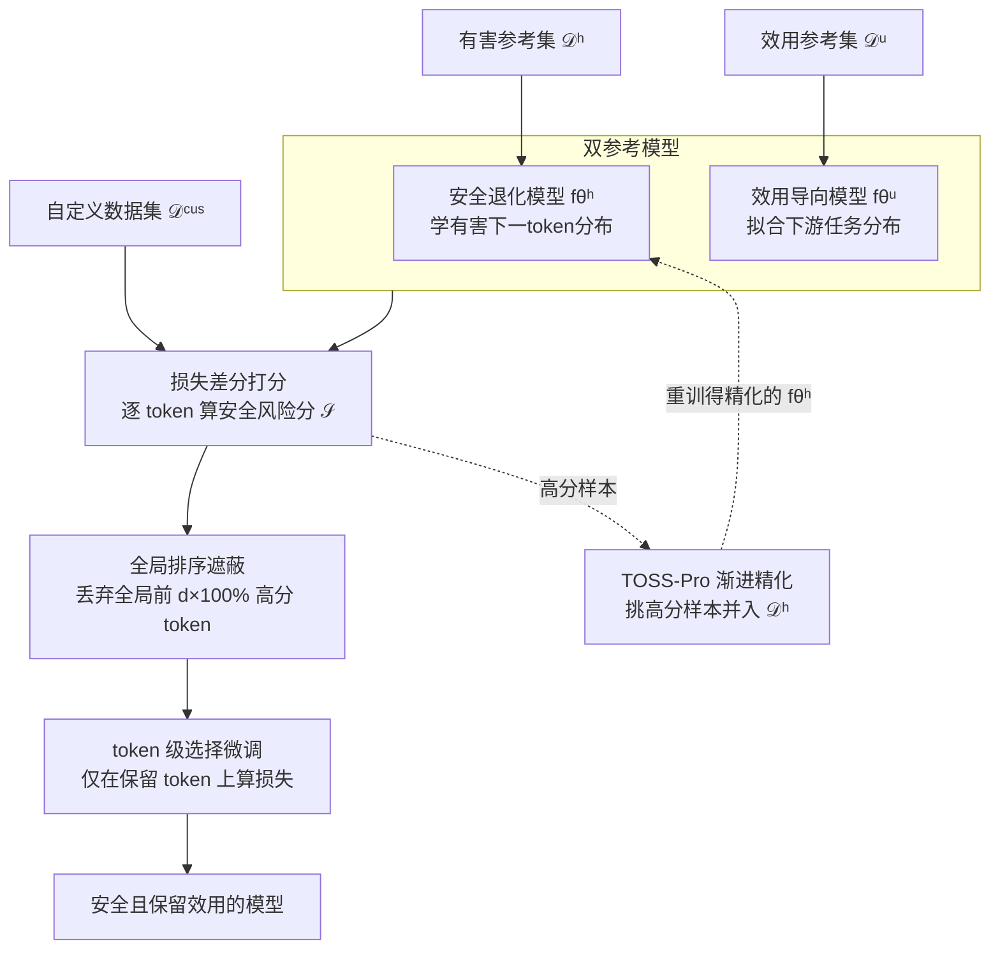

# Token-level Data Selection for Safe LLM Fine-tuning

**会议**: ICLR 2026  
**arXiv**: [2603.01185](https://arxiv.org/abs/2603.01185)  
**代码**: [github.com/Polly-LYP/TOSS](https://github.com/Polly-LYP/TOSS)  
**领域**: LLM预训练  
**关键词**: LLM safety, fine-tuning safety, token-level selection, data curation, safety-utility tradeoff

## 一句话总结

提出 TOSS（Token-level data Selection for Safe LLM fine-tuning），首个 token 级别的数据选择框架,通过安全退化模型和效用导向模型之间的损失差评估每个 token 的安全风险，实现比样本级方法更优的安全-效用权衡。

## 研究背景与动机

LLM 在自定义数据集上微调是适配特定领域的标准实践，但**微调过程会严重侵蚀模型的安全对齐**。现有防御手段均在**样本级别**操作：

**数据混合** (Bianchi et al., 2023)：将安全数据掺入自定义数据集，但过多安全数据导致模型过度拒绝

**样本过滤** (SEAL, Shen et al., 2024)：识别并丢弃被判定为不安全的整个样本，但丢弃有价值的下游任务信息

**核心发现**：安全退化不是样本级问题，而是 **token 级问题**。通过 token 级诊断分析发现：
- 最显著的分布偏移发生在**响应的最初几个 token**——模型将安全拒绝前缀替换为顺从有害指令的前缀
- 但危害不仅限于初始 token：中间和后期 token 也表现出向安全退化模型的显著偏离
- 即使表面上良性的数据也可能在 token 级别侵蚀安全对齐
- 简单的固定位置 token 遮蔽（如遮蔽前 5 个 token）虽改善安全但损害效用

因此需要**精细的 token 级选择机制**，能准确识别并移除有害 token 同时保留关键的任务适配 token。

## 方法详解

### 整体框架

TOSS 想解决的是一个被前人忽略的粒度问题：微调侵蚀安全对齐，根源不在"哪些样本有害"，而在"样本里的哪些 token 有害"——同一条样本里，诱导模型顺从有害指令的 token 和真正承载下游任务知识的 token 往往交织在一起，样本级的整刀切除要么误删有用信息、要么放过夹带的危险 token。TOSS 的破解办法是把数据清洗下沉到 token 粒度，做一台"外科手术"：先把基座模型校准成两个互为参照的小模型——一个刻意学有害模式、一个专门学下游任务效用，再用它们在每个 token 上的损失差打出一个安全风险分，然后对自定义数据集里的**全体 token** 做一次全局排序、遮蔽掉风险最高的一小撮，最后只在保留下来的 token 上做微调。进一步地，TOSS-Pro 把"挑出的高危样本回灌去重训有害模型"做成一条自举循环，让打分越来越准。

### 关键设计

**1. 双参考模型：把安全和效用拆成两个可比较的"靶子"**

单看一个 token 的损失无法判断它到底是有害还是有用，TOSS 的破题点是把基座模型校准成两个专门化的参考模型当对照基准。安全退化模型 $f_{\theta^h}$ 在小规模有害参考集 $\mathcal{D}^h$（有害指令配有害回复）上微调，刻意学会有害的下一 token 预测分布，损失为 $\mathcal{L}_{f_{\theta^h}} = \frac{1}{\sum_{i=1}^H L_i} \sum_{i=1}^H \sum_{j=1}^{L_i} -\log P(y_{i,j}^h | \boldsymbol{x}_i^h, \boldsymbol{y}_{i,:j-1}^h; \theta)$；效用导向模型 $f_{\theta^u}$ 则在高质量效用参考集 $\mathcal{D}^u$ 上用同样形式的损失训练，专门拟合下游任务分布。两者缺一不可——消融显示只用安全退化模型会连任务关键 token 一起误删、导致效用大降，只用效用模型又根本识别不出有害 token，正是这一"有害靶子 + 有用靶子"的对照结构，让后续每个 token 都能拿到安全侧和效用侧两路参照。

**2. 损失差分打分：让两个模型的分歧暴露安全风险**

有了两个参照，每个 token 的安全风险就可以用它们的对数概率之差来量化：

$$\mathcal{S}(y_{i,j}^{\text{cus}}) = -\log P(y_{i,j}^{\text{cus}}|\boldsymbol{x}_i^{\text{cus}}, \boldsymbol{y}_{i,:j-1}^{\text{cus}}; \theta^u) + \log P(y_{i,j}^{\text{cus}}|\boldsymbol{x}_i^{\text{cus}}, \boldsymbol{y}_{i,:j-1}^{\text{cus}}; \theta^h)$$

相对基座模型展开后，这个分数其实是两个竞争分量之和——一项衡量 token 与期望任务分布的对齐度（效用相关，越负越好），另一项衡量它与有害模式的对齐度（安全相关，越正越糟）。一个 token 得高分，意味着它在安全退化模型下概率高（有害模型"喜欢"、损失低）、同时在效用模型下概率低（任务模型"不喜欢"、损失高），正好对应"既危险又对任务没用"的待丢弃目标。和以往只盯效用增强的 token 打分函数不同，这里把安全和效用两个本来割裂的判据优雅地统一进了同一个标量。

**3. 全局排序遮蔽：按风险一刀切，而非每个样本内部切**

拿到所有 token 的分数后，TOSS 不在单个样本内部排序，而是对自定义数据集里的**全体 token** 做一次全局排序，丢弃得分最高的前 $d\times100\%$（实验中 $d=0.1$），遮蔽掩码定义为：当 $\mathcal{S}(y_{i,j}^{\text{cus}})$ 落在全局前 $d\times100\%$ 时 $m_{i,j}=0$，否则 $m_{i,j}=1$。之所以选全局而非局部，是因为有害 token 在不同样本里分布高度不均——某些样本几乎全是有害 token，另一些只零星夹杂几个，按样本内比例统一切会误伤干净样本、漏放高危样本，消融里全局排序也确实显著优于局部。

**4. TOSS-Pro 渐进精化：用自举循环让有害模型越来越准**

固定的安全退化模型质量直接决定 token 识别的上限，TOSS-Pro 因此把它做成可迭代精化的。从初始有害集 $\mathcal{D}_0^h=\mathcal{D}^h$ 训出 $f_{\theta_0^h}$ 后，每一轮用当前 $f_{\theta_t^h}$ 和固定的效用模型 $f_{\theta^u}$ 算 token 分数并降序排，再从最高分 token 顺着往下回溯它所在的样本（已收入的样本跳过），直到凑满 $k$ 个最具信息量的高危样本 $\mathcal{D}_t^s$，并入得到扩展集 $\mathcal{D}_{t+1}^h = \mathcal{D}_t^h \cup \mathcal{D}_t^s$ 后重训出 $f_{\theta_{t+1}^h}$，如此重复 $T$ 次，最后用精化过的模型做最终 token 选择。和"把数据切成 $T$ 份各自独立微调"的旧做法不同，这条"更准的有害模型 → 更准的 token 识别 → 更高质量的有害样本 → 更准的有害模型"正反馈才是增益来源；消融验证若改成随机选样本则失效甚至退化，可见精确挑选信息丰富的样本是关键。

### 损失函数 / 训练策略

最终的 token 级选择微调只在保留下来的 token 上计算交叉熵，被遮蔽的高风险 token（$m_{i,j}=0$）不贡献梯度：

$$\mathcal{L}^{\text{cus}} = \frac{1}{\sum_{i=1}^N L_i} \sum_{i=1}^N \sum_{j=1}^{L_i} -m_{i,j} \log P(y_{i,j}^{\text{cus}} | \boldsymbol{x}_i^{\text{cus}}, \boldsymbol{y}_{i,:j-1}^{\text{cus}}; \theta)$$

## 实验关键数据

### 主实验

| 方法 | Llama-3-8B (HH / HEx-PHI / SLIMORCA / AVG) | Llama-2-7B (HH / HEx-PHI / SLIMORCA / AVG) |
|------|---------------------------------------------|---------------------------------------------|
| Standard SFT | 50 / 50 / 50 / 50 | 50 / 50 / 50 / 50 |
| SafeInstr | 51.5 / 64.6 / 50.5 / 55.5 | 48.2 / 51.3 / 53.1 / 50.9 |
| DSIR | 67.4 / 60.8 / 53.8 / 60.7 | 63.7 / 57.0 / 52.0 / 57.6 |
| SEAL | 58.2 / 68.8 / 57.4 / 61.5 | 58.6 / 50.3 / 52.5 / 53.8 |
| **TOSS** | **88.8 / 87.5 / 68.4 / 81.6** | **83.2 / 69.9 / 57.3 / 70.1** |
| **TOSS-Pro** | **88.9 / 93.8 / 68.9 / 83.8** | **87.0 / 74.4 / 60.7 / 74.0** |

TOSS 相比 SEAL：安全提升高达 30%，效用提升高达 11%。TOSS-Pro 在 TOSS 基础上安全再提升 6%。

### 迁移性实验

将 Llama-3-8B-Instruct 选出的数据直接用于 Llama-3.2-1B/3B（共享 tokenizer）：

| 方法 | Llama-3.2-1B AVG | Llama-3.2-3B AVG |
|------|-------------------|-------------------|
| Standard SFT | 50 | 50 |
| SEAL | 56.3 | 53.7 |
| **TOSS** | **63.9** | **68.1** |

token 级选择仅需执行一次，可跨共享 tokenizer 的模型复用。

### 消融实验

| 消融项 | 发现 |
|--------|------|
| 全局 vs 局部排序 | 全局排序显著更优,有害样本中有害 token 比例不均 |
| Token 级 vs 样本级 | Token 级在安全和效用上均优 |
| 仅安全退化模型 | 安全提升但效用大降——丢弃了对任务适配关键的 token |
| 仅效用导向模型 | 效用可接受但安全无改善——无法识别有害 token |
| 随机选样 vs 指标选样（TOSS-Pro） | 随机选样无效甚至退化,精确选择信息丰富的样本是关键 |
| TOSS-Pro 迭代次数 | 1-2 次迭代即可持续改善安全性能 |

### 关键发现

1. **安全退化是 token 级问题**：有害信号和有益信号交织在同一样本中
2. **两个参考模型的互补性至关重要**：缺少任何一个都会导致安全或效用的显著退化
3. **全局排序优于局部排序**：因为有害 token 在不同样本中的分布高度不均
4. **渐进精化比一步到位更有效**：迭代选择更高质量的有害样本持续改善识别精度

## 亮点与洞察

1. **"安全退化的基本单元不是样本而是 token"**——这一核心假设通过诊断分析得到充分验证，是方法论的关键突破
2. **损失差分指标的设计**优雅地统一了安全和效用两个目标：高分 = 安全退化模型"喜欢" + 效用模型"不喜欢" = 需要丢弃
3. **TOSS-Pro 的渐进精化**利用了一个自举效应：更好的安全退化模型 → 更准确的 token 识别 → 更高质量的有害样本 → 更好的安全退化模型
4. **跨 tokenizer 共享的迁移性**使得该方法具有显著的实用价值——大模型做一次 token 选择，小模型直接复用

## 局限性

1. **需要额外构建有害参考数据集和效用参考数据集**：虽然用量较小（~10%），但仍需领域知识
2. **token 丢弃比例 $d$ 固定为 0.1**：不同数据集可能需要不同比例
3. **安全退化模型的训练**本身存在伦理考虑——需要显式训练一个"有害"模型
4. **评估依赖 GPT-4o 作为裁判**：可能引入评估偏差
5. **实验仅在 Llama 系列上验证**：未测试 Mistral、Qwen 等其他架构
6. **未讨论不同类型有害内容的差异性**：不同安全类别的 token 级特征可能不同

## 相关工作与启发

- **SEAL** (Shen et al., 2024)：样本级数据选择基线，TOSS 的直接改进对象
- **SafeInstr** (Bianchi et al., 2023)：数据混合方法
- **DSIR** (Xie et al., 2023)：基于重要性重采样的样本选择
- **TokenTune** (Simoulin et al., 2024)：token 级激活剪枝（关注效率而非安全）
- **DPO/RLHF**：训练阶段安全对齐方法，与 TOSS 互补

TOSS 的核心启发：**数据清洗的粒度决定了安全-效用权衡的上限**。从样本级到 token 级的粒度提升带来了巨大的性能飞跃，暗示未来可能进一步到子 token 或语义单元级别。

## 评分

- 新颖性: ⭐⭐⭐⭐⭐ — 首次系统性地在 token 级别诊断和解决微调安全退化问题
- 实验充分度: ⭐⭐⭐⭐ — 多模型、多基准、全面消融、迁移性验证
- 写作质量: ⭐⭐⭐⭐ — 逻辑清晰，诊断分析↔方法设计↔实验验证的闭环完整
- 价值: ⭐⭐⭐⭐⭐ — 为安全微调提供了新范式，性能大幅超越现有方法，代码开源

<!-- RELATED:START -->

## 相关论文

- [\[ICLR 2026\] Pre-training LLM without Learning Rate Decay Enhances Supervised Fine-Tuning](pre-training_llm_without_learning_rate_decay_enhances_supervised_fine-tuning.md)
- [\[ICML 2026\] Data Difficulty and the Generalization--Extrapolation Tradeoff in LLM Fine-Tuning](../../ICML2026/llm_pretraining/data_difficulty_and_the_generalization--extrapolation_tradeoff_in_llm_fine-tunin.md)
- [\[ICML 2025\] LLM Data Selection and Utilization via Dynamic Bi-level Optimization](../../ICML2025/llm_pretraining/llm_data_selection_and_utilization_via_dynamic_bi-level_optimization.md)
- [\[ACL 2025\] Data Whisperer: Efficient Data Selection for Task-Specific LLM Fine-Tuning via Few-Shot In-Context Learning](../../ACL2025/llm_pretraining/data_whisperer_data_selection.md)
- [\[ICML 2025\] DipLLM: Fine-Tuning LLM for Strategic Decision-Making in Diplomacy](../../ICML2025/llm_pretraining/dipllm_fine-tuning_llm_for_strategic_decision-making_in_diplomacy.md)

<!-- RELATED:END -->
