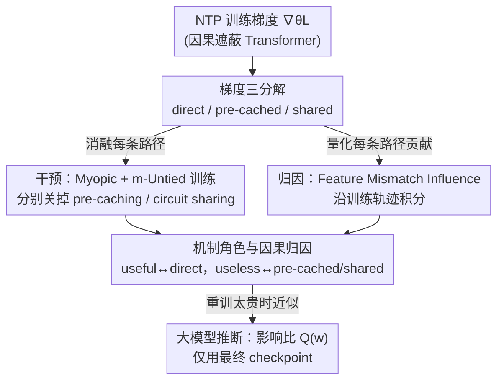

# Understanding the Emergence of Seemingly Useless Features in Next-Token Predictors

**会议**: ICLR 2026  
**arXiv**: [2603.14087](https://arxiv.org/abs/2603.14087)  
**代码**: [https://github.com/Markfryazino/useless-features-iclr-code](https://github.com/Markfryazino/useless-features-iclr-code)  
**领域**: LLM预训练  
**关键词**: 下一token预测, 特征涌现, pre-caching, circuit sharing, 机械可解释性

## 一句话总结
通过将训练梯度信号分解为 direct、pre-cached 和 circuit sharing 三种成分，解释了为什么 NTP 训练的 Transformer 会学到对预测当前下一token"无用"的特征，并在 OthelloGPT、小型语言模型和预训练 LLM（Gemma 2）上验证了这一框架的解释力。

## 研究背景与动机

**领域现状**：LLM 通过 NTP（下一 token 预测）目标训练，即学习 $p(x_{t+1}|x_1 \cdots x_t)$。直觉上模型应该只学习对预测下一 token 有用的特征。部分合成任务的研究也确认了这一点——NTP 训练确实只学到即时有用的特征。

**现有痛点**：但大量实证发现 LLM 学到了远超即时 NTP 所需的丰富特征——包括抽象输入特征重建、"世界模型"（如 OthelloGPT 编码的棋盘状态）、以及多步前瞻预测能力。为什么 NTP 目标能驱动这些"看似无用"特征的涌现？已有的可解释性研究主要从目的论视角（特征在成品模型中的算法角色）分析，未探究训练过程中的梯度信号来源。

**核心矛盾**：NTP 目标只提供关于"下一个 token"的监督信号，但模型学到了关于"全局状态"和"未来 token"的特征。梯度信号是如何"穿越"只优化即时预测的目标函数，驱动这些跨位置特征的学习的？

**本文目标** 从梯度信号的信息流视角解释 NTP-useless 特征的涌现机制。具体地：(a) 梯度信号通过什么路径到达参数？(b) 哪些路径负责学习"无用"特征？(c) 能否量化每种机制的贡献？

**切入角度**：利用因果遮蔽 Transformer 的计算图结构，将梯度信号分解为三种独立路径，发展干预（消融机制观察影响）和归因（量化每种机制的影响力）两种分析方法。

**核心 idea**：NTP-useless 特征通过 pre-caching（未来位置的损失信号通过注意力回传）和 circuit sharing（参数共享导致跨位置特征迁移）两种机制从 NTP 目标中涌现。

## 方法详解

### 整体框架
这是一篇**机制分析**论文，目标不是提出新模型，而是回答一个问题：只监督"下一个 token"的 NTP 目标，凭什么让模型学到关于全局状态、未来 token 这些"看似无用"的特征？全文的分析骨架是**先把梯度拆开、再逐条审问**。第一步固定某位置 $i$、某层 $k$ 的残差流 $r_{\theta,i}^k(x)$，把回传到参数的训练梯度精确分成 direct、pre-cached、shared 三条路径（**梯度三分解**）——direct 只和即时预测挂钩，剩下两条才是"无用"特征的潜在来源。拿到这三条路径后，论文用两套互补的工具分析它们：一是**干预**，用 myopic / m-untied 训练把 pre-caching、circuit sharing 分别"关掉"，看少了某条路径模型还能不能学到那些特征；二是**归因**，定义 feature mismatch influence 并沿训练轨迹积分，定量算出每条路径对某个特征涌现到底贡献了多少。这两套工具都要完整重训，在 Gemma 2 这种规模上跑不动，于是最后再给一个只需最终 checkpoint 的近似指标 $Q(w)$，把同样的"pre-cached 还是 direct 主导"的判断迁移到真实 LLM 上。

### 关键设计

**1. 梯度三分解（Proposition 3.1）：把 NTP 的训练梯度精确拆成 direct / pre-cached / shared 三条路径**

NTP 损失只监督"下一个 token"，可模型却学到了关于全局状态和未来 token 的特征——要回答这些"无用"特征从何而来，第一步是看清梯度到底经过哪些路径回传到参数。本文固定某位置 $i$、某层 $k$ 的残差流 $r_{\theta,i}^k(x)$，借助 stop-gradient 操作把总梯度切成三块：direct 项 $\nabla_\theta L_i - \nabla_\theta L_i^{sg(k,i)}$，只保留经过这一残差流、流向即时预测 $\hat{x}_{i+1}$ 的信号；pre-cached 项 $\nabla_\theta \sum_{j \neq i} [L_j - L_j^{sg(k,i)}]$，捕捉经过该残差流、却流向未来位置损失 $\hat{x}_j$（$j>i+1$）的信号；shared 项 $\sum_j \nabla_\theta L_j^{sg(k,i)}$，则是不经过该残差流、靠参数共享间接施加的影响。三者之和恰好等于 $\nabla_\theta L$，构成一个完备分解。这个切法之所以关键，是因为 direct 成分只和即时预测挂钩，它只能驱动 NTP-useful 特征；剩下的 pre-cached 与 shared 才是"无用"特征涌现的潜在来源，后续所有干预和归因都建立在这三块的区分上。

**2. 干预：Myopic Training 与 m-Untied Training——把 pre-caching 和 circuit sharing 分别"关掉"看后果**

有了三分解，最直接的验证就是逐个消融机制、观察缺了它模型会怎样。Myopic training（Wu et al. 2024 提出）在注意力的 K、V 矩阵处切断跨位置梯度，使位置 $i$ 不再被激励去计算"对未来位置有用"的特征，从而关闭 pre-caching；m-Untied training（本文提出）则用两套独立参数分别处理位置 $m$ 之前和之后的序列，让两段无法共享电路，从而切断 circuit sharing。之所以要分别关，是因为两条路径承担的角色不同：pre-caching 提供的是额外表达力，让多层注意力的复杂构造（如 induction head 式的两层电路）成为可能；circuit sharing 提供的是跨位置迁移——在某个位置 NTP-useful 的特征，可以通过共享参数被编码到另一个位置上去。把它们分开关，才能看清各自负责学的是哪类"无用"特征。

**3. 归因：Feature Mismatch Influence——量化每种梯度成分到底贡献了多少**

干预只能回答"某机制有没有必要"，回答不了"它实际贡献了多少"，于是本文再给出一套定量归因。先定义 feature mismatch 衡量两组参数下同一特征方向 $w_i^k$ 的表征差异：

$$R(x|\theta_1, \theta_2, w_i^k) = \frac{1}{2}\big(\langle w_i^k, r_{\theta_1,i}^k(x) \rangle - \langle w_i^k, r_{\theta_2,i}^k(x) \rangle\big)^2$$

再把某个梯度成分 $G$ 对这一差异的边际影响定义为 influence $I_i^k(\theta, x | w_i^k, \theta^*, G) = \frac{d}{d\varepsilon} R(x|\theta + \varepsilon G, \theta^*, w_i^k)|_{\varepsilon=0}$。为了让结论在真实优化器下成立，本文对 Adam 做了适配——为 direct、pre-cached、shared 各维护一套独立动量，保证三个成分的步长之和等于实际的优化器步长。沿训练轨迹把每一步的 influence 积分起来，就得到每种机制对某个特征涌现的累计定量贡献，这正是后面"direct 只推 useful、pre-cached 推 useless"那张置信区间表的来源。

**4. 大模型推断：Intervention-based Influence Ratio $Q(w)$——不重训也能估计 pre-cached vs direct 的影响比**

上面的归因要完整重训并逐步记录三个梯度成分，对 Gemma 2 这种规模的模型根本跑不动。为此本文给出一个只需访问最终 checkpoint 的近似指标：Proposition 5.1 证明，在训练后的模型上对某特征做激活干预（ablation），统计干预引起的未来位置 KL 散度之和与即时位置 KL 散度之比

$$Q(w) = \frac{\sum_{j>i+1} d_j^{/i}}{d_{i+1}^{/i}}$$

就能近似该特征上 pre-cached 与 direct influence 的比值。换言之，重训太贵时，单凭最终模型上的干预实验也能反推一个特征更多是被"为未来铺垫"还是被"即时预测"塑造出来的——代价是它只是局部近似，不等于整条训练轨迹的积分。

### 损失函数 / 训练策略
使用标准 NTP 交叉熵损失。Myopic 和 untied 变体通过 stop-gradient 修改梯度传播路径而非损失函数。

## 实验关键数据

### 主实验

OthelloGPT 中 NTP-useful vs NTP-useless 特征的影响力分析（95% 置信区间）：

| 梯度成分 | NTP-useful 特征 | NTP-useless 特征 | 含义 |
|---------|----------------|-----------------|------|
| Direct | [2.85, 12.38] | [-4.69, 2.74] | Direct 只推动 useful 特征 |
| Pre-cached | [-1.99, 0.66] | [0.55, 3.05] | Pre-cached 推动 useless 特征 |
| Shared | [4.80, 12.48] | [2.93, 9.91] | Shared 对两者都有贡献 |
| Combined | [12.14, 19.05] | [4.42, 10.07] | Useful 被学得更好 |

Direct 对 NTP-useless 特征的影响与零无显著差异，而 pre-cached 和 shared 对 NTP-useless 特征有正向贡献——这精确解释了 OthelloGPT "世界模型"的脆弱性来源。

### 消融实验

Toy 任务中不同训练模式对 NTP-useless 特征表征质量的影响：

| 训练模式 | Majority "多数" | Conditioned Majority "前一token" | 说明 |
|---------|----------------|-------------------------------|------|
| 标准训练 | 高探测准确率 | 高探测准确率 | 三种机制全开 |
| Myopic（无 pre-cache） | 下降 | 大幅下降 | 阻断 pre-caching |
| m-Untied（无 sharing） | 下降 | 下降 | 阻断 circuit sharing |
| Myopic + Untied | 最差 | 完全失败 | 无法学习 NTP-useless 特征 |

Conditioned Majority 需要类似 induction head 的两层注意力构造，myopic 训练完全阻止了这种电路的发展。

### 关键发现
- **语法特征主要由 direct 驱动**：小型语言模型中 POS 标签和依赖标签的 pre-cached influence 远低于 direct influence，说明简单语法可以不依赖 pre-caching 学习
- **Pre-caching 对连贯文本生成不可或缺**：myopic 模型的损失（3.29）远高于标准模型（2.53），说明 pre-caching 对复杂语言建模至关重要
- **Gemma 2 的 $Q(w)$ 极端值与形式推理相关**：SAE 特征中 $Q(w)$ 极高或极低的特征集中在代码和形式化领域。Pre-caching 对需要模拟形式计算装置（如 AST 解析）的任务尤为重要
- **Pre-caching ≠ Look-ahead**：$Q(w)$ 与 look-ahead 预测器的特征方向相关性为负——pre-cached 特征对前瞻预测的贡献反而更小。这支持了 "breadcrumbs" 假说：前瞻源于不同位置需要相似特征，而非显式规划

## 亮点与洞察
- **从"静态功能"到"发展过程"的视角转换**：传统可解释性问"这个特征在做什么"，本文问"这个特征是怎么被训练出来的"。这种发展视角与神经科学中功能 vs 发育的区分类似，为理解 LLM 的内部机制提供了全新工具
- **三分解的普适性**：direct/pre-cached/shared 分解基于因果遮蔽 Transformer 的计算图结构，适用于所有 autoregressive model。以此为骨架可以分析任何特征的成因
- **OthelloGPT 世界模型脆弱性的因果解释**：之前只知道"世界模型脆弱"，现在知道"因为 NTP-useless 的棋盘格子只有 pre-cached 和 shared 信号，缺乏 direct 信号"。这是第一个给出统计上显著的因果归因

## 局限与展望
- **归因方法计算成本高**：需要完整重训一次模型并在每步计算三个梯度成分，对大模型不可行
- **$Q(w)$ 指标只是近似**：只在训练后模型的局部区域有效，不代表整个训练轨迹的积分影响
- **Toy 任务与真实 LLM 的差距**：主要实验在小型模型上完成，大模型分析仅限于 $Q(w)$ 这一间接指标
- **可改进方向**：发展更高效的归因方法（如只需中间 checkpoint 而非完整重训）；利用梯度分解发现未知的可解释特征（如只被 pre-cached 更新产生的特征子空间）

## 相关工作与启发
- **vs Wu et al. (2024)**：首先提出 pre-caching 概念和 myopic training。本文在此基础上引入 circuit sharing、建立定量归因框架、发现 pre-caching ≠ look-ahead，是重要的深化和纠正
- **vs Vafa et al. (2025)**：他们发现 OthelloGPT 世界模型对共享相同合法下一步的棋盘脆弱。本文从梯度分解角度给出因果解释：NTP-useless 格子的 direct influence 为零，只靠 pre-cached 和 shared 学习，天然更脆弱
- **vs Bachmann & Nagarajan (2024)**：他们指出 NTP 的缺陷（可能学不到有用特征）。本文从相反角度分析：为什么 NTP 反而能学到"超出预期"的特征

## 评分
- 新颖性: ⭐⭐⭐⭐⭐ 提出了理解 Transformer 特征涌现的全新框架（梯度三分解 + 归因方法），视角独特且有深度
- 实验充分度: ⭐⭐⭐⭐ 从 toy 到 Othello 到小型 LM 到 Gemma 2 的渐进验证层次清晰，但大模型分析受限于间接指标
- 写作质量: ⭐⭐⭐⭐⭐ 叙事从直觉到形式化到实验的逻辑链极为流畅，概念定义精准
- 价值: ⭐⭐⭐⭐⭐ 对理解 NTP 训练目标如何产生"超预期"能力有基础性贡献，framework 可广泛应用于 LLM 可解释性研究

<!-- RELATED:START -->

## 相关论文

- [\[ICLR 2026\] A Law of Data Reconstruction for Random Features (and Beyond)](a_law_of_data_reconstruction_for_random_features_and_beyond.md)
- [\[ICLR 2026\] Understanding and Improving Shampoo and SOAP via Kullback-Leibler Minimization](understanding_and_improving_shampoo_and_soap_via_kullback-leibler_minimization.md)
- [\[ICLR 2026\] Explaining Grokking and Information Bottleneck through Neural Collapse Emergence](explaining_grokking_and_information_bottleneck_through_neural_collapse_emergence.md)
- [\[ICLR 2026\] Token-level Data Selection for Safe LLM Fine-tuning](token-level_data_selection_for_safe_llm_fine-tuning.md)
- [\[NeurIPS 2025\] Next Semantic Scale Prediction via Hierarchical Diffusion Language Models](../../NeurIPS2025/llm_pretraining/next_semantic_scale_prediction_via_hierarchical_diffusion_language_models.md)

<!-- RELATED:END -->
