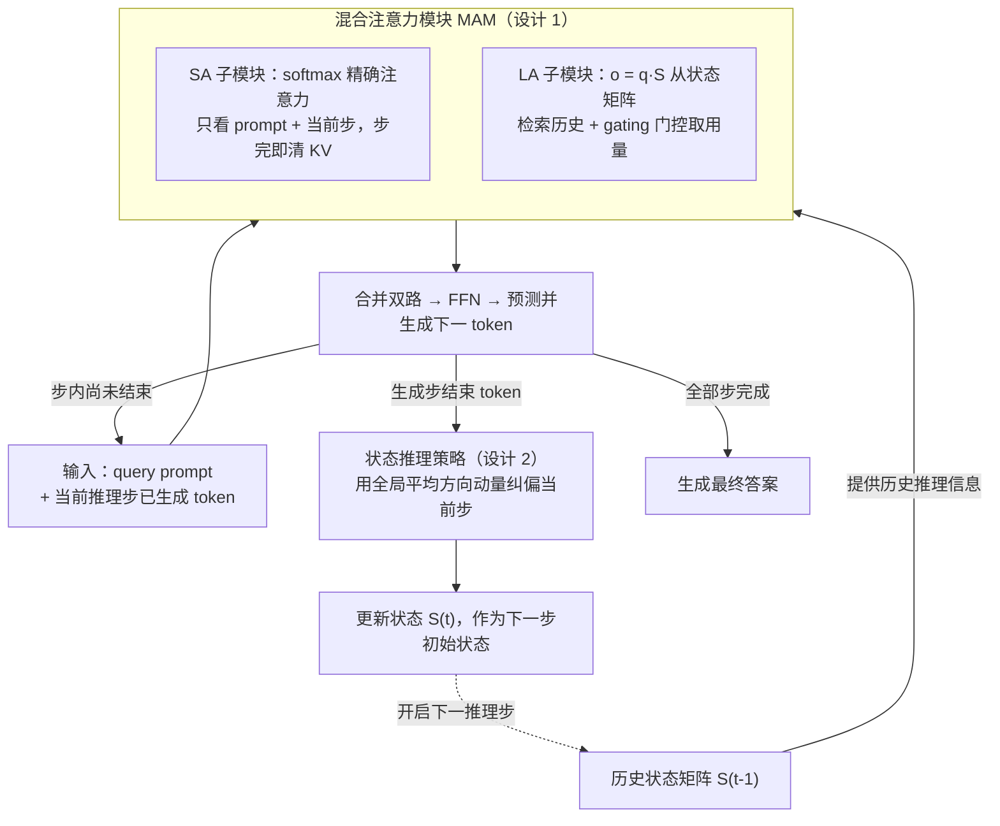

# A State-Transition Framework for Efficient LLM Reasoning

**会议**: ICLR 2026  
**arXiv**: [2602.01198](https://arxiv.org/abs/2602.01198)  
**代码**: 有  
**领域**: 模型压缩  
**关键词**: efficient reasoning, linear attention, state transition, KV cache, long CoT  

## 一句话总结
提出将 LLM 推理过程建模为状态转移过程的高效推理框架，用 Linear Attention 将历史推理步骤的信息压缩为状态矩阵，使注意力复杂度从 $O(C^2)$ 降为 $O(C)$、KV cache 从 $O(C)$ 降为 $O(1)$，同时不缩短 CoT 序列，保持推理能力。额外的动量 momentum 策略缓解了噪声推理步导致的 overthinking 问题。

## 研究背景与动机
**领域现状**：Long CoT（如 o1、R1）显著提升了 LLM 的推理能力，但 Transformer 注意力的二次复杂度使得长 CoT 的计算和内存成本极高。

**现有痛点**：现有高效推理方法主要压缩 CoT 序列（缩短、删tokens、改写），但这与 test-time scaling 矛盾——压缩 CoT 会损害推理能力。

**核心矛盾**：高效性要求减少计算，但推理能力要求保留完整的推理链。压缩 CoT 内容 vs 压缩 CoT 的注意力计算是两回事。

**本文目标** 如何在不缩短 CoT 的情况下降低推理的计算和内存开销？

**切入角度**：每个推理步骤中，有用的推理信息（结论）远少于语言信息（语法、措辞）。用 linear attention 的状态矩阵只记录推理信息，扔掉语言信息。

**核心 idea**：让每个推理步骤的 token 通过线性注意力的状态矩阵高效访问历史推理信息，而非显式注意历史 token。

## 方法详解

### 整体框架
这篇论文想在**不缩短 CoT** 的前提下，把长推理链的注意力计算和显存开销压下来。出发点是一个观察：一个推理步里真正有用的"结论性"信息很少，绝大部分 token 承担的是语法和措辞，因此完全没必要让当前步去逐个注意成千上万的历史 token。

具体做法是先把一条长 CoT 按高熵转折 token（如 "Alternatively"、"Wait"）切成一串**推理步**，再把每个 LLM 层里的 softmax 注意力替换成一个**混合注意力模块 MAM**，让"当前正在写的这一步"和"已经写完的历史步"走两条不同通路：当前步内部仍用精确 softmax 注意力，而所有已完成步的信息被线性注意力压进一个固定大小的**状态矩阵** $S_t$。当前步的每个 token 只要做一次 $\mathbf{o}=\mathbf{q}\cdot S_t$ 就能取回历史推理信息。每写完一步，再用一个**状态推理策略**把这一步的状态更新做动量纠偏后才并入 $S_t$，作为下一步的初始状态。整条 CoT 可以无限延长，而状态矩阵大小恒定不变。

### 关键设计

**1. 混合注意力模块 MAM：用 SA+LA 双路替代 softmax 注意力**

矛盾在于：当前步内部需要精确注意力才能写对这一步，但回看所有历史步又太贵。MAM 把这两件事拆开走两条通路。SA 子模块沿用原始 LLM 的 softmax 注意力，但限定每个 token 只注意 query prompt 和当前推理步的 token——一旦某个推理步完成，它在 KV cache 里的向量就被清除，所以精确注意力永远只发生在一步范围内。历史信息则交给 LA 子模块：它维护状态矩阵 $S_t=\sum_{i=1}^{t}\mathbf{k}_i^\top \mathbf{v}_i$，把每个已完成步的 key/value 外积累加进去，当前 token 用查询向量做 $\mathbf{o}=\mathbf{q}\cdot S_t$ 检索历史推理信息，再经一个 sigmoid **gating** $\sigma(W_g h)$ 控制实际取用多少（早期 token 更依赖历史、越往后越少）。两路输出相加后过线性层和 FFN。结果是：当前步内的精确注意力不丢，历史访问又变廉价，注意力复杂度从 $O(C^2)$ 降到 $O(C)$、KV cache 从 $O(C)$ 降到 $O(1)$（$C$ 为 CoT 长度）。选线性注意力而非 CNN/Q-Former，是因为它作为 softmax 的变体天然兼容、压缩时不易丢关键信息，且其状态更新本身等价于一次梯度下降，为下一个设计埋了伏笔。

**2. 状态推理策略：用动量积累的全局方向纠正噪声推理步**

长 CoT 里难免出现跑偏或冗余的推理步，若直接把它们的状态变化累进 $S_t$，会把后续检索带偏、加剧 overthinking。作者利用 LA 与 Test-Time Training 的等价关系——状态矩阵每步更新本质等价于一次梯度下降，于是把第 $t$ 步带来的状态变化 $\nabla_t=S_t-S_{t-1}$ 看作该步的"推理方向（梯度）"。噪声步的方向往往明显偏离其他步，因此先用动量累积出历史平均方向 $\bar{\nabla}_{t-1}=\frac{1}{t-1}\sum_{i<t}\nabla_i$，再在完成第 $t$ 步后把当前方向拉回全局趋势：

$$\hat{\nabla}_t=(1-\alpha)\nabla_t+\alpha\bar{\nabla}_{t-1},\qquad \alpha=\max\{\alpha_{\max},\tfrac{t}{|T|}\}$$

随后用 $\hat{\nabla}_t$ 而非原始 $\nabla_t$ 更新状态 $S_t=S_{t-1}+\hat{\nabla}_t$。纠偏系数 $\alpha$ 随推理步推进线性增大到阈值 $\alpha_{\max}$——早期步少、全局方向不可靠时少纠偏、鼓励探索，后期步多、方向可信时逐渐收敛到全局趋势。这把经典的梯度噪声缓解手段迁移到推理状态上，既有 TTT 理论依据，又在 AIME 这类难题上实测有效。

### 损失函数 / 训练策略
为不破坏 base model 已有的推理能力，训练时**只更新 LA 子模块（用 LoRA 实现以控制参数量）和标注思考模式的特殊 token**，其余权重全部冻结。CoT 用高熵转折 token 切成推理步、再聚类成若干思考模式，每步用一对特殊 token 包裹以便追踪和控制。训练用双损失 $\mathcal{L}=\mathcal{L}_{AR}+\beta\mathcal{L}_{KD}$：自回归损失 $\mathcal{L}_{AR}=-\log P(A,T\mid Q)$ 保证生成质量；知识蒸馏损失 $\mathcal{L}_{KD}=\mathrm{KL}(\hat{P}\,\|\,P)$ 用原始全注意力 base model 的分布 $\hat{P}$ 约束改造后模型 $P$，让 LA 子模块学到全局推理信息、避免双路替换带来的能力漂移。数据为从 OpenR1-Math-220K 抽出的 95K 高质量数学 CoT 样本，骨干为 Qwen2.5 系列（先用对应的 DeepSeek-R1 蒸馏版初始化），覆盖 1.5B 到 14B。

## 实验关键数据

### 主实验（vs 高效推理基线）

| 方法 | 类型 | GSM8K Acc | MATH-500 Acc | 推理延迟↓ |
|------|------|-----------|-------------|---------|
| Base model | 完整注意力 | 80.1 | 78.8 | 基线 |
| LightThinker | 压缩 CoT | 较低 | 较低 | 低 |
| INFTYTHINK | 摘要压缩 | 较低 | 较低 | 低 |
| H2O | KV cache 裁剪 | 低 | 低 | 低 |
| **Ours** | **状态转移** | **≥Base** | **≥Base** | **显著降低** |

### 关键发现
- 推理性能不降反升：状态转移框架在多个 benchmark 上等于甚至超过全注意力 base model
- 推理延迟大幅降低：CoT 越长优势越明显（因为状态矩阵大小恒定）
- 动量纠偏策略有效：消融显示它在 AIME 等难题上显著提升了正确率
- 在 1.5B, 7B, 14B 三个规模上一致有效
- 知识蒸馏损失对训练 LA 子模块至关重要

## 亮点与洞察
- **"不缩短 CoT，只缩短注意力"的思路**：完美绕开了高效推理与推理能力的矛盾——保留完整推理链但让注意力只在当前步内计算
- **TTT 视角下的动量纠偏**：利用 linear attention 等价于在线学习的理论性质，自然引入动量来抑制噪声步，理论优美且实验有效
- **对 test-time scaling 友好**：framework 允许 CoT 无限延长而计算和内存都线性增长

## 局限与展望
- Linear attention 的表达能力可能不如 softmax attention——复杂的跨步推理依赖可能在状态矩阵中丢失
- 高熵 token 分割推理步的方式可能不够精确，依赖训练数据的质量
- 仅在数学推理上验证，代码/科学推理等其他领域效果未知
- 需要从 DeepSeek-R1 蒸馏版本初始化，增加了训练 pipeline 复杂度

## 相关工作与启发
- **vs LightThinker（压缩 CoT）**: LightThinker 用特殊 token 压缩推理信息，但仍在 softmax attention 框架内；本文用 linear attention 直接替代，更彻底
- **vs TTT（Test-Time Training）**: 本文利用了 TTT 的 linear attention 理论视角，但将其应用于推理效率而非能力提升
- **vs KV cache 压缩（H2O, SapLLM）**: 这些方法在注意力分数上做选择性保留，可能丢失关键信息；本文通过双路设计（SA+LA）保证当前步内精确+历史步高效

## 评分
- 新颖性: ⭐⭐⭐⭐⭐ 状态转移建模+混合注意力的设计非常新颖
- 实验充分度: ⭐⭐⭐⭐ 多规模模型、7 个 benchmark、多基线对比
- 写作质量: ⭐⭐⭐⭐ 框架清晰，但符号和公式较多
- 价值: ⭐⭐⭐⭐⭐ 为长 CoT 推理的高效化提供了根本性解决方案

<!-- RELATED:START -->

## 相关论文

- [\[ICML 2026\] Beyond Test-Time Memory: State-Space Optimal Control for LLM Reasoning](../../ICML2026/llm_reasoning/beyond_test-time_memory_state-space_optimal_control_for_llm_reasoning.md)
- [\[ICLR 2026\] The Path of Least Resistance: Guiding LLM Reasoning Trajectories for Efficient Consistency](the_path_of_least_resistance_guiding_llm_reasoning_trajectories_for_efficient_co.md)
- [\[ICLR 2026\] Stabilizing Policy Gradients for Sample-Efficient Reinforcement Learning in LLM Reasoning](stabilizing_policy_gradients_for_sample-efficient_reinforcement_learning_in_llm_.md)
- [\[ICLR 2026\] DRPO: Efficient Reasoning via Decoupled Reward Policy Optimization](drpo_efficient_reasoning_via_decoupled_reward_policy_optimization.md)
- [\[AAAI 2026\] Beyond ReAct: A Planner-Centric Framework for Complex Tool-Augmented LLM Reasoning](../../AAAI2026/llm_reasoning/beyond_react_a_planner-centric_framework_for_complex_tool-au.md)

<!-- RELATED:END -->
