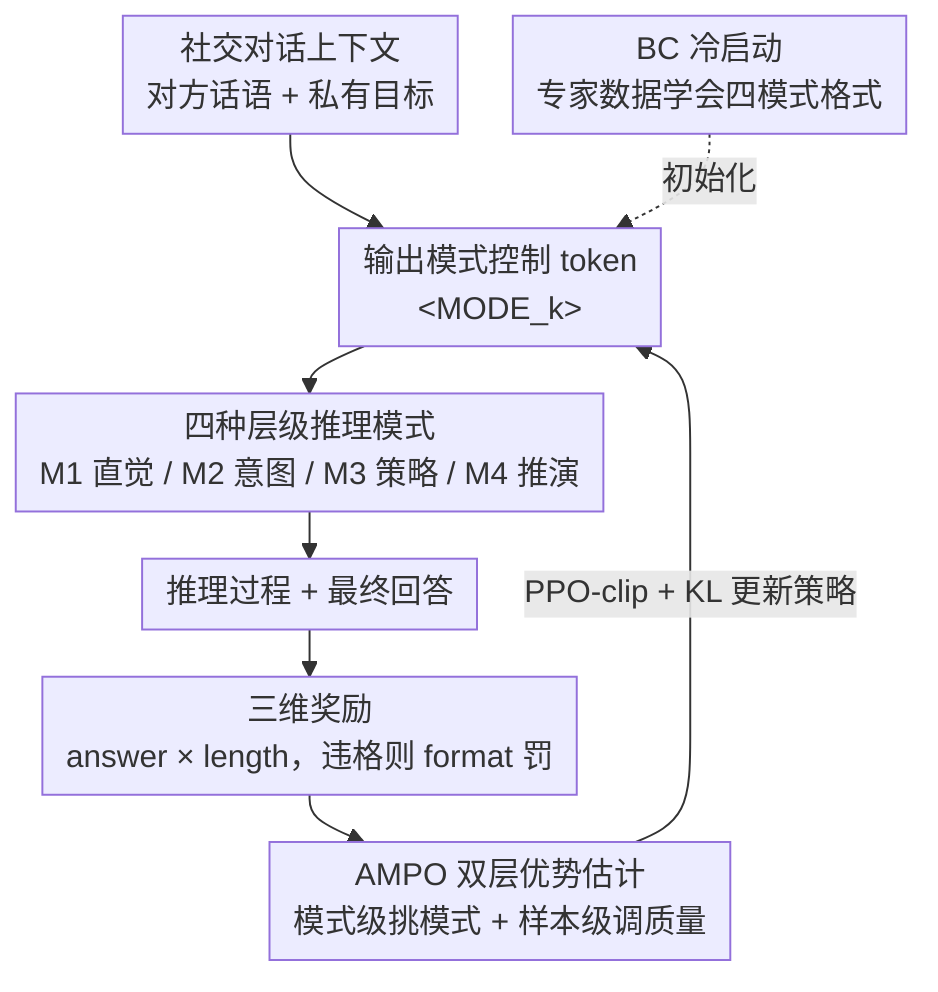

# Adaptive Social Learning via Mode Policy Optimization for Language Agents

**会议**: ICLR 2026  
**arXiv**: [2505.02156](https://arxiv.org/abs/2505.02156)  
**代码**: [https://github.com/MozerWang/AMPO](https://github.com/MozerWang/AMPO)  
**领域**: LLM推理  
**关键词**: social intelligence, adaptive reasoning, mode selection, reinforcement-learning, token efficiency

## 一句话总结
提出 Adaptive Social Learning（ASL）框架，设计四种层次化推理模式（从直觉回应到深度推演），并通过 AMPO 算法（融合模式级和样本级优势估计）让 LLM agent 根据社交场景复杂度自适应切换推理深度，在社交智能任务上比 GPT-4o 高 15.6%，比 GRPO 高 7.0% 且 token 用量减少 32.8%。

## 研究背景与动机
**领域现状**：LLM agent 在社交交互（谈判、合作等）中需要动态调整推理深度，但现有方法要么不做推理（直接回复），要么统一使用长 CoT，存在过度推理或推理不足的问题。

**现有痛点**：大推理模型（o1、R1 等）在社交任务上表现反而不如 GPT-4o——它们不分场景地进行穷举推理，导致 overthinking、推理链冗长、目标意识弱。GRPO 训练后模型也倾向于收敛到单一推理模式（总用最深的 Mode 4）。

**核心矛盾**：社交交互是动态的，不同回合、不同场景需要不同深度的推理。简单场景（双方目标已达成）只需直觉回应，复杂场景（双方冲突未解决）才需要深度策略推演。但现有 RL 方法（GRPO）的优势估计是"模式盲"的，无法学到这种自适应能力。

**本文目标** 如何让 LLM agent 在社交交互中根据上下文动态选择合适的推理深度，同时保持高效和高效果？

**切入角度**：借鉴认知科学的层级认知控制理论（HCCT），设计四个层次的推理模式，并在 GRPO 基础上引入模式级优势估计来引导模式选择。

**核心 idea**：用层级推理模式 + 模式感知的 RL 优化（AMPO）让社交 agent 学会"该快则快、该慢则慢"的自适应推理。

## 方法详解

### 整体框架
这篇论文要解决的是：让社交 agent 学会"该快则快、该慢则慢"——简单场景直觉回应，复杂场景才深度推演，而不是像现有大推理模型那样不分场景地穷举推理。整个流程从一段社交对话上下文出发，模型先吐出一个模式控制 token（决定这一回合用多深的推理），再按该模式的格式产出推理过程和最终回答；这份回答经三维奖励打分后，AMPO 用双层优势估计把信号回灌给策略，模型由此学会"看场景挑模式"并打磨推理质量。训练上先用行为克隆（BC）冷启动让模型学会四种模式各自的输出格式，再进入 AMPO 强化学习的迭代回环。

### 关键设计

**1. 四种层级推理模式：把推理深度做成可选挡位**

社交交互里不同回合需要的推理深度天差地别，所以这里没有用统一的 Long-CoT，而是按认知科学的层级认知控制理论（HCCT）把推理拆成由浅到深的四挡，每挡用一个控制 token `<MODE_k>` 在开头标识。M1（直觉回应）最浅，不做任何推理直接给答案，对应"双方目标已达成"这类简单场景；M2（意图分析）补上分析对方意图、保持说话风格、再给初步回应三步；M3（策略适应）在 M2 之上再加历史分析、目标明晰、情境评估、策略制定四步；M4（前瞻推演）最深，在 M3 基础上生成多个候选策略、各自模拟推演（Deduction）再整合择优（Integration）。这四挡正好对应 HCCT 从感觉运动到长情景控制的四个层级，等于给模型配齐了从 System 1 到 System 2 的完整推理谱系，让它有"挡位"可选。

**2. 三维奖励：把"简洁"也写进训练信号**

光靠目标完成度一项奖励，模型很容易学会"话越多越保险"，生成一堆冗长却没实质策略提升的推理。所以奖励由三部分组成：answer reward $r^a$ 用 LLM evaluator 评估社交目标的完成度并归一化到 $[0,1]$；format reward 约束模式格式，一旦违反就罚 $-2$ 并直接覆盖整个奖励；answer length reward $r^l$ 则是长度惩罚，答案超过目标长度时平滑衰减到 $[0,1]$。格式正确时总奖励取 $r = r^a \times r^l$，格式错误时取 $r = -2$。length reward 鼓励简洁这件事，正好和下一步模式级优势里"reward 打平就选短模式"的分支配合，共同把推理深度的自适应坐实。

**3. Adaptive Mode Policy Optimization：让优化器看得见"模式"**

GRPO 的优势估计是"模式盲"的——它只按 reward 把样本排个序，并不知道这些样本来自哪种模式，结果训练后模型一股脑收敛到 reward 最高但最费 token 的 M4。AMPO 的破法是把优势拆成两层：模式级优势 $A^{\mathcal{M}}$ 负责挑模式，样本级优势 $A^{\mathcal{S}}$ 负责在选定模式内分高下。模式级这一层带一个"性能优先、性能打平再比效率"的开关——当各模式的平均 reward $\bar{r}^{\mathcal{M}_k}$ 拉得开时，按 reward 的组内标准化值引导模型选高分模式；当所有 rollout 的 reward 都相同（如简单任务各模式都能解）时，它改用各模式平均 token 长度 $\bar{l}^{\mathcal{M}_k}$ 的组内标准化值、取负 tanh 当信号，主动奖励更短的模式：

$$
A^{\mathcal{M}}_i =
\begin{cases}
\dfrac{\bar{r}^{m(i)} - \mathrm{mean}(\{\bar{r}^{\mathcal{M}_k}\})}{\mathrm{std}(\{\bar{r}^{\mathcal{M}_k}\})}, & \text{各模式 reward 有差异} \\[8pt]
-\tanh\!\left(\dfrac{\bar{l}^{m(i)} - \mathrm{mean}(\{\bar{l}^{\mathcal{M}_k}\})}{\mathrm{std}(\{\bar{l}^{\mathcal{M}_k}\})}\right), & \text{各模式 reward 全相同}
\end{cases}
$$

样本级 $A^{\mathcal{S}}$ 则只在同一模式内部比较各 rollout 的质量。两者相加得到最终优势 $A = A^{\mathcal{M}} + A^{\mathcal{S}}$，再嵌进 PPO-clip 目标函数里更新。这样一来，reward 区分得开时模型追高分模式，reward 打平时就转去追效率，"该快则快"的自适应行为就是从这个切换里长出来的。

### 损失函数 / 训练策略
两阶段训练。第一阶段是 BC 冷启动（损失 $\mathcal{L}_{\text{BC}}$ 为标准的模仿学习负对数似然）：用专家 LLM 为每种模式生成完全符合格式的训练数据做 SFT，让模型先把四种模式的输出格式学会。第二阶段是 AMPO 在线策略优化：对每个 prompt 采样 $G$ 个 rollout（覆盖不同模式），用上面的双层优势估计配 PPO-clip 加 KL 正则化更新策略。训练采用 single-turn 范式以提高效率。

## 实验关键数据

### 主实验

| 方法 | SOTOPIA Goal↑ | Hard Goal↑ | Hard Overall↑ | Avg Tokens↓ |
|------|-------------|-----------|--------------|-------------|
| GPT-4o | 8.19 | 6.97 | 3.46 | - |
| DeepSeek-R1 | 7.97 | 5.86 | 2.73 | 711 |
| QwQ-32B | 7.70 | 5.35 | 2.41 | 973 |
| Qwen-7B + GRPO | 8.87 | 7.44 | 3.41 | 905 |
| **Qwen-7B + AMPO** | **8.95** | **7.85** | **3.54** | **647** |
| Llama-8B + GRPO | 8.86 | 7.59 | 3.44 | 865 |
| **Llama-8B + AMPO** | **9.08** | **8.06** | **3.68** | **581** |

### 消融实验

| 配置 | Hard Goal | Hard Overall | Avg Tokens |
|------|-----------|-------------|------------|
| AMPO + 4 Modes (完整) | 7.85 | 3.54 | 647 |
| AMPO w/o length reward | 7.56 | 3.56 | 1617 |
| 仅 M1 | 7.08 | 3.40 | 101 |
| 仅 M4 | 7.62 | 3.31 | 972 |
| GRPO + 无模式 | 7.32 | 3.16 | 866 |
| GRPO + 4 模式 | 7.44 | 3.41 | 905 |

### 关键发现
- **大推理模型在社交任务上全面落败**：o1、R1、QwQ 在 SOTOPIA-Hard 上均显著低于 GPT-4o，说明穷举推理对社交智能有害
- 模式分布随交互回合自适应变化：M4 集中在前 4 轮（53%），M1 在后期飙升（50% in 14-20 轮），符合"先深后浅"的认知直觉
- 去掉 length reward 后 token 暴增 2.5 倍（647→1617），但 Goal 反而下降（7.85→7.56），证实冗长推理不等于好推理
- 混合模式比单一模式显著更优：AMPO+4模式 比最好的单模式（M4）Goal 高 3%，token 少 33%

## 亮点与洞察
- **推理深度自适应是关键洞察**：不是所有场景都需要 Long-CoT，社交交互中自适应推理深度比统一深度推理更有效，这个发现可以推广到很多非确定性答案的任务
- **模式级优势估计的设计很巧妙**：当 reward 区分度够时选高 reward 模式，当 reward 相近时选效率更高的模式，两个分支的切换自然优雅
- **认知科学指导 AI 设计**：HCCT 四层级到四种推理模式的映射关系清晰，经验上也得到验证，说明认知科学理论对 AI agent 设计有指导价值

## 局限与展望
- single-turn 训练范式可能限制了长程策略一致性，尽管作者做了分析但仍是潜在弱点
- 四种模式是人工设计的，模式数量和结构可能不是最优的，自动发现推理模式可能更好
- 评估依赖 GPT-4o 打分（虽然有人工验证），可能存在 evaluator bias
- 目前仅在社交交互任务上验证，推广到其他需要自适应推理的场景（如开放域 QA、创意写作）尚未验证

## 相关工作与启发
- **vs GRPO**: AMPO 在 GRPO 基础上引入模式级优势估计，解决了 GRPO 的模式盲问题，实现了更好的性能-效率 trade-off
- **vs 大推理模型 (o1/R1)**: 这些模型在社交任务上的失败说明，无差别的 Long-CoT 不适合需要社交智能的开放式交互，需要更结构化的推理方式
- **vs EPO/DSI**: 外挂策略模块或策略注入虽有提升但幅度有限，端到端的自适应推理学习（ASL）更有效

## 评分
- 新颖性: ⭐⭐⭐⭐ 层级推理模式设计新颖，AMPO 的双层优势估计有创新
- 实验充分度: ⭐⭐⭐⭐⭐ 多模型、多基准、消融充分、人工评估、OOD 验证
- 写作质量: ⭐⭐⭐⭐ 结构清晰，但公式较多偏密集
- 价值: ⭐⭐⭐⭐ 自适应推理深度的思想有广泛适用性，社交智能方向的重要工作

<!-- RELATED:START -->

## 相关论文

- [\[ICLR 2026\] Temperature as a Meta-Policy: Adaptive Temperature in LLM Reinforcement Learning](temperature_as_a_meta-policy_adaptive_temperature_in_llm_reinforcement_learning.md)
- [\[ICLR 2026\] DRPO: Efficient Reasoning via Decoupled Reward Policy Optimization](drpo_efficient_reasoning_via_decoupled_reward_policy_optimization.md)
- [\[ICLR 2026\] FastGRPO: Accelerating Policy Optimization via Concurrency-aware Speculative Decoding and Online Draft Learning](fastgrpo_accelerating_policy_optimization_via_concurrency-aware_speculative_deco.md)
- [\[ICLR 2026\] Estimating the Empowerment of Language Model Agents](estimating_the_empowerment_of_language_model_agents.md)
- [\[ACL 2026\] Adapt to Thrive! Adaptive Power-Mean Policy Optimization for Improved LLM Reasoning](../../ACL2026/llm_reasoning/adapt_to_thrive_adaptive_power-mean_policy_optimization_for_improved_llm_reasoni.md)

<!-- RELATED:END -->
