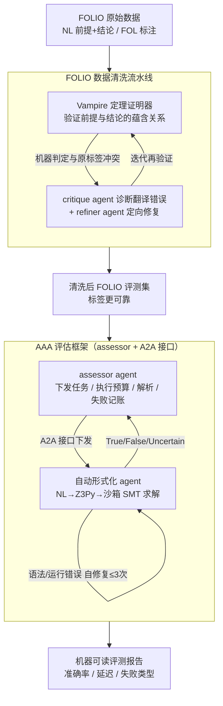

# Agentified Assessment of Logical Reasoning Agents

**会议**: ICLR 2026  
**arXiv**: [2603.02788](https://arxiv.org/abs/2603.02788)  
**代码**: [HuggingFace数据集](https://huggingface.co/datasets/yfxiao/folio-refined)  
**领域**: LLM推理  
**关键词**: 逻辑推理评测, Agent-to-Agent评估, 一阶逻辑, 自动形式化, SMT求解

## 一句话总结

提出基于Agent的评测框架(AAA)，将评估逻辑封装为assessor agent并通过标准A2A接口与被测agent交互，在经Vampire定理证明器系统清洗的FOLIO数据集上，自动形式化agent（NL→Z3Py+SMT求解）达到86.70%准确率，大幅超过CoT基线73.89%，尤其在矛盾检测(False类)上提升32.79个百分点。

## 研究背景与动机

- **评估痛点一——失败模式混淆**: 评估推理agent时，运行失败(超时/解析错误/运行时异常)与推理错误常被混淆在单一准确率数字中，难以区分"模型不会推理"和"模型的工具出了问题"
- **评估痛点二——集成成本线性增长**: 传统评测harness将benchmark逻辑与agent实现紧耦合，每增加一个benchmark就需要重新集成，成本为O(n)
- **数据质量问题**: FOLIO数据集存在潜在标签错误(训练集3.8%、验证集1.5%)和NL-FOL翻译质量问题，在不可靠数据上评估推理能力本身就不可靠
- **标准化接口缺失**: 不同agent有不同的输入输出格式、执行环境和错误处理方式，缺乏统一的即插即用接口
- **形式化验证价值**: 一阶逻辑推理是LLM的重要能力，但CoT方法无法保证逻辑有效性，形式化验证(SMT求解)提供确定性保证

## 方法详解

### 整体框架

这篇论文做的不是某个推理模型，而是一套评测推理 agent 的方法论，外加一个验证它的案例。核心主张是：把"评测协议"本身也封装成一个 assessor agent，让它通过标准的 A2A 接口去驱动被测的 agent under test，从而把"评什么"和"被评的是谁、怎么实现"彻底解耦。落地时分三步走：先用一条定理证明器流水线把 FOLIO 数据集的标签离线清洗一遍，得到更可靠的评测集；再让 assessor agent 在这份数据上下发任务、约束执行预算、解析输出、结构化记录失败类型；被测方则是一个把自然语言推理题翻译成可执行代码、交 SMT 求解器判定的自动形式化 agent。三者串起来就是"可靠数据 → 标准接口评测 → 形式化求解"的闭环，CoT 提示则作为不经求解器的对照基线一同接入同一个 assessor。

### 关键设计

**1. FOLIO 数据清洗流水线：用定理证明器替人工把标签验一遍**

在不可靠的标签上评推理能力本身就不可靠，而 FOLIO 训练集约 3.8%、验证集约 1.5% 的标签存在疑似错误，根因是自然语言到一阶逻辑的语义解析容易出岔。流水线先用 Vampire 定理证明器对每条样本的 FOL 表示做形式化验证：先查前提合取 $\bigwedge_i \phi_i$ 是否可满足（即前提是否自洽），再用蕴含条件重判标签——当 $\bigwedge_i \phi_i \wedge \neg\varphi$ 不可满足时判 True，当 $\bigwedge_i \phi_i \wedge \varphi$ 不可满足时判 False，两者都不成立则判 Uncertain。当机器判定与原标签冲突，就交给两个 LLM agent 接力：critique agent 诊断翻译层面的系统性毛病（括号不匹配、词法笔误、命名不一致等），refiner agent 据此做定向修复，再回到 Vampire 迭代重验，直到与期望标签一致；超过预设迭代阈值仍不一致的才标记人工审查。训练集上 674 条（67.3%）一次验证即通过、23 条（2.3%）修复后通过、剩余 304 条（30.4%）仍存疑，由此产出一份标签更干净的评测集（已开源为 folio-refined）。

**2. AAA 评估框架：把"工具崩了"和"模型不会推理"分开记账**

传统评测 harness 把超时、解析失败、运行时异常统统折算进一个准确率数字里，于是没法区分模型是真的推理错了，还是只是它的工具链出了岔子；而且 harness 把 benchmark 逻辑和 agent 实现紧耦合，每接一个新 benchmark 都要重新集成。AAA 把评估逻辑本身封装成 assessor agent 来破这两点：assessor 接管完整评估协议——逐题下发任务、用执行预算（超时与重试次数）做约束、确定性地解析最终标签、并把失败按 Timeout、RuntimeError、ParseError 三类执行失败结构化记录下来，与"推理错误"严格区分，最后产出含逐样本记录（gold/预测标签、对错、错误类型、延迟）和聚合指标的机器可读报告。这样既不像旧 harness 那样把无法解析的输出一律当错答案，又让评测可审计可复现。更关键的是它改写了集成成本模型：被测方只要实现一次 A2A 接口，就能接入任意 assessor，成本从随 benchmark 数量线性增长的 $O(n)$ 降到 $O(1)$，从而支持即插即用、对被测 agent 的内部架构不做任何假设。

**3. 自动形式化 agent：把"好像对"的推理换成 SMT 求解的确定性判定**

这是验证整套框架的主力被测 agent，针对的是 CoT 那种链式推理只能给出"看起来成立"、无法保证逻辑有效性的弱点。它分两阶段工作：Stage 1（代码生成）让 LLM 把自然语言的前提与结论翻译成一段可执行的 Z3Py 程序；Stage 2（执行与验证）在沙箱里以 60 秒超时运行该程序，按和数据清洗同一套可满足性条件输出 True/False/Uncertain——$\bigwedge_i \phi_i \wedge \neg\varphi$ 不可满足判 True，$\bigwedge_i \phi_i \wedge \varphi$ 不可满足判 False，否则 Uncertain。为对抗 LLM 生成代码的脆弱性，它带一个最多 3 次的自修复循环：遇到语法错误或量词写错导致执行失败时，提取报错信息做定向修改后重试。把逻辑有效性交给求解器保证，正是它在需要证明矛盾不可满足的 False 类上比 CoT 稳得多的原因。实验中作为对照的 CoT 基线则相反——只用 step-by-step 提示让模型推完直接给标签，全程不碰外部求解器，用来划出"纯语言推理"的能力参照线。

## 实验关键数据

### 主实验表

| 方法 | True准确率 | False准确率 | Uncertain准确率 | 总体准确率 |
|------|:---------:|:----------:|:--------------:|:---------:|
| Chain-of-Thought | 89.04% | 44.26% | 84.06% | 73.89% |
| **Auto-formalization** | **90.41%** | **77.05%** | **91.30%** | **86.70%** |

### 消融分析

| 分析维度 | 发现 |
|---------|------|
| False类提升 | +32.79pp，矛盾检测是CoT最弱项，形式化验证优势最显著 |
| Uncertain类提升 | +7.24pp，solver擅长处理逻辑不确定性 |
| True类 | 89.04%→90.41%，已较高，提升有限 |
| 数据清洗影响 | 清洗后标签更可靠，评估结果更真实 |

### 关键发现

- False类别的巨大提升(44.26%→77.05%)说明CoT在逻辑矛盾推理上的系统性弱点：模型难以从前提推导出矛盾(需要证明$\phi \wedge \neg\varphi$不可满足)
- 形式化验证将"好像对"式的推理替换为确定性的逻辑保证
- Backbone使用Gemini 2.5 Flash(T=0.0)，确保确定性输出
- 数据清洗揭示了现有benchmark的隐含质量问题——在错误标签上评估会系统性低估模型能力

## 亮点与洞察

- **评测agent化的范式创新**: 将评估本身变成agent，解耦了评估逻辑与被测agent实现，降低集成成本
- **结构化失败记录**: 区分Timeout/RuntimeError/ParseError vs 推理错误，使评测可审计可追溯
- **数据清洗的启示**: 用形式化定理证明器验证NLI数据集标签，比人工标注更可靠更可扩展
- **False类的巨大提升**: 揭示了CoT在逻辑否定/矛盾推理上的根本局限——非形式化方法此处天花板有限

## 局限与展望

- 仅在单一数据集(FOLIO 203例验证集)上验证，规模极小，统计功效有限
- 仅比较了CoT和Auto-formalization两种agent，缺乏更多方法(如LINC/Logic-LM/SymbCoT)对比
- 数据清洗流水线仍有30.4%训练样本标记为"problematic"未解决，pipeline的完整性待提升
- A2A接口的实际互操作性、通信延迟和开销未详细分析
- 自动形式化的Z3Py代码质量高度依赖backbone LLM能力
- 未测试在更复杂的推理任务(如高阶逻辑/概率推理)上的表现

## 相关工作与启发

- 相比传统静态评测harness，AAA解耦评估逻辑与agent实现，代表评测方法论的进步
- 基于AgentBeats框架和A2A协议，与Agent互操作性标准趋势一致
- FOLIO清洗工作用Vampire定理证明器验证NL-FOL对齐，是数据质量保证的范例
- 自动形式化(NL→Z3Py)思路与LINC/Logic-LM一脉相承，但增加了自修复循环提高鲁棒性

## 评分

- 新颖性: ⭐⭐⭐ (AAA框架概念新颖，但自动形式化技术相对简单)
- 实验充分度: ⭐⭐ (单数据集、少对比方法、规模极小)
- 写作质量: ⭐⭐⭐⭐ (清晰规范，问题定义精确)
- 价值: ⭐⭐⭐ (评测agent化范式有启发性，数据清洗有实践价值)

<!-- RELATED:START -->

## 相关论文

- [\[ICLR 2026\] Scaling Generalist Data-Analytic Agents](scaling_generalist_data-analytic_agents.md)
- [\[ICLR 2026\] ActivationReasoning: Logical Reasoning in Latent Activation Spaces](activationreasoning_logical_reasoning_in_latent_activation_spaces.md)
- [\[ICLR 2026\] Estimating the Empowerment of Language Model Agents](estimating_the_empowerment_of_language_model_agents.md)
- [\[ICLR 2026\] The Reasoning Trap — Logical Reasoning as a Mechanistic Pathway to Situational Awareness](the_reasoning_trap_--_logical_reasoning_as_a_mechanistic_pathway_to_situational_.md)
- [\[ICLR 2026\] LogicReward: Incentivizing LLM Reasoning via Step-Wise Logical Supervision](logicreward_incentivizing_llm_reasoning_via_step-wise_logical_supervision.md)

<!-- RELATED:END -->
