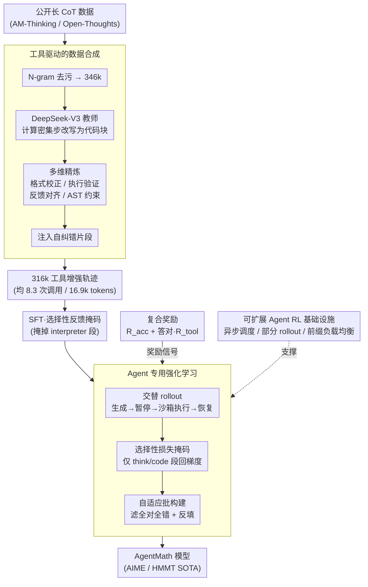

# AgentMath: Empowering Mathematical Reasoning for Large Language Models via Tool-Augmented Agent

**会议**: ICLR 2026  
**arXiv**: [2512.20745](https://arxiv.org/abs/2512.20745)  
**代码**: 无  
**领域**: LLM Reasoning  
**关键词**: 数学推理, 工具增强, 强化学习, 代码解释器, Agent框架

## 一句话总结
AgentMath提出一个工具增强的Agent框架，通过自动化数据合成、多轮交互式强化学习和高效异步训练系统，将LLM推理能力与代码解释器的计算精度无缝结合，在AIME24/25和HMMT25上以30B-A3B规模达到SOTA水平（90.6%/86.4%/73.8%），超越o3-mini和Claude-Opus-4.0-Thinking。

## 研究背景与动机
大型推理模型（LRM）如o3和DeepSeek-R1在长链思维推理上取得了显著进展，但在处理需要精确数学运算的问题时仍存在计算效率低和准确性不足的问题——纯文本推理的固有局限导致频繁的计算错误和冗余校正。现有工具增强方法面临三大挑战：(1) 高质量工具使用数据极度稀缺，手动标注成本高且不可扩展；(2) Agent强化学习在工具使用策略优化方面的潜力尚未被充分探索；(3) 竞赛级数学问题涉及超长推理链（96k tokens、96次工具调用），传统批同步RL训练无法胜任。本文的核心idea是：构建一个端到端的Agent框架，通过自动化数据合成解决数据稀缺、通过Agentic RL学习最优工具使用策略、通过异步训练架构解决效率瓶颈。

## 方法详解

### 整体框架
AgentMath把工具增强数学推理建模成一个马尔可夫决策过程：LLM 策略交替吐出自然语言推理片段和可执行代码块，再把代码丢进沙箱环境拿回执行结果继续推。三种状态用结构化标记区分——`<think>` 包裹推理、`<code>` 包裹可执行代码、`<interpreter>` 封装执行反馈。整条流水线分两段：先在合成的工具增强轨迹上做 SFT 建立基本的工具使用习惯，再用大规模 Agentic RL 让模型自己探索最优的"什么时候该写代码、写多少"策略；而支撑这套训练（尤其是 RL 阶段 96k tokens、近百次工具调用的超长轨迹）跑得起来的，是一套专门的异步基础设施。

### 关键设计

**1. 工具驱动的数据合成：让计算密集步骤自动长出代码** 高质量工具使用轨迹几乎无法手动标注，AgentMath 改用三阶段自动管线把现成的纯文本 CoT "改造"成带工具的轨迹。第一阶段先从 AM-Thinking、Open-Thoughts 等公开源聚合长 CoT 数据，经 N-gram 过滤剔除与评测集的重叠，留下 346k 条干净样本，再让 DeepSeek-V3 当教师，把其中计算密集的步骤替换成可执行代码块，同时刻意保留简单算式为纯文本，防止模型养成事事调工具的坏习惯。第二阶段做多维度精炼：格式一致性校正、沙箱执行验证代码可跑、用 Qwen3-32B 判断推理与执行结果是否对齐（并把教师模拟的输出换成真实执行结果），以及用 AST 深度和代码行数约束筛掉那些"杀鸡用牛刀"的无谓代码。第三阶段专门注入自纠错能力——从执行失败的轨迹里采样，让教师生成"诊断错误→修复代码→重跑→继续推理"的纠正片段。最终得到 316k 条工具增强训练集，平均每条 8.3 次工具调用、16.9k tokens。

**2. Agent 专用强化学习：只对模型自己的决策回传梯度** 数据合成只能教会模仿，真正的最优工具策略要靠 RL 探索，AgentMath 在 GRPO 上做了三处针对 Agent 场景的改造。其一是交替执行的轨迹构建：rollout 时走"生成—暂停—执行—恢复"的循环，把模型输出和沙箱反馈拼成一条混合轨迹，工具调用上限设为 $T$ 次。其二是选择性损失掩码——优势信号只作用在 `<think>` 和 `<code>` 段的 token 上，`<interpreter>` 段那些来自环境的反馈 token 在优化时被掩掉，因为这些 token 不是模型生成的，让它们参与梯度更新只会引入噪声。其三是自适应批构建：把一整批里全对或全错的问题过滤掉（这些题没有梯度信号），再反填新样本维持批大小恒定，保证每步都在"有学习信号"的题上更新。

**3. 复合奖励：答对之后再奖励省着用工具** 奖励函数同时盯住答案正确性和工具使用效率，写成 $R_{total} = R_{acc} + \mathbb{I}(R_{acc}=1) \cdot R_{tool}$。其中 $R_{acc}$ 是基于数学等价性判定的二值反馈（答案对就是 1），$R_{tool} = \min(R_{max}, \alpha + \beta \cdot N_{code})$ 只在答对时生效，按代码调用次数 $N_{code}$ 线性给一份有上限的额外奖励。这个"先答对、再奖励高效"的门控设计，避免模型为了刷工具奖励而胡乱写代码，又能在保证正确的前提下鼓励它把计算交给解释器。

**4. 可扩展的 Agent RL 基础设施：让 96k tokens × 96 次工具调用跑得起来** 竞赛题的轨迹动辄上下文 96k、工具调用近百次，传统批同步 RL 会被最慢的那条轨迹拖死，AgentMath 用四项工程把训练提速 4–5 倍。首先把 CPU 密集的代码执行从训练循环里剥出来，丢到分布式沙箱集群，单次工具调用延迟从 175s 压到 1.2s。其次做请求级异步 rollout 调度：每条轨迹是一个独立的长运行请求，某条暂停等执行时推理引擎立刻去处理其他就绪请求，彻底消掉队头阻塞。第三是 Agent 部分 rollout，把超长轨迹切成预算受限的片段 $\tau = \tau^{(1)} \oplus \tau^{(2)} \oplus \ldots$，每段受最大生成长度 $L_{seg}$ 和最大工具调用数 $T_{seg}$ 约束，防止单条长尾轨迹独占资源，单这一项就有 2.2–2.5 倍加速。最后是前缀感知加权负载均衡，按前缀长度给每个请求分配动态权重 $w_j = \lfloor L_j / L_{base} \rfloor + w_{base}$，再配合 LRU 粘性会话尽量复用 KV-cache。

### 损失函数 / 训练策略
SFT 阶段用的是带选择性反馈掩码的自回归损失 $\mathcal{L}_{SFT-masked} = -\sum_t \sum_k (1 - \mathbb{I}(z_{t,k})) \log \pi_\theta(z_{t,k} | \cdot)$，同样把 `<interpreter>` 段的 token 掩掉，只在模型自己该生成的位置算 loss；具体用 Llama-Factory 训 6 个 epoch、学习率 6e-5。RL 阶段用 verl 0.5.0，学习率 1e-6、batch size 64、每题采样 8 条 rollout，并采用多阶段自适应扩容策略：一旦截断率超过 10% 就自动放大预算，上下文长度沿 48k→72k→96k、工具调用上限沿 48→72→96、部分 rollout 段数沿 2→3→4 逐级提升，从而在算力允许的范围内逐步释放更长的推理链。

## 实验关键数据

### 主实验

| 数据集 | 指标 | AgentMath-8B | AgentMath-30B-A3B | AgentMath-235B-A22B-SFT | 之前SOTA (同规模) | 提升 |
|--------|------|------|------|------|----------|------|
| AIME24 | avg@32 | 89.8% | 90.6% | 93.4% | 86.0% (DS-0528-Qwen3-8B) | +3.8% |
| AIME25 | avg@32 | 84.7% | 86.4% | 90.8% | 76.3% (DS-0528-Qwen3-8B) | +8.4% |
| HMMT25 | avg@32 | 71.3% | 73.8% | 81.7% | 61.5% (DS-0528-Qwen3-8B) | +9.8% |

AgentMath-30B-A3B（仅3B激活参数）在AIME24/25上超越OpenAI-o3-mini (87.3%/86.3%)和Claude-Opus-4.0-Thinking (83.0%/72.0%)，逼近DeepSeek-R1-671B (91.4%/87.5%)。

### 消融实验

| 配置 | AIME24 | AIME25 | 说明 |
|------|---------|------|------|
| 未精炼合成数据 | 35.3% | 25.7% | 格式不一致和不可执行代码导致性能差 |
| + 格式一致性校正 | 47.4% | 40.1% | +12.1%/+14.4% |
| + 代码可执行性验证 | 52.8% | 44.8% | +5.4%/+4.7% |
| + 环境反馈对齐 | 56.3% | 48.3% | +3.5%/+3.5% |
| + 自纠正能力注入 | 58.6% | 50.8% | +2.3%/+2.5% |
| + SFT选择性掩码 | 60.5% | 53.3% | 最终SFT性能 |
| Text-Based-SFT vs AgentMath-SFT | 57.1% vs 60.5% | 49.2% vs 53.3% | 工具增强数据优势 |
| Text-Based-RL vs AgentMath-RL | 68.7% vs 76.2% | 57.5% vs 67.5% | RL阶段4x效率提升 |

### 训练效率

| 方法 | 每步时间 | 加速比 |
|------|---------|------|
| 静态批同步Rollout | 3600-4000s | - |
| + 请求级异步调度 | 2100-2500s | 1.5-1.8x |
| + Agent部分Rollout | 1100-1300s | 3.0-3.3x |
| + 前缀感知负载均衡 | 750-900s | 4.0-5.0x |

### 关键发现
- 工具增强模型在RL中仅需约400步即达到76.2%（AIME24），而纯文本模型需要约1600步才达到68.7%，效率提升4x
- 多阶段RL训练中出现了涌现的代码自纠正能力
- 推理序列长度减少约4k tokens（~14%），工具代码替代了冗长的手动计算
- 数据从2k扩展到300k时，AIME24从27.2%提升到78.4%，展现良好的scaling law

## 亮点与洞察
- **系统性解决三大瓶颈**：数据稀缺（自动合成管线）、策略优化（Agentic RL）、训练效率（异步基础设施），形成完整的技术闭环
- **涌现的代码自纠正能力**：RL训练中模型自主学会了诊断和修复代码错误的能力，这是未被显式训练的涌现行为
- **MoE模型的惊人效率**：30B-A3B模型仅用3B激活参数就接近671B参数模型的性能，说明工具增强策略可以大幅弥补参数量的不足
- **部分Rollout的精妙设计**：将超长轨迹分解为可管理的片段，既解决了长尾延迟问题，又不损害性能（accuracy~70%在不同N设置下保持一致）

## 局限与展望
- 235B规模模型由于算力限制仅进行了SFT，未做RL训练，可能还有更大提升空间
- 目前仅关注数学竞赛基准测试，未验证在科学推理、工程计算等更广泛场景的泛化性
- 复合奖励函数中的工具使用奖励设计相对简单，可能无法精细引导最优的工具调用时机
- 代码解释器目前限于Python/SymPy，未探索其他计算工具（如Mathematica、SageMath）的集成

## 相关工作与启发
- **与ToRL/ReTool的对比**：这些方法也探索了RL+工具使用，但在数据质量和训练效率上不及AgentMath，且改进幅度有限
- **与CoRT的对比**：CoRT依赖高质量人工标注，不可扩展；AgentMath的自动合成管线解决了这个问题
- **工程启发**：异步训练系统的设计思路（请求级调度+部分Rollout+前缀感知LB）具有很强的通用性，可迁移到其他Agent RL场景
- **关于Agent系统设计**：本文表明GRPO等简单的outcome-based奖励在Agent场景中就足够有效，无需复杂的process reward

## 评分
- 新颖性: ⭐⭐⭐⭐
- 实验充分度: ⭐⭐⭐⭐⭐
- 写作质量: ⭐⭐⭐⭐⭐
- 价值: ⭐⭐⭐⭐⭐

<!-- RELATED:START -->

## 相关论文

- [\[ICLR 2026\] SealQA: Raising the Bar for Reasoning in Search-Augmented Language Models](sealqa_raising_the_bar_for_reasoning_in_search-augmented_language_models.md)
- [\[ICLR 2026\] Vision-R1: Incentivizing Reasoning Capability in Multimodal Large Language Models](vision-r1_incentivizing_reasoning_capability_in_multimodal_large_language_models.md)
- [\[ICLR 2026\] THOR: Tool-Integrated Hierarchical Optimization via RL for Mathematical Reasoning](thor_tool-integrated_hierarchical_optimization_via_rl_for_mathematical_reasoning.md)
- [\[NeurIPS 2025\] WebThinker: Empowering Large Reasoning Models with Deep Research Capability](../../NeurIPS2025/llm_reasoning/webthinker_empowering_large_reasoning_models_with_deep_research_capability.md)
- [\[ICLR 2026\] InftyThink: Breaking the Length Limits of Long-Context Reasoning in Large Language Models](inftythink_breaking_the_length_limits_of_long-context_reasoning_in_large_languag.md)

<!-- RELATED:END -->
