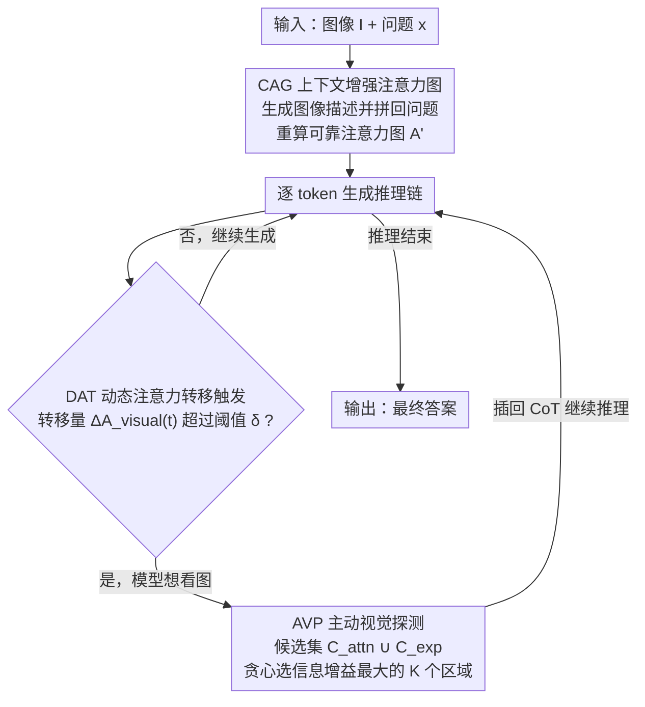

# AIMCoT: Active Information-driven Multimodal Chain-of-Thought for Vision-Language Reasoning

**会议**: ICLR 2026  
**arXiv**: [2509.25699](https://arxiv.org/abs/2509.25699)  
**代码**: 有（匿名链接）  
**领域**: LLM推理  
**关键词**: multimodal CoT, information gain, active visual probing, attention map, interleaved reasoning  

## 一句话总结
提出 AIMCoT，将多模态 CoT 的视觉信息选择从"被动关注高注意力区域"转变为"主动寻找最高信息增益区域"，通过三个模块（CAG 上下文增强注意力图、AVP 主动视觉探测、DAT 动态注意力转移触发）协同工作，在 LLaVA-W 上比 ICoT 提升 18.25%（0-shot），是一个免训练的即插即用框架。

## 研究背景与动机
**领域现状**：Interleaved-modal CoT（如 ICoT）通过在推理链中交替插入文本和视觉 patch 来增强 VLM 推理，已成为多模态推理的前沿方向。

**现有痛点**：现有方法依赖"被动"策略——选择注意力分数最高的 Top-K 区域，在换行符处插入。实验揭示三个问题：(1) 高注意力区域经常是冗余的或引入噪声；(2) 注意力图会遗漏关键视觉细节（尤其在文本-视觉粒度不匹配时）；(3) 在换行符处插入视觉信息缺乏理论依据。

**核心矛盾**：注意力图反映的是 token 相关性而非"对回答问题有用的信息"，但现有方法把两者混为一谈。被动 Top-K 选择没有明确目标，本质上是无方向的。

**本文目标** (1) 如何获得可靠的注意力图？(2) 如何主动选择对回答最有帮助的视觉区域？(3) 何时是插入视觉信息的最佳时机？

**切入角度**：从信息觅食理论（Information Foraging Theory）出发，将区域选择重新定义为信息增益最大化问题。

**核心 idea**：用信息增益驱动的主动探测替代注意力分数驱动的被动选择，让 VLM "主动寻找最需要看到的区域"。

## 方法详解

### 整体框架
AIMCoT 想解决的是 interleaved-modal CoT 的一个老毛病：模型在推理时往哪看、何时看，都由"注意力分数最高"这个被动信号说了算，而注意力反映的是 token 相关性，不等于"对答题有用"。AIMCoT 把这件事重新表述成信息增益最大化，整条链路是一个免训练的推理时回路：先由 CAG 把问题相关的描述拼回上下文、重算出一张更可靠的注意力图作为底图；随后进入逐 token 的推理生成，DAT 一直盯着模型对视觉的注意力，一旦发现注意力从文本明显转向视觉，就在这一刻触发 AVP；AVP 再从一批候选区域里贪心挑出信息增益最大的 K 个 patch，插回 CoT 继续往下推，直到生成答案。三个模块各管"看得准（CAG）/ 何时看（DAT）/ 看哪里（AVP）"，串成一个边推理边主动取证的闭环。

### 关键设计

**1. 上下文增强的注意力图 CAG：先把注意力图修准，再谈选区域**

被动选区域的前提是注意力图本身可信，但原始注意力图在文本与视觉粒度不匹配时并不可靠——论文用一个反直觉的实验戳破了这点：把 Top-10 高注意力区域全部 mask 掉，准确率仅下降 3.93%，说明高注意力 ≠ 关键信息。CAG 的做法是先让 VLM 针对问题对图像生成一段解释性描述 $\mathcal{D}_{CAG}=\text{VLM}(I,x,\mathcal{P}_{CAG})$，再把它拼到问题后面得到增强上下文 $x'=\text{concat}(x,\mathcal{D}_{CAG})$，用这个增强上下文重新计算注意力图 $A'$。多出来的文本上下文补偿了原始 query 里文本信息的稀疏、给注意力提供了更明确的语义锚点，让 $A'$ 更稳地指向真正与任务相关的区域，相当于在做选择之前先把"看哪里"的底图校准一遍，供后续 AVP 取候选用。

**2. 动态注意力转移触发 DAT：让插入时机由模型自己的注意力来决定**

底图修准后，下一个问题是"何时该补视觉证据"。旧方法固定在换行符处插入，纯属约定俗成、没有理论依据。DAT 改成由注意力动态来定时机：在每个 token 生成步统计模型对视觉上下文的注意力总分 $A_{visual}(t)$，再看它相对前一步的逐步变化量 $\Delta A_{visual}(t)$，一旦超过阈值 $\delta$ 就判定模型的认知焦点正从文本显著转向视觉、随即触发 AVP 去取一批新的视觉区域。这背后是一个实证规律：在 LLaVA-W 上按 ROUGE-L 把输出分成高分组和低分组，高分输出往往伴随"注意力明显转向视觉、随即补入视觉信息"的模式，低分输出缺这种模式。DAT 等于把这个相关性变成一个可执行的触发器——只在模型真正"想看图"的时刻补上视觉证据，而 $\delta$ 直接控制触发频率与性能的折中。

**3. 主动视觉探测 AVP：用信息增益替代 Top-K，主动挑最该看的区域**

时机定了，最后一步是"具体看哪几块"。即便注意力图修准，单纯取 Top-K 仍是无方向的，且高注意力区域彼此信息高度重叠。AVP 把"选区域"显式定义成最大化信息增益的主动探测，分三步走。先构建一个多样化候选集 $C = C_{attn} \cup C_{exp}$：$C_{attn}$ 取注意力分数最高的 $N$ 个区域，$C_{exp}$ 则从图像里均匀随机采样 $M$ 个网格区域——后者专门去捞那些注意力图没覆盖、但可能有用的角落，降低对注意力图的单一依赖。再量化每个区域的信息增益，思路是"理想区域应最大程度降低模型答题的不确定性"，不确定性用模型在词表上预测分布的熵来衡量：

$$IG(R_i) = U_B - U_{C,i}$$

其中 $U_B$ 是当前上下文下的基础不确定性、$U_{C,i}$ 是把候选区域 $R_i$ 加进上下文后的条件不确定性。最后用贪心算法从 $C$ 里迭代挑出 $K$ 个区域：每一轮都选当前增益最大、尚未入选的区域加入结果集 $S$。贪心天然带来去冗余的效果——某区域若信息已被先前选中的区域覆盖，边际增益就会变小、自动落选，哪怕它注意力分数很高也会被跳过。论文实证这个增益函数近似次模（approximate submodularity），正好为贪心选择提供了理论依据。

### 损失函数 / 训练策略
无需训练（training-free）。三个模块都在推理时即插即用，不改动 VLM 权重。

## 实验关键数据

### 主实验

| 模型 | 方法 | M3CoT (0-shot) | ScienceQA (0-shot) | LLaVA-W (0-shot) |
|------|------|----------------|--------------------|--------------------|
| Chameleon-7B | No-CoT | 29.1 | 47.7 | 13.1 |
| | ICoT | 29.8 | 51.0 | 25.2 |
| | **AIMCoT** | **31.4** | **53.1** | **29.8** |
| | 提升 vs ICoT | +5.5% | +4.1% | **+18.3%** |
| Qwen2-VL-7B | No-CoT | 43.6 | 56.3 | 32.7 |
| | ICoT | 44.1 | 56.8 | 34.2 |
| | **AIMCoT** | **44.7** | **57.4** | **36.3** |
| | 提升 vs ICoT | +1.4% | +1.1% | +6.2% |

### 消融实验

| 配置 | 效果 | 说明 |
|------|------|------|
| Mask Top-10 注意力区域 | 仅降 3.93% | 证明高注意力区域并非都关键 |
| 仅 CAG | 有改善 | 注意力图更可靠 |
| CAG + AVP | 显著提升 | 主动选择比被动 Top-K 好得多 |
| CAG + AVP + DAT (完整) | 最佳 | 三模块协同效果优于任何子集 |
| 推理时间 vs ICoT | ≤1.36x | 额外开销可接受 |

### 关键发现
- 在开放式 LLaVA-W 上优势最大（+18.3%），因为开放式场景更需要主动寻找信息
- 0-shot 比 1-shot 优势更明显，说明 AIMCoT 更能激发模型的基础推理能力
- 探索性候选集 $C_{exp}$（随机采样区域）提供了大量注意力图未覆盖的有用区域
- 信息增益函数实证表现出近似次模性，支持贪心算法的有效性

## 亮点与洞察
- **从被动到主动的范式转变**：将视觉区域选择从"模型在看哪里"转变为"什么信息对模型最有帮助"，是多模态推理的一个重要概念升级
- **信息增益作为选择度量**：用预测熵的变化来量化视觉区域的有用性，理论基础扎实，且自然解决了冗余问题
- **动态触发机制有独立价值**：监控注意力模态转移来决定插入时机的想法可以推广到其他需要多模态信息融合的场景

## 局限与展望
- 候选区域的信息增益计算需要多次前向传播（|C| + 1 次），计算开销是主要瓶颈
- 基于注意力监控的 DAT 可能在不同 VLM 架构上表现不一致
- 仅在 7B 模型上验证，更大模型上的表现未知
- 随机采样探索集的质量取决于图像内容分布，在特定场景可能不够高效

## 相关工作与启发
- **vs ICoT**: 同样做 interleaved CoT，但 AIMCoT 将被动 Top-K 升级为主动信息增益选择，解决了 ICoT 的高注意力区域不可靠问题
- **vs DDCoT/CCoT**: 这些方法只生成文本推理链，AIMCoT 直接在链中插入视觉证据，提供更强的视觉锚定
- 信息觅食理论在 NLP/多模态中的应用值得进一步探索

## 评分
- 新颖性: ⭐⭐⭐⭐ 信息增益驱动的主动选择是有意义的创新
- 实验充分度: ⭐⭐⭐⭐ 三个 benchmark、两个 backbone、详细消融
- 写作质量: ⭐⭐⭐⭐ 动机分析细致，理论基础扎实
- 价值: ⭐⭐⭐⭐ 免训练框架，实用性好，但在更强模型上提升有限

<!-- RELATED:START -->

## 相关论文

- [\[ACL 2026\] AIM-CoT: Active Information-driven Multimodal Chain-of-Thought for Vision-Language Reasoning](../../ACL2026/llm_reasoning/aim-cot_active_information-driven_multimodal_chain-of-thought_for_vision-languag.md)
- [\[ICLR 2026\] Vision-R1: Incentivizing Reasoning Capability in Multimodal Large Language Models](vision-r1_incentivizing_reasoning_capability_in_multimodal_large_language_models.md)
- [\[ICLR 2026\] TumorChain: Interleaved Multimodal Chain-of-Thought Reasoning for Traceable Clinical Tumor Analysis](tumorchain_interleaved_multimodal_chain-of-thought_reasoning_for_traceable_clini.md)
- [\[ICLR 2026\] Efficient Test-Time Scaling for Small Vision-Language Models](efficient_test-time_scaling_for_small_vision-language_models.md)
- [\[ICLR 2026\] Dynamics-Predictive Sampling for Active RL Finetuning of Large Reasoning Models](dynamics-predictive_sampling_for_active_rl_finetuning_of_large_reasoning_models.md)

<!-- RELATED:END -->
