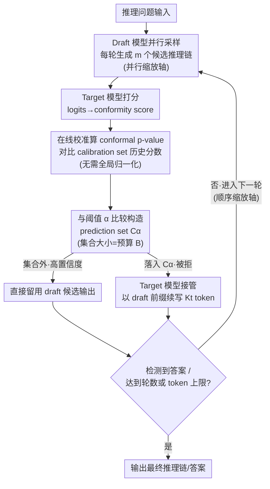

# ATTS: Asynchronous Test-Time Scaling via Conformal Prediction

**会议**: ICLR 2026  
**arXiv**: [2509.15148](https://arxiv.org/abs/2509.15148)  
**代码**: [https://github.com/menik1126/Asynchronous-Test-Time-Scaling](https://github.com/menik1126/Asynchronous-Test-Time-Scaling)  
**领域**: LLM推理  
**关键词**: 测试时缩放, 推测解码, 共形预测, asynchronous inference, rejection sampling

## 一句话总结
提出 ATTS，一个基于 conformal prediction 的异步 test-time scaling 框架，通过将 rejection sampling 重构为假设检验过程来消除同步开销，在 MATH/AIME 等数学推理任务上实现最高 56.7x 加速和 4.14x 吞吐量提升，且无精度损失；1.5B/70B 的 draft/target 组合可达到 o3-mini (high) 的 AIME 水平。

## 研究背景与动机
**领域现状**：Test-time scaling（推理时增加计算预算）通过顺序缩放（更长推理链）和并行缩放（更多采样）显著提升 LLM 推理能力。Speculative decoding 是加速推理的自然选择（小模型生成、大模型验证）。

**现有痛点**：当 speculative decoding 遇到 test-time scaling 时面临两个瓶颈：(1) **内存瓶颈**——高并发采样时 KV cache 爆炸，GPU 内存溢出；(2) **同步开销**——rejection sampling 需要对所有候选进行全局排名或 softmax 归一化，随采样轮数指数增长的同步等待时间成为主要瓶颈。

**核心矛盾**：高效的 test-time scaling 需要同时沿并行和顺序维度缩放，但全局同步排名和归一化操作使得异步执行不可行——所有候选必须等待其他候选完成才能进行排名。

**本文目标** 如何在保持统计保证的前提下，消除 test-time scaling 中 rejection sampling 的同步瓶颈？

**切入角度**：引入 conformal prediction 构建 prediction set，用 p-value 替代归一化 softmax 分数做序数分类，使每个候选可以独立判断接受/拒绝，无需等待全局排名。

**核心 idea**：用 conformal prediction 的 p-value 替代全局排名实现异步 rejection sampling，消除 test-time scaling 的同步瓶颈。

## 方法详解

### 整体框架
ATTS 要解决的问题是：把 speculative decoding 搬进 test-time scaling 后，rejection sampling 的全局排名/归一化让所有候选必须互相等待，同步开销随采样轮数指数增长。它的破局点是把"哪些候选该被拒"从一次全局排名，改成每个候选各自独立做的一次假设检验。

整条 pipeline 是一个三阶段、可多轮迭代的拒绝采样循环。每一轮里，Draft 模型先并行生成 $m$ 个候选推理链；Target 模型给每个候选打一个分（conformity score），再换算成 conformal p-value，只需和阈值 $\alpha$ 一比就能独立判断它该留还是该拒，不必等其他候选算完；落入 prediction set $C_\alpha$ 的候选被判为低置信度、交给 Target 模型以 draft 前缀为基础续写，集合外的高置信度候选则直接留用 draft 的输出。一轮结束若还没检测到答案，就带着已生成的内容进入下一轮。多跑几轮就是顺序缩放，每轮多放几个候选就是并行缩放——两个维度都能放大，而放大时不再积累同步等待。

### 关键设计

**1. 异步算术强度：先证明同步才是真正的瓶颈**

要论证异步有必要，先得说清同步到底有多贵。传统的算术强度只权衡计算量和内存访问，但在 test-time scaling 里真正卡脖子的是同步等待——论文实测同步开销随采样轮数**指数增长**、随并发样本数线性增长。ATTS 因此定义异步算术强度

$$r = \frac{T_c}{T_m + T_s} = \frac{t_c \times f}{t_m \times b + T_s} \approx \frac{T_c}{T_s},$$

其中 $T_c$ 是计算时间、$T_m$ 是内存访问时间、$T_s$ 是同步开销；之所以能近似掉 $T_m$，正是因为采样规模一大、$T_s$ 就远超 $T_m$。随着采样数增多 $r$ 持续下降，定量地说明瓶颈不在算力也不在显存带宽，而在"等别人算完"这件事上——这就把后续的异步改造从直觉变成了有量化依据的优化目标。

**2. conformal p-value 序数分类 + 在线校准：拆掉"必须等齐"的全局归一化**

同步的根源是 rejection sampling 要对所有候选做 softmax 归一化或全局排名，这两件事都得"凑齐所有候选"才能算。ATTS 把它重写成一个序数分类（ordinal classification）下的假设检验：对每个候选 $k$ 先用 Target 模型的 logits 算一个**非归一化**的 conformity score $s_\xi^k = -\ell(X_\xi, \hat{Y}_\xi^k)$（$\ell$ 为损失，score 越高代表候选越可信），再算它的 conformal p-value

$$p_\xi^k = \frac{\sum_{i=1}^{n}\sum_{j=1}^{m}\mathbf{1}(s_\xi^k \le s_i^j) + 1}{nm + 1}.$$

直观上这就是把当前候选的 score 和 calibration set 里 $n\times m$ 个历史 scores 比一比、数出它的排名——只用到本候选自己和历史数据，不依赖同批其他候选，于是每个候选都能独立、异步地评估，彻底拆掉了"必须等齐"的约束。比较范围用整个 calibration set 给的是边际覆盖（marginal coverage）、只用当前输入的样本给的是更严格的条件覆盖（conditional coverage），两者都带统计保证 $\mathbb{P}(y \in C_\alpha(Y)) \geq 1 - \alpha$，确保高质量候选不会被误丢。而 calibration set 本身又没有现成的：test-time scaling 现场没有预留的 held-out 数据，ATTS 就为每个测试输入预采样 $m$ 个输出、在线积累这些 scores 当作动态校准集，边测边更新。

**3. 三阶段拒绝采样流水线：draft 提议、target 验证与接管，双轴缩放**

把上面的判别装进可运行的采样循环，就是论文的三阶段流水线，每一轮依次做三件事。**Draft Model Sampling**：draft 模型 $q_d$ 并行提议 $m$ 条长度 $K_d$ 的候选续写——并发样本数就是并行缩放轴。**Verification**：用 target 模型 $q_t$ 给每条候选打 conformity score、算 p-value，与 $\alpha$ 比较后构造 prediction set $C_\alpha$。这里阈值 $\alpha$ 直接决定 rejection rate，从而让 $C_\alpha$ 的大小恰好等于预设的 budget $B$（要拒绝的候选数）——相当于给并发采样上了硬闸门，把 KV cache 占用钉在预算内、避免高并发时 GPU OOM。**Target Model Sampling**：落入 $C_\alpha$ 的低置信度候选交给 target 模型，以 draft 已生成的内容为前缀继续写至多 $K_t$ 个 token（而非像经典 rejection sampling 那样整条重采，省 token 预算）；集合外的高置信度候选直接留用 draft 输出。三阶段跑完检查是否终止（出答案 / 到轮数或 token 上限），否则进入下一轮——轮数就是顺序缩放轴。两条缩放轴都能放大，而每一步判别都是异步的，放大时不再积累同步等待。

### 损失函数 / 训练策略
无需训练（training-free, lossless）。ATTS 完全工作在推理时，不修改模型权重，对 draft / target 模型组合也无侵入。

## 实验关键数据

### 主实验（跨不同 Draft-Target 模型家族）

| Dataset | Draft Model | Target Model | Accuracy | Mar Speedup | Con Speedup |
|---------|------------|-------------|----------|-------------|-------------|
| MATH100 | Qwen2.5-7B-Inst | QwQ-32B | 96.0% (=TM) | **7.19x** | 5.35x |
| AIME24 | Qwen2.5-7B-Inst | QwQ-32B | 46.7% | **5.71x** | 10.10x |
| AIME25 | Qwen2.5-7B-Inst | QwQ-32B | 40.0% | **14.50x** | 12.82x |
| AMC23 | Qwen2.5-7B-Inst | QwQ-32B | 76.0% | **10.42x** | 8.20x |

### 大规模缩放结果

| 配置 | 说明 |
|------|------|
| 最高 56.7x 加速 | test-time scaling 场景下 |
| 4.14x 吞吐量提升 | 同时顺序+并行缩放 |
| 1.5B/70B draft/target | 达到 o3-mini (high) 的 AIME 水平 |
| Rejection rate 控制准确 | 与预设 $\alpha$ 高度一致 |

### 关键发现
- **跨家族 draft-target 组合有效**：即使 draft 和 target 来自不同模型家族（Qwen → QwQ, Llama → QwQ），ATTS 仍能提供有效的加速
- 红色标记的结果表示"无损加速"——加速后精度等于或超过 target model baseline
- 异步方案在采样数较多时优势明显——同步开销是指数增长的，而异步是常数
- 条件覆盖（per-instance 保证）通常比边际覆盖更保守但更可靠，对不同场景需权衡

## 亮点与洞察
- **conformal prediction 在 LLM 推理加速中的创新应用**：将统计学的 conformal prediction 引入 speculative decoding，用假设检验替代全局排名，是一个优雅的理论-工程结合
- **异步算术强度指标**：提供了量化 test-time scaling 瓶颈的新工具，可用于指导系统设计
- **"无损加速"的工程实用性**：training-free、model-agnostic、有统计保证，可直接部署

## 局限与展望
- 在线校准需要积累足够的历史 scores，冷启动阶段可能不够准确
- 精度在某些 draft-target 组合下不如 target model baseline（尤其是弱 draft model），说明 draft 质量仍很重要
- 仅在数学推理任务上验证，对开放式生成任务的适用性未知
- 需要同时部署 draft 和 target model，对 GPU 资源有额外需求

## 相关工作与启发
- **vs 标准 Speculative Decoding**: ATTS 将 speculative decoding 从 token-level 扩展到 chain-level（整条推理链），并解决了 test-time scaling 场景特有的同步瓶颈
- **vs BoN (Best-of-N)**: BoN 需要 N 条完整推理链全部生成完才能选择，ATTS 可以异步逐步筛选，大幅降低延迟
- **vs TPT 早停方法**: 早停可能剪掉正确推理路径，ATTS 通过 conformal 保证不丢失高质量候选

## 评分
- 新颖性: ⭐⭐⭐⭐⭐ conformal prediction + 异步 test-time scaling 的结合非常新颖
- 实验充分度: ⭐⭐⭐⭐ 多 benchmark、多 draft-target 组合、加速和精度双指标
- 写作质量: ⭐⭐⭐⭐ 理论推导扎实，系统分析清晰
- 价值: ⭐⭐⭐⭐⭐ 为 test-time scaling 的高效部署提供了实用框架

<!-- RELATED:START -->

## 相关论文

- [\[ICLR 2026\] Plan and Budget: Effective and Efficient Test-Time Scaling on Reasoning LLMs](plan_and_budget_effective_and_efficient_test-time_scaling_on_reasoning_large_lan.md)
- [\[ICLR 2026\] Understanding the Role of Training Data in Test-Time Scaling](understanding_the_role_of_training_data_in_test-time_scaling.md)
- [\[ICLR 2026\] Efficient Test-Time Scaling for Small Vision-Language Models](efficient_test-time_scaling_for_small_vision-language_models.md)
- [\[ACL 2026\] Parallel Test-Time Scaling for Latent Reasoning Models](../../ACL2026/llm_reasoning/parallel_test-time_scaling_for_latent_reasoning_models.md)
- [\[ACL 2026\] Efficient Test-Time Scaling via Temporal Reasoning Aggregation](../../ACL2026/llm_reasoning/efficient_test-time_scaling_via_temporal_reasoning_aggregation.md)

<!-- RELATED:END -->
