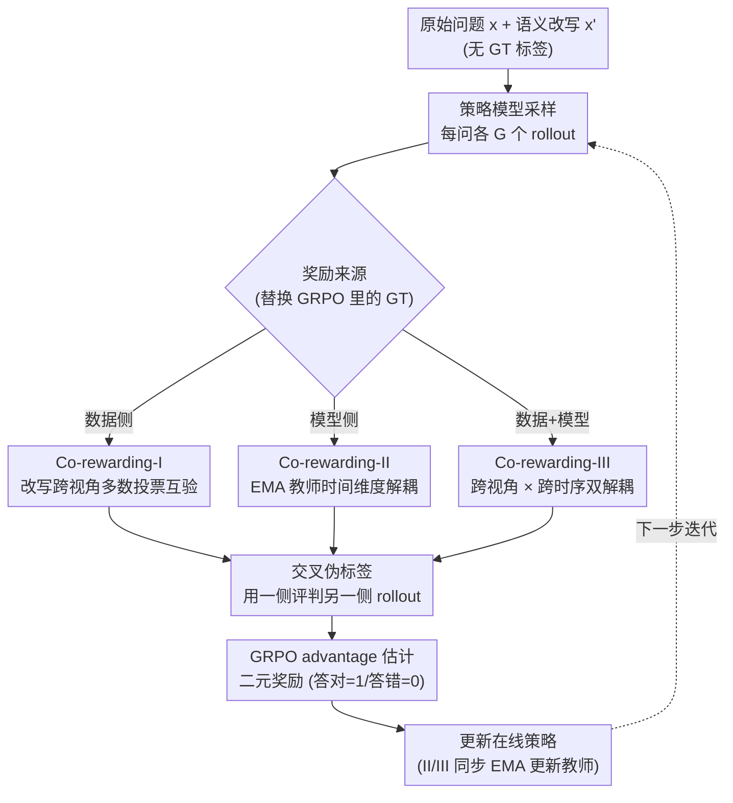

# Co-rewarding: Stable Self-supervised RL for Eliciting Reasoning in Large Language Models

**会议**: ICLR 2026  
**arXiv**: [2508.00410](https://arxiv.org/abs/2508.00410)  
**代码**: [https://github.com/tmlr-group/Co-rewarding](https://github.com/tmlr-group/Co-rewarding)  
**领域**: 强化学习  
**关键词**: 自监督RL, 无标签推理, 训练崩溃, GRPO, 对比学习

## 一句话总结
Co-rewarding 提出自监督 RL 框架，通过数据侧（对比改写问题的跨视角一致性）和模型侧（EMA 教师模型提供伪标签）两种互补监督方式，解决自奖励 RL 中的训练崩溃问题，在无人工标签条件下多项数学推理基准上达到甚至超过 RLVR（有标签）的性能。

## 研究背景与动机

**领域现状**：RLVR（带可验证奖励的强化学习，如 DeepSeek-R1 的 GRPO）是提升 LLM 推理能力的主流方法，但依赖人工标注的 ground-truth 答案作为奖励信号。

**现有痛点**：
   - GT 标注成本高、不易扩展，尤其对复杂任务
   - 自奖励方法（self-certainty、entropy-based、majority voting）可替代 GT，但频繁出现**训练崩溃**
   - 崩溃原因：奖励信号来自模型自身的单一视角输出 → 形成"自一致幻觉" → reward hacking

**核心矛盾**：自监督信号与当前策略纠缠——模型通过最小化熵或最大化一致性获得高奖励，但实际只是收敛到了平凡解（重复字符串、一致但错误的答案）

**本文目标**
   - 如何在不使用 GT 标签的情况下获得稳定的 RL 训练？
   - 如何打破"单一视角"下的自一致幻觉？
   - 能否达到有 GT 标签的 RLVR 水平？

**切入角度**：受自监督学习（SimCLR、BYOL、DINO）启发——真正的推理能力应体现为跨视角/跨时间的不变性（invariance），而非单一输出的确定性。

**核心 idea**：通过数据侧的"改写问题交叉验证"和模型侧的"EMA 教师伪标签"引入互补监督视角，增加 reward hacking 的难度从而防止训练崩溃。

## 方法详解

### 整体框架
Co-rewarding 要解决的是：在没有 GT 标签的情况下做 RL 训练，又不让模型像普通自奖励方法那样崩溃。它整体仍然搭在 GRPO 的骨架上，唯一被替换的环节是 advantage 估计里"奖励从哪来"——既不用人工标注答案，也不用模型自己单一视角的输出来给自己打分，而是引入**另一个视角**产生的伪标签作为交叉参照。每个问题先准备一个语义等价的改写版，策略模型对原始问题和改写问题各采样一组 rollout，再用某种"跨视角多数投票"产出伪标签去评判对侧的 rollout，最后照常走 GRPO 的 advantage 估计更新策略。论文把"另一个视角从哪来"做成三种递进的实例化：I 从数据侧引入第二视角（改写问题），II 从模型侧引入第二视角（EMA 教师），III 把两者叠在一起做跨视角 × 跨时序的双重解耦。

### 关键设计

**1. Co-rewarding-I（数据侧：用改写问题的跨视角一致性互相验证）**

普通自奖励方法的崩溃源头，是奖励信号和当前策略产生于同一个输入、同一个视角——模型只要让自己的输出"自洽"就能拿高分，于是收敛到一致但错误的平凡解。Co-rewarding-I 的做法是给原始问题 $x$ 准备一个语义等价的改写 $x'$，让两个视角互相当裁判。具体地，策略模型对 $x$ 和 $x'$ 各采样 $G$ 个 rollout，分别用多数投票得到伪标签 $y_v$ 和 $y_v'$；关键是**交叉使用**——用 $x'$ 的伪标签 $y_v'$ 去评估 $x$ 的 rollout，用 $x$ 的伪标签 $y_v$ 去评估 $x'$ 的 rollout，advantage 写成 $\hat{A}_i = \frac{r(y_v', y_i) - \text{mean}(\cdot)}{\text{std}(\cdot)}$。背后的假设是 analogy-invariance：语义等价的问题应该得到相同答案。这样一来模型想 reward hacking 就难了——它没法靠在单一输入上自圆其说骗到奖励，因为改写问题那一路的答案会反过来"检验"原始问题。

**2. Co-rewarding-II（模型侧：用 EMA 教师在时间维度上解耦监督）**

I 解决的是数据视角单一，但监督信号仍来自当下这一刻的策略；II 进一步在**时间维度**上把监督和策略拉开。它维护一个用 EMA 滑动平均更新的教师模型

$$\tilde{\pi}_{ref}^{(k)} \leftarrow \alpha^{(k)} \tilde{\pi}_{ref}^{(k-1)} + (1-\alpha^{(k)}) \pi_{\theta_{old}}^{(k)},$$

其中 EMA 权重 $\alpha^{(k)}$ 按余弦退火从 $\alpha_{start}$ 调到 $\alpha_{end}$。教师自己生成 rollout、多数投票产出伪标签 $\tilde{y}_v$，再用这个伪标签去评估在线策略的 rollout。因为教师是滑动平均出来的，它不会被策略的瞬时变化立刻带偏，于是打破了自奖励那种"模型变一点、奖励跟着变一点"的即时反馈闭环——这正是 BYOL / DINO 里 momentum teacher 防坍缩的同款思路。

**3. Co-rewarding-III（数据 + 模型双解耦）**

III 把前两路的互补性合到一起：让 EMA 教师去对**改写问题**生成 rollout、产出伪标签，再用它来监督策略模型在**原始问题**上的 rollout（反之亦然）。这样数据视角（原始 vs 改写）和监督时序（在线策略 vs EMA 教师）两个维度同时被解耦——I 负责堵住"单一数据视角"的漏洞，II 负责堵住"监督与策略纠缠"的漏洞，III 在两个方向上都不给 reward hacking 留口子。

### 损失函数 / 训练策略
- 优化目标沿用 GRPO：$\mathcal{J}(\theta) = \text{clipped surrogate objective} - \beta \cdot D_{KL}(\pi_\theta \| \pi_{ref})$，区别只在 advantage 里的奖励来源换成了交叉伪标签。
- 奖励为二元（答对=1、答错=0），由上面三种方式之一给出的伪标签来判定。
- EMA 教师按余弦退火更新：训练初期 $\alpha$ 偏小、更新快，让教师跟上策略的快速改进；后期 $\alpha$ 增大、更新慢，提供稳定监督。
- 改写数据可离线生成——用一个 LLM 对原始数学问题做语义等价改写即可，不增加在线训练的优化开销。

## 实验关键数据

### 主实验（MATH 训练集，Qwen3-8B-Base）

| 方法 | MATH500 | GSM8K | AMC | IFEval | MMLU-Pro |
|------|---------|-------|-----|--------|----------|
| Before RL | 72.4 | 27.8 | 20.9 | 50.9 | 52.9 |
| GT-Reward (RLVR) | 82.6 | 87.3 | 54.2 | 52.8 | 57.1 |
| Self-Certainty | 80.2 | 80.7 | 50.8 | 51.0 | 54.2 |
| Majority-Voting | 79.8 | 89.8 | 49.1 | 51.8 | 56.9 |
| **Co-rewarding-I** | 81.2 | **93.7** | 51.2 | 55.8 | **60.0** |
| **Co-rewarding-II** | 80.8 | 92.4 | 53.5 | **60.7** | 57.5 |
| **Co-rewarding-III** | **81.4** | 91.0 | **54.1** | 53.7 | 59.1 |

### 消融 / 训练稳定性

| 配置 | 训练崩溃？ | 数学推理平均提升 |
|------|----------|--------------|
| Self-Certainty | 经常崩溃 | +3% |
| Entropy | 偶尔崩溃 | +2% |
| Majority-Voting | 有时崩溃 | +4% |
| **Co-rewarding** | **不崩溃** | **+7.49% (Llama-3.2-3B)** |

### 关键发现
- **GSM8K 94.01%**：Co-rewarding 在 GSM8K 上用 Qwen3-8B 达到 94.01% Pass@1，超过了使用 GT 标签的 RLVR（87.26%）——无标签居然比有标签更好
- **训练稳定性**：所有自奖励基线在训练过程中都出现过崩溃（validation loss 突然飙升），Co-rewarding 的训练曲线始终稳定
- **平均提升 +3.31%**：在多个数学推理基准上，Co-rewarding 比最佳自奖励基线平均高 3.31%，在 Llama-3.2-3B 上高达 +7.49%
- **跨任务迁移**：仅在 MATH 上训练，在 Code（LiveCodeBench）和 Instruction Following（IFEval）上也有显著提升
- **三个版本各有优势**：I 在 GSM8K 上最强，II 在 IFEval 上最强，III 整体最均衡

## 亮点与洞察
- **自监督学习哲学的优雅迁移**：将 SimCLR 的"双视角一致性"和 BYOL/DINO 的"momentum teacher"迁移到 LLM RL 训练中，概念清晰、类比精准。这提示了一个更广泛的方法论：自监督学习中的成功范式可以系统性地迁移到 RL 中。
- **无标签超越有标签的现象值得关注**：GSM8K 上 94.01% vs 87.26%（GT-Reward），可能的解释是自监督信号提供了更多样的探索，而 GT 标签的二元奖励可能过度约束了策略。
- **EMA 教师 + 改写交叉验证的组合很实用**：计算开销可控（EMA 不需额外优化器），改写可以离线生成，整体方案比 RLVR 更容易扩展到无标注数据。

## 局限与展望
- 改写质量影响 Co-rewarding-I 的效果，需要高质量的改写模型
- EMA 教师的超参数（$\alpha_{start}, \alpha_{end}$）需要调优
- 仅在数学推理任务上验证，对 NLP 推理、代码生成等场景的效果待探究
- Co-rewarding-III 需要同时维护 EMA 教师和改写数据，内存开销较大
- 理论分析不够深入——为什么交叉验证能防止崩溃的形式化保证尚缺

## 相关工作与启发
- **vs Self-Certainty (Zhao et al.)**: 单一视角的确定性信号→容易崩溃；Co-rewarding 引入多视角→稳定
- **vs RLVR (GT-Reward)**: RLVR 依赖人工标注限制扩展；Co-rewarding 无标签但在多个设置下匹敌或超越
- **vs Majority-Voting (Shafayat et al.)**: 同样用多数投票，但仅在单一问题上→还是单视角；Co-rewarding 通过改写或教师引入真正的互补视角

## 评分
- 新颖性: ⭐⭐⭐⭐ 自监督学习→RL的概念迁移很精彩，但具体技术（改写+多数投票+EMA）并非全新
- 实验充分度: ⭐⭐⭐⭐⭐ 多模型系列(Qwen3/Llama)、多基准、训练稳定性可视化、充分消融
- 写作质量: ⭐⭐⭐⭐ 概念阐述清晰，三个版本的递进关系好，但公式较多
- 价值: ⭐⭐⭐⭐⭐ 无标签RL训练的稳定性问题是实际中的痛点，本文提出了可行的解决方案

<!-- RELATED:START -->

## 相关论文

- [\[ICLR 2026\] Dynamics-Predictive Sampling for Active RL Finetuning of Large Reasoning Models](dynamics-predictive_sampling_for_active_rl_finetuning_of_large_reasoning_models.md)
- [\[ICLR 2026\] Vision-R1: Incentivizing Reasoning Capability in Multimodal Large Language Models](vision-r1_incentivizing_reasoning_capability_in_multimodal_large_language_models.md)
- [\[AAAI 2026\] Incorporating Self-Rewriting into Large Language Model Reasoning Reinforcement](../../AAAI2026/llm_reasoning/incorporating_self-rewriting_into_large_language_model_reasoning_reinforcement.md)
- [\[ICLR 2026\] SceneCOT: Eliciting Grounded Chain-of-Thought Reasoning in 3D Scenes](scenecot_eliciting_grounded_chain-of-thought_reasoning_in_3d_scenes.md)
- [\[ICML 2026\] Prioritize the Process, Not Just the Outcome: Rewarding Latent Thought Trajectories Improves Reasoning in Looped Language Models](../../ICML2026/llm_reasoning/prioritize_the_process_not_just_the_outcome_rewarding_latent_thought_trajectorie.md)

<!-- RELATED:END -->
