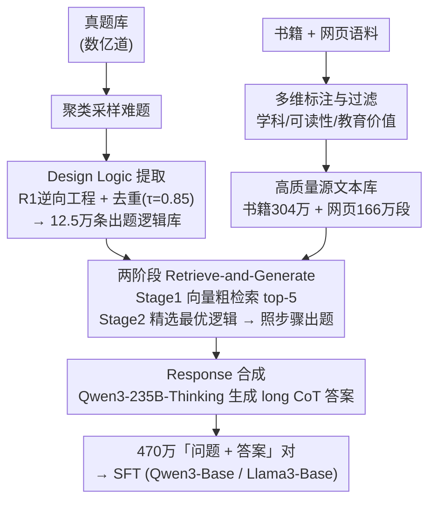

# DESIGNER: Design-Logic-Guided Multidisciplinary Data Synthesis for LLM Reasoning

**会议**: ICLR 2026  
**arXiv**: [2508.12726](https://arxiv.org/abs/2508.12726)  
**代码**: [https://attention-is-all-i-need.github.io/Design-Logic-Reasoning](https://attention-is-all-i-need.github.io/Design-Logic-Reasoning)  
**领域**: LLM推理  
**关键词**: data synthesis, design logic, multidisciplinary reasoning, question generation, SFT

## 一句话总结
提出 Design Logic（设计逻辑）——从真题中逆向工程出的可复用元知识，用于指导从原始文本合成多学科推理问题。构建了 470 万道覆盖 75 学科的推理题目，SFT 后的 base 模型甚至超越经过完整后训练的官方模型。

## 研究背景与动机

**领域现状**：LLM 在数学和编程上的推理能力提升显著（受益于竞赛平台丰富的开放题源），但在大学级别的跨学科推理上仍落后于人类专家。核心瓶颈是高质量多学科推理训练数据的严重匮乏。

**现有痛点**：(a) **Query-centric 方法**（如 Evol-Instruct）通过改写种子问题扩展数据，受限于种子覆盖面和模型偏差；(b) **Document-centric 方法**从文本生成问题，但难以控制难度和多样性，常退化为事实回忆；(c) 现有数据集学科分布严重偏斜（数学占绝大多数），跨学科覆盖不足。

**核心矛盾**：如何从原始文本（书籍、网页）大规模合成具有多步推理深度、可控难度、高多样性的考试级别问题？缺乏指导原则让 LLM 不知道如何将知识转化为复杂问题。

**本文目标** 提供一个系统化的多学科推理数据合成流水线——不仅合成问题，还合成"出题方法论"。

**切入角度**：人类教育专家出题时遵循结构化的设计过程（识别目标→构建情境→设计推理路径→制作干扰选项→验证）。如果能从真题中提取这种"出题逻辑"（Design Logic），就可以将其作为可复用模板应用到新的源文本上。

**核心 idea**：从真题中逆向工程出 12.5 万条 Design Logic（出题元知识），然后通过 retrieve-and-generate 将这些 logic 与原始文本匹配，指导 LLM 按相同推理模式从全新文本出题。

## 方法详解

### 整体框架
这篇论文要解决的核心难题是：怎么从原始书籍、网页这类「非题目」文本，大规模合成出大学/研究生级别、推理深度够、难度可控的多学科考题。它的关键判断是——直接让 LLM「看着文本出题」会退化成事实回忆，真正缺的是「出题方法论」。于是整条流水线先并行准备两份原料：一边从 13.2 万道精选真题里**逆向工程出 Design Logic（设计逻辑）**、汇成一个可复用的出题逻辑库（12.5 万条）；另一边把书籍、网页语料做多维标注与过滤，构建一个干净、跨学科的**高质量源文本库**。两份原料汇合到核心的**两阶段 retrieve-and-generate 问题合成**：先按向量相似度给每段源文本粗检索出候选逻辑，再让强模型精选最契合的一条、严格照着它的步骤从该文本出一道考题。最后一步 **Response 合成**为每道题配一份 long CoT 参考答案，凑成「问题 + 答案」训练对喂给 SFT。换句话说，它合成的不只是题，更是「怎么把一段知识变成一道好题」的可复用模板。

### 关键设计

**1. Design Logic 提取：把出题者的隐性方法论显式化成可迁移的元知识**

直接从文本生成问题之所以失败，是因为 LLM 不知道一道好题是怎么被「设计」出来的。这一步就是把人类出题者脑子里的隐性过程挖出来：用 DeepSeek-R1 逐道分析真题，(i) 推断出题者的思维过程，(ii) 追溯从知识点到成题的构造路径，(iii) 把它抽象成结构化的设计原则（以 Mermaid 格式表达）。提取完再做一轮去重——基于 Qwen3-Embedding 算语义相似度、做图聚类，相似度阈值取 $\tau=0.85$，把语义重复的逻辑合并，最终保留 125,328 条独特的 Design Logic。这套逻辑的关键性质是**与具体学科内容解耦**：同一个出题逻辑（比如「给定一组约束、要求反推唯一可行解」）可以套在物理、经济、法律的不同知识点上，从而把「出题能力」本身做成可迁移、可规模化复用的资产。

**2. 高质量源文本库构建：给出题逻辑准备足够干净、覆盖够广的「原料」**

逻辑再好，喂进去的源文本太烂或学科太偏也出不了好题，所以这一步专门把原料筛干净。书籍语料走章节级处理：MinHash 去重，用 ModernBERT 分类器标注学科，BERT 评估可读性，fineweb-edu-classifier 评估教育价值，最后筛出约 300 万段高质量文本。网页语料则从 FineFineWeb 的 6.5B 文本里，用 Qwen3-30B 做五级打分、只留评分 ≥3 的，再重新标注学科、对齐到统一的 75 学科分类体系。两路语料互补：教科书结构化、知识深，网页覆盖广、话题新，共同保证后续出题既有深度又有跨学科广度。

**3. 两阶段 Retrieve-and-Generate 问题合成：先粗筛再精配，避免逻辑×文本的组合爆炸**

12.5 万条逻辑 × 几百万段文本，若两两穷举匹配会直接爆掉，所以合成拆成「先检索、后生成」两段。Stage 1 粗检索：把源文本和所有 Design Logic 都编码成向量，按余弦相似度取 top-5 候选逻辑，先把范围从十万级压到个位数。Stage 2 精匹配+生成：让 DeepSeek-R1 从这 5 个候选里挑出最契合当前文本的那一条逻辑，再**严格照着这条逻辑的步骤**，从源文本生成一道研究生级别的考题外加参考答案。举例来说，一段讲「市场均衡」的经济学教材，粗检索可能召回 5 条偏向「多约束反推」的逻辑，精匹配选中其中要求「给定供需函数与外部冲击、求新均衡并解释机制」的那条，最终产出的就不是「均衡的定义是什么」这种事实题，而是一道需要多步推导的分析题。先粗后精既挡住了组合爆炸，又靠 R1 的精选保住了逻辑与文本的契合度。

**4. Response 合成：为每道题配一份高质量长链推理答案，凑成 SFT 训练对**

有了题还得有可学的解。这一步用 Qwen3-235B-A22B-Thinking 为每道合成题生成 long CoT 回答，把「问题 + 长推理答案」组成训练对，直接喂给后面的 SFT。之所以用最强的 Thinking 模型来产答案，是因为这些题本身难度很高，答案的推理质量决定了学生模型能从中学到多少。

### 损失函数 / 训练策略
- SFT：标准自回归损失，分别在 Qwen3-Base 和 Llama3-Base 上训练
- 数据规模：DLR-Book 304 万 + DLR-Web 166 万 = 470 万道问题，覆盖 75 学科
- 去重：MinHash + 13-gram 去污染（针对所有评估基准）

## 实验关键数据

### 主实验

| 模型 | MMLU | MMLU-Pro | GPQA-Diamond | SuperGPQA |
|------|------|----------|-------------|-----------|
| Llama-3.1-8B-Instruct (官方) | 70.86 | 47.38 | 23.18 | 20.08 |
| **Llama-3.1-8B-SFT (DLR-Web+Book)** | **84.13** | **76.04** | **65.45** | **45.06** |
| Qwen3-4B Thinking (官方) | 82.87 | 69.34 | 54.70 | 43.30 |
| **Qwen3-4B-Base-SFT (DLR-Web+Book)** | **85.00** | **73.06** | **63.69** | **46.15** |

仅用 DLR 数据 SFT 的 base 模型**超越**了经过完整后训练的官方模型！

### 消融实验

| 数据源 | MMLU | GPQA-Diamond | 说明 |
|--------|------|-------------|------|
| DLR-Web only | 83.55 | 53.74 | 网页源 |
| DLR-Book only | 84.73 | 62.58 | 书籍源更好（教育深度更高） |
| DLR-Web + Book | **85.00** | **63.69** | 两者互补最佳 |
| OpenThoughts3 (基线) | -- | ~50 | Design Logic 数据更优 |

### 关键发现
- **Design Logic 合成的数据难度显著更高**：Very Hard 占比远超所有基线数据集和评估基准，Easy 占比仅 0.27%-0.72%
- **多样性远超基线**：在 5 个语义多样性指标上全面领先，1-NN Distance 是基线的约 2 倍，说明几乎没有语义重复
- **学科覆盖最均衡**：75 学科覆盖 STEM、人文、社科、应用等，而现有数据集严重偏向数学
- **书籍源 > 网页源**：DLR-Book 在大部分指标上优于 DLR-Web，因教科书提供更结构化的深度知识
- **SFT base > 官方后训练**：这是最惊人的发现——仅用高质量合成数据做 SFT 就能超越含 RL、DPO 等完整后训练流程的官方模型

## 亮点与洞察
- **Design Logic 作为可复用元知识**：这是一个根本性的创新——不是合成数据，而是合成"出题能力"。12.5 万条 Design Logic 可以无限复用到新的文本上，实现规模化
- **"题目比答案更重要"**：引用爱因斯坦名言，强调高质量问题的核心地位。给定好问题，任何模型都能生成回答——这与"好的 prompt 比好的模型更重要"的洞察异曲同工
- **470 万道题覆盖 75 学科**：这是目前最大规模的多学科推理数据集，且质量（难度+多样性）均超越基线
- **对后训练的启示**：SFT data quality >> SFT+RL+DPO 的完整流程但用低质量数据。这挑战了"RL 是必需的"这一假设

## 局限与展望
- Design Logic 的提取依赖已有题库——如果某学科无现成考题则无法提取 logic
- 回答的 CoT 准确率仅 71.48%（因开放题的多样性），用于 SFT 时可能引入噪声
- 未探索 RL 训练——如果在 DLR 数据上再加 RL/DPO 是否能进一步提升？
- 75 学科分类依赖 LLM 标注，分类准确性为 90.14%，有约 10% 的误标

## 相关工作与启发
- **vs Evol-Instruct (Query-centric)**: 受限于种子覆盖面，不能跨学科。DESIGNER 从文本出发，学科覆盖远更广
- **vs NaturalReasoning/WebInstruct (Document-centric)**: 缺乏出题指导原则，常退化为事实回忆。Design Logic 提供了结构化的出题控制
- **vs Nemotron-Post-Training**: 学科分布较均衡但难度低。DLR 在难度和多样性上全面胜出
- **vs OpenThoughts3**: 推理深度好但严重偏向数学。DLR 在非数学学科上优势巨大

## 评分
- 新颖性: ⭐⭐⭐⭐⭐ Design Logic 的概念和逆向工程方法论是全新的贡献
- 实验充分度: ⭐⭐⭐⭐⭐ Qwen3 + Llama3 多模型、多基准评测 + 数据质量分析 + 消融
- 写作质量: ⭐⭐⭐⭐ 流水线描述清晰，但论文偏工程化，理论分析较少
- 价值: ⭐⭐⭐⭐⭐ 470 万道多学科推理题 + 12.5万条 Design Logic，对 LLM 后训练社区极有价值

<!-- RELATED:START -->

## 相关论文

- [\[ICLR 2026\] On the Design of KL-Regularized Policy Gradient Algorithms for LLM Reasoning](on_the_design_of_kl-regularized_policy_gradient_algorithms_for_llm_reasoning.md)
- [\[ICML 2026\] An Information-Theoretic Criterion for Efficient Data Synthesis](../../ICML2026/llm_reasoning/an_information-theoretic_criterion_for_efficient_data_synthesis.md)
- [\[ACL 2026\] Efficient PRM Training Data Synthesis via Formal Verification](../../ACL2026/llm_reasoning/efficient_prm_training_data_synthesis_via_formal_verification.md)
- [\[ACL 2026\] MathAgent: Adversarial Evolution of Constraint Graphs for Mathematical Reasoning Data Synthesis](../../ACL2026/llm_reasoning/mathagent_adversarial_evolution_of_constraint_graphs_for_mathematical_reasoning_.md)
- [\[AAAI 2026\] Jupiter: Enhancing LLM Data Analysis Capabilities via Notebook and Inference-Time Value-Guided Search](../../AAAI2026/llm_reasoning/jupiter_enhancing_llm_data_analysis_capabilities_via_notebook_and_inference-time.md)

<!-- RELATED:END -->
