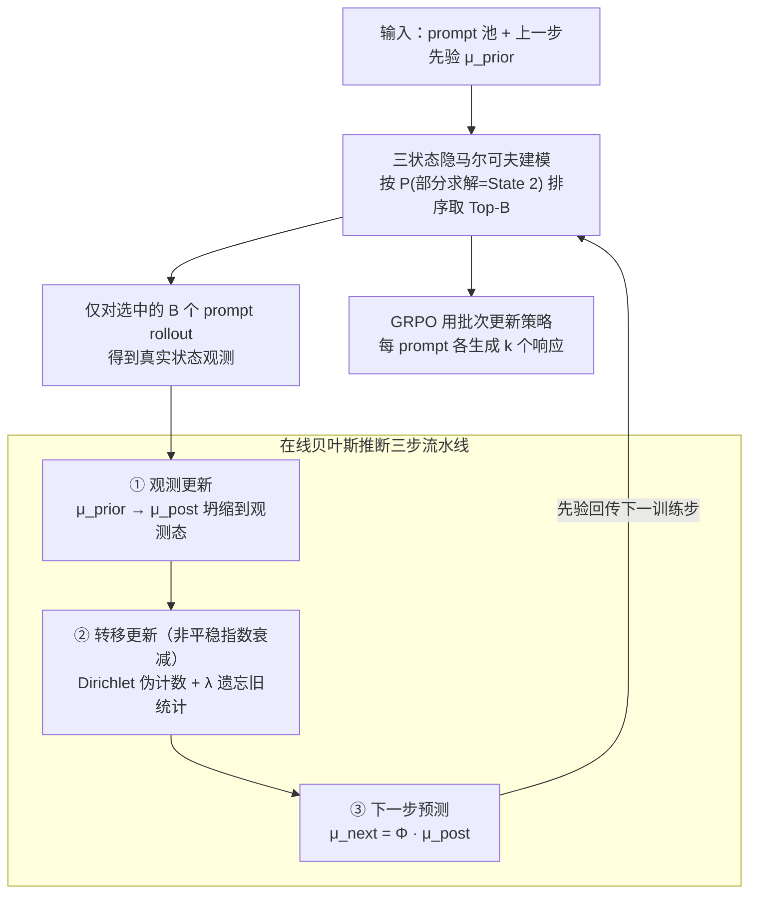

# Dynamics-Predictive Sampling for Active RL Finetuning of Large Reasoning Models

**会议**: ICLR 2026  
**arXiv**: [2603.10887](https://arxiv.org/abs/2603.10887)  
**代码**: [github.com/maoyixiu/DPS](https://github.com/maoyixiu/DPS)  
**领域**: LLM Reasoning / RL Finetuning  
**关键词**: 强化学习微调, 提示采样, 隐马尔可夫模型, 大推理模型, 在线贝叶斯推断

## 一句话总结

将 RL 微调中每个 prompt 的求解进度建模为隐马尔可夫动力系统，通过轻量贝叶斯推断在线预测 prompt 的求解状态，优先采样"部分求解"的 prompt，以不到 DS 30% 的 rollout 量达到同等甚至更优的推理性能。

## 研究背景与动机

**领域现状**：RL 微调（以 GRPO 为代表）已成为提升 LLM 推理能力的核心技术路线。DeepSeek-R1、OpenAI o1 等大推理模型（LRM）通过 RL 微调在数学竞赛、代码生成、逻辑推演等任务上取得了突破性进展。然而，RL 微调的效果高度依赖训练数据的选择质量——并非所有 prompt 都对策略优化有同等贡献。

**现有痛点**：GRPO 使用组内归一化计算优势函数 $\hat{A}_i^\tau = \frac{r(\tau, y_i^\tau) - \text{mean}}{\text{std}}$。当模型对某 prompt 的 $k$ 个响应全部正确或全部错误时，$\text{std} = 0$，优势函数退化，梯度信号消失。因此，只有"部分求解"（some correct, some incorrect）的 prompt 才能提供有效的优化信号。

**核心矛盾**：当前最先进的在线 prompt 选择方法 Dynamic Sampling（DS）通过扩大候选批次（通常为最终批次的 3-4 倍）并逐一 rollout 来筛选有效 prompt，虽然能精准找到部分求解的样本，但 rollout 的计算开销极为昂贵——生成长链推理响应的成本常常超过微调本身。另一方法 History Resampling（HR）在 epoch 级别过滤已完全求解的 prompt，但其"吸收态"假设过于刚性，且只排除已解 prompt 而不主动寻找部分求解的。

**本文目标** 如何在不进行昂贵 rollout 的前提下，在线预测哪些 prompt 当前处于"部分求解"状态，从而以极低的额外开销实现与 DS 相当甚至更优的训练效果？

**切入角度**：作者将每个 prompt 的求解进度视为一个随时间演化的动力系统——随着模型更新，prompt 的求解状态（未解→部分求解→已解）会发生转移。这种演化可以用 HMM 建模：隐状态是求解程度，观测是间歇性的 rollout 结果。利用历史 rollout 数据进行贝叶斯推断就可以预测未来的求解状态，无需实际 rollout。

**核心 idea**：将 prompt 求解进度建模为 HMM 动力系统，通过在线贝叶斯推断预测求解状态，在 rollout 前就选出最可能处于"部分求解"状态的 prompt，实现 rollout-free 的自适应采样。

## 方法详解

### 整体框架

DPS 想解决的问题是：在不为每个候选 prompt 真正跑一遍昂贵 rollout 的前提下，提前判断哪些 prompt 此刻正处于"部分求解"状态、能给 GRPO 提供非零梯度。它的做法是把每个 prompt 的求解进度当成一个随训练步演化的隐马尔可夫系统，用历史 rollout 结果做在线贝叶斯推断来预测当前状态。

每个训练步 $t$ 走两个阶段。先是**预测与选择**：用上一步推断出的先验 $\mu_t^{\tau,\text{prior}}$，按每个 prompt 落在"部分求解"（State 2）的概率从高到低排序，取 Top-$B$ 个组成训练批次 $\mathcal{B}_t$。再是**推断与更新**：只对这 $B$ 个被选中的 prompt 执行 rollout 拿到真实观测，据此更新它们的状态后验和转移矩阵后验，最后把后验向前传播一步，得到下一训练步要用的先验预测。这样一来，rollout 只发生在真正进入批次的 prompt 上，而非 DS 那样先对 3-4 倍候选集全部 rollout 再过滤。

### 关键设计

**1. 三状态隐马尔可夫建模：把"该不该采样"翻译成"现在处于哪个状态"**

GRPO 的优势函数在一个 prompt 的 $k$ 个响应全对或全错时会因 $\text{std}=0$ 而归零，只有部分对部分错的 prompt 才有梯度。DPS 据此为每个 prompt 定义隐状态 $z_t^\tau \in \{1, 2, 3\}$，分别对应完全未解（$k$ 个响应全错）、部分求解（部分正确部分错误）、完全求解（全部正确），起始先验取均匀分布 $\mu_1^{\text{prior}} = [1/3, 1/3, 1/3]$。状态如何随训练演化由一个列随机矩阵 $\Phi \in \mathbb{R}^{3 \times 3}$ 刻画；观测模型则是"退化发射"——一个 prompt 只要被选中 rollout，它的真实状态就被精确看到，没被选中就没有任何观测。三状态的划分一方面正好对齐 GRPO 的梯度信号结构（只有 State 2 优势非零），另一方面足够简洁，消融实验显示再细分或再粗分都会拉低预测精度。

**2. 在线贝叶斯推断三步流水线：让状态估计和转移模型每步实时更新**

经典 HMM 的前向-后向算法要拿到完整轨迹才能推断，没法边训边用，所以 DPS 把推断拆成只依赖当前步观测和上一步后验的三步增量更新。第一步**观测更新**：若 prompt 这步被选中 rollout，用贝叶斯规则把先验 $\mu_t^{\text{prior}}$ 更新为后验 $\mu_t^{\text{post}}$，由于是退化发射，后验直接坍缩到被观测到的那个状态。第二步**转移更新**：借 Dirichlet-Categorical 共轭性，用后验转移伪计数 $\xi_t(i,j) = \mathbb{P}(z_{t-1}=j, z_t=i \mid y_{1:t})$ 去增量更新 Dirichlet 参数 $\alpha_t$，从而在线学习转移矩阵。第三步**下一步预测**：把后验经转移矩阵传播为下一步先验，

$$\mu_{t+1}^{\text{prior}} = \Phi_t \mu_t^{\text{post}}.$$

整条流水线全是 $3 \times 3$ 的矩阵运算，开销可忽略，这正是它能替代昂贵 rollout 的前提。

**3. 非平稳指数衰减：让转移模型跟得上不断变化的求解动态**

LRM 的学习是高度非平稳的——策略一更新，prompt 的求解概率就变，标准 HMM 的平稳假设并不成立。DPS 为此引入衰减因子 $\lambda \in (0,1)$，把转移参数的更新改成

$$\alpha_t = \lambda \cdot \alpha_{t-1} + (1-\lambda) \cdot \alpha_0 + \xi_t,$$

较小的 $\lambda$ 让模型更快遗忘旧统计量、贴近新动态。这个衰减还顺带提供了隐式探索：长期没被采样的 prompt，其后验会逐渐衰减回均匀分布，在没有明显高信息 prompt 时被自然重新访问，省去了显式探索-利用权衡的超参调优。

### 训练策略

采样落在纯利用上：按 $\mu_t^{\tau,\text{prior}}(2)$（预测为部分求解的概率）对全部 prompt 排序，直接取 Top-$B$ 进批次；隐式探索由上面的非平稳衰减兜底，未被采样的 prompt 预测分布漂向均匀后会被重新纳入，避免采样死锁。DPS 与具体 RL 算法正交，本文实验都在 verl 框架内用 GRPO 跑：每步选出 $B$ 个 prompt，各生成 $k$ 个响应并计算奖励，用 GRPO 目标更新策略。整个推断只占 $O(|\mathcal{D}| \times 3^2)$ 的矩阵运算，实测对总训练时间的影响 < 1%。

## 实验关键数据

### 主实验：数学推理（MATH 数据集训练，跨基准测试）

| 方法 | AIME24 | AMC23 | MATH500 | Minerva | Olympiad | Avg↑ | Rollouts↓ | 运行时间↓ |
|------|--------|-------|---------|---------|----------|------|-----------|----------|
| R1-Distill-1.5B (基线) | 18.33 | 51.73 | 76.64 | 23.83 | 35.31 | 41.17 | - | - |
| +US | 26.46 | 63.18 | 82.78 | 27.46 | 43.00 | 48.57 | 737k | 27h |
| +HR | 28.13 | 64.61 | 82.88 | 27.37 | 43.15 | 49.23 | 737k | 28h |
| +DS (Oracle) | 31.88 | 67.32 | 84.79 | 29.18 | 46.83 | 52.00 | 2933k | 89h |
| **+DPS (Ours)** | **32.71** | **67.77** | **84.95** | 29.09 | 46.11 | **52.13** | **737k** | **32h** |
| R1-Distill-7B (基线) | 37.71 | 68.45 | 86.94 | 34.74 | 46.94 | 54.95 | - | - |
| +US | 45.83 | 73.57 | 89.06 | 37.68 | 50.42 | 59.31 | 287k | 30h |
| +HR | 46.46 | 75.98 | 90.01 | 37.94 | 51.50 | 60.38 | 287k | 36h |
| +DS (Oracle) | 49.79 | 78.99 | 90.96 | 37.89 | 54.45 | 62.42 | 1147k | 73h |
| **+DPS (Ours)** | **51.04** | **80.35** | **91.13** | 37.82 | **55.32** | **63.13** | **287k** | **39h** |

**关键结论**：DPS 在 1.5B 和 7B 两个规模上均超越 DS oracle（Avg +0.13/+0.71），而 rollout 量仅为 DS 的 25.1%（737k vs 2933k）和 25.0%（287k vs 1147k）。运行时间约为 DS 的 36%（32h vs 89h）和 53%（39h vs 73h）。

### 跨任务泛化：Countdown 规划 & Geometry 视觉几何

| 任务 / 模型 | 方法 | 测试准确率 | Rollouts↓ |
|-------------|------|-----------|-----------|
| Countdown / Qwen2.5-3B | +US | 69.87 / 39.42 | 246k |
| | +HR | 70.19 / 42.10 | 246k |
| | +DS (Oracle) | 74.95 / 47.67 | 1141k |
| | **+DPS** | **74.27 / 47.78** | **246k** |
| Countdown / Qwen2.5-7B | +US | 77.84 / 53.27 | 246k |
| | +HR | 78.15 / 54.54 | 246k |
| | +DS (Oracle) | 81.26 / 60.77 | 1006k |
| | **+DPS** | **81.15 / 59.61** | **246k** |

DPS 在 Countdown（数值规划）和 Geometry3k（视觉几何推理，使用 Qwen2.5-VL 多模态模型）上均匹配 DS 性能，rollout 量约为 DS 的 21-24%，证明方法跨任务和跨模态的泛化能力。

### 预测精度与有效样本比例

- 整体预测准确率在训练过程中持续保持高位，Class 2（部分求解）的 precision、recall、F1 均稳健
- 混淆矩阵随训练推进对角线增强、off-diagonal 减少，体现预测能力持续改善
- **有效样本比例**（批次中部分求解 prompt 的占比）：DPS 达到 ~90%，远高于 US（~30-50%）和 HR（~40-60%），接近 DS oracle 水平

### 消融实验

**非平稳衰减 $\lambda$**：$\lambda = 1$（无衰减，等权所有历史）导致性能和预测精度下降，说明求解动态确实是非平稳的；$\lambda = 0$（仅用最近一次观测）同样退化，因为丢弃了有价值的历史信息。中等 $\lambda$（如 0.9-0.99）在响应性与历史利用之间取得最佳平衡。

**状态划分数量**：2 状态（部分求解 vs 其他）将未解和已解混为一类，掩盖了它们截然不同的动态；4+ 状态将有限观测分散到更多类别，导致稀疏估计。3 状态在建模精度和数据效率之间达到最佳。

**响应组大小 $k$**：$k = 4$ 时 DPS 相对 US 优势最大。原因是较小 $k$ 下，一个 prompt 同时产生正确和错误响应的概率为 $1 - p^k - (1-p)^k$，该概率随 $k$ 减小而降低，使得 US 的有效样本比例极低，而 DPS 通过主动预测弥补了这一劣势。

## 亮点与洞察

- **HMM 建模的精妙适配**：三状态 HMM 恰好对应 GRPO 的梯度信号结构（State 1/3 梯度为零，State 2 梯度非零），使得状态预测直接等价于梯度信号预测。退化发射模型（观测即真实状态）使推断极度简化，整个系统仅需维护每个 prompt 的 $3 \times 1$ 信念向量和 $3 \times 3$ Dirichlet 参数
- **隐式探索机制的优雅设计**：非平稳衰减 $\lambda$ 一箭双雕——既适应非平稳动态，又通过后验漂移至均匀分布自动实现探索。实验（Fig. 7）验证较小 $\lambda$ 产生更均匀的采样频率分布，有效避免采样死锁
- **预测准确率的自增强效应**：DPS 优先采样 State 2 prompt，获得更多 State 2 的观测数据，反过来提升对 State 2 的预测精度。这形成正反馈循环，是方法越用越准的内在机制
- **与课程学习的隐式联系**：DPS 本质上实现了一种数据驱动的自适应课程——训练早期大量 prompt 处于 State 1（未解），DPS 自然采样到刚开始能解的 prompt；训练后期更多 prompt 转向 State 3（已解），DPS 自动聚焦于剩余的挑战性样本。这种课程无需人工设计难度指标

## 局限与展望

- **奖励结构假设**：当前方法依赖正确性二值奖励来定义三个状态。对于密集奖励（如 process reward）或连续奖励场景，需要重新设计状态划分方案。作者提到可以通过划分累积回报区间来扩展，但未验证
- **Prompt 间独立假设**：每个 prompt 维护独立的 HMM，未利用 prompt 之间的结构相似性（如同一知识点、同一难度级别的 prompt 可能有相似的状态转移）。共享转移模型或引入 prompt 嵌入可能进一步提升预测精度
- **Top-$B$ 贪心选择**：纯利用策略可能在极端场景下次优。作者提到基于熵的优先级策略作为未来方向——优先采样状态预测最不确定的 prompt 可能在某些设定下更优
- **可扩展性未充分分析**：虽然推断开销为 $O(|\mathcal{D}| \times 9)$，但当数据集极大（百万级 prompt）时，每步遍历全部 prompt 计算先验并排序可能成为瓶颈。可考虑基于优先级队列的增量更新
- **仅验证 GRPO**：DPS 框架理论上与 RL 算法正交，但实验仅在 GRPO 上验证。在 PPO、REINFORCE++ 等其他 RL 算法上的适用性有待确认

## 相关工作与启发

- **vs Dynamic Sampling (DS)**：DS 是 rollout-intensive 的 oracle 方案——需要对 3-4 倍的候选集进行完整 rollout 才能筛选出有效 prompt。DPS 用预测替代 rollout，在保持 DS 精度的同时将 rollout 开销降低 75%。核心区别在于 DS 是"先生成再过滤"，DPS 是"先预测再采样"
- **vs History Resampling (HR)**：HR 在 epoch 级别标记已完全求解的 prompt 并在后续 epoch 中排除。其局限有二：(1) epoch 级吸收态假设过于刚性——模型更新后某些"已解" prompt 可能退回未解状态；(2) 仅排除已解 prompt 而不主动识别部分求解的 prompt，在训练早中期效果有限
- **vs 离线数据过滤**：基于难度估计、领域平衡等的静态过滤方法无法适应模型不断变化的能力边界，而 DPS 通过在线推断持续跟踪模型的求解动态
- **与课程学习的联系**：DPS 可视为一种隐式的、数据驱动的课程学习——区别在于传统课程学习需要预定义的难度指标，而 DPS 直接从 rollout 反馈中学习难度动态

## 评分

- 新颖性: ⭐⭐⭐⭐⭐ 将 prompt 采样优雅转化为 HMM 在线状态预测问题，视角新颖且理论扎实
- 实验充分度: ⭐⭐⭐⭐⭐ 覆盖数学/规划/视觉三类任务、1.5B-7B 多规模模型，消融全面
- 写作质量: ⭐⭐⭐⭐⭐ 建模清晰，推导详尽，实验呈现规范
- 价值: ⭐⭐⭐⭐⭐ 以 <30% rollout 量达到 SOTA 采样策略水平，对大规模 RL 微调有直接实用价值

<!-- RELATED:START -->

## 相关论文

- [\[ICLR 2026\] Co-rewarding: Stable Self-supervised RL for Eliciting Reasoning in Large Language Models](co-rewarding_stable_self-supervised_rl_for_eliciting_reasoning_in_large_language.md)
- [\[ICLR 2026\] Towards Safe Reasoning in Large Reasoning Models via Corrective Intervention](towards_safe_reasoning_in_large_reasoning_models_via_corrective_intervention.md)
- [\[ICML 2026\] Verifying Meta-Awareness via Predictive Rewards in Reasoning Models](../../ICML2026/llm_reasoning/verifying_meta-awareness_via_predictive_rewards_in_reasoning_models.md)
- [\[ICLR 2026\] Training Large Reasoning Models Efficiently via Progressive Thought Encoding](training_large_reasoning_models_efficiently_via_progressive_thought_encoding.md)
- [\[ICLR 2026\] RFEval: Benchmarking Reasoning Faithfulness under Counterfactual Reasoning Intervention in Large Reasoning Models](rfeval_benchmarking_reasoning_faithfulness_under_counterfactual_reasoning_interv.md)

<!-- RELATED:END -->
