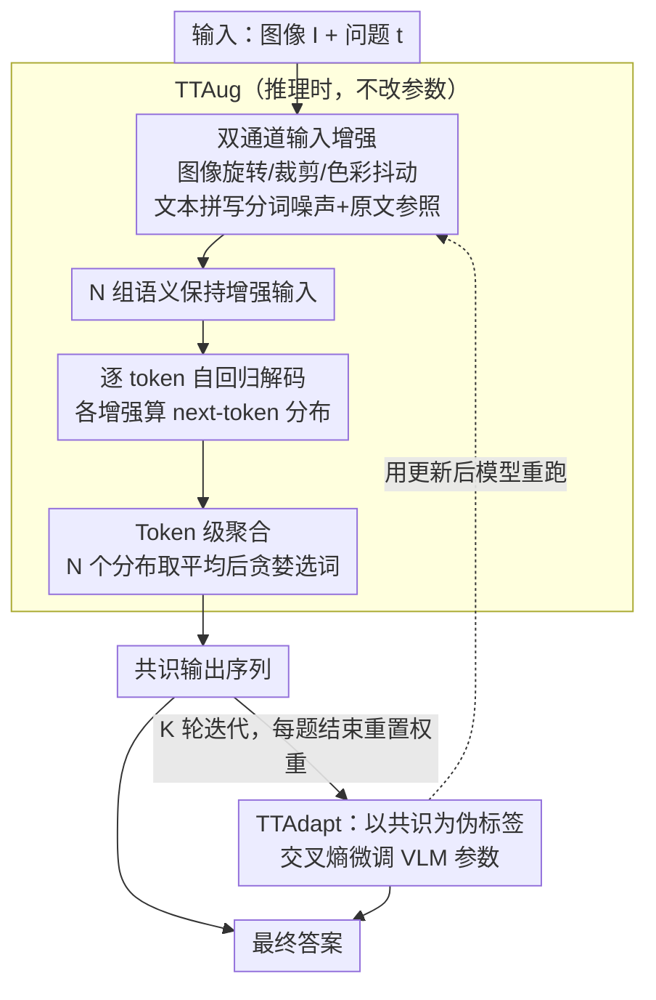

# Efficient Test-Time Scaling for Small Vision-Language Models

**会议**: ICLR 2026  
**arXiv**: [2510.03574](https://arxiv.org/abs/2510.03574)  
**代码**: [GitHub](https://github.com/monurcan/efficient_test_time_scaling)  
**领域**: LLM推理 / VLM效率  
**关键词**: test-time scaling, vision-language models, test-time augmentation, test-time adaptation, token-level aggregation

## 一句话总结

为小型 VLM 提出两种高效的测试时缩放策略：TTAug（对输入做多种增强后在 token 级别聚合输出概率）和 TTAdapt（用 TTAug 生成的伪标签自适应调整模型参数），在 9 个基准上一致提升性能，同时计算效率远优于现有的基于重复采样的测试时方法。

## 研究背景与动机

小型视觉语言模型（如 SmolVLM2-2.2B）提供了计算高效的替代方案，但泛化能力和下游任务性能弱于大型模型。测试时缩放（Test-Time Scaling, TTS）技术可以在推理时投入更多计算来弥补模型能力不足，但现有方法存在根本矛盾：

**Self-Consistency**: 通过温度采样生成多个候选答案，然后用多数投票聚合。但采样多次的计算开销大，且只在最终答案层面聚合，丢失了 token 级别的细粒度信息。

**Self-Selector / Sample-and-Rank**: 用模型自身或 log probability 选择最佳回答，但仍依赖多次独立采样。

**Self-Synthesizer**: 让模型综合多个回答生成最终答案，额外增加了综合步骤的开销。

核心问题：**现有 TTS 方法的计算开销与小模型的资源节约设计目标相矛盾。**

本文提出的关键洞察是两个设计选择可以同时提升效果和效率：
- **用输入增强替代温度采样来诱导多样性**：语义保持的增强比温度采样能产生更高质量的多样候选
- **在 token 级别而非答案级别聚合**：捕获更细粒度的置信度信号

## 方法详解

### 整体框架

本文要解决的是"小模型想用测试时缩放补能力，但现有方法太贵"的矛盾，给出两条互补的 pipeline 取代昂贵的重复采样。第一条是 TTAug（Test-Time Augmentation，测试时增强）：把同一道题在图像和文本两侧做成 $N$ 组语义保持的增强输入，让 VLM 分别自回归解码，在每个 token 的概率分布上取平均后再贪婪选词，整个过程不改一个参数。第二条是 TTAdapt（Test-Time Adaptation，测试时自适应）：把 TTAug 算出的共识输出当伪标签去轻量微调模型，用更新后的模型再跑 TTAug，迭代 $K$ 轮逼近本题的局部最优，每处理完一道新题就把权重重置回初始值。两者共享同一个内核——用"输入多样性 + token 级聚合"替代"温度采样 + 答案级投票"，这也是本文两条可独立迁移的核心洞察。

### 关键设计

**1. 双通道输入增强：用语义保持的扰动制造高质量多样性**

现有 TTS 靠提高解码温度来产生多个候选，但温度只搅动了输出端的随机性，模型接收到的信息没变，多样性是表面的。本文转而在输入端做文章：图像侧施加轻微旋转、裁剪、色彩抖动等语义保持变换，提供视角层面的多样性；文本侧对 prompt 注入拼写与分词噪声（如 "Which country" → "Wh ich cou ntry"），同时附上原始完整问题作为参照（"In other words, ..."），迫使模型越过表面形式去抓核心语义。两条通道叠加后得到 $N$ 组 $\{(I_i, t_i)\}_{i=1}^N$，每个都是模型对同一问题的一次"换角度"作答，比温度采样产出的候选质量更高、分歧更本质——这也是论文验证的第一条可迁移洞察：把任意已有 TTS 框架的多样性来源从温度换成输入增强，就能拿到稳定增益。

**2. Token 级别聚合：在解码每一步利用局部置信度信号**

Self-Consistency 这类方法只在最终答案层面做多数投票，一旦把整句话压成一个标签，中间每一步的置信度信息就被丢掉了。TTAug 改在自回归解码的每一步收集所有增强输入对应的 next-token 概率分布 $p_{i,j}(v)=\mathrm{softmax}(f(I_i,t_i,y_{<j}))$，做平均后再贪婪选词：

$$p_j(v)=\frac{1}{N}\sum_{i=1}^{N} p_{i,j}(v),\qquad y_j=\arg\max_{v\in V} p_j(v)$$

选出的 $y_j$ 追加进所有增强共享的上下文 $y_{<j}$，再进入下一步。这样局部一致性能被直接利用——某个位置上 10 个增强里有 6 个预测 "Germany"、3 个 "France"、1 个 "UK"，token 聚合就能借这 60% 的共识把答案拉向正确选项，而答案级投票要等整句生成完才能比较，既慢又粗。这是论文的第二条可迁移洞察：token 级聚合比答案级聚合保留了更多细粒度信息。

**3. 共识伪标签自适应（TTAdapt）：把推理时的纠错信号内化进参数**

TTAug 虽然有效，但每次都要重新跑一遍多组增强，纠错信号用完即弃。TTAdapt 把 TTAug 的共识输出当高质量伪标签，对模型做一次以交叉熵 $\arg\min_{\theta} -\log p(y^{(k)}|I,t;\theta)$ 为目标的轻量更新（可配合梯度检查点或参数高效微调），更新后的模型再跑 TTAug 生成新一轮伪标签，迭代 $K$ 轮逐步贴合本题分布。关键的工程细节是：每处理完一道新题就把权重重置回初始值 $\theta_0$，避免在单题上学到的修正污染后续题目（灾难性遗忘）。相比无参数更新的 TTAug，它能在愿意付出少量优化开销时把临时共识进一步固化成更强的回答。

### 损失函数 / 训练策略

TTAug 是纯推理时方法，无需任何训练。TTAdapt 以 TTAug 共识输出为伪标签，用标准 next-token 交叉熵更新整套 VLM 参数，每轮迭代后保留更新、每道新题前重置回 $\theta_0$，靠"逐题重置 + 共识监督"在适应测试分布的同时维持稳定。

## 实验关键数据

### 主实验

在 9 个基准上评估（主要使用 SmolVLM2-2.2B）：
- VQA 类：GQA、TextVQA、OCRVQA
- 多选/判断类：AI2D、MME-RealWorld、AMBER
- 图表理解：ChartQA、OCRBench
- 图像描述：COCO Captions

蜘蛛图结果显示 TTAug 和 TTAdapt 在所有 9 个基准上均产生一致提升，TTAdapt > TTAug > Baseline。

### 与其他 TTS 方法对比

| 方法 | 多样性来源 | 聚合层级 | 效率 |
|------|----------|---------|------|
| Self-Consistency | 温度采样 | 答案级 | 低（多次完整解码）|
| Self-Selector | 温度采样 | 选择 | 低 |
| Sample-and-Rank | 温度采样 | 选择 | 低 |
| Self-Synthesizer | 温度采样 | LLM综合 | 最低 |
| **TTAug (本文)** | **输入增强** | **Token级** | **高** |

### 缩放行为

- 随增强数量增加，平均性能呈单调递增并趋于饱和
- 少量增强（如 4-8 组）即可获得大部分收益

### 跨模型泛化

虽然超参数针对 SmolVLM2-2.2B 优化，但在不同模型（不同规模和架构）上均有一致提升，证明了方法的通用性。

### 消融实验

| 配置 | 说明 |
|------|------|
| 聚合策略选择 | Token级 > 答案级 |
| 聚合层选择 | 探索最佳聚合位置 |
| 增强技术组合 | 图像+文本双增强最优 |
| 适应目标 | 不同 TTAdapt 损失的比较 |

### 定性结果

多个案例展示了增强+聚合的纠错能力：
- ChartQA：基线回答 "France" → TTAug/TTAdapt 正确回答 "Germany"
- OCRBench：基线回答 "100.00" → TTAug/TTAdapt 正确回答 "71.10"
- OCRVQA：基线回答 "Brushy" → TTAug/TTAdapt 正确回答 "Brush Dance"
- GQA：基线回答 "Blinds" → TTAug/TTAdapt 正确回答 "Desk"

## 亮点与洞察

1. **两个关键洞察构成核心贡献**: 增强 > 温度采样 + token级 > 答案级，这两个发现可以独立应用于其他 TTS 方法
2. **文本增强的巧妙设计**: 引入拼写噪声+原文参照的方式既简单又有效，迫使模型学会忽略表面噪声、关注语义
3. **TTAdapt 的迭代机制**: 用自己的共识输出作为伪标签来自适应，形成正反馈循环
4. **面向实际部署**: 明确以小模型为目标场景，效率约束贯穿始终
5. **系统性分析**: 提供了全面的消融、缩放行为、跨模型泛化等分析

## 局限与展望

1. **增强数量与延迟的权衡**: 虽然比采样类方法高效，但仍需处理多个增强输入，延迟会线性增长
2. **文本增强的通用性**: 拼写噪声注入对某些任务（如代码生成）可能不适用
3. **TTAdapt 的过拟合风险**: 在单个测试样本上适应参数可能导致过拟合，特别是在分布外数据上
4. **超参数转移**: 虽然展示了跨模型泛化，但承认"专用调参效果更好"
5. **评估局限**: 主要在判别式任务上评估，开放式生成任务的效果有待验证

## 相关工作与启发

- **Test-Time Training（TTT）**: 经典的测试时自适应方法，本文在 VLM 场景重新设计
- **Self-Consistency（Wang et al.）**: 多数投票 TTS 的开创性工作，本文在多样性来源和聚合粒度两方面改进
- **Test-Time Augmentation（传统CV）**: TTA 在传统 CV 中广泛使用，本文将其扩展到 VLM 的自回归生成
- **Token Merging / Pruning**: 效率优化的另一方向，可以与 TTAug 互补
- 对 VLM 推理效率的研究有启发：不仅可以从模型压缩角度省算力，也可以从更聪明的推理策略角度提升性能

## 评分

- 新颖性: ⭐⭐⭐⭐
- 实验充分度: ⭐⭐⭐⭐⭐
- 写作质量: ⭐⭐⭐⭐
- 价值: ⭐⭐⭐⭐

<!-- RELATED:START -->

## 相关论文

- [\[ICLR 2026\] Plan and Budget: Effective and Efficient Test-Time Scaling on Reasoning LLMs](plan_and_budget_effective_and_efficient_test-time_scaling_on_reasoning_large_lan.md)
- [\[ICML 2026\] Prism: Efficient Test-Time Scaling via Hierarchical Search and Self-Verification for Discrete Diffusion Language Models](../../ICML2026/llm_reasoning/prism_efficient_test-time_scaling_via_hierarchical_search_and_self-verification_.md)
- [\[ICML 2026\] Diversity Matters: Revisiting Test-Time Compute in Vision-Language Models](../../ICML2026/llm_reasoning/diversity_matters_revisiting_test-time_compute_in_vision-language_models.md)
- [\[ICLR 2026\] ATTS: Asynchronous Test-Time Scaling via Conformal Prediction](atts_asynchronous_test-time_scaling_via_conformal_prediction.md)
- [\[ACL 2026\] Efficient Test-Time Scaling via Temporal Reasoning Aggregation](../../ACL2026/llm_reasoning/efficient_test-time_scaling_via_temporal_reasoning_aggregation.md)

<!-- RELATED:END -->
