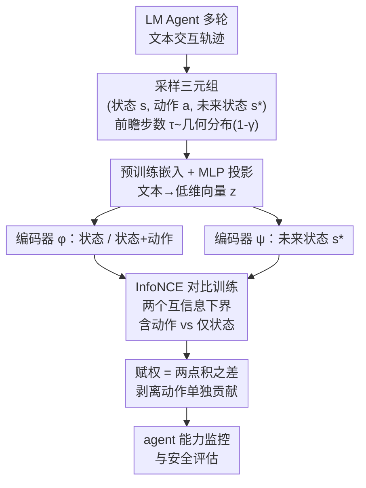

# Estimating the Empowerment of Language Model Agents

**会议**: ICLR 2026  
**arXiv**: [2509.22504](https://arxiv.org/abs/2509.22504)  
**代码**: [GitHub](https://github.com/Jinyeop3110/EELMA)  
**领域**: LLM推理  
**关键词**: empowerment, information theory, mutual information, LM agents, goal-agnostic evaluation, InfoNCE, WebArena

## 一句话总结

提出 EELMA 算法，利用信息论中的"赋权"（empowerment，即 agent 动作与未来状态的互信息）作为目标无关的 LM Agent 能力度量指标，在语言游戏和真实网页浏览场景中与任务表现强相关（$r=0.83$–$0.94$），可用于开放式 agent 监控与安全评估。

## 研究背景与动机

- **传统评估的局限性**：当前 LM Agent 评估主要依赖目标导向基准（goal-centric benchmarks），需要人工设计大量任务，成本高且无法检测基准范围之外的能力增长，对 AI 安全存在盲区
- **开放式环境的挑战**：随着 LM Agent 能够调用搜索引擎、API、操作系统等工具进行长时间多轮交互，传统的里程碑式评估方法无法捕捉 agent 在开放环境中的真实能力
- **赋权（Empowerment）的启发**：信息论中的赋权度量了 agent 对未来状态的影响力，理论上与任意随机目标下的期望回报存在下界关系，天然适合作为目标无关的能力指标
- **技术瓶颈**：经典赋权估计方法计算开销大，无法在高维文本空间中直接应用，需要新的可扩展算法

## 方法详解

### 整体框架

EELMA（Estimating Empowerment of Language Model Agents）要解决的问题是：如何在不依赖任何目标标注的前提下，量化一个 LM Agent 在开放文本环境里的能力。它的抓手是信息论里的「赋权」——动作能在多大程度上改变 agent 对未来状态的可达性，赋权越高，意味着 agent 越能左右后续走向、在任意随机目标上也越可能表现好。

整条 pipeline 是这样转的：先把 agent 的多轮文本交互看成标准 MDP $(\mathcal{S}, \mathcal{A}, T, R, \gamma)$ 上的状态-动作序列，从轨迹里采样「当前状态、当前动作、若干步之后的未来状态」三元组；但文本状态空间高维稀疏、经典赋权估计算不动，于是 EELMA 把状态/动作/未来状态的文本先用预训练嵌入压成低维向量；再用一对编码器以对比学习去逼近「动作与未来状态」的互信息；最后用两个点积之差读出赋权值，既能给整个策略打分，也能逐时刻定位高影响力的关键动作。

### 关键设计

**1. 有效赋权定义：把"对未来的影响力"写成可估的互信息**

经典赋权要对所有未来动作序列求互信息，在长时多轮的文本环境里根本算不动——这是赋权落不了地的第一道坎。EELMA 改为引入一个随机的未来状态 $s_*$，其前瞻步数 $\tau \sim \text{Geom}(1-\gamma)$ 服从几何分布（自然吻合折扣因子），把赋权重定义为当前状态-动作与该未来状态之间的平均互信息：

$$\mathcal{E}(\pi_{LM}) \triangleq \mathbb{E}_{s_t, a_t, s_*}\left[\sum_{t=0}^{\infty} \frac{\gamma^t}{1-\gamma} \log \frac{P(s_{t+\tau}=s_* \mid s_t, a_t)}{P(s_{t+\tau}=s_* \mid s_t)}\right]$$

直觉上，分子分母之比衡量「知道这一步的动作」相比「只知道当前状态」能多解释多少未来——比值越大说明该动作越能左右后续走向，赋权越高。在此基础上还能进一步细化出状态条件赋权 $\mathcal{E}(s, \pi_{LM})$ 与状态-动作条件赋权 $\mathcal{E}(s, a, \pi_{LM})$，从而定位哪些具体时刻、哪些动作是"高影响力"的关键节点（后文认证行为案例正是靠它）。这一定义还带来理论保障：在均匀奖励假设下，赋权是平均折扣回报 $\bar{r} = \mathbb{E}_R[\sum_{t=0}^{\infty} \gamma^t r_t]$ 的下界，因此「保留更多未来选择权」直接对应「在任意随机目标上期望表现更好」，这正是它能当作目标无关能力指标的根基。

**2. 文本嵌入与投影：把高维文本压成可微的紧凑表征**

把赋权写成互信息只是第一步，要真去算它还得先有数值表征，否则高维文本根本无法做对比学习。EELMA 从多轮轨迹 $\{(s_t^i, a_t^i)\}_{t=1}^{T_i}$ 中采样三元组 $(s_t^i, a_t^i, s_*^i)$，用预训练嵌入模型（如 Jina Embeddings）把状态、动作、未来状态的文本各自编码，再接一个参数为 $\theta$ 的可微 MLP 投影到紧凑嵌入 $(z_{s,t}^i, z_{a,t}^i, z_{s_*,t}^i)$。预训练嵌入提供语义对齐的起点，可学的投影则把它进一步压到适合互信息估计的低维空间，使得后续编码器在小样本轨迹上也能稳定训练。

**3. InfoNCE 对比估计与赋权读出：用对比学习拿到互信息下界，再相减得赋权**

有了低维表征还差最后一环：互信息本身不可直接微分，没法当作可优化的目标。EELMA 借 InfoNCE 把它转成对比学习问题——用编码器 $\phi$ 编码当前状态（或状态+动作）、$\psi$ 编码未来状态，让真实配对的 $(s_t,a_t)\to s_*$ 在一批负样本中被打高分。正样本是同一轨迹的真实未来状态，负样本则取自其它轨迹的目标状态，于是 InfoNCE 损失给出「含动作」那一份互信息的变分下界：

$$I_{\text{NCE}}^{\text{State-action}} \geq \mathbb{E}\left[\log \frac{e^{\phi(z_{s,t}^i, z_{a,t}^i)^\top \psi(z_{s,*}^i)}}{\frac{1}{K}\sum_j e^{\phi(z_{s,t}^i, z_{a,t}^i)^\top \psi(z_{s,*}^j)}}\right]$$

同样地再训一份只看状态、不看动作的 $I_{\text{NCE}}^{\text{State-only}}$。两者的差正好对应"加入动作信息后多解释的那部分未来"，也就是赋权。训练完成后，赋权不必再回到难算的概率比，而是直接用两组表征的点积之差读出：

$$\mathcal{E}(\pi_{LM}) = \mathbb{E}_{i,t,s^*}\left[\phi(z_{s,t}^i, z_{a,t}^i)^\top \psi(z_{s,*}^i) - \phi(z_{s,t}^i)^\top \psi(z_{s,*}^i)\right]$$

前一项是「状态+动作」对未来的相容度，后一项是「只看状态」的相容度，相减即剥离掉动作单独贡献的影响力。这个估计计算极轻、可逐时刻评估，也让认证、登录等关键动作的赋权能被单独度量出来。

### 损失函数 / 训练策略

训练阶段联合最大化两个 NCE 下界——状态-动作版 $I_{\text{NCE}}^{\text{State-action}}$ 与仅状态版 $I_{\text{NCE}}^{\text{State-only}}$，梯度同时更新两个编码器 $\phi, \psi$ 和嵌入投影 $\theta$。两个目标共享底层表征，使得估计赋权时所需的两个点积来自同一套一致的表征空间，差值才有意义。

## 实验关键数据

### 主实验

**语言游戏验证（Gridworld + Tower of Hanoi）**

| 环境 | 方法 | State RMSE (bits) |
|------|------|-------------------|
| Gridworld | EELMA (固定格式) | 0.056 |
| Gridworld | 直接估计 (NL) | 0.302 |
| Gridworld | EELMA (NL) | 0.048 |
| Tower of Hanoi | EELMA (固定格式) | 0.158 |
| Tower of Hanoi | 直接估计 (NL) | 0.438 |
| Tower of Hanoi | EELMA (NL) | 0.127 |

EELMA 在自然语言变体下仍保持鲁棒性，RMSE 甚至低于固定格式时的直接估计。

**WebArena 真实网页浏览**

| 领域 | 赋权-回报相关性 ($R_s$) |
|------|--------------------------|
| GitLab | 0.94 |
| Reddit | 0.83 |
| Shopping Admin | 0.87 |
| Shopping | 弱相关（推理瓶颈） |

GPT-4o 赋权最高、折扣回报最高；o3 成功率与 GPT-4o 相当但步数更多导致折扣回报较低。

### 消融实验

**Agent 子系统对赋权的影响**

| 消融因素 | 赋权变化 |
|----------|----------|
| 移除 CoT | Gridworld 下降 99%（0.19→0.01 bits），ToH 下降 65%（0.29→0.09 bits） |
| 记忆长度 m0→m3 | ToH 赋权从约 0.3 升至 0.4 bits |
| 模型规模 | 闭源模型 > 开源模型；大模型 > 小模型 |
| 环境复杂度 | 4→7 个盒子时赋权单调下降 |

### 关键发现

**认证行为案例研究**

| 动作类型 | 平均赋权 (bits) | 显著性 |
|----------|-----------------|--------|
| 有效密码输入 | 0.210 | p < 0.001 |
| 无效密码输入 | -0.152 | — |
| 有效用户名输入 | 0.170 | p = 0.32（不显著） |
| 总体有效认证 | 0.365 | p < 0.001 |
| 总体无效认证 | -0.127 | — |

成功认证后赋权急剧上升，体现了 agent 获取系统管理权限的"权力扩张"行为。密码输入比用户名输入更关键——因为即使用户名正确，配合错误密码也无法获得未来状态的可达性提升。

## 亮点与洞察

1. **目标无关的能力度量**：赋权是首个不需要目标标注的 LM Agent 通用能力指标，与多种环境下的任务表现高度相关
2. **安全监控价值**：高赋权动作对应关键时刻（如获取认证），可用于检测潜在的权力扩张行为，无需预先枚举危险行为列表
3. **CoT 的定量价值**：首次用信息论方式量化 CoT 的效果——移除 CoT 后赋权下降 99%，提供了 agent 推理能力的理论度量
4. **语言鲁棒性**：EELMA 在自然语言变体下比直接估计更准确，这对现实部署至关重要
5. **理论-实验一致性**：赋权的理论下界关系在从玩具到真实的多种场景中均得到实验支持

## 局限性

1. **赋权不等于权力**：选项更多不一定意味着更强大（类比"一个好 offer 胜过多个差 offer"），且无法捕捉间接影响力（如对其他 agent 的信念和决策的影响）
2. **Shopping 域弱相关**：当瓶颈不在环境控制而在数值推理时，赋权指标失效
3. **计算开销**：需要多轮轨迹收集和嵌入训练，规模化到更复杂的开放环境仍需探索
4. **仅限文本环境**：虽讨论了多模态扩展可能性，但当前仅在文本交互中验证

## 相关工作与启发

- **与 benchmark 评估的互补**：EELMA 不替代而是补充传统基准评估，特别适合发现基准未覆盖的能力增长
- **与 RL 内在激励的区别**：先前工作用互信息作为训练信号（intrinsic reward），本文首次用于评估 LM Agent 而非训练
- **与 AI 安全的连接**：Turner 等人的"权力寻求"理论预测最优策略趋向寻求权力，EELMA 提供了可操作的检测工具
- **对 agent 设计的启发**：赋权分析揭示了 CoT、记忆长度、模型规模对 agent 能力的量化影响，可指导 agent 架构设计

## 评分

- **新颖性**: ⭐⭐⭐⭐⭐ 首次将信息论赋权概念迁移到 LM Agent 评估，方法和视角均为原创
- **实验充分度**: ⭐⭐⭐⭐ 从受控玩具环境（有真值验证）到真实 WebArena 场景，消融全面
- **实用价值**: ⭐⭐⭐⭐ 为 agent 安全监控和能力评估提供了新范式，但部署开销需优化
- **写作质量**: ⭐⭐⭐⭐⭐ 理论动机清晰，图表丰富，案例研究（认证行为）生动说服力强
- **总评**: ⭐⭐⭐⭐½ 高质量的跨领域创新工作，将信息论与 LM Agent 评估巧妙结合

<!-- RELATED:START -->

## 相关论文

- [\[ICLR 2026\] Why is Your Language Model a Poor Implicit Reward Model?](why_is_your_language_model_a_poor_implicit_reward_model.md)
- [\[ICLR 2026\] Adaptive Social Learning via Mode Policy Optimization for Language Agents](adaptive_social_learning_via_mode_policy_optimization_for_language_agents.md)
- [\[ICLR 2026\] Agentified Assessment of Logical Reasoning Agents](agentified_assessment_of_logical_reasoning_agents.md)
- [\[ICLR 2026\] Scaling Generalist Data-Analytic Agents](scaling_generalist_data-analytic_agents.md)
- [\[ACL 2026\] Language Model as Planner and Formalizer under Constraints](../../ACL2026/llm_reasoning/language_model_as_planner_and_formalizer_under_constraints.md)

<!-- RELATED:END -->
