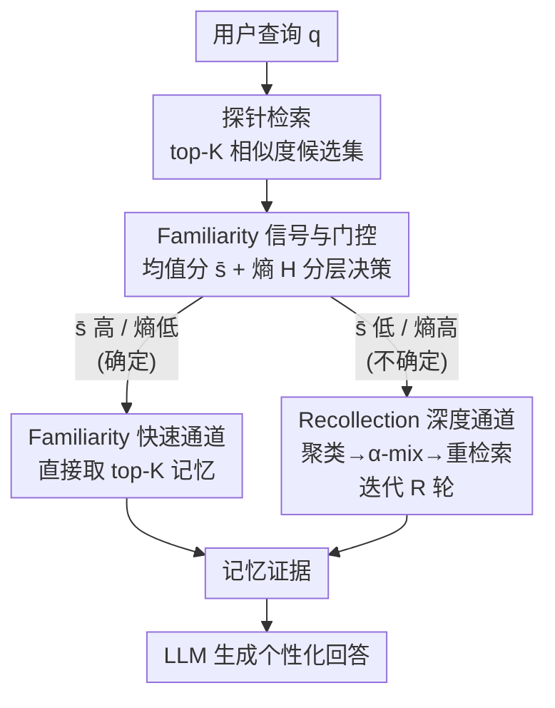

# Evoking User Memory: Personalizing LLM via Recollection-Familiarity Adaptive Retrieval

**会议**: ICLR 2026  
**arXiv**: [2603.09250](https://arxiv.org/abs/2603.09250)  
**代码**: 见论文 Reproducibility Statement  
**领域**: 个性化 / 信息检索  
**关键词**: LLM 个性化, 记忆检索, 双过程理论, 自适应检索, 认知科学

## 一句话总结

受认知科学双过程理论启发，提出 RF-Mem 框架，通过 Familiarity（快速相似度匹配）和 Recollection（深层链式重建）双路径自适应切换的记忆检索机制，实现高效且可扩展的 LLM 个性化。

## 研究背景与动机

个性化大语言模型需要将用户特定的历史记录、偏好和上下文纳入到对话生成中。现有两种主流方法各有严重缺陷：

**全上下文方法**: 将用户所有历史记忆塞入 prompt，成本高昂且不可扩展——随着用户记忆的积累，prompt 长度会迅速超出模型窗口限制

**一次性检索方法**: 将检索简化为单轮相似度搜索（top-K），只能捕获表面匹配，无法深度恢复与查询间接相关但关键的记忆内容

认知科学研究表明，人类记忆识别是通过**双过程**运作的：
- **Familiarity（熟悉感）**: 快速但粗糙的识别过程，能够迅速判断某事物是否曾经遇到过
- **Recollection（回忆）**: 慢速但精确的重建过程，能够有意识地回溯具体细节和相关上下文

现有系统既缺乏回忆式检索的能力，也没有在两种检索路径之间自适应切换的机制。这导致要么检索不足（遗漏关键记忆），要么引入噪声（检索到不相关的内容）。

## 方法详解

### 整体框架

RF-Mem（Recollection-Familiarity Memory Retrieval）把人类记忆识别的双过程理论搬进了 LLM 的记忆检索。给定一条用户查询 $q$，系统先在用户记忆库里做一次廉价的探针检索（probe retrieval），从返回的相似度分数算出一个 Familiarity（熟悉度）信号来判断"自己有多确定能找对记忆"，再据此分流：信号强就走 Familiarity 快速通道直接取 top-K 记忆，信号弱就转入 Recollection（回忆）深度通道做多轮链式重建；两条路最终都汇成一份记忆证据，交给生成 LLM 产出个性化回答。整套机制完全发生在检索层，免训练，不改动底层嵌入模型或生成模型，且嵌入器、聚类器、生成 LLM 都可独立替换，能直接挂接到已有个性化系统上。

### 关键设计

**1. Familiarity 信号与分层门控：用分数分布的形状决定走哪条路**

分流决策若靠 LLM 反复试探，成本就退化回全上下文方案，所以 RF-Mem 只用一次探针检索的相似度分数来估计确定性。给定查询嵌入 $x_t=\phi(q)$ 与记忆嵌入 $z_i=\phi(m_i)$，探针检索按余弦相似度 $s_i=\langle x_t, z_i\rangle$ 取出 top-K 候选，再从这 K 个分数读两个量：均值分 $\bar{s}=\frac{1}{K}\sum_i s_i$ 捕获整体匹配强度（越高说明库里确实有贴近查询的记忆），以及把分数 softmax 归一化 $p_i=\frac{\exp(\lambda(s_i-\max_j s_j))}{\sum_j \exp(\lambda(s_j-\max_j s_j))}$ 后算出的熵 $H(p)=-\sum_i p_i\log p_i$（$\lambda$ 控制锐度，熵越低说明匹配集中在少数几条记忆上、目标越明确）。门控是**分层**的而非简单"高均值且低熵"：均值分先拍板——$\bar{s}\ge\theta_{high}$ 直接走 Familiarity、$\bar{s}\le\theta_{low}$ 直接走 Recollection；只有落在 $(\theta_{low},\theta_{high})$ 的模糊区间才由熵当裁判，$H(p)\le\tau$ 走 Familiarity、$H(p)>\tau$ 走 Recollection。这套阈值门控正是论文避开"全上下文塞爆 prompt"和"一次性检索漏召回"两个极端的关键：把昂贵的 Recollection 只留给真正模糊的查询，从而在固定 token 预算和延迟下逼近全上下文的检索质量。

**2. Familiarity 快速通道：确定时一锤定音**

当信号判为确定（高均值或低熵）时，查询与历史记忆的关联是直接的，再做复杂推理只是浪费算力。这条路径就执行标准的 top-K 相似度检索，把 $C_t=\text{Top-K}\{(m_i, \langle x_t, z_i\rangle)\}$ 里最相关的记忆直接喂给生成模型。它只需一次前向检索、没有任何额外开销，承担了大部分日常查询，是整个系统效率的来源。

**3. Recollection 深度通道：在嵌入空间里模拟链式回忆**

当信号判为不确定时，相关记忆往往与查询只是间接关联、散落在不同时间和主题里，一次表面匹配召回不到，于是 RF-Mem 模仿人脑"顺藤摸瓜"的回忆过程，在嵌入空间里做多轮"检索-聚类-混合"（retrieve-cluster-mix）迭代。每一轮先取 top-N 候选，其中 $N=(B+r)\times F$ 随轮次 $r$ 增大（$B$ 是束宽、$F$ 是扇出），并剔除前几轮已出现的记忆，防止反复召回同一批；再用 KMeans 把候选嵌入聚成 $B$ 个簇，每个簇心 $g_b^{(r)}=\frac{1}{|G_b^{(r)}|}\sum_{m_i\in G_b^{(r)}} z_i$ 代表一个语义方向、充当检索树的一个分支；然后做 α-mix 查询扩展，把当前查询、簇心和原查询按系数混合生成偏向该方向的新查询：

$$x_b^{(r+1)} = \text{norm}\big(\alpha\, x^{(r)} + (1-\alpha)\, g_b^{(r)} + x_t\big),\quad \alpha\in[0,1]$$

这里特意保留了原查询 $x_t$ 的残差项，避免多轮扩展后查询漂移、丢掉原始意图。新查询再去检索下一轮候选，如此迭代，最多保持 $B$ 个活跃分支、深度封顶 $R$ 轮，达到轮次上限或凑够目标条数即停，最终证据为各轮候选的并集截断 $C_t=\text{Top-K}\bigcup_{r=0}^{R} C^{(r)}$。整个链式重建只靠向量检索和小规模聚类，把与原查询语义关联却表面不相似的记忆逐步纳进来，避免了多轮 LLM 调用的高昂代价。

## 实验关键数据

### 主实验

在三个个性化基准上进行评测，涵盖不同的语料库规模：

| 方法 | 基准1 | 基准2 | 基准3 | 说明 |
|------|-------|-------|-------|------|
| 全上下文推理 | 基线 | 基线 | 基线 | 成本最高，性能上限 |
| 一次性检索 | 低于全上下文 | 低于全上下文 | 低于全上下文 | 简单快速但质量差 |
| **RF-Mem** | **最优** | **最优** | **最优** | 在固定预算下一致超越两种基线 |

### 消融实验

| 配置 | 关键指标 | 说明 |
|------|---------|------|
| 仅 Familiarity 路径 | 基线水平 | 等同于标准 top-K 检索 |
| 仅 Recollection 路径 | 高于 Familiarity-only | 但在简单查询上浪费计算 |
| 双路径 + 自适应切换 | **最优** | 兼顾效率和质量 |
| 去除聚类 | 性能下降 | 聚类帮助识别记忆主题结构 |
| 去除 Alpha-Mix | 性能下降 | 查询扩展是 Recollection 的核心 |

### 关键发现

- **一致优势**: RF-Mem 在所有三个基准和不同语料库规模上均优于两种基线方法
- **预算效率**: 在固定的检索预算（token 数量）和延迟约束下，RF-Mem 实现了接近全上下文方法的性能，同时保持了一次性检索的效率
- **可扩展性**: 随着用户记忆库规模增大，RF-Mem 的优势更加明显——全上下文方法的成本线性增长，而 RF-Mem 的开销增长温和
- **路径分布**: 约 60-70% 的查询通过 Familiarity 快速路径处理，30-40% 需要 Recollection 深度路径

## 亮点与洞察

1. **认知科学的优雅迁移**: 将人类记忆的 Familiarity-Recollection 双过程理论引入 LLM 检索系统设计，这种跨学科启发既优雅又实用
2. **不确定性引导的自适应**: 利用检索分数分布的均值和熵作为自适应切换信号，比简单的阈值方法更鲁棒
3. **嵌入空间中的记忆重建**: 通过聚类和 Alpha-Mix 在嵌入空间中模拟回忆过程的链式重建，避免了代价昂贵的多轮 LLM 调用
4. **实用的设计哲学**: 框架模块化，各组件可独立替换和优化，适合工程部署

## 局限与展望

1. **Familiarity 阈值的设定**: 自适应切换依赖于阈值参数，不同数据集可能需要不同的阈值，缺乏完全自动化的方案
2. **聚类算法的选择**: Recollection 路径中的聚类方法可能对高维稀疏记忆效果有限
3. **长期记忆遗忘与更新**: 未明确讨论如何处理过时或矛盾的用户记忆
4. **隐私考量**: 存储和检索用户历史记忆涉及隐私风险，论文未深入讨论隐私保护机制

## 相关工作与启发

- **双过程认知理论 (Yonelinas, 2002)**: Familiarity 和 Recollection 是人类记忆识别的两种基本过程，本文将此理论操作化为检索系统设计
- **RAG (Retrieval-Augmented Generation)**: RF-Mem 可视为 RAG 的增强版本，专门针对个性化场景优化检索策略
- **自适应检索 (Adaptive Retrieval)**: 如 Self-RAG, FLARE 等工作研究何时检索，RF-Mem 研究如何检索
- **个性化 LLM**: 如 LaMP, PersonaLLM 等基准推动了个性化 LLM 的发展，本文在此基础上改进检索模块

## 评分

- 新颖性: ⭐⭐⭐⭐⭐ — 认知科学双过程理论在 LLM 检索中的创新应用
- 实验充分度: ⭐⭐⭐⭐ — 三个基准、多尺度评测、消融分析
- 写作质量: ⭐⭐⭐⭐ — 概念清晰，跨学科动机解释充分
- 价值: ⭐⭐⭐⭐ — 为个性化 LLM 的记忆检索提供了实用可扩展的方案

<!-- RELATED:START -->

## 相关论文

- [\[ICLR 2026\] Temperature as a Meta-Policy: Adaptive Temperature in LLM Reinforcement Learning](temperature_as_a_meta-policy_adaptive_temperature_in_llm_reinforcement_learning.md)
- [\[ICML 2026\] Beyond Test-Time Memory: State-Space Optimal Control for LLM Reasoning](../../ICML2026/llm_reasoning/beyond_test-time_memory_state-space_optimal_control_for_llm_reasoning.md)
- [\[ACL 2026\] Evo-Attacker: Memory-Augmented Reinforcement Learning for Long-Horizon Tool Attacks on LLM-MAS](../../ACL2026/llm_reasoning/evo-attacker_memory-augmented_reinforcement_learning_for_long-horizon_tool_attac.md)
- [\[ICLR 2026\] Adaptive Social Learning via Mode Policy Optimization for Language Agents](adaptive_social_learning_via_mode_policy_optimization_for_language_agents.md)
- [\[ICLR 2026\] Thinking in Latents: Adaptive Anchor Refinement for Implicit Reasoning in LLMs](thinking_in_latents_adaptive_anchor_refinement_for_implicit_reasoning_in_llms.md)

<!-- RELATED:END -->
